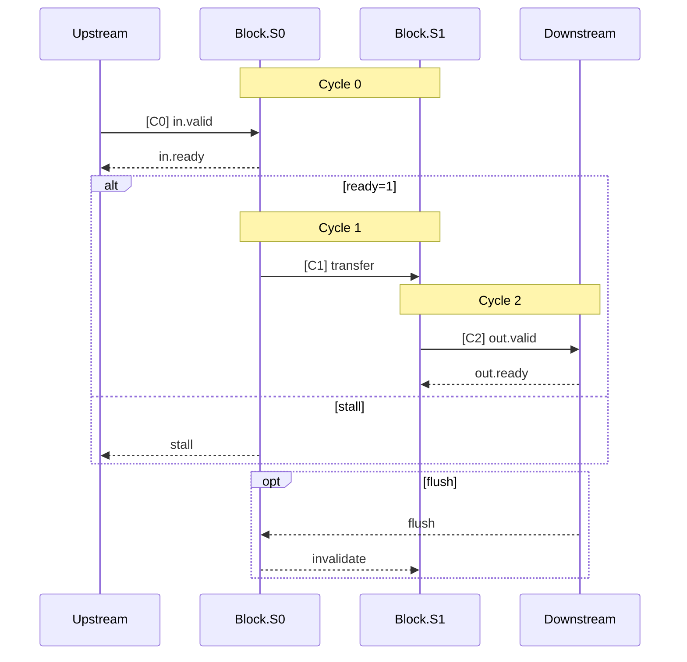

# RTL_code_analysis_rule.md

> 최우선 원칙: 모든 분석은 반드시 **code-based only**로 수행한다.  
> `web-search` 결과나 사전 지식(기억 기반 정보)에 의존한 추론/서술은 금지한다.

> 목적: RTL 또는 RTL에 준하는 구조적 코드(Verilog, SystemVerilog, VHDL, Chisel/Scala 등)를 읽고, **마이크로아키텍처 관점**에서 블록/모듈 구조, 파이프라인, 인터페이스, 플로우/백프레셔를 **문서 3종 세트**로 일관되게 분석/산출한다.

---

## 0) 기본 원칙 (반드시 준수)

### 0.1 산출물 3종(필수)

아래 산출물을 **반드시** 생성한다. `<block_name>`은 분석 대상 상위 블록의 이름이다.

#### A. Block Diagram 원본

1. **`<block_name>_block_diagram.drawio`**

#### B. Markdown 문서 3종

1. **`<block_name>_block_diagram_overview.md`**
2. **`<block_name>_in_out_seq_diagram.md`**
3. **`<block_name>_<module_name>_analysis.md`** (하위 모듈별 1개 이상)

산출물 간 상호 참조 시 아래 포맷을 사용한다:

* `→ See [<block_name>_block_diagram_overview.md](./<block_name>_block_diagram_overview.md)` (overview 참조)
* `→ See [<module_name> analysis](./<block_name>_<module_name>_analysis.md#section)` (모듈 분석 참조)
* `→ See [Sequence Group A](./<block_name>_in_out_seq_diagram.md#group-a)` (시퀀스 참조)
* `→ See [block diagram drawio](./<block_name>_block_diagram.drawio)` (drawio 원본 참조)

---

### 0.2 RTL 코드에서 "신뢰 가능한 근거"로 삼을 것

이 규칙은 특정 언어 전용이 아니다. 아래 근거는 언어에 무관하게 동일하게 적용된다.

#### 모듈/블록 경계

구조적 인스턴스화를 모듈 경계 근거로 본다.

| 언어 | 예시 |
| --- | --- |
| Verilog / SystemVerilog | `foo u_foo (...)`, `generate ... endgenerate` |
| VHDL | `u_foo : entity work.foo port map (...)`, `component ... port map` |
| Chisel / Scala | `Module(new Foo)`, `LazyModule(new Foo)`, `val m = Module(...)` |

#### 인터페이스

포트 선언 및 블록 경계를 넘는 연결을 인터페이스 근거로 본다.

| 언어 | 예시 |
| --- | --- |
| Verilog / SystemVerilog | `input`, `output`, `inout`, `interface`, `modport`, named port connection |
| VHDL | `in`, `out`, `inout`, `buffer`, `port map`, `signal` |
| Chisel / Scala | `IO(new Bundle {...})`, `DecoupledIO`, `ValidIO`, `Flipped`, `Bundle`, `Vec`, ReadyValid 류 |

#### 파이프라인 stage 단서

명시적 레지스터 경계, queue, stage 이름을 근거로 사용한다.

| 언어 | 예시 |
| --- | --- |
| Verilog / SystemVerilog | `always_ff`, pipeline reg, FIFO, `state_t`, stage signal naming |
| VHDL | clocked process, register signal, enumerated state |
| Chisel / Scala | `RegNext`, `RegEnable`, `RegInit`, `ShiftRegister`, `Pipe(...)`, `Queue(...)` |

공통 naming 단서: `s0/s1/s2`, `stage0/stage1`, `pipe0/pipe1`

#### 플로우/백프레셔 단서

아래는 언어 무관하게 공통으로 적용한다.

* handshake: `ready`, `valid`, `fire`
* backpressure structure: `Queue`, `SkidBuffer`, `ElasticBuffer`, `Fifo`, `FIFO`
* control signal: `flush`, `kill`, `redirect`, `replay`, `stall`, `hold`
* credit 기반: `credit`, `token`, `decr/incr`, `available`
* ready/valid 조건: `when(io.in.fire)`, `io.out.valid :=`, `io.in.ready :=` 류

> 문서에 쓰는 모든 결론(파이프라인 개수, 방향, 백프레셔 방식)은 위 단서 중 하나 이상으로 **코드 근거**를 붙여 설명한다.

#### 파라미터/Config 단서

| 언어 | 예시 |
| --- | --- |
| Verilog / SystemVerilog | `parameter`, `localparam`, `ifdef`/`define` |
| VHDL | `generic`, `constant` |
| Chisel / Scala | `case class XxxParams(...)`, `case object XxxKey extends Field[...]`, `implicit p: Parameters`, `p(XxxKey)` |

모듈 분석 시 주요 파라미터 값과 그것이 구조(way 수, 파이프라인 depth, 큐 depth 등)에 미치는 영향을 표로 정리한다.

#### Config 기준 원칙

* 파라미터 값을 인용할 때는 **해당 블록/모듈의 default 값**을 기준으로 한다.
* override 또는 top-level config에서 다른 값을 사용하는 경우, 별도로 명기하지 않는 한 사용하지 않는다.
* default 값과 override 값이 다를 경우, default를 먼저 기술하고 필요 시 "(override 시 X)" 형식으로 부기한다.

---

### 0.3 분석 깊이 기준

* **기본**: top 모듈에서 2 depth까지 분석
* 하위 모듈이 단순 util(Queue wrapper, Arbiter, MuxLookup, decoder 등)이면 skip하고 overview에 이름만 표기
* 사용자가 명시적으로 지정한 모듈은 depth 무관하게 분석
* 분석 대상 모듈이 10개를 초과할 경우, 사용자에게 우선순위를 확인한 뒤 진행

---

### 0.4 Diagram 형식 규칙 (필수)

#### Block Diagram

* block diagram 원본은 **반드시 draw.io (`.drawio`)** 로 생성한다.
* block diagram 작성 규칙은 **[block_diagram_rule.md](./block_diagram_rule.md)** 를 따른다.
* `block_diagram_overview.md`에는 아래를 포함한다.
  * draw.io export image (`png` 또는 `svg`)
  * draw.io 원본 파일 링크

#### Sequence Diagram

* sequence diagram은 **반드시 Mermaid code**로 작성한다.
* sequence diagram이 들어가는 md에는 **렌더링된 그림 + Mermaid code**를 같이 넣는다.
* 노드 텍스트에서 `()` 최소 사용
* `\n` 줄바꿈은 대괄호 `[]` 안에서만
* 특수문자 `|`, `<`, `>` 최소화
* 노드명은 짧게, 상세는 설명 텍스트로

---

### 0.5 Memory 분석 규칙 (해당 시 필수)

Memory 관련 모듈을 분석할 때는 아래 항목을 반드시 문서화한다.

* memory spec: `depth`, `width`, `number of banks`, `number of read ports`, `number of write ports`
* memory contents: 각 field별 `size(bit)`와 `description`
* multi-port 또는 bank conflict가 있으면 arbitration/충돌 처리 규칙 명시
* 위 항목은 코드 선언(`SyncReadMem`, `SRAMTemplate`, `ram`, `mem`, `reg []`, `process` 등 언어별 근거) 기반 근거와 함께 작성

---

## 1) `<block_name>_block_diagram_overview.md` 작성 규칙

### 1.1 목표

* 블록 전체 구조를 한 장으로 이해
* 세부 블록은 module 단위
* 화살표 방향 = 데이터 흐름
* 화살표 라벨 = 인터페이스 이름 + 제어 신호
* pipeline stage는 모듈 내부 sub-block으로 표시
* 모듈별 pipeline stage 개수 명확히 표현
* block level flow/backpressure 설명 포함

---

### 1.2 문서 구조 (템플릿)

#### 1. Block Summary

* 역할 요약 (3줄)
* 주요 input/output
* 성능/병목 포인트

#### 2. Key Parameters

| Parameter | Default | 영향 |
| --------- | ------- | ---- |
| nWays     | 4       | 캐시 way 수 결정 |
| nEntries  | 8       | 큐 depth 결정 |

* 언어별 `parameter`/`generic`/`case class` 기반으로 정리

#### 3. Top-Level Block Diagram (draw.io export image + link)

* draw.io export image 삽입
* draw.io 원본 링크 삽입
* 다이어그램 작성 규칙은 **[block_diagram_rule.md](./block_diagram_rule.md)** 를 따른다.

#### 4. Pipeline Stages by Module

* draw.io export image 삽입
* draw.io 원본 링크 삽입
* 다이어그램 작성 규칙은 **[block_diagram_rule.md](./pipeline_rule.md)** 를 따른다.

#### 5. Flow / Backpressure Control

* handshake 방식 (Decoupled / Valid / 별도 프로토콜 여부)
* stall/flush/kill/replay 경로
* 큐/버퍼 정책
* credit 기반 설명

#### 6. Error / Exception Paths

* bus error, ECC error 처리 경로
* exception/interrupt 전파 경로
* error 발생 시 파이프라인 동작 (flush, replay 등)

#### 7. Timing Hints

* critical path 후보 (큰 mux, multi-way comparator, long chain 등)
* 타이밍 민감 모듈 메모

#### 8. Open Questions / TODO

---

## 2) `<block_name>_in/out_seq_diagram.md` 작성 규칙

### 2.1 목표

* input → processing → output 전 과정 표현
* forward path + backward path 모두 포함
* 입력 많으면 그룹별로 분리

---

### 2.2 입력 그룹핑 기준

1. 프로토콜 차이 (handshake / Valid-only / Control)
2. 서로 다른 output 대응 관계
3. 결과 경로 분기 (hit/miss 등)
4. 핵심 데이터 경로 우선

---

### 2.3 문서 구조

#### 1. I/O Summary

* 입력 리스트
* 출력 리스트

#### 2. Sequence Diagram - Group A

* 정상 흐름
* stall/backpressure
* flush/kill 분기

#### 3. Sequence Diagram - Group B/C

* 필요 시 추가

#### 4. Edge Cases

* flush 중 처리
* replay
* ordering
* bus error / ECC error 수신 시 처리
* exception / interrupt 전파

---

### 2.4 Sequence 작성 규칙

* participant = module 또는 stage
* forward `->>`
* backward `-->>`
* ready/valid 또는 handshake 상태 표시
* 분기 `alt/else`

---

### 2.5 Cycle 표기 규칙

* cycle-based sequence diagram은 **x축=cycle, y축=unit/module(participant)** 기준으로 작성한다.
* 각 cycle에서 어떤 behavior가 발생하는지(transfer, stall, flush, replay, ready/valid 상태)를 반드시 명시한다.
* `Note over S0,S1: Cycle N` 을 사용하여 사이클 경계를 표시
* 또는 메시지 라벨에 `[C0]`, `[C1]` 접두사를 사용하여 사이클 번호를 명시
* 파이프라인 latency가 핵심인 경우 반드시 cycle 표기를 포함

---

### 2.6 Mermaid 예시



---

## 3) `<block_name>_<module_name>_analysis.md` 작성 규칙

### 3.1 목표

* 하위 모듈 분석
* interface 표 작성
* functionality 설명
* pseudocode 포함
* flow/backpressure 설명

---

### 3.2 문서 구조

#### 1. Module Summary

* 역할
* 위치 (→ See overview 링크)
* pipeline stage 수

#### 2. Key Parameters

| Parameter | Source | Default | 영향 |
| --------- | ------ | ------- | ---- |
| nWays     | `parameter nWays` / `p(XxxKey).nWays` | 4 | way 수 결정 |

#### 3. Interfaces (표 형식)

| Port | Dir | Bitwidth | Protocol | Description |
| ---- | --- | -------- | -------- | ----------- |

---

#### 4. Memory Organization (해당 시 필수)

* memory spec 표 작성: depth / width / banks / read ports / write ports
* memory contents 표 작성: field별 size(bit) / description
* bank/port 충돌 처리 및 우선순위 규칙

Memory spec 표 예시:

| Memory | Depth | Width(bit) | Banks | Read Ports | Write Ports |
| ------ | ----- | ---------- | ----- | ---------- | ----------- |
| metaMem | 256 | 64 | 4 | 2 | 1 |

Memory contents 표 예시:

| Memory | Field | Size(bit) | Description |
| ------ | ----- | --------- | ----------- |
| metaMem | tag | 20 | set/tag 비교용 태그 |
| metaMem | valid | 1 | 엔트리 유효 비트 |
| metaMem | target | 39 | 예측 타겟 주소 |

---

#### 5. Internal Pipeline / State

* stage 구성
* 레지스터
* 큐
* FSM

#### 6. Functionality

* 데이터 흐름
* 알고리즘

#### 7. Flow / Backpressure Control

* handshake (ready/valid 또는 동등한 프로토콜)
* stall 조건
* flush 조건
* queue 정책

#### 8. Error / Exception Handling

* 에러 입력 처리 방식
* 에러 출력/전파 방식
* 에러 시 파이프라인 동작

#### 9. Timing Hints

* critical path 후보
* 큰 combinational logic (wide mux, CAM lookup, priority encoder 등)
* 개선 여지 메모

#### 10. Pseudocode

#### 11. Notes / Assumptions

---

### 3.3 Interface 표 예시

| Port     | Dir | Bitwidth | Protocol  | Description |
| -------- | --- | -------- | --------- | ----------- |
| req      | in  | bundle   | Decoupled | request     |
| resp     | out | bundle   | Decoupled | response    |
| flush    | in  | 1        | Valid     | flush       |
| error    | out | 1        | Valid     | ECC/bus error |

---

### 3.4 Pseudocode 작성 규칙

* cycle 기반 또는 handshake fire 기반
* stall/flush 명시
* error 경로 명시
* stage별 작성

예시:

```
S0:
  if in.fire:
    latch
  if flush:
    invalidate

S1:
  if valid and out_ready:
    compute
  if error:
    set error flag, flush pipeline

S2:
  if valid:
    output result
    if error_flag:
      output error response
```

---

## 4) 분석 수행 절차

### Step 1: 블록 경계 식별

* top module/entity/class 찾기
* IO/port 목록 정리
* 주요 파라미터(`parameter`, `generic`, `case class`/`Field` 등) 수집

### Step 2: 하위 모듈 그래프 생성

* 인스턴스 트리 작성
* 분석 깊이 기준(0.3)에 따라 분석 대상 확정

### Step 3: 파이프라인 인식

* explicit register boundary / Queue / handshake 경계

### Step 4: Flow 정리

* stall / flush / replay
* error / exception 경로

### Step 5: 3종 문서 생성

* overview → seq → module
* 문서 간 cross-reference 링크 삽입

---

## 5) 품질 체크리스트

### Overview

* [ ] 모듈 단위 구성
* [ ] 인터페이스 라벨 존재
* [ ] pipeline stage 표시
* [ ] backpressure 설명
* [ ] 파라미터 표 존재
* [ ] error/exception 경로 기술
* [ ] timing hints 기술
* [ ] module analysis 문서 링크 존재
* [ ] 블록 다이어그램이 block_diagram_rule.md 원칙을 준수했는가

### Sequence

* [ ] 전체 흐름 표현
* [ ] backward path 포함
* [ ] flush/kill 포함
* [ ] Mermaid code 포함
* [ ] cycle-based일 때 x축=cycle, y축=unit/module 기준 준수
* [ ] cycle별 behavior(transfer/stall/flush/replay/ready/valid) 명시
* [ ] cycle 표기 포함 (파이프라인 latency가 핵심인 경우)
* [ ] error/exception edge case 포함
* [ ] overview 및 module analysis 링크 존재

### Module

* [ ] interface 표 존재
* [ ] memory spec(depth/width/banks/read/write ports) 기술
* [ ] memory field별 size/description 기술
* [ ] pseudocode 존재
* [ ] flow 설명 존재
* [ ] 파라미터 표 존재
* [ ] error handling 섹션 존재
* [ ] timing hints 존재
* [ ] overview 링크 존재

---

## 6) 출력 파일 헤더 표준

```
# <file_name>

- Block: <block_name>
- Module: <module_name or N/A>
- Source: <source file paths>
- Language: Verilog / SystemVerilog / VHDL / Chisel/Scala / Mixed
- Protocols: Decoupled/Valid/AXI/TileLink/Credit/Custom
- Key Params: <주요 파라미터 나열>
- Last updated: YYYY-MM-DD
```

---

## 7) 용어 표준

* fire = valid && ready (또는 언어/프로토콜 등가 조건)
* forward path = data 흐름
* backward path = flow control
* flush/kill = in-flight 무효화
* stall = 진행 중단
* error path = 에러/예외 전파 경로
* critical path = 타이밍 상 가장 긴 combinational 경로

---

## 8) 코드 근거 인용 포맷

코드 근거는 **파일명 + 구조적 단서**를 명시한다. 언어에 무관하게 아래 포맷을 따른다.

```
<filename>: <construct>
예) foo.scala: class Bar
    foo.v: module foo, u_bar foo_bar (...)
    foo.vhd: entity bar, u_bar : entity work.bar port map (...)
    RegNext used between s0 -> s1
    Queue(depth=4) on req path
    parameter nWays=4 determines way count
    error output driven by ECC check logic
```

---

### END
