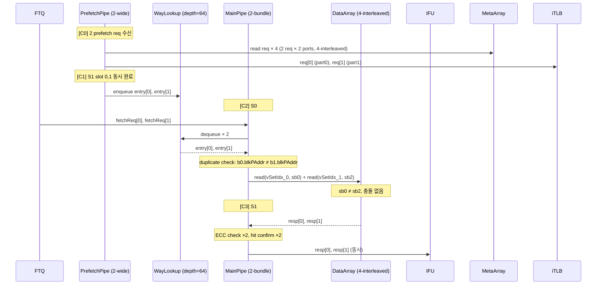
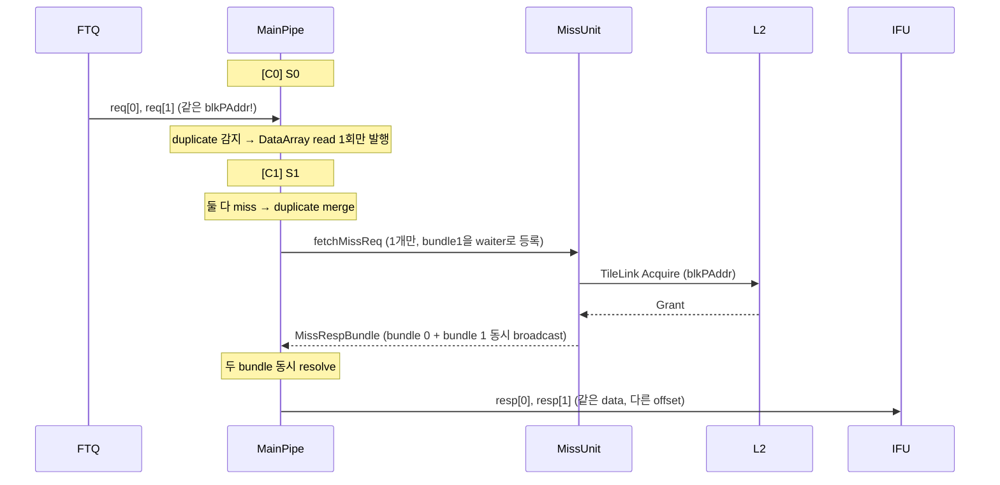
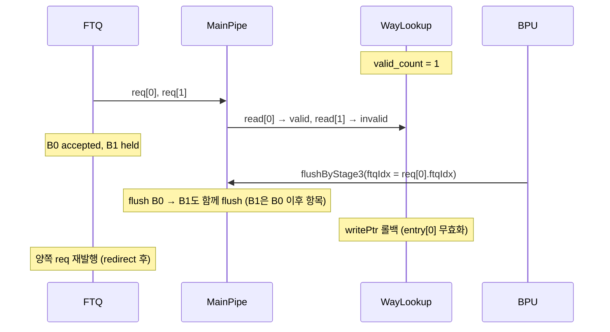

# 2-Fetch ICache Microarchitecture

- Based on: [icache_analysis.md](./icache_analysis.md)
- Target: 2 fetch bundles/cycle from MainPipe (2× input req BW)
- Date: 2026-04-22

---

## 1. Overview

기존 ICache는 MainPipe가 FTQ로부터 1 fetch bundle/cycle을 받는다. 2-Fetch 설계는 이를 **2 fetch bundles/cycle**로 확장한다. 이 변경은 다음 문제를 연쇄적으로 유발한다.

1. **DataArray bank conflict 증가**: 동시 접근이 2배로 늘어 singlePort SRAM 충돌 급증
2. **WayLookup throughput 불균형**: MainPipe 소비 속도 2배 vs PrefetchPipe 생산 속도
3. **MissUnit MSHR 부족**: fetch MSHR 2배 필요, prefetch MSHR은 2배 확장으로 BW 보완
4. **L2/L3 BW 부족**: ICache miss 2배 + DCache 폭 확대로 메모리 계층 전체 BW 스트레스
5. **Arbitration 복잡도**: 2 bundle × (TLB hit/miss × Cache hit/miss) 조합, FTQ backpressure 케이스 증가
6. **FTQ/IFU 인터페이스 계약 변화**: ICache만 2-bundle로 바뀌면 충분하지 않고, FTQ req 포맷·IFU resp 포맷·decode 소비 방식도 함께 정의되어야 함
7. **`PortNumber=2` 의미 혼동 위험**: 기존 `PortNumber=2`는 "한 bundle 내 doubleline access"인데, 여기에 "2 bundle/cycle" 축이 추가되어 구현자가 두 축을 혼용할 가능성 존재
8. **Duplicate request merge 필요**: 두 bundle의 `blkPAddr`가 동일할 경우(같은 64B cacheline) DataArray read와 MSHR 할당을 각각 merge하지 않으면 bank conflict와 MSHR pressure가 불필요하게 증가. merge 판정 기준은 `bundle0.blkPAddr == bundle1.blkPAddr`이며, "sequential adjacent"나 "크기 합 ≤ 64B"는 이 조건의 충분조건이 아님 (→ §5.1, §5.4)
9. **WayLookup flush / update correctness 악화**: dual-consume 구조에서는 BPU stage3 flush, refill update, exception entry, rollback rule이 기존보다 복잡해짐
10. **Replacer 일관성 문제**: DataArray bank 구조가 바뀌면 replacer도 storage bank 기준이 아니라 logical set 기준으로 동작하도록 재정의해야 함
11. **Refill/read hazard 증가**: refill write와 main read가 같은 cycle에 같은 set/sub-bank를 만날 때 old/new data 우선순위와 stall policy를 명확히 정해야 함
12. **ECC / parity recovery 복잡도 증가**: bundle별로 ECC error가 독립적으로 발생할 수 있어 flush, refetch, exception 정책이 더 세분화됨
13. **Prefetch pollution / fairness 문제**: prefetch MSHR만 크게 늘리면 useless prefetch가 demand fetch 또는 DCache traffic을 밀어내어 L2 admission 효율을 저하시킬 수 있음
14. **TLB / PMP path — hit는 CAM 2×로 자연 해소, miss는 PTW 직렬화 필요**: iTLB·PMP는 CAM 구조이므로 2× concurrent lookup은 comparator 회로 2×만으로 달성 가능(hit path). 단, TLB miss 시 PTW outbound 채널은 1-wide를 유지하고 2-entry pending buffer로 직렬화한다. 두 slot이 동일 VPN을 miss하면 PTW req를 1개로 merge해 불필요한 duplicate walk를 막을 수 있음 (→ §5.2 PTW Request Serialization)
15. **Refill completion serialization 한계**: miss admission은 늘어나더라도 refill completion이 여전히 1/cycle이면 tail latency와 MSHR occupancy가 기대만큼 개선되지 않을 수 있음
16. **Timing / power / verification 부담 증가**: control fanout, 작은 SRAM instance 증가, state-space explosion 때문에 타이밍 수렴과 검증 난이도가 크게 상승함
17. **#8 MSHR 구현 시 merge 조건 주의**: same-cacheline miss 시 single MSHR entry로 merge해야 하며, 판정은 반드시 `bundle0.blkPAddr == bundle1.blkPAddr`로 해야 한다. "bundle 크기 합 ≤ 64B"나 "not taken + sequential"은 판정 기준이 아님 — bundle 0이 cacheline 경계 근처에서 시작하면 크기 합이 작아도 두 bundle이 서로 다른 cacheline에 걸칠 수 있다 (→ §5.4 Duplicate Merge)

즉, 2-Fetch ICache는 단순히 MainPipe 입력 BW만 2배로 만드는 문제가 아니다.  
DataArray / WayLookup / MissUnit / PrefetchPipe뿐 아니라 FTQ-IFU 계약, replacer correctness, L2 admission policy, verification strategy까지 함께 재설계해야 하는 구조 변경이다.

---

## 2. Design Delta Summary

| 항목 | Baseline | 2-Fetch |
|------|----------|---------|
| MainPipe fetch bundles/cycle | 1 | **2** |
| DataArray NumInterleavedDataBank | 1 (없음) | **4** |
| MetaArray NumInterleavedBank | 2 | **4** |
| NumFetchMshr | 4 | **8** |
| NumPrefetchMshr | 10 | **20** |
| WayLookupSize | 32 | **64** |
| WayLookup read ports/cycle | 1 | **2** |
| WayLookup write ports/cycle | 1 | **2** |
| WayLookup exceptionEntry | 1 (global) | **2 (per slot)** |
| PrefetchPipe MetaArray reads/cycle | 2 (PortNumber) | **4** |
| iTLB lookup ports/cycle | 1 | **2** |
| PMP check ports/cycle | 1 | **2** |
| Replacer touch ports/cycle | 2 (PortNumber) | **4 (2 bundle × PortNumber)** |
| MissUnit duplicate merge logic | 없음 | **신규 필요** |
| TileLink data channel width (L1→L2) | 256b/beat | **512b/beat** |
| L2 internal banks | 4 (설계 가정) | **8** |
| L2 MSHR | N (기존) | **2N** |
| FTQ fetchReq ports | 1 | **2** |
| IFU resp ports | 1 | **2** |

---

## 3. Key Parameter Changes

```
// 2-Fetch ICache Parameters (변경분만 표기)

NumFetchBundles      = 2          // 기존 1 → MainPipe가 동시 처리하는 FTQ req 수
NumFetchMshr         = 8          // 기존 4 → 2 bundle miss 동시 대응
NumPrefetchMshr      = 20         // 기존 10 → miss MSHR 2배로 prefetch BW 보완
WayLookupSize        = 64         // 기존 32 → 2× 소비 속도 대응 버퍼 깊이
NumInterleavedDataBank = 4        // 신규 → DataArray 4-way set 인터리빙
NumInterleavedMetaBank = 4        // 기존 2 → PrefetchPipe 2-wide 대응
```

`PortNumber=2`, `nSets=256`, `nWays=4`, `blockBytes=64`, `DataBanks=8`은 유지.

### PortNumber=2 vs NumFetchBundles=2 — 혼동 주의 (Issue #7)

이 두 파라미터는 **서로 다른 축(dimension)**을 나타낸다.

| 파라미터 | 의미 | 적용 범위 |
|---------|------|---------|
| `PortNumber=2` | **한 bundle 내** doubleline: 하나의 fetch req가 2개 연속 cacheline에 걸칠 때 동시 처리하는 포트 수 | PrefetchPipe S1 tag compare, MetaArray read 2개, DataArray bank select |
| `NumFetchBundles=2` | **bundle 간**: MainPipe가 FTQ로부터 동시에 처리하는 독립적 fetch request 수 (신규 차원) | MainPipe req/resp 폭, WayLookup 소비 속도, FTQ/IFU 인터페이스 폭 |

최악 케이스: `NumFetchBundles=2` × `PortNumber=2` = **4개 cacheline 동시 접근**.  
코드에서 두 축을 혼용하면 "2개의 2" 때문에 논리 오류가 생기기 쉬우므로, 변수명 규약을 명확히 분리해야 한다.

```
// 권장 변수명 규약
s0_bundle[0..1]               // bundle axis (NumFetchBundles)
s0_bundle[b].port[0..1]       // port axis within bundle (PortNumber)
s0_bundle[b].port[p].vSetIdx  // 최대 4개 vSetIdx 독립 관리
```

---

## 4. Memory Organization

### 4.1 DataArray — 4-Way Set-Interleaved Design

#### 문제 (Issue #1)

기존 DataArray는 `SRAMTemplate(set=nSets=256, singlePort=true)` × 8 banks × 4 ways.  
singlePort SRAM은 cycle당 1 read 또는 1 write만 가능하다.  
2 fetch bundle이 동시에 같은 DataBank SRAM에 접근하면 충돌이 발생한다.

**doubleline 포함 최악 케이스** (2 bundles × doubleline each = 4 cacheline accesses/cycle):

```
Bundle 0: cacheline @ set S0  + cacheline @ set S0+1   (sub-bank S0%2, (S0+1)%2)
Bundle 1: cacheline @ set S2  + cacheline @ set S2+1   (sub-bank S2%2, (S2+1)%2)
```

NumInterleavedDataBank=2로는 sequential doubleline에서 충돌 0% 달성 불가.  
→ **NumInterleavedDataBank=4** 로 4개 set이 각각 다른 sub-bank로 분산 (자세한 분석: [icache_bank_interleave_diagram.md](./icache_bank_interleave_diagram.md)).

#### 설계

```
NumInterleavedDataSet = nSets / NumInterleavedDataBank = 256 / 4 = 64 sets/sub-bank
sub_bank_sel = vSetIdx[1:0]   // 하위 2비트
sub_row_addr = vSetIdx[7:2]   // 상위 6비트 (0~63)
```

**SRAM 인스턴스:**

| | Baseline | 2-Fetch |
|-|----------|---------|
| Sub-bank 수 | 1 | 4 |
| Sub-bank당 DataBanks | 8 | 8 |
| Sub-bank당 ways | 4 | 4 |
| Sub-bank당 SRAM depth | 256 sets | 64 sets |
| 총 SRAM 인스턴스 | 32 | **128** |
| 총 SRAM 비트 | 32×256×66b | 128×64×66b (동일) |

**접근 방식:**

```
DataSubArray[vSetIdx[1:0]][data_bank_idx][way].read(vSetIdx[7:2], waymask)
```

#### Refill/Read Hazard (Issue #11)

refill write와 MainPipe read가 **같은 sub-bank에 같은 cycle**에 진입할 때의 우선순위:

```
// sub-bank별 독립 arbitration
for sb in 0..3:
  subbank[sb].read.ready  := !subbank[sb].write.valid
  subbank[sb].write.ready := true  // refill 항상 우선

// 케이스 분류
Case A: refill → sb[2], fetch bundle 1 → sb[2]
  → bundle 1 stall 1 cycle
  → bundle 0 (→ sb[0]) 계속 진행 가능  ← interleave 이점

Case B: refill → sb[2], fetch bundles → sb[0], sb[1]
  → stall 없음, 완전 병렬 진행

Case C: refill 완료 직후 cycle에 같은 set을 fetch
  → MSHR bypass 사용: DataArray 대신 MSHR의 data를 직접 사용
  → 정의: MainPipe S1에서 missResp.valid && vSetIdx match → bypass 우선
  → 이 경우 DataArray read 결과는 무시 (stale 가능성 있음)
```

**MSHR bypass 우선순위 규칙 (2-bundle 확장):**

```
// bundle b에 대해
val useBypass_b = missResp.valid
                  && (missResp.bits.vSetIdx === s1_vSetIdx_b)
                  && (missResp.bits.blkPAddr === s1_blkPAddr_b)

s1_data_b := Mux(useBypass_b, missResp.bits.data, dataArray_resp_b)
```

두 bundle이 동시에 같은 MSHR broadcast를 받을 수 있다 (같은 cacheline을 각자 요청한 경우).  
이 경우 두 bundle 모두 bypass 적용 — duplicate merge와 연동 (§5.4 참조).

---

### 4.2 MetaArray — Quad-Interleaved Design

#### 문제

2-wide PrefetchPipe는 cycle당 최대 4 MetaArray reads 필요:  
(2 prefetch requests) × (PortNumber=2 = doubleline) = 4 reads.  
기존 NumInterleavedBank=2는 2 reads/cycle만 지원 → 병목.

#### 설계

`NumInterleavedBank = 4`, `NumInterleavedSet = nSets / 4 = 64 sets/bank`

```
MetaBank 0: sets 0,4,8,...   (set%4==0)
MetaBank 1: sets 1,5,9,...   (set%4==1)
MetaBank 2: sets 2,6,10,...  (set%4==2)
MetaBank 3: sets 3,7,11,...  (set%4==3)
```

4개 bank 각각 독립 SRAM → 4 reads/cycle 충돌 없음.

**포트 우선순위** (bank당 독립):
1. `flushAll` (fence.i)
2. `flush.req.valid` (ECC error) — 해당 bank만 invalidate
3. `write.req.valid` (refill) — 해당 bank만 block
4. `read.req.valid` (PrefetchPipe)

refill write가 한 bank만 막아도 다른 bank의 prefetch read는 계속 가능.

---

### 4.3 Replacer — Logical-Set Consistency (Issue #10)

#### 문제

기존 Replacer:
```scala
private val replacers = Seq.fill(PortNumber)(ReplacementPolicy.fromString(Replacer, nWays, nSets/PortNumber))
// 2 replacer 인스턴스, 각각 nSets/2=128 sets 담당
// vSetIdx[0]으로 홀짝 분기
```

이 구조는 DataArray의 sub-bank 분할과 **무관하게** logical vSetIdx 기준으로 동작한다.  
DataArray가 4-interleaved로 바뀌어도 Replacer는 여전히 logical vSetIdx 기준 → **별도 변경 불필요**.

그러나 2-fetch에서 **touch event가 최대 4개/cycle** 발생한다:

```
bundle 0, port 0: vSetIdx_0_port0 → replacer[vSetIdx_0_port0 & 1]
bundle 0, port 1: vSetIdx_0_port1 → replacer[vSetIdx_0_port1 & 1]
bundle 1, port 0: vSetIdx_1_port0 → replacer[vSetIdx_1_port0 & 1]
bundle 1, port 1: vSetIdx_1_port1 → replacer[vSetIdx_1_port1 & 1]
```

각 replacer 인스턴스는 1 touch/cycle만 처리 가능하므로, 같은 replacer(같은 홀짝)에 2개 이상의 touch가 동시에 오면 **충돌**.

#### 해결

**Touch serialization 정책**: 같은 replacer 인스턴스에 동시 touch가 2개 이상이면, 첫 번째 touch만 적용하고 나머지는 다음 cycle에 적용 (1 cycle stale LRU 허용).

```
// collision detect
val touch_even = Seq(b0_p0, b0_p1, b1_p0, b1_p1).filter(_.vSetIdx[0] == 0)
val touch_odd  = Seq(b0_p0, b0_p1, b1_p0, b1_p1).filter(_.vSetIdx[0] == 1)

replacers(0).touch(touch_even.head)  // even replacer: 첫 번째만 적용
replacers(1).touch(touch_odd.head)   // odd  replacer: 첫 번째만 적용
// 나머지 touch는 pipeline에서 drop (LRU 갱신 1 cycle 지연 허용)
```

LRU 정확도 영향: hit path에서 touch 누락은 eviction 정책에 미치는 영향이 미미하다.  
Replacer는 SRAM이 아닌 register 기반이므로 cycle당 1 write 제약이 하드웨어 비용이 낮다.

**Victim 선택**: MissUnit acquire 시 replacer.victim.req — 2 bundle 동시 miss 시 2개 victim 요청 가능.  
같은 replacer에 2개 victim req가 오면 직렬화 (B0 우선, B1 다음 cycle).

---

## 5. Pipeline Architecture

### 5.1 MainPipe — Dual-Bundle (2-Stage)

#### 인터페이스 변경

```scala
// 기존
val req  : Decoupled[FtqFetchRequest]
val resp : Valid[ICacheRespBundle]

// 신규
val req  : Vec[NumFetchBundles, Decoupled[FtqFetchRequest]]
val resp : Vec[NumFetchBundles, Valid[ICacheRespBundle]]
```

#### Duplicate Request Detection (Issue #8)

두 bundle이 **같은 cacheline(동일 blkPAddr)**을 동시에 요청하는 경우:

```
duplicate = (bundle0.blkPAddr == bundle1.blkPAddr)
            // 또는 more precisely:
            // (bundle0.vSetIdx == bundle1.vSetIdx) && (bundle0.pTag == bundle1.pTag)
```

| 케이스 | 동작 |
|--------|------|
| Duplicate + 둘 다 hit | DataArray read 1번만 발행, 결과를 양쪽에 공유 |
| Duplicate + miss | MissUnit에 req 1개만 발행 (bundle 0 기준), bundle 1은 같은 MSHR에 merge |
| Duplicate + B0 hit / B1 miss | B0의 DataArray 결과로 둘 다 응답 (B1은 miss가 아님, B0 waymask 공유) |

DataArray read 절약: duplicate 시 sub-bank access 1회 → 불필요한 bank conflict 원천 차단.  
MissUnit duplicate merge 상세는 §5.4 참조.

#### S0 — Dual WayLookup Dequeue + Dual DataArray Read

```
진행 조건:
  s0_canGo[0] = toData[0].ready && fromWayLookup.valid_count >= 1 && s1_ready[0]
  s0_canGo[1] = toData[1].ready && fromWayLookup.valid_count >= 2 && s1_ready[1]
                && !duplicate  // duplicate 시 bundle 1은 별도 DataArray read 불필요

fromFtq[0].ready = s0_canGo[0]
fromFtq[1].ready = s0_canGo[0] && s0_canGo[1]
```

DataArray 접근 (non-duplicate):
```
bundle 0: DataSubArray[vSetIdx_0[1:0]].read(vSetIdx_0[7:2], waymask_0, bankSel_0)
bundle 1: DataSubArray[vSetIdx_1[1:0]].read(vSetIdx_1[7:2], waymask_1, bankSel_1)
```

#### S1 — Hit/Miss Arbitration + Ordered IFU Response

**In-Order Response Policy:**  
IFU는 in-order 응답 필수. Bundle 0이 miss면 bundle 1의 hit 응답도 hold.

| Bundle 0 | Bundle 1 | 동작 | IFU 응답 | FTQ 상태 |
|----------|----------|------|---------|---------|
| Hit | Hit | 둘 다 서비스 | cycle N+1에 2개 동시 응답 | ready |
| Hit | Miss | B0 응답 즉시, B1 MSHR 할당 대기 | B0 resp now, B1 hold | stall (B1 wait) |
| Miss | Hit | B0 MSHR 할당, B1 결과를 resp buffer에 보관 | B0 resp 후 B1 응답 | stall (B0 wait) |
| Miss | Miss | 각각 MSHR 할당 (또는 duplicate merge) | miss resp 수신 순서대로 응답 | stall (both wait) |
| Duplicate | — | 단일 read + 결과 공유 | 동시 응답 가능 | ready |

**Miss/Hit (B0 miss, B1 hit) 처리 — 1-entry response buffer:**

```
s1_b1_resp_buf: Reg[ICacheRespBundle]
s1_b1_resp_buf_valid: Reg[Bool]

when(bundle0_miss && bundle1_hit):
  s1_b1_resp_buf := bundle1_resp
  s1_b1_resp_buf_valid := true

when(bundle0_missResp.valid && missMatch_0):
  IFU.resp[0] := bundle0_resp_from_mshr
  IFU.resp[1].valid := s1_b1_resp_buf_valid
  IFU.resp[1].bits  := s1_b1_resp_buf
  s1_b1_resp_buf_valid := false
```

**S1 ready 조건:**

```
s1_ready[0] = !s1_valid[0] || s1_fetchFinish[0]
s1_ready[1] = !s1_valid[1] || (s1_fetchFinish[0] && s1_fetchFinish[1])
```

**Flush 정책:**

```
s1_flush_0 = io.flush || bpuFlush.shouldFlush(s1_ftqIdx[0])
s1_flush_1 = io.flush || bpuFlush.shouldFlush(s1_ftqIdx[1])

// bundle 0 flush → bundle 1도 무효화 (bundle 1은 bundle 0 이후 항목이므로)
// bundle 1 flush only → bundle 0 유지, bundle 1만 무효화
when(s1_flush_0): { s1_valid[0] := false; s1_valid[1] := false; s1_b1_resp_buf_valid := false }
when(s1_flush_1 && !s1_flush_0): { s1_valid[1] := false; s1_b1_resp_buf_valid := false }
```

---

### 5.2 PrefetchPipe — Fully 2-Wide

#### 설계 방향

iTLB와 PMP가 **CAM 기반**이므로, PrefetchPipe 전체 경로를 **fully 2-wide**로 확장한다.

```
CAM (Content Addressable Memory) 특성:
  - 모든 entry를 query와 병렬 비교 (combinational match)
  - 2개 동시 lookup = comparator 회로 2× 추가만으로 달성
  - SRAM처럼 read port 수에 의한 구조적 병목 없음
  - iTLB miss (page table walk) 도 2 slot 독립 처리 가능
```

이로 인해:
- TLB: 2 lookup/cycle — 2× comparator array, 구조 변경 없음
- PMP: 2 check/cycle — 2× rule comparator bank, 조합 논리 1 cycle 미만 유지
- MetaArray: 4 reads/cycle — 4-interleaved bank 활용 (§4.2)
- miss FSM: **2-slot 독립 FSM** (TLB miss retry 각 slot 독립 처리)

WayLookup 생산(2 entries/cycle)과 MainPipe 소비(2 entries/cycle)가 **균형** 달성.  
NumPrefetchMshr=20은 2× miss path BW를 further 보완한다.

#### TLB / PMP CAM 구조 확장 (Issue #14 해소)

```
iTLB (CAM 기반) — hit path:
  Baseline: comparator array × N_entries, 1 query/cycle
  2-Fetch:  comparator array × N_entries × 2 set (slot 0, slot 1 독립)
  → 2 동시 virtual address → 2 독립 physical tag 반환
  → 면적: ~2×, 타이밍: comparator 병렬화 → critical path 증가 없음

iTLB — miss path (PTW 직렬화):
  2 slot이 동시에 miss하더라도 PTW outbound 채널은 1-wide 유지
  → 2-entry pending buffer로 PTW req 직렬화 (slot 0 우선)
  → 두 slot이 동일 VPN miss → PTW req 1개만 발행, 응답 시 두 slot 동시 갱신
  (세부 설계: §5.2 PTW Request Serialization)

PMP (combinational, CAM 기반):
  Baseline: N_rules × pAddr comparator, 1 check/cycle
  2-Fetch:  N_rules × pAddr comparator × 2 set
  → 2 pAddr 동시 검사, 결과 1 cycle 미만, miss 개념 없음 (fault → exception)
  → PMP rule 수 16 이하 시 면적 영향 미미
```

#### S0/S1/S2 변경 사항

```
S0: 2개 prefetch request 동시 수신 (FTQ prefetch req × 2)
    → MetaArray: 4 reads/cycle (2 requests × PortNumber=2) — 4-interleaved bank
    → iTLB:     2 independent CAM lookups (req[0], req[1] 동시)
    → PMP:      2 independent combinational checks

S1 FSM: 2-slot 완전 독립 (slot 0, slot 1)
    → {tlbValid, sramValid, waymask, pTag, exception} 각 slot 독립 레지스터
    → TLB hit:  즉시 pTag 확정, 해당 slot 진행
    → TLB miss: ItlbResend state 진입, PTW pending buffer에 req 적재
                PTW outbound 채널은 1-wide → slot 0 우선 발행 (§5.2 PTW Serialization)
    → enqueue 순서: slot 0 → slot 1 (WayLookup FIFO ordering 유지)

S2: miss인 slot 각각 MissUnit prefetch req 발행 (최대 2개/cycle)
    → NumPrefetchMshr=20으로 흡수
```

#### 순서 보장 및 TLB × Cache 상태 행렬

WayLookup enqueue 순서: slot 0 완료 후에만 slot 1 enqueue 허용.

| Slot 0 TLB | Slot 1 TLB | PTW 발행 | WayLookup enqueue |
| --------- | --------- | ------- | ----------------- |
| hit | hit | 없음 | 동시 enqueue 가능 |
| hit | miss | slot 1 → PTW (1개) | Slot 0 즉시, Slot 1은 PTW 완료 후 |
| miss | hit | slot 0 → PTW (1개) | Slot 1 대기. Slot 0 PTW 완료 후 함께 enqueue |
| miss | miss (다른 VPN) | slot 0 먼저, slot 1은 buffer 대기 | 각 PTW 완료 후 Slot 0 → Slot 1 순서 |
| miss | miss (같은 VPN) | PTW req 1개 (dedup) | 단일 PTW 응답 후 두 slot 동시 TLB 갱신, Slot 0 → Slot 1 순서 enqueue |

#### PTW Request Serialization

**문제**: 2-slot PrefetchPipe에서 두 slot이 동시에 TLB miss하면 cycle당 최대 2개의 PTW request가 발생한다. 그러나 PTW outbound 채널을 2-wide로 확장하는 것은 불필요하고 PTW 내부 설계 변경도 크다.

##### 해결: 2-entry PTW pending buffer + 1-wide 채널 유지

```
// PrefetchPipe S1 — PTW pending buffer (2 entries)
ptw_pending: Vec[2, Valid[PTWReqEntry]]
  PTWReqEntry: { vpn: VPN, vSetIdx: UInt, slot_id: UInt(1.W) }

// 동시 miss 시 적재
when(slot0_tlb_miss && !slot1_tlb_miss):
  ptw_pending[0] := {vpn=slot0_vpn, id=0}

when(!slot0_tlb_miss && slot1_tlb_miss):
  ptw_pending[0] := {vpn=slot1_vpn, id=1}

when(slot0_tlb_miss && slot1_tlb_miss):
  val same_vpn = (slot0_vpn === slot1_vpn)
  ptw_pending[0] := {vpn=slot0_vpn, id=0}
  when(!same_vpn):
    ptw_pending[1] := {vpn=slot1_vpn, id=1}
  // same_vpn이면 entry 1개만 (dedup)

// PTW 채널 arbitration (1-wide, head-of-queue 우선)
io.ptw_req.valid := ptw_pending[0].valid
io.ptw_req.bits  := ptw_pending[0].bits
when(io.ptw_req.fire):
  ptw_pending[0] := ptw_pending[1]   // shift
  ptw_pending[1].valid := false

// PTW 응답 라우팅 — VPN 매칭으로 해당 slot(들) 갱신
when(io.ptw_resp.valid):
  val wake0 = (io.ptw_resp.bits.vpn === slot0_pending_vpn) && slot0_in_ItlbResend
  val wake1 = (io.ptw_resp.bits.vpn === slot1_pending_vpn) && slot1_in_ItlbResend
  when(wake0): slot0_tlb_update := true   // TLB 갱신 후 slot 0 retry
  when(wake1): slot1_tlb_update := true   // TLB 갱신 후 slot 1 retry
  // same-VPN dedup 케이스: wake0 && wake1 동시 가능
```

##### 추가 고려 사항

1. **PTW 내부 outstanding 수**: XiangShan PTW가 다수의 outstanding walk를 지원하더라도, pending buffer를 두어 PrefetchPipe 측에서 back-pressure를 명시적으로 관리하는 것이 더 안전하다.

2. **Same-VPN dedup 효과**: sequential prefetch에서 인접 bundle들은 같은 4KB 페이지 안에 있을 가능성이 높다. 이 경우 두 slot의 VPN이 동일 → PTW request 절반으로 감소.

3. **ItlbResend state에서 slot 1 blocking**: slot 0이 ItlbResend 상태일 때 slot 1이 새로운 TLB miss를 발생시키면, pending buffer[1]에 적재되고 slot 0의 PTW가 accepted된 후 buffer[0]으로 올라와 발행된다. slot 1의 WayLookup enqueue는 slot 0 완료 이후이므로 ordering 위반 없음.

4. **PMP miss는 없음**: PMP는 purely combinational이므로 pending buffer가 필요 없다. PMP fault는 exception으로 처리되어 해당 slot의 WayLookup entry에 exception 표시 후 enqueue됨.

---

### 5.3 WayLookup — Dual-Port + Correctness (Issues #2, #9)

#### 기본 구조

```
entries:   RegInit(VecInit.fill(WayLookupSize=64)(...))
readPtr:   단일 포인터, 1 cycle에 최대 2 advance (s0_fire[0] +1, s0_fire[1] +1 → 최대 +2)
writePtr:  단일 포인터, 1 cycle에 최대 2 advance
valid_count = (writePtr - readPtr) mod 64

io.read[0].valid = (valid_count >= 1) && !updateStall[readPtr]   || canBypass[0]
io.read[1].valid = (valid_count >= 2) && !updateStall[readPtr+1] || canBypass[1]
```

#### exceptionEntry — 2-slot 분리 (Issue #9)

기존: `exceptionEntry: Reg[Valid[WayLookupExceptionEntry]]` (큐 전체에 1개, 첫 예외만 기록)

2-Fetch에서는 2개 slot이 독립적으로 예외를 가질 수 있다:

```
// 신규
exceptionEntry: Vec[2, Reg[Valid[WayLookupExceptionEntry]]]

// PrefetchPipe slot 0 예외 → exceptionEntry[0]에 기록
// PrefetchPipe slot 1 예외 → exceptionEntry[1]에 기록
// MainPipe S0 dequeue 시: entry[0]은 exceptionEntry[0], entry[1]은 exceptionEntry[1] 참조
// flush 시: 두 exceptionEntry 모두 clear
```

예외 ordering: slot 0 예외가 있으면 slot 1 예외는 suppress (IFU에는 slot 0 예외 응답 후 slot 1은 기다림).

#### BPU Stage3 Flush / Rollback (Issue #9)

기존: BPU flush → WayLookup tail(writePtr)을 1 entry 롤백.

2-Fetch에서 flush는 FTQ entry 단위로 발생하며, 각 FTQ entry가 WayLookup slot 하나에 대응된다.

```
// flush 대상 ftqIdx 수신 시
// writePtr이 가리키는 엔트리 중 ftqIdx가 일치하는 것 이후를 롤백

val flushTargetPtr = WayLookup에서 ftqIdx == flush.ftqIdx인 첫 번째 entry 위치

// 해당 entry부터 writePtr까지 무효화 (writePtr = flushTargetPtr)
writePtr := flushTargetPtr

// 한 사이클에 두 slot이 enqueue된 경우:
//   flush가 slot 0의 ftqIdx를 가리키면 → slot 0, slot 1 둘 다 롤백
//   flush가 slot 1의 ftqIdx를 가리키면 → slot 1만 롤백 (slot 0은 유지)
```

**updateStall (refill broadcast 시) — 2-entry 동시 체크:**

```
val updateStall_0 = entryUpdate(readPtr)        // 현재 read entry 업데이트 중
val updateStall_1 = entryUpdate(readPtr + 1)    // 다음 read entry 업데이트 중

io.read[0].valid := (valid_count >= 1) && !updateStall_0 || canBypass[0]
io.read[1].valid := (valid_count >= 2) && !updateStall_1 || canBypass[1]
// B1만 updateStall이면 B0는 진행 가능
```

updateStall pre-compute: `updateStall[i]`를 1 cycle 앞에 계산해 register에 저장 → S0 critical path 단축.

#### Bypass — 2-entry 확장

```
canBypass[0] = empty && io.write[0].valid && !exceptionEntry[0].valid
canBypass[1] = empty && io.write[0].valid && io.write[1].valid
               && !exceptionEntry[0].valid && !exceptionEntry[1].valid
```

---

### 5.4 MissUnit — Scaled MSHRs + Duplicate Merge + Serialization

#### MSHR 스케일업

```
fetchMSHRs     : 4 → 8   (2 bundle 동시 miss 대응)
prefetchMSHRs  : 10 → 20 (prefetch miss BW 보완)
acquireArb     : Arbiter(NumFetchMshr+1) → Arbiter(8+1)
```

#### Duplicate Merge (Issue #8)

두 bundle이 같은 cacheline을 동시에 miss할 때 MSHR 1개만 할당:

```
// S1 miss 판정 후
val same_cacheline = (bundle0.blkPAddr === bundle1.blkPAddr) && bundle0_miss && bundle1_miss

when(same_cacheline):
  allocate fetchMSHR for bundle 0 only
  fetchMSHR[n].waiters += bundle1   // bundle 1을 같은 MSHR의 waiter로 등록
  // refill 완료 시 bundle 0과 bundle 1 모두에게 broadcast

.otherwise:
  allocate fetchMSHR[n] for bundle 0
  allocate fetchMSHR[m] for bundle 1  // m ≠ n
```

같은 cacheline miss가 prefetch MSHR에 이미 있는 경우 (prefetch MSHR hit):
```
val fetchHit_0 = prefetchMSHRs.map(m => m.valid && m.blkPAddr === bundle0.blkPAddr).orR
val fetchHit_1 = prefetchMSHRs.map(m => m.valid && m.blkPAddr === bundle1.blkPAddr).orR
// fetchHit인 bundle은 새 MSHR 할당 없음 → 기존 prefetch MSHR broadcast 대기
```

#### Refill Completion Serialization (Issue #15)

miss admission 증가 (fetchMSHR 8개, prefetchMSHR 20개)에도 불구하고, refill completion이 1/cycle이면 tail latency가 제한된다.

**분석:**

```
TileLink D-channel: 512b/beat (기존 256b × 2beats → 512b × 1beat)
refill 완료: 1 beat 수신 후 SRAM write + broadcast

이론적 최대 refill throughput: 1 cacheline/cycle
실제: SRAM write가 특정 sub-bank를 점유 → 다른 sub-bank read는 계속 가능

병목 지점:
  A. TileLink D-channel: 1 Grant/cycle → 1 refill/cycle 한계
  B. DataArray write port: sub-bank당 1 write/cycle
     → 4 sub-bank 중 서로 다른 sub-bank면 최대 4 simultaneous writes (이론적)
     → 실제: TileLink 1 Grant/cycle → 1 write/cycle이 real bottleneck
```

**완화 방안:**

1. **TileLink 2-channel 병렬화**: ICache와 DCache가 독립된 TileLink channel 사용  
   → ICache channel: fetch MSHR 전용, DCache channel: DCache 전용  
   → ICache refill 처리량 독립적으로 확보

2. **Refill pipeline**: SRAM write를 1 cycle latency로 숨기는 pipeline 추가  
   → Grant 수신 cycle에 SRAM write, 다음 cycle에 broadcast  
   → 2개의 simultaneous Grant 처리 가능 (dual-channel TL 사용 시)

3. **MSHR occupancy 모니터링**: 8 fetchMSHR이 동시 소진되는 패턴 → cold miss spike 감지  
   → spike 시 FTQ에 stall 신호 (backpressure 자연 발생)

#### Prefetch Fairness / L2 Admission Control (Issue #13)

prefetchMSHR=20으로 증가 시, 유용하지 않은 prefetch가 L2 BW를 낭비할 위험:

```
문제: prefetch MSHR 20개 → 동시에 20개 L2 request 발행 가능
     이 중 demand miss와 경쟁 → demand latency 증가 (IPC 하락)
```

**Throttle 정책 (권장):**

```
// prefetch 발행 제한: demand MSHR 사용률에 따라 prefetch MSHR 활성 수 조절
val activeFetchMSHR = PopCount(fetchMSHRs.map(_.valid))
val maxPrefetchActive = Mux(activeFetchMSHR >= 4, 8.U, 20.U)
  // demand 요청이 많으면 prefetch MSHR 활성 수를 8로 제한

val prefetchBlocked = PopCount(prefetchMSHRs.map(_.valid)) >= maxPrefetchActive
prefetchMSHR.io.alloc.valid := s2_prefetch_req.valid && !prefetchBlocked
```

**L2 acquire priority:**

```
acquireArb:
  0~7: fetchMSHR[0..7]  — 최고 우선순위 (demand)
  8:   prefetch 묶음 (priorityFIFO) — 낮은 우선순위
```

acquireArb는 fetch MSHR을 prefetch보다 항상 먼저 서비스 → demand latency 보호.

---

### 5.5 FTQ / IFU Interface Contract (Issue #6)

ICache가 2-bundle로 변경되면 **FTQ와 IFU 인터페이스도 함께 재정의**되어야 한다.

#### FTQ → ICache (fetchReq)

```scala
// 기존: FTQ가 1개 FtqFetchRequest/cycle 발행
// 신규: FTQ가 2개 FtqFetchRequest/cycle 발행 (consecutive FTQ entries)

class FtqToICacheIO_2Fetch:
  val fetchReq: Vec[NumFetchBundles, Decoupled[FtqFetchRequest]]
    // fetchReq[0]: FTQ entry[ptr]
    // fetchReq[1]: FTQ entry[ptr+1]
    // fetchReq[1].valid = fetchReq[0].valid && (ptr+1 < writePtr)
```

FTQ 제약:
- `fetchReq[1]`은 `fetchReq[0]`이 valid할 때만 valid
- FTQ는 2개 연속 entry를 동시에 dequeue할 준비가 되어 있어야 함
- 기존 FTQ의 single read port → dual read port 확장 필요

#### ICache → IFU (resp)

```scala
// 기존: Valid[ICacheRespBundle] 1개/cycle
// 신규: Vec[NumFetchBundles, Valid[ICacheRespBundle]] — 2개/cycle

// 응답 보장:
//   resp[0].valid == true 이면 resp[0]는 항상 bundle 0에 해당
//   resp[1].valid == true 이면 resp[1]는 resp[0]와 같은 cycle 또는 이후 cycle
//   resp[1]은 resp[0] 이후에만 valid (in-order 보장)
```

IFU가 처리해야 할 변화:
- **Instruction alignment buffer**: 2× 넓어진 입력 처리
- **Predecode**: 2개 resp에 대해 동시 RVC 길이 계산
- **IFU→Decode**: 2× 넓은 instruction bus
- **`respStall`**: `fromIfu.respStall`이 asserted되면 2개 응답 모두 hold (IFU가 가득 찬 경우)

#### FTQ Prefetch Req (prefetchReq)

```scala
// 신규: 2개 prefetch req/cycle
class FtqToICacheIO_2Fetch:
  val prefetchReq: Vec[NumFetchBundles, Decoupled[PrefetchRequest]]
```

FTQ는 fetchReq보다 더 앞선 entry를 prefetch로 발행한다. 2-wide prefetch는 MainPipe 2×소비에 대응.

---

## 6. Input Arbitration & Backpressure

### 6.1 FTQ Backpressure Cases

| # | Bundle 0 | Bundle 1 | WayLookup | DataArray | 결과 |
|---|----------|----------|-----------|-----------|------|
| 1 | ─ | ─ | empty (0) | ready | 둘 다 stall |
| 2 | ─ | ─ | 1 entry only | ready | B0 진행, B1 stall (partial) |
| 3 | hit | hit | 2+ entries | ready | 정상: 2 응답 동시 |
| 4 | hit | miss | 2+ entries | ready | B0 즉시 응답, B1 MSHR 대기 stall |
| 5 | miss | hit | 2+ entries | ready | B1 buffer, B0 MSHR 대기. 둘 다 stall |
| 6 | miss | miss | 2+ entries | ready | 2 MSHR 할당. 둘 다 stall |
| 6a | miss | miss (duplicate) | 2+ entries | ready | 1 MSHR 할당, merge. 둘 다 stall (1 MSHR 회전율 이점) |
| 7 | ─ | ─ | ─ | refill write (sb A) | sb A fetch stall, sb B/C/D fetch 진행 |
| 8 | BPU flush (B0) | ─ | ─ | ─ | B0, B1 모두 flush |
| 9 | valid | BPU flush (B1만) | ─ | ─ | B0 유지, B1만 flush |
| 10 | ─ | ─ | updateStall (B0 ptr) | ─ | B0 stall, B1도 stall |
| 11 | ─ | ─ | updateStall (B1 ptr only) | ─ | B0 진행, B1 stall |
| 12 | ECC error | valid | ─ | ─ | B0 metaFlush+MSHR req, B1 hold |
| 13 | valid | ECC error | ─ | ─ | B0 응답, B1 metaFlush+MSHR req |
| 14 | ECC error | ECC error | ─ | ─ | B0 먼저 flush/req, B1 다음 cycle |
| 15 | TLB exception | valid | ─ | ─ | B0 exception resp, B1 hold |
| 16 | subbank conflict (B0∩B1) | same sb | ─ | busy | B1 1 cycle delay |
| 17 | ─ | ─ | WL flush rollback | ─ | writePtr 롤백, enqueue 중단 |
| 18 | ─ | ─ | exceptionEntry[0] valid | ─ | B0만 exception dequeue, B1 stall |

---

### 6.2 PrefetchPipe 2-slot TLB 상태 조합

| Slot 0 TLB | Slot 1 TLB | WayLookup enqueue |
|-----------|-----------|-------------------|
| hit | hit | 동시 enqueue |
| hit | miss | S0 즉시 enqueue, S1은 TLB 해소 후 enqueue |
| miss | hit | S1 대기 (S0 우선). S0 해소 후 S0→S1 순서 enqueue |
| miss | miss | 각 해소 후 S0→S1 순서 |
| exception | valid | S0 exception enqueue, S1 hold until S0 enqueued |
| valid | exception | S0 enqueue, S1 exception enqueue |

---

### 6.3 DataArray Sub-bank Conflict 처리

```
충돌 감지: (bundle0.vSetIdx[1:0] == bundle1.vSetIdx[1:0])
          || (bundle0.port1_vSetIdx[1:0] == bundle1.vSetIdx[1:0])  // doubleline 포함

충돌 시: bundle 1의 DataArray read를 1 cycle delay
         s0_canGo[1] &= !subbank_conflict
         → bundle 1은 다음 cycle에 DataArray read (s0_fire[1] delayed by 1)
```

duplicate 감지와 subbank_conflict 감지를 S0 초반에 병렬 수행해 s0_canGo에 반영.

---

### 6.4 ECC / Parity Recovery — 2-Bundle 대응 (Issue #12)

기존 ECC 처리 경로:
```
hit way의 meta ECC + data ECC → parity check → metaFlush + missReq (EnableCorruptRefetch=true 시)
```

2-Bundle에서 ECC 오류는 bundle별로 독립 발생 가능. 처리 정책:

**metaFlush 포트 확장:**

```scala
// 기존
val metaFlush: Vec[PortNumber, Valid[MetaFlushBundle]]  // PortNumber=2

// 신규 (2 bundles × PortNumber=2 = 4 포트)
val metaFlush: Vec[NumFetchBundles * PortNumber, Valid[MetaFlushBundle]]
// metaFlush[0,1] = bundle 0의 port 0,1
// metaFlush[2,3] = bundle 1의 port 0,1
```

MetaArray는 4-interleaved이므로 최대 4개 flush가 각각 다른 bank에 해당하면 동시 처리 가능.  
같은 bank에 2개 flush가 동시에 오면 우선순위: bank당 flush arbitration (B0 우선).

**ECC + miss req 우선순위 (2-bundle):**

| Bundle 0 | Bundle 1 | fetchMSHR 할당 |
|----------|----------|---------------|
| ECC error (refetch) | miss | B0 refetch req 발행 (B0 우선), B1 miss req 발행. 각각 독립 MSHR |
| ECC error (refetch) | ECC error (refetch) | B0 먼저 refetch req 발행, B1은 다음 cycle (MSHR 2개 필요) |
| ECC error (exception, EnableCorruptRefetch=false) | valid | B0 exception resp to IFU, B1 hold |

ECC 오류 리포트 (BEU):
```scala
val errors: Vec[NumFetchBundles * PortNumber, Valid[L1CacheErrorInfo]]
// errors[0,1]: bundle 0 / errors[2,3]: bundle 1
```

---

## 7. L2/L3 Bandwidth Scaling

### 문제

2-Fetch ICache + 넓어진 decode width (machine width 2×):
- ICache miss rate: 최대 2×
- DCache access/cycle: decode width에 비례하여 증가
- L2 traffic: ICache demand + DCache + prefetch = 기존 대비 2~3×

### 7.1 TileLink L1→L2 데이터 채널 폭 확대 (최우선)

```
현재: 256b/beat × 2 beats = 512b per cacheline fill
변경: 512b/beat × 1 beat  = 512b per cacheline fill

효과:
  - fill latency 절반 → MSHR 점유 시간 단축 → MSHR effective capacity 증가
  - ICache 8 fetchMSHR 회전율 2× 개선 → 실효 miss throughput 증가
```

### 7.2 L2 내부 Bank 수 증가

```
L2 4-bank → L2 8-bank
효과: ICache miss + DCache miss 동시 서비스 throughput 2×
비용: L2 SRAM 인스턴스 증가
```

### 7.3 L2 MSHR 스케일업

```
L2 MSHR N → 2N
효과: L1 fetchMSHR 8 + DCache demand MSHR 동시 처리
```

### 7.4 Instruction Stream Buffer (ISB)

```
위치:  ICache PrefetchPipe miss path와 L2 사이
크기:  8~16 entries (fully-associative, 64B/entry)
동작:  sequential stream 패턴 감지 → ahead-of-time L2 read → ISB 저장
       demand miss 발생 시 ISB hit → L2 접근 차단
효과:  sequential code ICache→L2 demand traffic 최대 90% 감소
```

### 7.5 DCache Victim Cache (D-side 압력 완화)

```
크기:  8~16 entries (fully-associative)
동작:  DCache eviction → victim cache, 이후 D-miss → victim cache 제공
효과:  conflict miss 기반 L2 traffic 감소, I/D side L2 BW 경합 완화
```

### 7.6 L2→L3 채널 폭 확대

```
L2→L3: 512b/beat 이상, L3 bank 수 증가
DRAM burst width와 정렬 필요
```

### 7.7 Prefetch Admission Control at L2 (Issue #13)

prefetchMSHR=20으로 증가 시, 불필요한 prefetch가 L2 BW를 낭비하지 않도록 L2 측에서도 제어:

```
L2 prefetch admission policy:
  1. Prefetch 요청에 별도 priority bit 부여 (TileLink user field 활용)
  2. L2 BW utilization > threshold(예: 80%) 시 prefetch 요청 throttle
  3. Prefetch로 채워진 L2 entry는 demand entry보다 낮은 eviction priority 부여
     (demand entry가 eviction 후보가 될 때 prefetch entry를 먼저 퇴출)
  4. L2 prefetch filter: 이미 L2에 있는 cacheline에 대한 중복 prefetch 차단
```

ICache MissUnit에서의 대응:
```
// prefetch 발행 시 demand MSHR 점유율 감시 (§5.4 throttle 정책)
// demand latency 급증 시 prefetch MSHR 동적 감소 (최소 4개 보장)
val dynamicPrefetchMSHRCap =
  Mux(l2_bw_stressed, 8.U, 20.U)  // L2 BW stress 신호 수신 시 throttle
```

### 우선순위 요약

| 우선 | 방안 | 효과 | 비용 |
|------|------|------|------|
| 1 | TileLink L1→L2 폭 512b | fill latency ½, MSHR 회전율 2× | routing 오버헤드 |
| 2 | L2 MSHR 2× | outstanding req 2× | 면적 소폭 증가 |
| 3 | L2 bank 2× | 내부 throughput 2× | 면적 증가 |
| 4 | ISB | sequential I-miss 90% 감소 | 별도 로직, 면적 |
| 5 | L2 prefetch admission | useless prefetch BW 낭비 방지 | L2 설계 변경 필요 |
| 6 | DCache victim cache | D-side L2 경합 완화 | 별도 로직, 면적 |
| 7 | L2→L3 폭 확대 | L3 escalation 병목 방지 | 설계 복잡도 |

---

## 8. Timing, Power & Verification (Issues #14, #15, #16)

### 8.1 새로운 Critical Path 후보

| 위치 | Critical Path | 이유 |
|------|---------------|------|
| MainPipe S0 | `fromWayLookup.valid_count` → `s0_canGo[0,1]` | 64-entry 카운터 비교 + 2 bundle AND |
| MainPipe S0 | duplicate detect: `(b0.blkPAddr == b1.blkPAddr)` | PA 비교 (물리주소 폭) → s0_canGo에 합산 |
| MainPipe S0 | subbank conflict: `(b0.vSetIdx[1:0] == b1.vSetIdx[1:0])` | 2-bit compare, 짧으나 s0_canGo에 직렬 |
| MainPipe S1 | `s1_b1_resp_buf` write 후 IFU resp mux | miss 판정 → 2× mux chain |
| DataArray | 4-way sub-bank MUX + row addr splicing | vSetIdx split → SRAM enable |
| WayLookup | `updateStall[readPtr+1]` 체크 | 64-entry scan (pre-compute 필수) |
| PrefetchPipe S1 | 2-slot FSM enqueue priority | 독립 FSM ×2 + 순서화 로직 |
| MissUnit | 8-MSHR free-detect priority encoder | 기존 4-bit → 8-bit encoder |
| iTLB | 2× CAM comparator lookup | CAM 구조상 comparator array 2×만 추가, 구조 변경 없음, critical path 증가 없음 |
| Replacer | 4-touch 충돌 감지 + arbitration | PopCount + priority mux |
| ECC | metaFlush 4 port arbitration per bank | 최대 4 flush req → bank arbiter |

### 8.2 타이밍 리스크 및 완화

1. **WayLookup valid_count 경로**: `readPtr+1`의 updateStall pre-compute (1 cycle 선행 계산)으로 S0 critical path 단축.

2. **Duplicate detect 경로**: blkPAddr 비교는 PA 폭(PAddrBits-6 bits)만큼 길다 → MainPipe S0 초반에 별도 로직 먼저 계산 후 latch.

3. **MissUnit 8-MSHR free 인코더**: 8-bit → 2-level tree encoder. 기존 4-bit 대비 1 logic level 추가 (허용 범위).

4. **PrefetchPipe 2-slot FSM**: slot별 독립 계산 후 마지막 enqueue arbitration만 합산. critical path를 slot 내부에 국한.

5. **iTLB 2× CAM lookup 타이밍**: CAM 구조이므로 2번째 lookup용 comparator array를 병렬로 추가하는 것이 전부. critical path는 단일 CAM lookup과 동일하게 유지됨. SRAM-based TLB라면 read port 추가가 필요했겠지만 CAM은 해당 없음.

### 8.3 Power 분석 (Issue #16)

**동적 전력:**

```
DataArray SRAM reads:
  Baseline: 8 DataBanks × 4 ways = 32 SRAM read/cycle (hit path)
  2-Fetch:  최대 16 DataBanks × 4 ways = 64 SRAM read/cycle (2× bundles)
  동적 전력: ~2× 증가 (DataArray는 ICache 전력의 주요 기여자)

MetaArray SRAM reads:
  Baseline: 2 banks / prefetch cycle
  2-Fetch:  4 banks / prefetch cycle → 2× 증가

총 ICache 동적 전력: 예상 ~1.8~2.0× 증가
```

**완화 방안:**

```
1. Clock gating 강화:
   - 각 sub-bank에 독립 clock gate 추가
   - bundle 1 미사용 sub-bank는 clock gating (subbank_conflict 또는 single-line 시)
   - withClockGate=true를 DataArray SRAMs에도 적용 (기존 false → true)

2. 저전력 SRAM macro 선택:
   - 128 × 64 × 66b SRAM → 깊이가 얕아지므로 저전력 macro 사용 가능
   - Bitline precharge 감소, sense amp 면적 감소

3. Bank-level power gating:
   - idle cycle 감지 후 sub-bank power gate (수 cycle 단위)
```

**정적 전력:**

```
SRAM 인스턴스 수 4×, 그러나 각 SRAM 크기 1/4 → 총 SRAM 면적 동일
leakage는 면적에 비례 → 정적 전력 증가 미미
추가 로직(MUX, arbiter) 면적: ~5~10% 증가 추정
```

### 8.4 Verification Complexity (Issue #16)

**State-space 증가:**

```
Baseline state 주요 변수:
  WayLookup(32 entries) × MainPipe(S0,S1) × PrefetchPipe(FSM) × MissUnit(4+10 MSHR)

2-Fetch 추가 변수:
  NumFetchBundles: +2 dimension
  duplicate flag: +1
  exceptionEntry[2]: +2
  s1_b1_resp_buf: +1
  subbank_conflict: +1
  replacer collision: +1

→ corner case 수: 기존 대비 4~8× 증가
```

**주요 검증 시나리오:**

| 시나리오 | 검증 포인트 |
|---------|-----------|
| Simultaneous miss to same cacheline (duplicate) | MSHR merge, 단일 refill broadcast로 양쪽 응답 |
| B0 miss, B1 hit → refill도착 순서 vs resp buffer | s1_b1_resp_buf 정확성, in-order 응답 보장 |
| WayLookup BPU flush + 동시 refill update | writePtr rollback 중 updateStall 동시 발생 |
| ECC error on both bundles simultaneously | metaFlush arbitration, 2 MSHR re-fetch |
| exceptionEntry[0] valid + slot 1 miss | exception handling ordering |
| Replacer 4-touch collision | LRU update serialization, 1 cycle stale 허용 범위 |
| fence.i during 2-bundle S1 | 두 bundle 모두 flush + MetaArray flushAll |
| WFI during miss wait | 두 bundle MSHR 모두 acquire 정지 |

**검증 전략:**

```
1. 2-bundle formal property:
   - resp[0]은 항상 FTQ entry[ptr]에 대응
   - resp[1]은 항상 FTQ entry[ptr+1]에 대응
   - resp[1].valid → resp[0].valid (in-order)

2. MSHR invariant:
   - duplicate merge 시 MSHR waiter 수 ≤ NumFetchBundles
   - refill broadcast 시 모든 matching waiter가 동일 cycle 또는 순차 응답 수신

3. WayLookup FIFO integrity:
   - flush 후 readPtr ≤ writePtr (no underflow)
   - updateStall은 최대 1 cycle (2 cycle updateStall은 bug)
```

---

## 9. Sequence Diagrams

### 9.1 2-Bundle Hit (이상적 fast path)



---

### 9.2 Bundle 0 Miss, Bundle 1 Hit


---

### 9.3 Duplicate Miss (두 bundle → 같은 cacheline)



---

### 9.4 WayLookup 1-entry + BPU Flush



---

## 10. Block Diagram

```
┌──────────────────────────────────────────────────────────────────────────┐
│                         2-Fetch ICache                                   │
│                                                                          │
│  FTQ prefetchReq[0,1]      FTQ fetchReq[0,1]                            │
│       │                         │                                        │
│       ▼                         ▼                                        │
│  ┌──────────────────┐    ┌──────────────────────────────────────────┐   │
│  │  PrefetchPipe    │    │  MainPipe (2-bundle)                     │   │
│  │  (2-wide)        │    │  S0: duplicate detect                    │   │
│  │  S0: Meta×4 read │    │      2 WayLookup deq                     │   │
│  │      TLB×2       │    │      2 DataArray read (4-sb)             │   │
│  │      PMP×2       │    │      subbank conflict check              │   │
│  │  S1: 2-slot FSM  │    │  S1: hit/miss arb (4 cases)             │   │
│  │      ordered enq │    │      in-order resp buffer (s1_b1)        │   │
│  │  S2: prefReq     │    │      ECC check ×(2×PortNumber)           │   │
│  └────────┬─────────┘    └────────────┬─────────────────────────────┘   │
│           │ write[0,1]                │ resp[0,1]                        │
│           ▼                           ▼                                  │
│  ┌─────────────────────────┐       IFU (2× wide)                        │
│  │  WayLookup (depth=64)   │                                            │
│  │  dual-read/write port   │                                            │
│  │  exceptionEntry[0,1]    │ ◄─── refill update (MissUnit broadcast)    │
│  │  BPU flush rollback     │                                            │
│  └─────────────────────────┘                                            │
│                                                                          │
│  ┌──────────────────────────────────────────────────────────────────┐   │
│  │  MissUnit                                                         │   │
│  │  fetchMSHR[0..7]  (duplicate merge, priority encoder 8-bit)      │   │
│  │  prefetchMSHR[0..19]  (throttle: demand 점유율 감시)              │   │
│  │  acquireArb(9-to-1)                                               │   │
│  │  refill broadcast (arbiter for simultaneous done)                 │   │
│  │  → TileLink 512b/beat → L2 (8-bank, 2N MSHR, prefetch ctrl)     │   │
│  └──────────────────────────────────────────────────────────────────┘   │
│                                                                          │
│  MetaArray (NumInterleavedBank=4, 64sets/bank)                          │
│    ← PrefetchPipe MetaRead×4   ← MissUnit MetaWrite   → metaFlush×4    │
│                                                                          │
│  DataArray (NumInterleavedDataBank=4, 64sets/sub-bank)                  │
│    ← MainPipe DataRead×2 (w/ refill/read hazard per sub-bank)           │
│    ← MissUnit DataWrite (per sub-bank)                                  │
│                                                                          │
│  Replacer (2 instances, vSetIdx[0] 분기, 4-touch serialization)         │
│    ← MainPipe replacerTouch (최대 4/cycle → serialized)                 │
│    ← MissUnit victimReq (B0/B1 직렬화)                                  │
│                                                                          │
└──────────────────────────────────────────────────────────────────────────┘
```

---

## 11. Open Issues / Design Risks

| # | 이슈 | 관련 | 영향도 | 권장 해소 방안 |
|---|------|------|--------|---------------|
| 1 | ISB 미구현 시 L2 ICache BW 부족 | #4 | 높음 | ISB 1차 구현 대상 포함 |
| 2 | fetchMSHR 1개 남았을 때 2 bundle 동시 miss | #3 | 중간 | B0 우선 할당, B1 다음 cycle (1 cycle stall) |
| 3 | DataArray sub-bank conflict (random 25%) | #1 | 낮음 | sequential code 0%, random 허용 범위 |
| 4 | WayLookup updateStall 64-entry pre-compute | #2,#9 | 중간 | 1 cycle 선행 계산 register |
| 5 | PrefetchPipe slot 0 TLB miss → slot 1 blocking (long stall) | #5 | 중간 | 향후 OOO enqueue + WayLookup reorder buffer 검토 |
| 6 | refill broadcast 2개 동시 → arbiter 1 cycle 지연 | #3,#15 | 중간 | 2-to-1 arbiter + MSHR 점유 소폭 증가 허용 |
| 7 | IFU 2× 응답 수용, decode width 확대 (ICache 외부 범위) | #6 | 높음 | IFU/decode 팀과 인터페이스 사전 합의 필수 |
| 8 | TileLink 512b/beat L2 포트 변경 연쇄 영향 | #4,#15 | 높음 | L2 팀 사전 협의, 단계적 적용 |
| 9 | PortNumber=2 vs NumFetchBundles=2 구현 혼동 | #7 | 높음 | 변수명 규약 문서화 + 코드 리뷰 체크리스트 |
| 10 | duplicate merge corner: B0 hit + B1 miss(same cacheline) | #8 | 중간 | B0 waymask로 B1도 hit 처리 (§5.1 참조) |
| 11 | WayLookup flush rollback 중 동시 refill update | #9 | 높음 | writePtr 롤백과 updateStall를 분리된 우선순위로 처리 |
| 12 | exceptionEntry[0,1] 동시 valid + flush | #9 | 중간 | exception ordering 규칙: B0 우선 처리, flush 시 둘 다 clear |
| 13 | Replacer 4-touch 충돌 시 LRU stale 허용 범위 | #10 | 낮음 | 최악 case 실측 (hit rate 영향 < 0.1% 예상) |
| 14 | Refill write와 MainPipe read 동일 sub-bank 충돌 빈도 | #11 | 중간 | MSHR bypass로 대부분 흡수, bypass miss 시 1 cycle stall |
| 15 | 2-bundle ECC error 동시 발생: metaFlush 4 port 타이밍 | #12 | 중간 | metaFlush bank arbiter per 4-bank |
| 16 | prefetchMSHR=20 → L2 BW 독점 위험 | #13 | 높음 | demand 점유율 기반 동적 throttle (§5.4) |
| 17 | iTLB 2× CAM 면적 증가 (comparator 2×) 가 power budget에 영향 | #14 | 낮음 | CAM entry 수 제한(iTLB size 유지)으로 흡수 가능, partitioning 불필요 |
| 18 | Refill completion serialization: 8 MSHR full → tail latency spike | #15 | 중간 | TileLink 2-channel 중장기 검토 (§5.4 §7) |
| 19 | 동적 전력 2× → clock frequency target 달성 난이도 증가 | #16 | 높음 | sub-bank clock gate (withClockGate=true), 저전력 SRAM macro |
| 20 | Verification state-space 4~8× 증가 → regression 시간 급증 | #16 | 높음 | formal property (§8.4) 우선 정의, simulation regression 병렬화 |
| 21 | `EnableCorruptRefetch` 2-bundle 재활성화 시 복잡도 | #12 | 낮음 | 현재 false 유지, 별도 타이밍 검증 후 활성화 |
