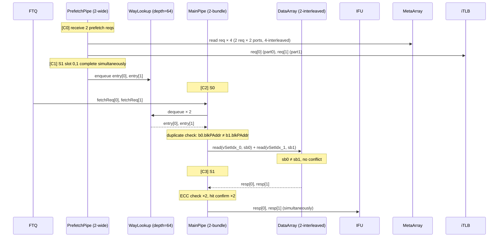
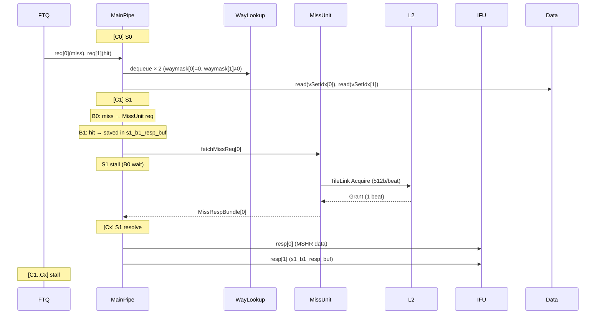
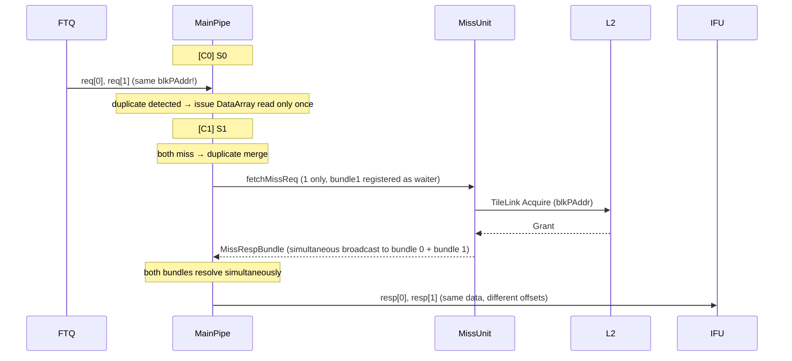
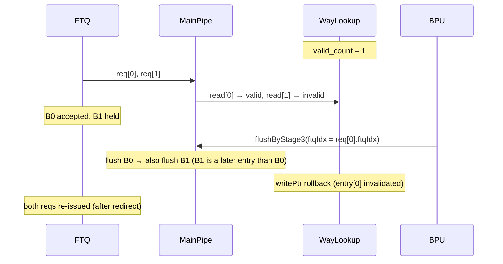

# 2-Fetch ICache Design Request

- Based on: [icache_analysis.md](./icache_analysis.md)
- Target: 2 fetch bundles/cycle from MainPipe (2× input req BW)
- Date: 2026-04-22

---

## 1. Overview

The baseline ICache has MainPipe receiving 1 fetch bundle/cycle from FTQ. The 2-Fetch design extends this to **2 fetch bundles/cycle**. This change cascades into the following problems.

1. **DataArray bank conflict increase**: Concurrent accesses double, causing singlePort SRAM collisions to spike
2. **WayLookup dual-port correctness**: PrefetchPipe production and MainPipe consumption are both 2 entries/cycle, so throughput can be balanced; the real issue is preserving FIFO order, flush rollback, refill update, and exception entry correctness under dual enqueue/dequeue
3. **MissUnit MSHR shortage**: fetch MSHRs need to double; prefetch MSHRs expanded 2× to compensate BW
4. **L2/L3 BW shortage**: ICache misses 2× + wider DCache stresses the entire memory hierarchy BW
5. **Arbitration complexity**: 2 bundle × (TLB hit/miss × Cache hit/miss) combinations; more FTQ backpressure cases
6. **FTQ/IFU interface contract change**: Changing only ICache to 2-bundle is insufficient; FTQ req format, IFU resp format, and decode consumption must all be co-defined
7. **`PortNumber=2` semantic confusion risk**: Existing `PortNumber=2` means "doubleline access within one bundle"; adding the "2 bundle/cycle" axis creates risk that implementors conflate the two axes
8. **Duplicate request merge required**: When two bundles request a cacheline with the same `blkPAddr` (same 64B cacheline), failing to merge DataArray reads and MSHR allocations causes unnecessary bank conflict and MSHR pressure. The merge criterion is `bundle0.blkPAddr == bundle1.blkPAddr`; "sequential adjacent" or "combined size ≤ 64B" are not sufficient conditions (→ §5.1, §5.4)
9. **WayLookup flush / update correctness degradation**: In a dual-consume structure, BPU stage3 flush, refill update, exception entry, and rollback rules become more complex than before
10. **Replacer consistency issue**: When the DataArray bank structure changes, the replacer must be redefined to operate on logical set granularity rather than storage bank granularity
11. **Refill/read hazard increase**: When a refill write and a main read enter the same set/sub-bank in the same cycle, the old/new data priority and stall policy must be clearly defined
12. **ECC / parity recovery complexity increase**: ECC errors can occur independently per bundle, requiring more fine-grained flush, refetch, and exception policies
13. **Prefetch pollution / fairness issue**: Scaling up only prefetch MSHRs risks useless prefetches crowding out demand fetch or DCache traffic, degrading L2 admission efficiency
14. **TLB / PMP path — hit naturally handled by 2× CAM; miss requires PTW serialization**: iTLB and PMP are CAM-based, so 2× concurrent lookups are achieved by simply doubling the comparator circuits (hit path). However, on TLB miss the PTW outbound channel remains 1-wide and PTW requests are serialized via a 2-entry pending buffer. When both slots miss on the same VPN, their PTW requests can be merged into one to avoid duplicate walks (→ §5.2 PTW Request Serialization)
15. **Refill completion serialization bottleneck**: Even if miss admission increases, if refill completion remains 1/cycle, tail latency and MSHR occupancy may not improve as expected
16. **Timing / power / verification burden increase**: Control fanout, more small SRAM instances, and state-space explosion significantly raise timing closure and verification difficulty
17. **Merge condition caution for #8 MSHR implementation**: On a same-cacheline miss, the merge must use a single MSHR entry, and the criterion must be `bundle0.blkPAddr == bundle1.blkPAddr`. "Combined bundle size ≤ 64B" or "not taken + sequential" are not valid criteria — if bundle 0 starts near a cacheline boundary, even a small combined size can place the two bundles in different cachelines (→ §5.4 Duplicate Merge)

In short, 2-Fetch ICache is not merely a matter of doubling the MainPipe input BW.
It is a structural change requiring co-redesign of DataArray / WayLookup / MissUnit / PrefetchPipe as well as the FTQ-IFU contract, replacer correctness, L2 admission policy, and verification strategy.

---

## 2. Design Delta Summary

| Item | Baseline | 2-Fetch |
| ------ | ---------- | --------- | 
| MainPipe fetch bundles/cycle | 1 | **2** |
| DataArray NumInterleavedDataBank | 1 (none) | **2** |
| MetaArray NumInterleavedBank | 2 | **4** |
| NumFetchMshr | 4 | **8** |
| NumPrefetchMshr | 10 | **20** |
| WayLookupSize | 32 | **64** |
| WayLookup read ports/cycle | 1 | **2** |
| WayLookup write ports/cycle | 1 | **2** |
| WayLookup exceptionEntry | 1 (global) | **2 (per slot)** |
| PrefetchPipe MetaArray reads/cycle | 2 (PortNumber) | **4** |
| iTLB lookup ports/cycle | 1 | **2** |
| PMP check ports/cycle | 1 | **2** |
| Replacer touch ports/cycle | 2 (PortNumber) | **4 (2 bundle × PortNumber)** |
| MissUnit duplicate merge logic | none | **new required** |
| TileLink data channel width (L1→L2) | 256b/beat | **512b/beat** |
| L2 internal banks | 4 (assumed) | **8** |
| L2 MSHR | N (existing) | **2N** |
| FTQ fetchReq ports | 1 | **2** |
| IFU resp ports | 1 | **2** |

---

## 3. Key Parameter Changes

```
// 2-Fetch ICache Parameters (changed values only)

NumFetchBundles      = 2          // was 1 → number of FTQ reqs MainPipe processes simultaneously
NumFetchMshr         = 8          // was 4 → handles simultaneous 2-bundle miss
NumPrefetchMshr      = 20         // was 10 → 2× prefetch MSHR to compensate prefetch BW
WayLookupSize        = 64         // was 32 → deeper buffer for dual enqueue/dequeue burst absorption and refill/flush update stalls
NumInterleavedDataBank = 2        // new → 2-way set interleaving for DataArray
NumInterleavedMetaBank = 4        // was 2 → supports 2-wide PrefetchPipe
```

`PortNumber=2`, `nSets=256`, `nWays=4`, `blockBytes=64`, `DataBanks=8` remain unchanged.

### PortNumber=2 vs NumFetchBundles=2 — Beware of Confusion (Issue #7)

These two parameters represent **different axes (dimensions)**.

| Parameter | Meaning | Scope |
| ----------- | --------- | ------- | 
| `PortNumber=2` | **Within-bundle** doubleline: number of ports for simultaneous access when one fetch req spans 2 consecutive cachelines | PrefetchPipe S1 tag compare, 2 MetaArray reads, DataArray bank select |
| `NumFetchBundles=2` | **Between-bundle**: number of independent fetch requests MainPipe processes simultaneously from FTQ (new dimension) | MainPipe req/resp width, WayLookup consumption rate, FTQ/IFU interface width |

Worst case: `NumFetchBundles=2` × `PortNumber=2` = **4 simultaneous cacheline accesses**.
Conflating the two axes in code leads to logic errors due to "two 2s", so variable naming conventions must clearly separate them.

```
// Recommended naming convention
s0_bundle[0..1]               // bundle axis (NumFetchBundles)
s0_bundle[b].port[0..1]       // port axis within bundle (PortNumber)
s0_bundle[b].port[p].vSetIdx  // up to 4 independent vSetIdx values
```

---

## 4. Memory Organization

### 4.1 DataArray — 2-Way Set-Interleaved Design

#### Problem (Issue #1)

The baseline DataArray is `SRAMTemplate(set=nSets=256, singlePort=true)` × 8 banks × 4 ways.
A singlePort SRAM supports only 1 read or 1 write per cycle.
When 2 fetch bundles simultaneously access the same DataBank SRAM, a conflict occurs.

**Worst case including doubleline** (2 bundles × doubleline each = 4 cacheline data fragments):

```
Bundle 0: cacheline @ set S0  + cacheline @ set S0+1   (sub-bank S0%2, (S0+1)%2)
Bundle 1: cacheline @ set S2  + cacheline @ set S2+1   (sub-bank S2%2, (S2+1)%2)
```

DataArray does not need to guarantee four independent line reads in one cycle. The architectural target is 2 fetch bundles/cycle, and the common data-read cases are:

- two one-line bundles
- one cross-line bundle
- same-line duplicate bundles

`NumInterleavedDataBank=2` is sufficient for these common cases because adjacent cachelines map to different sub-banks. When two cross-line bundles collectively require four line fragments, the DataArray read queue serializes the younger fragments over the next cycle. This is preferable to a 4-way DataArray because it cuts SRAM macro count and dynamic power while keeping the 2-bundle common case fast.

#### Design

```
NumInterleavedDataSet = nSets / NumInterleavedDataBank = 256 / 2 = 128 sets/sub-bank
sub_bank_sel = vSetIdx[0]     // lower 1 bit
sub_row_addr = vSetIdx[7:1]   // upper 7 bits (0~127)
```

**SRAM instances:**

| | Baseline | 2-Fetch |
| - | ---------- | --------- |
| Sub-bank count | 1 | 2 |
| DataBanks per sub-bank | 8 | 8 |
| Ways per sub-bank | 4 | 4 |
| SRAM depth per sub-bank | 256 sets | 128 sets |
| Total SRAM instances | 32 | **64** |
| Total SRAM bits | 32×256×66b | 64×128×66b (same) |

**Access pattern:**

```
DataSubArray[vSetIdx[0]][data_bank_idx][way].read(vSetIdx[7:1], waymask)
```

#### Refill/Read Hazard (Issue #11)

Priority when a refill write and a MainPipe read enter **the same sub-bank in the same cycle**:

```
// Per-sub-bank independent arbitration
for sb in 0..1:
  subbank[sb].read.ready  := !subbank[sb].write.valid
  subbank[sb].write.ready := true  // refill always wins

// Case classification
Case A: refill → sb[1], fetch bundle 1 → sb[1]
  → bundle 1 stall 1 cycle
  → bundle 0 (→ sb[0]) can continue  ← interleave benefit

Case B: refill → sb[1], fetch bundle → sb[0]
  → no stall, fully parallel

Case C: fetch hits same set immediately after refill completes
  → use MSHR bypass: use MSHR data directly instead of DataArray
  → defined: MainPipe S1 where missResp.valid && vSetIdx match → bypass takes priority
  → DataArray read result is discarded in this case (may be stale)
```

**MSHR bypass priority rule (extended for 2-bundle):**

```
// for bundle b
val useBypass_b = missResp.valid
                  && (missResp.bits.vSetIdx === s1_vSetIdx_b)
                  && (missResp.bits.blkPAddr === s1_blkPAddr_b)

s1_data_b := Mux(useBypass_b, missResp.bits.data, dataArray_resp_b)
```

Both bundles can receive the same MSHR broadcast simultaneously (when each requested the same cacheline).
In this case, both bundles apply bypass — tied into duplicate merge (see §5.4).

---

### 4.2 MetaArray — Quad-Interleaved Design

#### Problem

A 2-wide PrefetchPipe requires up to 4 MetaArray reads per cycle:
(2 prefetch requests) × (PortNumber=2 = doubleline) = 4 reads.
The baseline NumInterleavedBank=2 supports only 2 reads/cycle → bottleneck.

#### Design

`NumInterleavedBank = 4`, `NumInterleavedSet = nSets / 4 = 64 sets/bank`

```
MetaBank 0: sets 0,4,8,...   (set%4==0)
MetaBank 1: sets 1,5,9,...   (set%4==1)
MetaBank 2: sets 2,6,10,...  (set%4==2)
MetaBank 3: sets 3,7,11,...  (set%4==3)
```

4 independent SRAMs → 4 reads/cycle without conflict.

**Port priority** (independent per bank):
1. `flushAll` (fence.i)
2. `flush.req.valid` (ECC error) — invalidates only the affected bank
3. `write.req.valid` (refill) — blocks only the affected bank
4. `read.req.valid` (PrefetchPipe)

Even when a refill write blocks one bank, prefetch reads on other banks can continue.

---

### 4.3 Replacer — Logical-Set Consistency (Issue #10)

#### Problem

Baseline Replacer:
```scala
private val replacers = Seq.fill(PortNumber)(ReplacementPolicy.fromString(Replacer, nWays, nSets/PortNumber))
// 2 replacer instances, each covering nSets/2=128 sets
// even/odd split via vSetIdx[0]
```

This structure operates on logical vSetIdx **independently** of the DataArray sub-bank split.
Even when DataArray switches to 2-interleaved, the Replacer still operates on logical vSetIdx → **no separate change required**.

However, in 2-fetch, **up to 4 touch events occur per cycle**:

```
bundle 0, port 0: vSetIdx_0_port0 → replacer[vSetIdx_0_port0 & 1]
bundle 0, port 1: vSetIdx_0_port1 → replacer[vSetIdx_0_port1 & 1]
bundle 1, port 0: vSetIdx_1_port0 → replacer[vSetIdx_1_port0 & 1]
bundle 1, port 1: vSetIdx_1_port1 → replacer[vSetIdx_1_port1 & 1]
```

Each replacer instance can handle only 1 touch/cycle, so **conflict** occurs when 2 or more touches arrive at the same replacer (same even/odd) simultaneously.

#### Solution

**Touch serialization policy**: When 2 or more simultaneous touches arrive at the same replacer instance, apply only the first touch and defer the rest to the next cycle (1 cycle stale LRU is acceptable).

```
// collision detect
val touch_even = Seq(b0_p0, b0_p1, b1_p0, b1_p1).filter(_.vSetIdx[0] == 0)
val touch_odd  = Seq(b0_p0, b0_p1, b1_p0, b1_p1).filter(_.vSetIdx[0] == 1)

replacers(0).touch(touch_even.head)  // even replacer: apply only the first
replacers(1).touch(touch_odd.head)   // odd  replacer: apply only the first
// remaining touches dropped in pipeline (1 cycle LRU update delay acceptable)
```

LRU accuracy impact: dropped touches in the hit path have negligible effect on eviction policy.
Since Replacer is register-based (not SRAM), the 1 write/cycle constraint has low hardware cost.

**Victim selection**: On MissUnit acquire via replacer.victim.req — 2 victim requests possible with simultaneous 2-bundle miss.
When 2 victim reqs arrive at the same replacer, serialize (B0 first, B1 next cycle).

---

## 5. Pipeline Architecture

### 5.1 MainPipe — Dual-Bundle (2-Stage)

#### Interface Changes

```scala
// baseline
val req  : Decoupled[FtqFetchRequest]
val resp : Valid[ICacheRespBundle]

// new
val req  : Vec[NumFetchBundles, Decoupled[FtqFetchRequest]]
val resp : Vec[NumFetchBundles, Valid[ICacheRespBundle]]
```

#### Duplicate Request Detection (Issue #8)

When two bundles simultaneously request the **same cacheline (identical blkPAddr)**:

```
duplicate = (bundle0.blkPAddr == bundle1.blkPAddr)
            // or more precisely:
            // (bundle0.vSetIdx == bundle1.vSetIdx) && (bundle0.pTag == bundle1.pTag)
```

| Case | Behavior |
| ------ | ---------- | 
| Duplicate + both hit | Issue DataArray read only once, share result with both bundles |
| Duplicate + miss | Issue only 1 req to MissUnit (from bundle 0), merge bundle 1 into the same MSHR |
| Duplicate + B0 hit / B1 miss | Respond to both using B0's DataArray result (B1 is not a miss, share B0 waymask) |

DataArray read savings: 1 sub-bank access on duplicate → eliminates unnecessary bank conflicts at the source.
MissUnit duplicate merge details in §5.4.

#### S0 — Dual WayLookup Dequeue + Dual DataArray Read

```
Advance conditions:
  s0_canGo[0] = toData[0].ready && fromWayLookup.valid_count >= 1 && s1_ready[0]
  s0_canGo[1] = toData[1].ready && fromWayLookup.valid_count >= 2 && s1_ready[1]
                && !duplicate  // on duplicate, bundle 1 needs no separate DataArray read

fromFtq[0].ready = s0_canGo[0]
fromFtq[1].ready = s0_canGo[0] && s0_canGo[1]
```

DataArray access (non-duplicate):
```
bundle 0: DataSubArray[vSetIdx_0[0]].read(vSetIdx_0[7:1], waymask_0, bankSel_0)
bundle 1: DataSubArray[vSetIdx_1[0]].read(vSetIdx_1[7:1], waymask_1, bankSel_1)
```

#### S1 — Hit/Miss Arbitration + Ordered IFU Response

**In-Order Response Policy:**
IFU requires in-order responses. If bundle 0 misses, bundle 1's hit response must also be held.

| Bundle 0 | Bundle 1 | Behavior | IFU Response | FTQ State |
| ---------- | ---------- | ---------- | ------------- | ----------- | 
| Hit | Hit | Both served | 2 simultaneous responses at cycle N+1 | ready |
| Hit | Miss | B0 responds immediately, B1 waits for MSHR allocation | B0 resp now, B1 hold | stall (B1 wait) |
| Miss | Hit | B0 MSHR allocated, B1 result saved in resp buffer | B1 resp after B0 resp | stall (B0 wait) |
| Miss | Miss | Each allocated an MSHR (or duplicate merge) | Respond in miss resp arrival order | stall (both wait) |
| Duplicate | — | Single read + shared result | Can respond simultaneously | ready |

**Miss/Hit (B0 miss, B1 hit) handling — 1-entry response buffer:**

```
s1_b1_resp_buf: Reg[ICacheRespBundle]
s1_b1_resp_buf_valid: Reg[Bool]

when(bundle0_miss && bundle1_hit):
  s1_b1_resp_buf := bundle1_resp
  s1_b1_resp_buf_valid := true

when(bundle0_missResp.valid && missMatch_0):
  IFU.resp[0] := bundle0_resp_from_mshr
  IFU.resp[1].valid := s1_b1_resp_buf_valid
  IFU.resp[1].bits  := s1_b1_resp_buf
  s1_b1_resp_buf_valid := false
```

**S1 ready conditions:**

```
s1_ready[0] = !s1_valid[0] || s1_fetchFinish[0]
s1_ready[1] = !s1_valid[1] || (s1_fetchFinish[0] && s1_fetchFinish[1])
```

**Flush policy:**

```
s1_flush_0 = io.flush || bpuFlush.shouldFlush(s1_ftqIdx[0])
s1_flush_1 = io.flush || bpuFlush.shouldFlush(s1_ftqIdx[1])

// flush bundle 0 → also invalidate bundle 1 (bundle 1 is a later entry than bundle 0)
// flush bundle 1 only → keep bundle 0, invalidate bundle 1 only
when(s1_flush_0): { s1_valid[0] := false; s1_valid[1] := false; s1_b1_resp_buf_valid := false }
when(s1_flush_1 && !s1_flush_0): { s1_valid[1] := false; s1_b1_resp_buf_valid := false }
```

---

### 5.2 PrefetchPipe — Fully 2-Wide

#### Design Direction

Because iTLB and PMP are **CAM-based**, the entire PrefetchPipe path is extended to **fully 2-wide**.

```
CAM (Content Addressable Memory) properties:
  - Parallel comparison of all entries against query (combinational match)
  - 2 simultaneous lookups = achieved by adding 2× comparator circuits only
  - No structural bottleneck from read port count unlike SRAM
  - iTLB miss (page table walk) can be handled independently per slot
```

This means:
- TLB: 2 lookups/cycle — 2× comparator array, no structural change
- PMP: 2 checks/cycle — 2× rule comparator bank, combinational logic stays under 1 cycle
- MetaArray: 4 reads/cycle — using 4-interleaved banks (§4.2)
- miss FSM: **2-slot independent FSM** (TLB miss retry handled independently per slot)

WayLookup production (2 entries/cycle) and MainPipe consumption (2 entries/cycle) are **balanced**.
NumPrefetchMshr=20 further supplements 2× miss path BW.

#### TLB / PMP CAM Structure Extension (Resolves Issue #14)

```
iTLB (CAM-based) — hit path:
  Baseline: comparator array × N_entries, 1 query/cycle
  2-Fetch:  comparator array × N_entries × 2 sets (slot 0, slot 1 independent)
  → 2 simultaneous virtual addresses → 2 independent physical tags returned
  → area: ~2×, timing: comparator parallelism → no critical path increase

iTLB — miss path (PTW serialization):
  Even when both slots miss simultaneously, the PTW outbound channel stays 1-wide
  → 2-entry pending buffer serializes PTW reqs (slot 0 priority)
  → both slots miss on same VPN → issue 1 PTW req, update both slots on response
  (detailed design: §5.2 PTW Request Serialization)

PMP (combinational, CAM-based):
  Baseline: N_rules × pAddr comparator, 1 check/cycle
  2-Fetch:  N_rules × pAddr comparator × 2 sets
  → 2 pAddr checks simultaneously, result within 1 cycle, no miss concept (fault → exception)
  → negligible area impact when PMP rule count ≤ 16
```

#### S0/S1/S2 Changes

```
S0: receive 2 prefetch requests simultaneously (FTQ prefetch req × 2)
    → MetaArray: 4 reads/cycle (2 requests × PortNumber=2) — 4-interleaved bank
    → iTLB:     2 independent CAM lookups (req[0], req[1] simultaneously)
    → PMP:      2 independent combinational checks

S1 FSM: fully independent 2-slot (slot 0, slot 1)
    → {tlbValid, sramValid, waymask, pTag, exception} independent registers per slot
    → TLB hit:  pTag confirmed immediately, slot proceeds
    → TLB miss: enters ItlbResend state, loads req into PTW pending buffer
                PTW outbound channel is 1-wide → slot 0 issued first (§5.2 PTW Serialization)
    → enqueue order: slot 0 → slot 1 (maintains WayLookup FIFO ordering)

S2: each miss slot issues MissUnit prefetch req (up to 2/cycle)
    → absorbed by NumPrefetchMshr=20
```

#### Ordering Guarantee and TLB × Cache State Matrix

WayLookup enqueue order: slot 1 enqueue only allowed after slot 0 completes.

| Slot 0 TLB | Slot 1 TLB | PTW issued | WayLookup enqueue |
| --------- | --------- | ---------- | ----------------- |
| hit | hit | none | simultaneous enqueue possible |
| hit | miss | slot 1 → PTW (1 req) | Slot 0 immediately, Slot 1 after PTW completes |
| miss | hit | slot 0 → PTW (1 req) | Slot 1 waits. Enqueue together after Slot 0 PTW completes |
| miss | miss (different VPN) | slot 0 first, slot 1 queued in buffer | Each after PTW completes, Slot 0 → Slot 1 order |
| miss | miss (same VPN) | 1 PTW req (dedup) | Both slots update TLB on single PTW response, Slot 0 → Slot 1 order enqueue |

#### PTW Request Serialization

**Problem**: When both slots in a 2-slot PrefetchPipe simultaneously miss TLB, up to 2 PTW requests are generated per cycle. However, widening the PTW outbound channel to 2-wide is unnecessary and requires significant changes inside PTW.

##### Solution: 2-entry PTW pending buffer + keep 1-wide channel

```
// PrefetchPipe S1 — PTW pending buffer (2 entries)
ptw_pending: Vec[2, Valid[PTWReqEntry]]
  PTWReqEntry: { vpn: VPN, vSetIdx: UInt, slot_id: UInt(1.W) }

// load on simultaneous miss
when(slot0_tlb_miss && !slot1_tlb_miss):
  ptw_pending[0] := {vpn=slot0_vpn, id=0}

when(!slot0_tlb_miss && slot1_tlb_miss):
  ptw_pending[0] := {vpn=slot1_vpn, id=1}

when(slot0_tlb_miss && slot1_tlb_miss):
  val same_vpn = (slot0_vpn === slot1_vpn)
  ptw_pending[0] := {vpn=slot0_vpn, id=0}
  when(!same_vpn):
    ptw_pending[1] := {vpn=slot1_vpn, id=1}
  // if same_vpn: only 1 entry (dedup)

// PTW channel arbitration (1-wide, head-of-queue priority)
io.ptw_req.valid := ptw_pending[0].valid
io.ptw_req.bits  := ptw_pending[0].bits
when(io.ptw_req.fire):
  ptw_pending[0] := ptw_pending[1]   // shift
  ptw_pending[1].valid := false

// PTW response routing — update matching slot(s) via VPN match
when(io.ptw_resp.valid):
  val wake0 = (io.ptw_resp.bits.vpn === slot0_pending_vpn) && slot0_in_ItlbResend
  val wake1 = (io.ptw_resp.bits.vpn === slot1_pending_vpn) && slot1_in_ItlbResend
  when(wake0): slot0_tlb_update := true   // update TLB then slot 0 retries
  when(wake1): slot1_tlb_update := true   // update TLB then slot 1 retries
  // same-VPN dedup case: wake0 && wake1 simultaneously possible
```

##### Additional Considerations

1. **PTW internal outstanding count**: Even if XiangShan PTW supports multiple outstanding walks, keeping a pending buffer at the PrefetchPipe side for explicit back-pressure management is safer.

2. **Same-VPN dedup effect**: In sequential prefetch, adjacent bundles are likely on the same 4KB page. In this case both slots share the same VPN → PTW requests are halved.

3. **Slot 1 blocking during ItlbResend**: When slot 0 is in ItlbResend and slot 1 generates a new TLB miss, the slot 1 req is loaded into pending buffer[1] and promoted to buffer[0] once slot 0's PTW is accepted. Since slot 1's WayLookup enqueue is after slot 0 completes, there is no ordering violation.

4. **PMP has no miss**: PMP is purely combinational so no pending buffer is needed. A PMP fault is treated as an exception and enqueued into the slot's WayLookup entry with the exception flag set.

---

### 5.3 WayLookup — Dual-Port + Correctness (Issues #2, #9)

#### Basic Structure

```
entries:   RegInit(VecInit.fill(WayLookupSize=64)(...))
readPtr:   single pointer, advances up to 2 per cycle (s0_fire[0] +1, s0_fire[1] +1 → max +2)
writePtr:  single pointer, advances up to 2 per cycle
valid_count = (writePtr - readPtr) mod 64

io.read[0].valid = (valid_count >= 1) && !updateStall[readPtr]   || canBypass[0]
io.read[1].valid = (valid_count >= 2) && !updateStall[readPtr+1] || canBypass[1]
```

#### exceptionEntry — 2-slot Split (Issue #9)

Baseline: `exceptionEntry: Reg[Valid[WayLookupExceptionEntry]]` (1 entry for the entire queue, records only the first exception)

In 2-Fetch, both slots can hold exceptions independently:

```
// new
exceptionEntry: Vec[2, Reg[Valid[WayLookupExceptionEntry]]]

// PrefetchPipe slot 0 exception → recorded in exceptionEntry[0]
// PrefetchPipe slot 1 exception → recorded in exceptionEntry[1]
// MainPipe S0 dequeue: entry[0] references exceptionEntry[0], entry[1] references exceptionEntry[1]
// on flush: clear both exceptionEntries
```

Exception ordering: if slot 0 has an exception, slot 1's exception is suppressed (IFU waits for slot 1 after slot 0 exception response).

#### BPU Stage3 Flush / Rollback (Issue #9)

Baseline: BPU flush → rollback WayLookup tail (writePtr) by 1 entry.

In 2-Fetch, flush occurs at FTQ entry granularity, with each FTQ entry corresponding to one WayLookup slot.

```
// on receiving flush target ftqIdx
// rollback entries from the first entry matching ftqIdx to writePtr

val flushTargetPtr = position of the first entry in WayLookup where ftqIdx == flush.ftqIdx

// invalidate from that entry to writePtr (writePtr = flushTargetPtr)
writePtr := flushTargetPtr

// when two slots were enqueued in the same cycle:
//   flush targets slot 0's ftqIdx → rollback both slot 0 and slot 1
//   flush targets slot 1's ftqIdx → rollback slot 1 only (keep slot 0)
```

**updateStall (during refill broadcast) — simultaneous 2-entry check:**

```
val updateStall_0 = entryUpdate(readPtr)        // current read entry is being updated
val updateStall_1 = entryUpdate(readPtr + 1)    // next read entry is being updated

io.read[0].valid := (valid_count >= 1) && !updateStall_0 || canBypass[0]
io.read[1].valid := (valid_count >= 2) && !updateStall_1 || canBypass[1]
// if only B1 has updateStall, B0 can still proceed
```

updateStall pre-compute: compute `updateStall[i]` 1 cycle ahead and store in register → shortens S0 critical path.

#### Bypass — 2-entry Extension

```
canBypass[0] = empty && io.write[0].valid && !exceptionEntry[0].valid
canBypass[1] = empty && io.write[0].valid && io.write[1].valid
               && !exceptionEntry[0].valid && !exceptionEntry[1].valid
```

---

### 5.4 MissUnit — Scaled MSHRs + Duplicate Merge + Serialization

#### MSHR Scale-Up

```
fetchMSHRs     : 4 → 8   (handles simultaneous 2-bundle miss)
prefetchMSHRs  : 10 → 20 (compensates prefetch miss BW)
acquireArb     : Arbiter(NumFetchMshr+1) → Arbiter(8+1)
```

#### Duplicate Merge (Issue #8)

When both bundles simultaneously miss the same cacheline, allocate only 1 MSHR:

```
// after S1 miss determination
val same_cacheline = (bundle0.blkPAddr === bundle1.blkPAddr) && bundle0_miss && bundle1_miss

when(same_cacheline):
  allocate fetchMSHR for bundle 0 only
  fetchMSHR[n].waiters += bundle1   // register bundle 1 as waiter on the same MSHR
  // broadcast to both bundle 0 and bundle 1 on refill completion

.otherwise:
  allocate fetchMSHR[n] for bundle 0
  allocate fetchMSHR[m] for bundle 1  // m ≠ n
```

When the same-cacheline miss already has a prefetch MSHR entry (prefetch MSHR hit):
```
val fetchHit_0 = prefetchMSHRs.map(m => m.valid && m.blkPAddr === bundle0.blkPAddr).orR
val fetchHit_1 = prefetchMSHRs.map(m => m.valid && m.blkPAddr === bundle1.blkPAddr).orR
// bundles with fetchHit skip new MSHR allocation → wait for existing prefetch MSHR broadcast
```

#### Refill Completion Serialization (Issue #15)

Despite increased miss admission (8 fetchMSHR, 20 prefetchMSHR), if refill completion remains 1/cycle, tail latency is bounded.

**Analysis:**

```
TileLink D-channel: 512b/beat (was 256b × 2beats → 512b × 1beat)
refill completion: SRAM write + broadcast after receiving 1 beat

theoretical max refill throughput: 1 cacheline/cycle
in practice: SRAM write occupies a specific sub-bank → reads on other sub-banks can continue

bottlenecks:
  A. TileLink D-channel: 1 Grant/cycle → 1 refill/cycle limit
  B. DataArray write port: 1 write/cycle per sub-bank
     → theoretically up to 4 simultaneous writes if targeting different sub-banks
     → in practice: TileLink 1 Grant/cycle → 1 write/cycle is the real bottleneck
```

**Mitigations:**

1. **TileLink 2-channel parallelism**: ICache and DCache use independent TileLink channels
   → ICache channel: dedicated to fetch MSHRs, DCache channel: dedicated to DCache
   → ICache refill throughput secured independently

2. **Refill pipeline**: add pipeline to hide SRAM write behind 1 cycle latency
   → SRAM write in the Grant receive cycle, broadcast in the next cycle
   → enables handling 2 simultaneous Grants (when using dual-channel TL)

3. **MSHR occupancy monitoring**: pattern where all 8 fetchMSHRs drain simultaneously → cold miss spike detection
   → stall signal to FTQ on spike (natural backpressure)

#### Prefetch Fairness / L2 Admission Control (Issue #13)

Risk that useless prefetches waste L2 BW when prefetchMSHR=20:

```
problem: 20 prefetch MSHRs → can issue 20 L2 requests simultaneously
         these compete with demand misses → increased demand latency (IPC drop)
```

**Throttle policy (recommended):**

```
// limit prefetch issuance: adjust active prefetch MSHR count based on demand MSHR utilization
val activeFetchMSHR = PopCount(fetchMSHRs.map(_.valid))
val maxPrefetchActive = Mux(activeFetchMSHR >= 4, 8.U, 20.U)
  // when demand requests are heavy, cap active prefetch MSHRs at 8

val prefetchBlocked = PopCount(prefetchMSHRs.map(_.valid)) >= maxPrefetchActive
prefetchMSHR.io.alloc.valid := s2_prefetch_req.valid && !prefetchBlocked
```

**L2 acquire priority:**

```
acquireArb:
  0~7: fetchMSHR[0..7]  — highest priority (demand)
  8:   prefetch bundle (priorityFIFO) — lower priority
```

acquireArb always services fetch MSHRs before prefetch → protects demand latency.

---

### 5.5 FTQ / IFU Interface Contract (Issue #6)

When ICache changes to 2-bundle, **the FTQ and IFU interfaces must also be co-redefined**.

#### FTQ → ICache (fetchReq)

```scala
// baseline: FTQ issues 1 FtqFetchRequest/cycle
// new: FTQ issues 2 FtqFetchRequests/cycle (consecutive FTQ entries)

class FtqToICacheIO_2Fetch:
  val fetchReq: Vec[NumFetchBundles, Decoupled[FtqFetchRequest]]
    // fetchReq[0]: FTQ entry[ptr]
    // fetchReq[1]: FTQ entry[ptr+1]
    // fetchReq[1].valid = fetchReq[0].valid && (ptr+1 < writePtr)
```

FTQ constraints:
- `fetchReq[1]` is valid only when `fetchReq[0]` is valid
- FTQ must be ready to dequeue 2 consecutive entries simultaneously
- FTQ's existing single read port must be extended to dual read ports

#### ICache → IFU (resp)

```scala
// baseline: 1 Valid[ICacheRespBundle] per cycle
// new: Vec[NumFetchBundles, Valid[ICacheRespBundle]] — 2 per cycle

// response guarantees:
//   if resp[0].valid == true, resp[0] always corresponds to bundle 0
//   if resp[1].valid == true, resp[1] is in the same cycle or later than resp[0]
//   resp[1] is valid only after resp[0] (in-order guarantee)
```

Changes IFU must handle:
- **Instruction alignment buffer**: handle 2× wider input
- **Predecode**: simultaneous RVC length computation for 2 resps
- **IFU→Decode**: 2× wider instruction bus
- **`respStall`**: when `fromIfu.respStall` is asserted, hold both responses (when IFU is full)

#### FTQ Prefetch Req (prefetchReq)

```scala
// new: 2 prefetch reqs/cycle
class FtqToICacheIO_2Fetch:
  val prefetchReq: Vec[NumFetchBundles, Decoupled[PrefetchRequest]]
```

FTQ issues prefetch entries that are ahead of fetchReq entries. 2-wide prefetch matches the 2× MainPipe consumption rate.

---

## 6. Input Arbitration & Backpressure

### 6.1 FTQ Backpressure Cases

| # | Bundle 0 | Bundle 1 | WayLookup | DataArray | Result |
| --- | ---------- | ---------- | ----------- | ----------- | -------- | 
| 1 | ─ | ─ | empty (0) | ready | both stall |
| 2 | ─ | ─ | 1 entry only | ready | B0 proceeds, B1 stall (partial) |
| 3 | hit | hit | 2+ entries | ready | normal: 2 simultaneous responses |
| 4 | hit | miss | 2+ entries | ready | B0 responds immediately, B1 stalls waiting for MSHR |
| 5 | miss | hit | 2+ entries | ready | B1 buffered, B0 waits for MSHR. both stall |
| 6 | miss | miss | 2+ entries | ready | 2 MSHRs allocated. both stall |
| 6a | miss | miss (duplicate) | 2+ entries | ready | 1 MSHR allocated, merged. both stall (better MSHR turnover) |
| 7 | ─ | ─ | ─ | refill write (sb A) | sb A fetch stalls, the other data sub-bank can proceed |
| 8 | BPU flush (B0) | ─ | ─ | ─ | both B0 and B1 flushed |
| 9 | valid | BPU flush (B1 only) | ─ | ─ | B0 kept, B1 flushed only |
| 10 | ─ | ─ | updateStall (B0 ptr) | ─ | B0 stall, B1 also stalls |
| 11 | ─ | ─ | updateStall (B1 ptr only) | ─ | B0 proceeds, B1 stalls |
| 12 | ECC error | valid | ─ | ─ | B0 metaFlush+MSHR req, B1 hold |
| 13 | valid | ECC error | ─ | ─ | B0 responds, B1 metaFlush+MSHR req |
| 14 | ECC error | ECC error | ─ | ─ | B0 flush/req first, B1 next cycle |
| 15 | TLB exception | valid | ─ | ─ | B0 exception resp, B1 hold |
| 16 | subbank conflict (B0∩B1) | same sb | ─ | busy | B1 1 cycle delay |
| 17 | ─ | ─ | WL flush rollback | ─ | writePtr rollback, enqueue halted |
| 18 | ─ | ─ | exceptionEntry[0] valid | ─ | B0 exception dequeue only, B1 stall |

---

### 6.2 PrefetchPipe 2-slot TLB State Combinations

| Slot 0 TLB | Slot 1 TLB | WayLookup enqueue |
| ----------- | ----------- | ------------------- | 
| hit | hit | simultaneous enqueue |
| hit | miss | S0 enqueues immediately, S1 enqueues after TLB resolved |
| miss | hit | S1 waits (S0 first). Enqueue S0→S1 order after S0 resolved |
| miss | miss | Each enqueues after resolved, S0→S1 order |
| exception | valid | S0 exception enqueued, S1 held until S0 enqueued |
| valid | exception | S0 enqueued, S1 exception enqueued |

---

### 6.3 DataArray Sub-bank Conflict Handling

```
conflict detection:
  collect valid data fragments from bundle0.port0/1 and bundle1.port0/1
  data_bank = fragment.vSetIdx[0]
  conflict when more than one non-duplicate fragment targets the same data_bank

on conflict: issue older fragments first, delay younger fragment read by 1 cycle
             s0_canGo[1] &= !subbank_conflict
             → bundle 1 performs DataArray read in next cycle (s0_fire[1] delayed by 1)
```

Duplicate detection and subbank_conflict detection are performed in parallel at the beginning of S0 and folded into s0_canGo.

---

### 6.4 ECC / Parity Recovery — 2-Bundle Handling (Issue #12)

Baseline ECC handling path:
```
hit way meta ECC + data ECC → parity check → metaFlush + missReq (when EnableCorruptRefetch=true)
```

In 2-Bundle, ECC errors can occur independently per bundle. Handling policy:

**metaFlush port expansion:**

```scala
// baseline
val metaFlush: Vec[PortNumber, Valid[MetaFlushBundle]]  // PortNumber=2

// new (2 bundles × PortNumber=2 = 4 ports)
val metaFlush: Vec[NumFetchBundles * PortNumber, Valid[MetaFlushBundle]]
// metaFlush[0,1] = bundle 0 port 0,1
// metaFlush[2,3] = bundle 1 port 0,1
```

Since MetaArray is 4-interleaved, up to 4 simultaneous flushes can be processed if each targets a different bank.
If 2 flushes arrive at the same bank simultaneously, priority: per-bank flush arbitration (B0 wins).

**ECC + miss req priority (2-bundle):**

| Bundle 0 | Bundle 1 | fetchMSHR allocation |
| ---------- | ---------- | --------------------- | 
| ECC error (refetch) | miss | B0 issues refetch req first (B0 priority), B1 issues miss req. Each gets independent MSHR |
| ECC error (refetch) | ECC error (refetch) | B0 issues refetch req first, B1 in next cycle (2 MSHRs needed) |
| ECC error (exception, EnableCorruptRefetch=false) | valid | B0 exception resp to IFU, B1 hold |

ECC error reporting (BEU):
```scala
val errors: Vec[NumFetchBundles * PortNumber, Valid[L1CacheErrorInfo]]
// errors[0,1]: bundle 0 / errors[2,3]: bundle 1
```

---

## 7. L2/L3 Bandwidth Scaling

### Problem

2-Fetch ICache + wider decode width (machine width 2×):
- ICache miss rate: up to 2×
- DCache accesses/cycle: increases proportionally with decode width
- L2 traffic: ICache demand + DCache + prefetch = 2~3× compared to baseline

### 7.1 TileLink L1→L2 Data Channel Width Increase (Top Priority)

```
current: 256b/beat × 2 beats = 512b per cacheline fill
changed: 512b/beat × 1 beat  = 512b per cacheline fill

effect:
  - half fill latency → shorter MSHR occupancy → increased MSHR effective capacity
  - ICache 8 fetchMSHR turnover rate 2× improvement → effective miss throughput increase
```

### 7.2 L2 Internal Bank Count Increase

```
L2 4-bank → L2 8-bank
effect: 2× throughput for simultaneous ICache miss + DCache miss service
cost: increased L2 SRAM instances
```

### 7.3 L2 MSHR Scale-Up

```
L2 MSHR N → 2N
effect: simultaneous handling of L1 fetchMSHR 8 + DCache demand MSHR
```

### 7.4 Instruction Stream Buffer (ISB)

```
location:  between ICache PrefetchPipe miss path and L2
size:      8~16 entries (fully-associative, 64B/entry)
behavior:  detect sequential stream pattern → ahead-of-time L2 read → store in ISB
           ISB hit on demand miss → block L2 access
effect:    up to 90% reduction in sequential code ICache→L2 demand traffic
```

### 7.5 DCache Victim Cache (D-side pressure relief)

```
size:      8~16 entries (fully-associative)
behavior:  DCache eviction → victim cache, subsequent D-miss → served from victim cache
effect:    reduced conflict-miss-based L2 traffic, alleviates I/D side L2 BW contention
```

### 7.6 L2→L3 Channel Width Increase

```
L2→L3: 512b/beat or wider, increase L3 bank count
must align with DRAM burst width
```

### 7.7 Prefetch Admission Control at L2 (Issue #13)

With prefetchMSHR=20, L2-side control to prevent unnecessary prefetches from wasting L2 BW:

```
L2 prefetch admission policy:
  1. Assign separate priority bit to prefetch requests (use TileLink user field)
  2. Throttle prefetch requests when L2 BW utilization > threshold (e.g., 80%)
  3. L2 entries filled by prefetch get lower eviction priority than demand entries
     (evict prefetch entries first when demand entries are eviction candidates)
  4. L2 prefetch filter: block duplicate prefetches for cachelines already in L2
```

ICache MissUnit side response:
```
// monitor demand MSHR occupancy when issuing prefetch (§5.4 throttle policy)
// dynamically reduce prefetch MSHRs when demand latency spikes (guarantee minimum 4)
val dynamicPrefetchMSHRCap =
  Mux(l2_bw_stressed, 8.U, 20.U)  // throttle when L2 BW stress signal received
```

### Priority Summary

| Priority | Measure | Effect | Cost |
| ---------- | --------- | -------- | ------ | 
| 1 | TileLink L1→L2 width 512b | fill latency ½, MSHR turnover 2× | routing overhead |
| 2 | L2 MSHR 2× | outstanding req 2× | slight area increase |
| 3 | L2 bank 2× | internal throughput 2× | area increase |
| 4 | ISB | 90% reduction in sequential I-miss | separate logic, area |
| 5 | L2 prefetch admission | prevent useless prefetch BW waste | requires L2 design change |
| 6 | DCache victim cache | alleviates D-side L2 contention | separate logic, area |
| 7 | L2→L3 width increase | prevent L3 escalation bottleneck | design complexity |

---

## 8. Timing, Power & Verification (Issues #14, #15, #16)

### 8.1 New Critical Path Candidates

| Location | Critical Path | Reason |
| ---------- | --------------- | -------- | 
| MainPipe S0 | `fromWayLookup.valid_count` → `s0_canGo[0,1]` | 64-entry counter compare + 2 bundle AND |
| MainPipe S0 | duplicate detect: `(b0.blkPAddr == b1.blkPAddr)` | PA compare (physical address width) → folded into s0_canGo |
| MainPipe S0 | subbank conflict: `(b0.vSetIdx[0] == b1.vSetIdx[0])` | 1-bit compare, short but serial in s0_canGo |
| MainPipe S1 | IFU resp mux after `s1_b1_resp_buf` write | miss determination → 2× mux chain |
| DataArray | 2-way sub-bank MUX + row addr splicing | vSetIdx split → SRAM enable |
| WayLookup | `updateStall[readPtr+1]` check | 64-entry scan (pre-compute essential) |
| PrefetchPipe S1 | 2-slot FSM enqueue priority | independent FSM ×2 + ordering logic |
| MissUnit | 8-MSHR free-detect priority encoder | was 4-bit → 8-bit encoder |
| iTLB | 2× CAM comparator lookup | CAM structure adds only 2× comparator array, no structural change, no critical path increase |
| Replacer | 4-touch conflict detection + arbitration | PopCount + priority mux |
| ECC | metaFlush 4 port arbitration per bank | up to 4 flush reqs → bank arbiter |

### 8.2 Timing Risks and Mitigations

1. **WayLookup valid_count path**: pre-compute updateStall for `readPtr+1` (1 cycle ahead) to shorten S0 critical path.

2. **Duplicate detect path**: blkPAddr compare is as long as PA width (PAddrBits-6 bits) → compute separately at the start of MainPipe S0 and latch.

3. **MissUnit 8-MSHR free encoder**: 8-bit → 2-level tree encoder. Adds 1 logic level vs. 4-bit (within acceptable range).

4. **PrefetchPipe 2-slot FSM**: compute each slot independently, only the final enqueue arbitration is combined. Critical path stays within each slot.

5. **iTLB 2× CAM lookup timing**: For CAM, adding the second lookup is simply duplicating the comparator array in parallel. Critical path stays the same as a single CAM lookup. If the TLB were SRAM-based, an additional read port would be needed, but CAM is not affected.

### 8.3 Power Analysis (Issue #16)

**Dynamic power:**

```
DataArray SRAM reads:
  Baseline: 8 DataBanks × 4 ways = 32 SRAM reads/cycle (hit path)
  2-Fetch:  up to 16 DataBanks × 4 ways = 64 SRAM reads/cycle (2× bundles)
  dynamic power: ~2× increase (DataArray is the primary ICache power contributor)

MetaArray SRAM reads:
  Baseline: 2 banks / prefetch cycle
  2-Fetch:  4 banks / prefetch cycle → 2× increase

total ICache dynamic power: estimated ~1.8~2.0× increase
```

**Mitigations:**

```
1. Stronger clock gating:
   - add independent clock gate to each sub-bank
   - clock-gate unused sub-banks for bundle 1 (on subbank_conflict or single-line)
   - apply withClockGate=true to DataArray SRAMs as well (was false → true)

2. Low-power SRAM macro selection:
   - 64 × 128 × 66b SRAM → shallower depth than baseline enables low-power macros
   - reduced bitline precharge, smaller sense amp area

3. Bank-level power gating:
   - power-gate sub-banks after detecting idle cycles (on the order of a few cycles)
```

**Static power:**

```
SRAM instance count 4×, but each SRAM is 1/4 the size → total SRAM area unchanged
leakage proportional to area → negligible static power increase
additional logic (MUX, arbiter) area: estimated ~5~10% increase
```

### 8.4 Verification Complexity (Issue #16)

**State-space growth:**

```
Baseline key state variables:
  WayLookup(32 entries) × MainPipe(S0,S1) × PrefetchPipe(FSM) × MissUnit(4+10 MSHR)

2-Fetch additional variables:
  NumFetchBundles: +2 dimensions
  duplicate flag: +1
  exceptionEntry[2]: +2
  s1_b1_resp_buf: +1
  subbank_conflict: +1
  replacer collision: +1

→ corner case count: 4~8× increase vs. baseline
```

**Key verification scenarios:**

| Scenario | Verification Points |
| ---------- | --------------------- | 
| Simultaneous miss to same cacheline (duplicate) | MSHR merge, both respond via single refill broadcast |
| B0 miss, B1 hit → refill arrival order vs. resp buffer | s1_b1_resp_buf correctness, in-order response guarantee |
| WayLookup BPU flush + simultaneous refill update | updateStall occurring while writePtr rolls back |
| ECC error on both bundles simultaneously | metaFlush arbitration, 2 MSHR re-fetches |
| exceptionEntry[0] valid + slot 1 miss | exception handling ordering |
| Replacer 4-touch collision | LRU update serialization, acceptable range for 1 cycle stale |
| fence.i during 2-bundle S1 | flush both bundles + MetaArray flushAll |
| WFI during miss wait | acquire halted for both bundle MSHRs |

**Verification strategy:**

```
1. 2-bundle formal property:
   - resp[0] always corresponds to FTQ entry[ptr]
   - resp[1] always corresponds to FTQ entry[ptr+1]
   - resp[1].valid → resp[0].valid (in-order)

2. MSHR invariant:
   - on duplicate merge, MSHR waiter count ≤ NumFetchBundles
   - on refill broadcast, all matching waiters receive response in same cycle or sequentially

3. WayLookup FIFO integrity:
   - after flush, readPtr ≤ writePtr (no underflow)
   - updateStall lasts at most 1 cycle (2-cycle updateStall is a bug)
```

---

## 9. Sequence Diagrams

### 9.1 2-Bundle Hit (ideal fast path)



---

### 9.2 Bundle 0 Miss, Bundle 1 Hit



---

### 9.3 Duplicate Miss (both bundles → same cacheline)



---

### 9.4 WayLookup 1-entry + BPU Flush



---

## 10. Block Diagram

```
┌──────────────────────────────────────────────────────────────────────────┐
│                         2-Fetch ICache                                   │
│                                                                          │
│  FTQ prefetchReq[0,1]      FTQ fetchReq[0,1]                            │
│       │                         │                                        │
│       ▼                         ▼                                        │
│  ┌──────────────────┐    ┌──────────────────────────────────────────┐   │
│  │  PrefetchPipe    │    │  MainPipe (2-bundle)                     │   │
│  │  (2-wide)        │    │  S0: duplicate detect                    │   │
│  │  S0: Meta×4 read │    │      2 WayLookup deq                     │   │
│  │      TLB×2       │    │      2 DataArray read (2-sb)             │   │
│  │      PMP×2       │    │      subbank conflict check              │   │
│  │  S1: 2-slot FSM  │    │  S1: hit/miss arb (4 cases)             │   │
│  │      ordered enq │    │      in-order resp buffer (s1_b1)        │   │
│  │  S2: prefReq     │    │      ECC check ×(2×PortNumber)           │   │
│  └────────┬─────────┘    └────────────┬─────────────────────────────┘   │
│           │ write[0,1]                │ resp[0,1]                        │
│           ▼                           ▼                                  │
│  ┌─────────────────────────┐       IFU (2× wide)                        │
│  │  WayLookup (depth=64)   │                                            │
│  │  dual-read/write port   │                                            │
│  │  exceptionEntry[0,1]    │ ◄─── refill update (MissUnit broadcast)    │
│  │  BPU flush rollback     │                                            │
│  └─────────────────────────┘                                            │
│                                                                          │
│  ┌──────────────────────────────────────────────────────────────────┐   │
│  │  MissUnit                                                         │   │
│  │  fetchMSHR[0..7]  (duplicate merge, priority encoder 8-bit)      │   │
│  │  prefetchMSHR[0..19]  (throttle: monitor demand occupancy)       │   │
│  │  acquireArb(9-to-1)                                               │   │
│  │  refill broadcast (arbiter for simultaneous done)                 │   │
│  │  → TileLink 512b/beat → L2 (8-bank, 2N MSHR, prefetch ctrl)     │   │
│  └──────────────────────────────────────────────────────────────────┘   │
│                                                                          │
│  MetaArray (NumInterleavedBank=4, 64sets/bank)                          │
│    ← PrefetchPipe MetaRead×4   ← MissUnit MetaWrite   → metaFlush×4    │
│                                                                          │
│  DataArray (NumInterleavedDataBank=2, 128sets/sub-bank)                 │
│    ← MainPipe DataRead×2 (w/ refill/read hazard per sub-bank)           │
│    ← MissUnit DataWrite (per sub-bank)                                  │
│                                                                          │
│  Replacer (2 instances, vSetIdx[0] split, 4-touch serialization)        │
│    ← MainPipe replacerTouch (up to 4/cycle → serialized)                │
│    ← MissUnit victimReq (B0/B1 serialized)                              │
│                                                                          │
└──────────────────────────────────────────────────────────────────────────┘
```

---

## 11. Open Issues / Design Risks

| # | Issue | Related | Impact | Recommended Resolution |
| --- | ------- | --------- | -------- | ------------------------ | 
| 1 | L2 ICache BW shortage if ISB not implemented | #4 | high | include ISB in first implementation target |
| 2 | simultaneous 2-bundle miss when only 1 fetchMSHR remaining | #3 | medium | allocate B0 first, B1 next cycle (1 cycle stall) |
| 3 | DataArray sub-bank conflict (50% for random two-line access) | #1 | medium | 0% for adjacent sequential pair; conflict handled by B1/data-fragment replay |
| 4 | WayLookup updateStall 64-entry pre-compute | #2,#9 | medium | 1-cycle-ahead computation register |
| 5 | PrefetchPipe slot 0 TLB miss → slot 1 blocking (long stall) | #5 | medium | future consideration: OOO enqueue + WayLookup reorder buffer |
| 6 | 2 simultaneous refill broadcasts → arbiter 1 cycle delay | #3,#15 | medium | 2-to-1 arbiter + allow slight MSHR occupancy increase |
| 7 | IFU 2× response handling, decode width expansion (outside ICache scope) | #6 | high | must agree on interface with IFU/decode team in advance |
| 8 | TileLink 512b/beat L2 port change cascading impact | #4,#15 | high | early coordination with L2 team, phased rollout |
| 9 | PortNumber=2 vs NumFetchBundles=2 implementation confusion | #7 | high | document naming convention + code review checklist |
| 10 | duplicate merge corner: B0 hit + B1 miss (same cacheline) | #8 | medium | treat B1 as hit using B0 waymask (see §5.1) |
| 11 | simultaneous refill update during WayLookup flush rollback | #9 | high | handle writePtr rollback and updateStall with separate priority |
| 12 | exceptionEntry[0,1] both valid + flush | #9 | medium | exception ordering rule: B0 first, clear both on flush |
| 13 | LRU stale tolerance range when Replacer 4-touch collision occurs | #10 | low | measure worst case in practice (expected hit rate impact < 0.1%) |
| 14 | refill write and MainPipe read collision frequency in same sub-bank | #11 | medium | mostly absorbed by MSHR bypass, 1 cycle stall on bypass miss |
| 15 | 2-bundle simultaneous ECC error: metaFlush 4-port timing | #12 | medium | metaFlush bank arbiter per 4-bank |
| 16 | prefetchMSHR=20 → risk of L2 BW monopoly | #13 | high | dynamic throttle based on demand occupancy rate (§5.4) |
| 17 | iTLB 2× CAM area increase (comparator 2×) impacts power budget | #14 | low | absorbable by keeping iTLB size (entry count) unchanged, no partitioning needed |
| 18 | refill completion serialization: 8 MSHR full → tail latency spike | #15 | medium | TileLink 2-channel as medium-to-long term consideration (§5.4 §7) |
| 19 | dynamic power 2× → increased difficulty hitting clock frequency target | #16 | high | sub-bank clock gate (withClockGate=true), low-power SRAM macros |
| 20 | verification state-space 4~8× growth → regression time spike | #16 | high | define formal properties first (§8.4), parallelize simulation regression |
| 21 | complexity of re-enabling `EnableCorruptRefetch` for 2-bundle | #12 | low | keep false for now, enable after separate timing verification |
