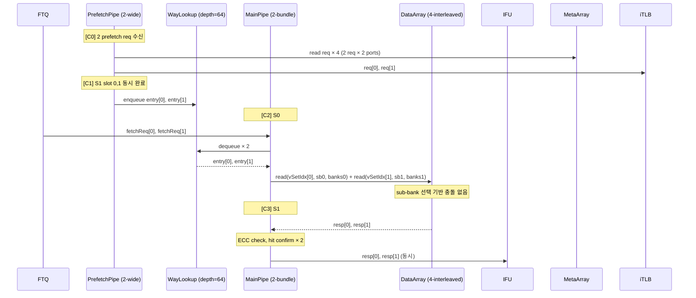
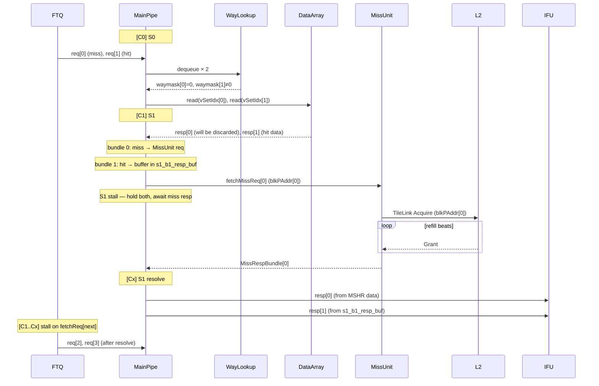
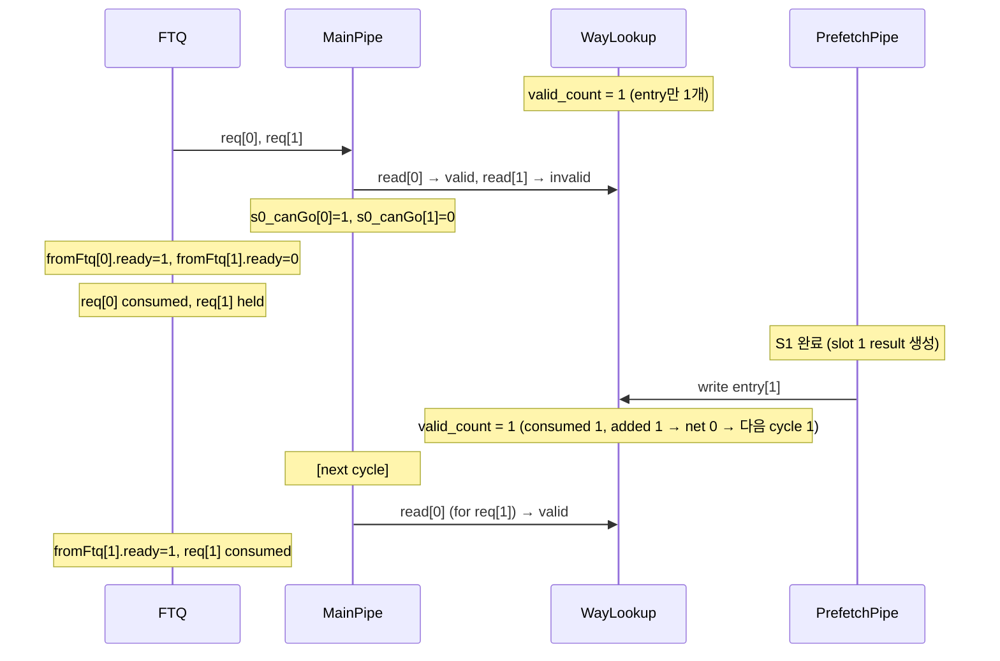
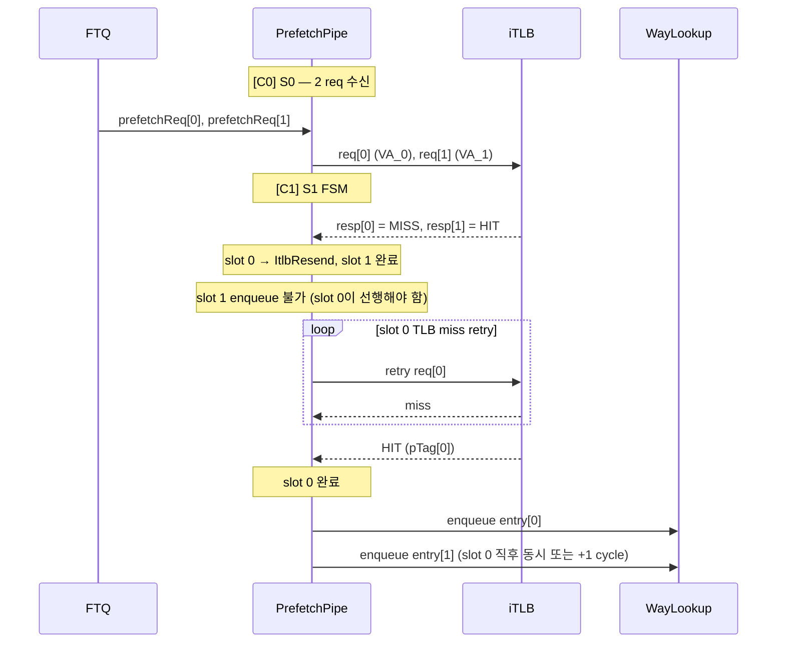

# 2-Fetch ICache Microarchitecture

- Based on: [icache_analysis.md](./icache_analysis.md)
- Target: 2 fetch bundles/cycle from MainPipe (2× input req BW)
- Date: 2026-04-22

---

## 1. Overview

기존 ICache는 MainPipe가 FTQ로부터 1 fetch bundle/cycle을 받는다. 2-Fetch 설계는 이를 **2 fetch bundles/cycle**로 확장한다. 이 변경은 다음 문제를 연쇄적으로 유발한다.

1. **DataArray bank conflict 증가**: 동시 접근이 2배로 늘어 singlePort SRAM 충돌 급증
2. **WayLookup throughput 불균형**: MainPipe 소비 속도 2배 vs PrefetchPipe 생산 속도
3. **MissUnit MSHR 부족**: fetch MSHR 2배 필요, prefetch MSHR은 2배 확장으로 BW 보완
4. **L2/L3 BW 부족**: ICache miss 2배 + DCache 폭 확대로 메모리 계층 전체 BW 스트레스
5. **Arbitration 복잡도**: 2 bundle × (TLB hit/miss × Cache hit/miss) 조합, FTQ backpressure 케이스 증가

---

## 2. Design Delta Summary

| 항목 | Baseline | 2-Fetch |
|------|----------|---------|
| MainPipe fetch bundles/cycle | 1 | **2** |
| DataArray NumInterleavedDataBank | 1 (없음) | **4** |
| MetaArray NumInterleavedBank | 2 | **4** |
| NumFetchMshr | 4 | **8** |
| NumPrefetchMshr | 10 | **20** |
| WayLookupSize | 32 | **64** |
| WayLookup read ports/cycle | 1 | **2** |
| WayLookup write ports/cycle | 1 | **2** |
| PrefetchPipe MetaArray reads/cycle | 2 (PortNumber) | **4** |
| TileLink data channel width (L1→L2) | 256b/beat | **512b/beat** |
| L2 internal banks | 4 (설계 가정) | **8** |
| L2 MSHR | N (기존) | **2N** |

---

## 3. Key Parameter Changes

```
// 2-Fetch ICache Parameters (변경분만 표기)

NumFetchBundles      = 2          // 기존 1 → MainPipe가 동시 처리하는 FTQ req 수
NumFetchMshr         = 8          // 기존 4 → 2 bundle miss 동시 대응
NumPrefetchMshr      = 20         // 기존 10 → miss MSHR 2배로 prefetch BW 보완
WayLookupSize        = 64         // 기존 32 → 2× 소비 속도 대응 버퍼 깊이
NumInterleavedDataBank = 4        // 신규 → DataArray 4-way set 인터리빙
NumInterleavedMetaBank = 4        // 기존 2 → PrefetchPipe 2-wide 대응
```

`PortNumber=2` (doubleline per bundle), `nSets=256`, `nWays=4`, `blockBytes=64`, `DataBanks=8`은 유지.

---

## 4. Memory Organization

### 4.1 DataArray — 4-Way Set-Interleaved Design

#### 문제

기존 DataArray는 `SRAMTemplate(set=nSets=256, singlePort=true)` × 8 banks × 4 ways.  
singlePort SRAM은 cycle당 1 read 또는 1 write만 가능하다.  
2 fetch bundle이 동시에 같은 DataBank SRAM에 접근하면 충돌이 발생한다.

**doubleline 포함 최악 케이스** (2 bundles × doubleline each = 4 cacheline accesses/cycle):

```
Bundle 0: cacheline @ set S0  + cacheline @ set S0+1   (sub-bank S0%2, (S0+1)%2)
Bundle 1: cacheline @ set S2  + cacheline @ set S2+1   (sub-bank S2%2, (S2+1)%2)
```

NumInterleavedDataBank=2로는 sequential doubleline에서 모든 4 세트가 2 sub-bank를 충돌 없이 나눠가질 수 없다.  
(예: sets 0,1,2,3 → sub-banks 0,1,0,1 → bundle 0이 sub-bank 0,1 모두 사용, bundle 1도 sub-bank 0,1 모두 사용 → 충돌)

**NumInterleavedDataBank=4** 적용 시:

```
sets 0,1,2,3 → sub-banks 0,1,2,3 → 각 sub-bank가 독립 SRAM
Bundle 0: sets 0(sb0), 1(sb1) — sub-bank 0,1 사용
Bundle 1: sets 2(sb2), 3(sb3) — sub-bank 2,3 사용
→ 충돌 없음 (sequential doubleline 기준)
```

sequential code에서 2 bundle × doubleline 충돌 확률 = **0%**.  
random access에서 충돌 확률 = $1 - \frac{4!/(4-4)!}{4^4}$ 개선 (4 sub-bank 중 같은 것을 고를 확률 감소).

#### 설계

```
NumInterleavedDataSet = nSets / NumInterleavedDataBank = 256 / 4 = 64 sets/sub-bank
```

**SRAM 인스턴스:**

| | Baseline | 2-Fetch |
|-|----------|---------|
| Sub-bank 수 | 1 | 4 |
| Sub-bank당 DataBanks | 8 | 8 |
| Sub-bank당 ways | 4 | 4 |
| Sub-bank당 SRAM depth | 256 sets | 64 sets |
| 총 SRAM 인스턴스 | 32 | **128** |
| 총 SRAM 비트 | 32 × 256 × 66b | 128 × 64 × 66b (동일) |

총 저장 용량은 동일하며 SRAM 인스턴스 수가 4배 증가한다. 각 SRAM이 4배 작아지므로 SRAM 단위 면적은 감소하고, 인터리브 MUX/디코더 오버헤드가 추가된다.

**접근 방식:**

```
vSetIdx → sub_bank_sel = vSetIdx[1:0]   // 하위 2비트로 4개 sub-bank 선택
          sub_set_idx  = vSetIdx[7:2]   // 상위 6비트로 sub-bank 내 row 선택

DataBank read:
  sub_bank = sub_bank_sel
  DataSubArray[sub_bank][data_bank_idx][way].read(sub_set_idx)
```

**포트 우선순위** (기존 동일):
1. `write` (refill) — sub-bank별 독립, set parity 기준 routing
2. `read` (MainPipe S0)

refill write 시 write set의 sub-bank만 stall; 다른 sub-bank의 read는 계속 진행 가능.

---

### 4.2 MetaArray — Quad-Interleaved Design

#### 문제

2-wide PrefetchPipe는 cycle당 최대 4 MetaArray reads 필요:  
(2 prefetch requests) × (PortNumber=2 = doubleline 2 cachelines each) = 4 reads.

기존 NumInterleavedBank=2는 2 reads/cycle만 지원 → 병목.

#### 설계

`NumInterleavedBank = 4`, `NumInterleavedSet = nSets / 4 = 64 sets/bank`

```
MetaBank 0: sets 0, 4, 8, ...   (set % 4 == 0)
MetaBank 1: sets 1, 5, 9, ...   (set % 4 == 1)
MetaBank 2: sets 2, 6, 10, ...  (set % 4 == 2)
MetaBank 3: sets 3, 7, 11, ...  (set % 4 == 3)
```

4개 bank 각각 독립 SRAM → 4 reads/cycle 충돌 없음.

**포트 우선순위** (bank당 독립 적용):
1. `flushAll` (fence.i)
2. `flush.req.valid` (ECC error)
3. `write.req.valid` (refill) — 해당 bank만 block
4. `read.req.valid` (PrefetchPipe)

refill write가 특정 bank만 막아 다른 bank의 prefetch read는 계속 가능.

---

## 5. Pipeline Architecture

### 5.1 MainPipe — Dual-Bundle (2-Stage)

#### 인터페이스 변경

```scala
// 기존
val req  : Decoupled[FtqFetchRequest]          // 1 bundle
val resp : Valid[ICacheRespBundle]             // 1 response

// 신규
val req  : Vec[NumFetchBundles, Decoupled[FtqFetchRequest]]  // 2 bundles
val resp : Vec[NumFetchBundles, Valid[ICacheRespBundle]]      // 2 responses
```

#### S0 — Dual WayLookup Dequeue + Dual DataArray Read

```
진행 조건:
  s0_canGo[i] = toData[i].ready
                && fromWayLookup.valid_count >= (i+1)   // bundle i를 위한 entry 존재
                && s1_ready[i]

fromFtq[0].ready = s0_canGo[0]
fromFtq[1].ready = s0_canGo[0] && s0_canGo[1]   // bundle 1은 bundle 0이 진행할 때만
```

두 bundle은 **in-order로 WayLookup에서 dequeue**: bundle 0이 먼저, bundle 1이 그 다음.

WayLookup에 1개 entry만 있으면 bundle 0만 진행, bundle 1 stall → FTQ partial stall.

각 bundle은 독립적으로 DataArray sub-bank에 접근:
```
bundle 0: DataSubArray[vSetIdx_0 % 4].read(vSetIdx_0 >> 2, waymask_0, bankSel_0)
bundle 1: DataSubArray[vSetIdx_1 % 4].read(vSetIdx_1 >> 2, waymask_1, bankSel_1)
```

#### S1 — Hit/Miss Arbitration + Ordered IFU Response

**In-Order Response Policy:**  
IFU는 in-order 응답을 요구한다. Bundle 0이 miss면 bundle 1의 hit 응답도 hold.

| Bundle 0 | Bundle 1 | 동작 | IFU 응답 | FTQ 상태 |
|----------|----------|------|---------|---------|
| Hit | Hit | 둘 다 서비스 | cycle N+1에 2개 응답 | ready |
| Hit | Miss | B0 응답 즉시, B1 MSHR 할당 | B0 resp now, B1 hold | stall (B1 wait) |
| Miss | Hit | B0 MSHR 할당, B1 resp buffer에 hold | B0 resp 후 B1 flush | stall (B0 wait) |
| Miss | Miss | 2 MSHR 할당 | miss resp 순서대로 응답 | stall (both wait) |

**Miss/Hit 케이스 처리 (1-entry response buffer):**  
bundle 1이 hit했지만 bundle 0이 miss 대기 중이면, bundle 1의 DataArray 결과를 `s1_b1_resp_buf`에 저장.  
bundle 0 miss resp 수신 후 bundle 0 응답 → 다음 cycle에 저장된 bundle 1 응답 발행.

```
s1_b1_resp_buf: Reg[ICacheRespBundle]
s1_b1_resp_buf_valid: Reg[Bool]

when(bundle0_miss && bundle1_hit):
  s1_b1_resp_buf := bundle1_resp
  s1_b1_resp_buf_valid := true

when(bundle0_missResp.valid):
  IFU.resp[0] := bundle0_resp
  IFU.resp[1].valid := s1_b1_resp_buf_valid
  IFU.resp[1].bits  := s1_b1_resp_buf
  s1_b1_resp_buf_valid := false
```

**S1 ready 조건:**

```
s1_ready[0] = !s1_valid[0] || s1_fetchFinish[0]
s1_ready[1] = !s1_valid[1] || (s1_fetchFinish[0] && s1_fetchFinish[1])
              // bundle 1은 bundle 0도 완료되어야 ready
```

**Flush 정책:**  
BPU stage3 flush가 bundle 0의 ftqIdx에 해당하면 **두 bundle 모두 flush** (bundle 1은 bundle 0에 의존).  
flush가 bundle 1에만 해당하면 bundle 0은 유지, bundle 1만 flush.

---

### 5.2 PrefetchPipe — 2-Wide Hit Path

#### 설계 방향

user 요구사항: **prefetch miss 경로 MSHR만 2배** (NumPrefetchMshr 10→20), 입력 BW는 1×로 유지.  
그러나 MainPipe 소비 속도 2×에 대응하기 위해 **hit 경로(MetaArray read)는 2-wide**로 확장.  
miss FSM은 1개 유지 (TLB miss retry 로직 중복 없음).

#### 변경 사항

```
S0: 2개 prefetch request 동시 수신 (FTQ prefetch req × 2)
    → MetaArray: 4 reads/cycle (2 requests × 2 ports each) — 4-interleaved bank 활용
    → iTLB: 2 requests/cycle (TLB req[0], req[1] 동시 발행)
    → PMP: 2 checks/cycle

S1 FSM: 2-slot (slot 0, slot 1 독립 처리)
    → 각 slot: {tlbValid, sramValid, waymask, pTag, exception} 독립 레지스터
    → 두 slot 모두 완료된 후 WayLookup에 2개 enqueue (순서 유지)

S2: miss인 slot만 MissUnit prefetch req 발행 (각 slot 독립)
    → 최대 2개 prefetch miss req/cycle (NumPrefetchMshr=20으로 흡수)
```

#### 순서 보장 (ordering rule)

WayLookup은 FIFO이므로 prefetch result를 FTQ 요청 순서대로 enqueue해야 한다.

```
WayLookup enqueue 조건:
  slot 0이 완료(tlbValid && sramValid) && WayLookup.ready(0)
  slot 1이 완료(tlbValid && sramValid) && WayLookup.ready(1)

slot 0이 TLB miss로 stall → slot 1도 enqueue 불가 (slot 0이 먼저여야 함)
slot 1이 TLB miss로 stall → slot 1만 hold, slot 0은 즉시 enqueue 가능
```

slot 0 miss가 slot 1을 막지 않도록, slot 0의 enqueue는 slot 1과 독립적으로 처리한다.  
단, slot 0 enqueue 전에 slot 1이 enqueue되는 역전은 금지.

#### TLB × Cache 상태 행렬 (S1 per slot)

| TLB hit/miss | Cache hit/miss | S1 동작 | WayLookup | Miss req |
|-------------|----------------|---------|-----------|---------|
| TLB hit | Cache hit | 즉시 완료 | enqueue (waymask≠0) | 없음 |
| TLB hit | Cache miss | 즉시 완료 | enqueue (waymask=0) | S2에서 prefetch req |
| TLB miss | Cache hit | ItlbResend loop | enqueue after TLB hit | 없음 |
| TLB miss | Cache miss | ItlbResend loop | enqueue after TLB hit (waymask=0) | S2에서 prefetch req |
| TLB 예외 | — | 예외 기록 | enqueue (exception flag) | 없음 |

TLB miss 중 MetaArray 결과는 TLB 결과 수신 후 pTag 비교로 재사용.  
MetaArray 자체가 busy(write/flush)면 MetaResend로 재요청 (기존 FSM 동일).

---

### 5.3 WayLookup — Dual-Port Enhancement

#### 변경 사항

```
entries: RegInit(VecInit.fill(WayLookupSize=64)(...))  // depth 32→64
readPtr:  2개 포인터 (readPtr[0], readPtr[1]) → 1 cycle에 2 entries 소비
writePtr: 2개 포인터 (writePtr[0], writePtr[1]) → 1 cycle에 2 entries 생산
```

**Read (MainPipe S0 기준):**

```
valid_count = writePtr - readPtr  (circular arithmetic)

io.read[0].valid = (valid_count >= 1) && !updateStall[readPtr+0] || canBypass[0]
io.read[1].valid = (valid_count >= 2) && !updateStall[readPtr+1] || canBypass[1]

when(s0_fire[0]): readPtr[0] += 1
when(s0_fire[1]): readPtr[0] += 2  // 또는 각 fire 조건에 따라 +1/+2
```

**Write (PrefetchPipe S1 기준):**

```
io.write[0].ready = !full && writePtr+0 != readPtr (wrap)
io.write[1].ready = !full && writePtr+1 != readPtr
```

**Bypass (기존 확장):**

```
canBypass[0] = empty && io.write[0].valid && !exceptionEntry.valid
canBypass[1] = empty && io.write[0].valid && io.write[1].valid
               && !exceptionEntry.valid
```

**updateStall (refill broadcast 수신 시):**  
readPtr[0], readPtr[1] 두 entry 모두 체크. 둘 중 하나라도 update 중이면 해당 read stall.

---

### 5.4 MissUnit — Scaled MSHRs

#### 변경 사항

```
fetchMSHRs     : 4 → 8   (2 bundle miss 동시 대응)
prefetchMSHRs  : 10 → 20  (prefetch miss BW 보완)
acquireArb     : Arbiter(NumFetchMshr+1) → Arbiter(8+1)
                 (8 fetch MSHRs + prefetch MuxBundle)
```

fetch MSHR 할당 (S1):

```
// bundle 0 miss req → fetchMSHRs[0..7] 중 lowest-free (우선순위 인코더)
// bundle 1 miss req → 남은 free MSHR 중 다음 lowest-free
// 두 req가 같은 cacheline → MSHR hit (merging), 새 할당 없음
```

refill broadcast:

```
// 기존: MissRespBundle 1개 broadcast
// 신규: 최대 2개 MissRespBundle/cycle 가능
//       (두 MSHR이 서로 다른 cycle에 done이면 순차 broadcast)
//       (동시 done이면 1개 broadcast + 1 cycle wait OR arbiter로 순차화)
```

**권장**: refill broadcast arbiter 추가 (2-to-1 Arbiter for simultaneous done), 1 cycle 지연으로 처리.

MainPipe S1: `missResp.valid` 수신 시 해당 bundle의 vSetIdx/pTag 매칭으로 응답 식별.

---

## 6. Input Arbitration & Backpressure

### 6.1 FTQ Backpressure Cases

기존 1-bundle 대비 추가·변형된 케이스:

| # | Bundle 0 | Bundle 1 | WayLookup | DataArray | 결과 |
|---|----------|----------|-----------|-----------|------|
| 1 | ─ | ─ | empty (0 entries) | ready | **둘 다 stall**: `fromFtq[0].ready=0` |
| 2 | ─ | ─ | 1 entry only | ready | **B1 stall**: B0 진행, `fromFtq[1].ready=0` |
| 3 | hit | hit | 2+ entries | ready | 정상: 둘 다 진행 |
| 4 | hit | miss | 2+ entries | ready | B0 resp 즉시, B1 MSHR wait. FTQ B1 stall |
| 5 | miss | hit | 2+ entries | ready | B0 MSHR wait, B1 hold. FTQ 둘 다 stall |
| 6 | miss | miss | 2+ entries | ready | 2 MSHR 할당. FTQ 둘 다 stall |
| 7 | ─ | ─ | ─ | refill write | **둘 다 stall** (refill이 해당 sub-bank 점유) |
| 7a | ─ | ─ | ─ | refill write (sub-bank A only) | sub-bank B fetch는 진행 가능 (set-interleaved 이점) |
| 8 | BPU flush | ─ | ─ | ─ | B0, B1 모두 flush |
| 9 | valid | BPU flush (B1만) | ─ | ─ | B0 유지, B1만 flush. FTQ B1 쪽 flush |
| 10 | ─ | ─ | updateStall (B0 ptr) | ─ | B0 stall, B1도 stall (순서 유지) |
| 11 | ─ | ─ | updateStall (B1 ptr only) | ─ | B0 진행, B1 stall |
| 12 | ECC error | ─ | ─ | ─ | B0 metaFlush + miss req, B1 hold |
| 13 | ─ | ECC error | ─ | ─ | B0 resp, B1 metaFlush + miss req |
| 14 | TLB exception | ─ | ─ | ─ | B0 exception resp to IFU, B1 hold |

**핵심 변화**: case 7a — set-interleaved DataArray 덕분에 refill write가 한 sub-bank만 막으면 다른 sub-bank의 fetch는 계속 진행 가능. 기존 설계 대비 refill stall impact 감소.

### 6.2 PrefetchPipe 2-slot 상태 조합

2개 prefetch slot의 TLB × Cache 조합에 따른 WayLookup enqueue 순서:

| Slot 0 TLB | Slot 1 TLB | 처리 |
|-----------|-----------|------|
| hit | hit | 동시 enqueue 가능 |
| hit | miss | Slot 0 먼저 enqueue, Slot 1은 TLB 해소 후 enqueue |
| miss | hit | Slot 1 대기 (Slot 0 먼저여야 함). Slot 0 TLB 해소 후 함께 enqueue |
| miss | miss | 두 slot 모두 각 TLB 해소 후, Slot 0 → Slot 1 순서로 enqueue |

**Slot 1 blocking 정책**: Slot 0이 TLB miss면 Slot 1은 enqueue 불가 (WayLookup 순서 보장).  
Slot 1이 TLB miss면 Slot 0은 enqueue 가능 → Slot 1은 독립적으로 FSM 진행.

### 6.3 DataArray 충돌 발생 시 처리

set-interleaved에서도 완전히 충돌이 없지는 않다 (random access, 같은 sub-bank 접근).

```
충돌 감지: (bundle0.vSetIdx % 4) == (bundle1.vSetIdx % 4)

충돌 시: bundle 1의 DataArray read를 1 cycle delay
         s0_canGo[1] := s0_canGo[0] && !subbank_conflict
         → bundle 1은 다음 cycle에 DataArray read (s0_fire[1] delayed)
```

---

## 7. L2/L3 Bandwidth Scaling

### 문제

2-Fetch ICache + 넓어진 decode width (machine width 2×):  
- ICache miss rate: 최대 2×  
- DCache access/cycle: decode width에 비례하여 증가  
- L2 traffic: ICache demand + DCache + prefetch = 기존 대비 2~3×

### 해결 방안

#### 7.1 TileLink L1→L2 데이터 채널 폭 확대 (최우선)

```
현재: 256b/beat × 2 beats = 512b per cacheline fill
변경: 512b/beat × 1 beat  = 512b per cacheline fill
효과: 동일 throughput이지만 fill latency 절반 → MSHR 점유 시간 단축 → MSHR effective capacity 증가
     → L2 포트 utilization 동일한 BW에서 더 많은 요청 처리
```

TileLink AXI D-channel 폭 256b→512b. L1 cache block (64B=512b)을 1 beat에 전달.  
채널 폭 증가로 면적/routing 오버헤드 있으나, MSHR 점유 감소 효과가 큼.

#### 7.2 L2 내부 Bank 수 증가

```
현재 가정: L2 4-bank
변경:      L2 8-bank (또는 16-bank)
효과: L2 내부 read/write 처리량 2× (ICache miss + DCache miss 동시 서비스)
비용: L2 SRAM 인스턴스 증가, 면적 증가
```

L2 bank는 set index 하위 비트로 분배. ICache와 DCache miss가 서로 다른 bank로 분산될 가능성 증가.

#### 7.3 L2 MSHR 스케일업

```
현재: L2 MSHR N개
변경: L2 MSHR 2N개
효과: 더 많은 outstanding L1 miss request 동시 수용
      ICache 8 fetch MSHR + DCache demand MSHR 동시 처리
```

L1의 MSHR 증가(8+20)에 L2가 병목이 되지 않도록 L2 MSHR도 비례 확장.

#### 7.4 Instruction Stream Buffer (ISB) — ICache 전용 prefetch 필터

```
위치: ICache PrefetchPipe와 L2 사이
크기: 8~16 entries (fully-associative, 64B/entry)
동작: sequential instruction stream을 감지하여 ahead-of-time L2 read
      demand miss 발생 전 ISB가 데이터를 보유 → L2 demand miss 차단
효과: sequential code에서 ICache→L2 demand traffic 최대 90% 감소
      L2 BW를 DCache 및 비순차 ICache miss에 집중 가능
```

ISB는 ICache PrefetchPipe의 miss path와 연동. prefetch MSHR이 L2로 fill 요청 시  
ISB에도 동시 저장. 이후 동일 cacheline의 demand miss는 ISB에서 제공.

#### 7.5 DCache Victim Cache (D-side 압력 완화)

```
위치: DCache와 L2 사이 (또는 DCache 내부)
크기: 8~16 entries (fully-associative)
동작: DCache eviction 시 L2 write 대신 victim cache 저장
      이후 같은 주소 DCache miss → L2 대신 victim cache에서 제공
효과: conflict miss에 의한 L2 demand traffic 감소
      DCache와 ICache의 L2 BW 경합 완화
```

#### 7.6 L2→L3 채널 폭 확대 (L3 BW)

```
현재: L2→L3 256b 또는 512b (구현에 따라 상이)
변경: L3도 L2와 동일하게 512b/beat 이상으로 폭 확대
     또는 L3 bank 수 증가 (L2와 동일한 접근)
효과: L2 miss가 L3로 escalate될 때 병목 방지
```

L3는 일반적으로 last-level cache (LLC)이므로 DRAM BW와 정렬되어야 한다.  
DRAM burst width에 맞게 L3→DRAM 채널도 함께 검토 필요.

#### 우선순위 요약

| 우선 | 방안 | 효과 | 비용 |
|------|------|------|------|
| 1 | TileLink L1→L2 폭 512b | fill latency ½, MSHR 회전율 2× | routing 오버헤드 |
| 2 | L2 MSHR 2× | outstanding req 2× | 면적 소폭 증가 |
| 3 | L2 bank 2× | 내부 throughput 2× | 면적 증가 |
| 4 | ISB (ICache prefetch 필터) | sequential I-miss 90% 감소 | 별도 로직, 면적 |
| 5 | DCache victim cache | D-side L2 경합 완화 | 별도 로직, 면적 |
| 6 | L2→L3 폭 확대 | L3 escalation 병목 방지 | 설계 복잡도 |

---

## 8. Timing Analysis

### 새로운 Critical Path 후보

| 위치 | Critical Path | 이유 |
|------|---------------|------|
| MainPipe S0 | `fromWayLookup[0,1].valid_count` → `s0_canGo[0,1]` | 64-entry 카운터 비교 + 2 bundle AND gate |
| MainPipe S0 | sub-bank conflict detect: `(b0.vSetIdx % 4) == (b1.vSetIdx % 4)` | 2-bit compare, 경로는 짧으나 s0_canGo에 합산 |
| MainPipe S1 | bundle 1 miss/hit 결정 후 `s1_b1_resp_buf` write | miss 판정 → mux → reg capture |
| DataArray | 4-way sub-bank MUX 추가 | vSetIdx → sub-bank sel → SRAM 입력 경로 |
| WayLookup | dual-readPtr 관리 + updateStall[readPtr+1] | 2-entry 동시 체크 |
| PrefetchPipe S1 | 2-slot FSM 동시 관리 | 독립 FSM × 2, enqueue priority 로직 |
| MissUnit | 8 fetchMSHR 동시 free-detect (우선순위 인코더) | 기존 4 → 8, 인코더 폭 증가 |
| MetaArray | 4-bank 라우팅 (vSetIdx → bank select + set addr) | 기존 2-bank 대비 MUX 1개 추가 |

### 주요 타이밍 리스크

1. **WayLookup valid_count 경로**: 64-entry 2-pointer 관리. `readPtr+1`의 updateStall 체크가 S0 critical path에 추가.  
   → 완화: updateStall을 reg pipeline (1 cycle ahead 계산)으로 pre-compute.

2. **DataArray sub-bank MUX**: 4-way interleave select가 SRAM read enable에 영향.  
   → 완화: sub-bank sel은 vSetIdx 하위 2비트 → 매우 짧은 경로, 타이밍 영향 미미.

3. **MissUnit 8-MSHR free 인코더**: 8-bit priority encoder (기존 4-bit).  
   → 완화: 우선순위 인코더는 O(log N) 깊이, 8-bit → 1개 레벨 추가, 허용 범위.

4. **PrefetchPipe 2-slot FSM enqueue**: slot 0 enqueue ready와 slot 1 enqueue ready 조건을 동시에 계산.  
   → 완화: slot 독립 계산 후 마지막에 AND/순서화. 조합 로직 깊이 최소화.

5. **IFU 인터페이스 폭 확대**: resp[0], resp[1] 2개 동시 → IFU decode 입력 2×.  
   → IFU 내부 decode pipe도 2× wide 필요 (별도 설계 범위).

---

## 9. Sequence Diagrams

### 9.1 2-Bundle Hit (이상적 fast path)



---

### 9.2 Bundle 0 Miss, Bundle 1 Hit



---

### 9.3 WayLookup 1-entry stall (partial)



---

### 9.4 PrefetchPipe 2-slot TLB miss / hit 순서 처리



---

## 10. Block Diagram (텍스트)

```
┌──────────────────────────────────────────────────────────────────────────┐
│                         2-Fetch ICache                                   │
│                                                                          │
│  FTQ prefetchReq[0,1]                                                    │
│       │                                                                  │
│       ▼                                                                  │
│  ┌──────────────────────────────────┐                                    │
│  │  ICachePrefetchPipe (2-wide)     │ ← iTLB req[0,1]                   │
│  │  S0: 2 req → MetaArray×4 reads  │ ← PMP req[0,1]                    │
│  │  S1: 2-slot FSM (ordered enq)   │                                    │
│  │  S2: miss → MissUnit prefReq    │                                    │
│  └──────────────┬───────────────────┘                                   │
│                 │ write[0,1]                                              │
│                 ▼                                                        │
│  ┌──────────────────────────────────┐    refill update                  │
│  │  ICacheWayLookup (depth=64)      │ ◄──────────────── MissUnit        │
│  │  dual-read / dual-write port     │                                    │
│  └──────────────┬───────────────────┘                                   │
│                 │ read[0,1]                                               │
│                 ▼                                                        │
│  FTQ fetchReq[0,1]                                                       │
│       │         │                                                        │
│       ▼         ▼                                                        │
│  ┌──────────────────────────────────┐                                    │
│  │  ICacheMainPipe (2-bundle)       │                                    │
│  │  S0: 2 WayLookup deq            │                                    │
│  │      2 DataArray read (4-sb)    │ → DataArray (4-interleaved)        │
│  │  S1: hit/miss arb               │                                    │
│  │      in-order resp buffer       │ → MissUnit (fetchMissReq[0,1])     │
│  │      ECC check ×2               │                                    │
│  └──────────┬───────────────────────┘                                   │
│             │ resp[0,1]                                                  │
│             ▼                                                            │
│          IFU (2× wide)                                                   │
│                                                                          │
│  ┌───────────────────────────────────────────────────────────────────┐  │
│  │  ICacheMissUnit                                                    │  │
│  │  fetchMSHRs[0..7]   prefetchMSHRs[0..19]                          │  │
│  │  acquireArb(9-to-1) → TileLink (512b/beat) → L2 (8-bank, 2N MSHR)│  │
│  └───────────────────────────────────────────────────────────────────┘  │
│                                                                          │
│  ICacheMetaArray (NumInterleavedBank=4)  ← PrefetchPipe MetaRead×4      │
│                                          ← MissUnit MetaWrite           │
│  ICacheDataArray (NumInterleavedDataBank=4) ← MainPipe DataRead×2       │
│                                              ← MissUnit DataWrite       │
│                                                                          │
└──────────────────────────────────────────────────────────────────────────┘
```

---

## 11. Open Issues / Design Risks

| # | 이슈 | 영향도 | 권장 해소 방안 |
|---|------|--------|---------------|
| 1 | ISB(Instruction Stream Buffer) 미구현 시 L2 ICache miss BW 부족 | 높음 | ISB를 1차 구현 대상에 포함 |
| 2 | 2 bundle 동시 miss시 fetchMSHR 2개 동시 할당 — free MSHR이 1개만 남은 경우 | 중간 | B0 miss 우선 할당, B1 다음 cycle 할당 (FTQ 1 cycle stall 허용) |
| 3 | DataArray sub-bank conflict (random access 25% 확률) — 이 경우 B1 1 cycle delay | 낮음 | set-interleaved로 sequential code에서는 0%, random은 허용 범위 |
| 4 | WayLookup 64-entry updateStall 경로 timing | 중간 | updateStall pre-compute (1 cycle 선행 계산) |
| 5 | PrefetchPipe 2-slot FSM에서 slot 0 long TLB miss → slot 1 blocking | 중간 | 향후 out-of-order enqueue 허용 + WayLookup 재정렬 버퍼 검토 |
| 6 | refill broadcast 2개 동시 → MissUnit → MainPipe S1 timing | 중간 | broadcast Arbiter 추가 (1 cycle 지연, MSHR 점유 약간 증가) |
| 7 | IFU 2× 응답 수용 — decode width 확대 요구 (ICache 외부 범위) | 높음 | decode/IFU 팀과 인터페이스 사전 합의 필요 |
| 8 | TileLink 512b/beat — L2 포트 설계 변경 연쇄 영향 | 높음 | L2 설계 팀과 사전 협의; 단계적 적용 (우선 BW 증가, 이후 TL 폭 확대) |
| 9 | NumFetchMshr=8 시 MSHR 전체 소진 edge case (8 동시 miss) | 낮음 | MSHR full 시 FTQ stall (기존 동일), stall 빈도 monitoring 필요 |
| 10 | `EnableCorruptRefetch` — 2-bundle에서의 ECC re-fetch 로직 복잡도 | 낮음 | 현재와 동일하게 비활성 유지 (`false`), 별도 타이밍 검증 후 활성화 검토 |
