# Xiangshan Frontend Micro-Architecture: Pipeline Stage Analysis

> **Stage Definition Rule:** A pipeline stage is defined strictly by a **register boundary**.
> Specifically, a stage exists only when a `RegInit` / `RegEnable` / `RegNext`-generated
> **stage-valid register** is present. Combinational-only phases (S0, F0, IC-S0) are
> classified as **"launch phases"**, not stages.

---

## 1. Overall Frontend Block Diagram

```mermaid
flowchart LR
    subgraph BPU["BPU — Predictor.scala"]
        direction LR
        S0(["S0\n[combinational]\nPC mux\nHistory gen\nPredictor input"])
        RS1[/"REG\ns1_valid_dup\ns1_pc\ns1_folded_gh\ns1_ghist_ptr"/]
        S1(["S1\nFauFTB result\n1st prediction\n→ FTQ write"])
        RS2[/"REG\ns2_valid_dup\ns2_pc\nprevious_s1_pred_info\ns2_ftq_idx"/]
        S2(["S2\nMain FTB\n+ TAGE base\ns2_redirect?"])
        RS3[/"REG\ns3_valid_dup\ns3_pc\nprevious_s2_pred\ns3_ftq_idx"/]
        S3(["S3\nTAGE-SC-L full\n+ ITTAGE + RAS\ns3_fire = s3_valid"])

        S0 -->|s0_fire| RS1 --> S1
        S1 -->|s1_fire| RS2 --> S2
        S2 -->|s2_fire| RS3 --> S3
    end

    FTQ(["FTQ\nbpuPtr → ifuPtr\ncommPtr"])

    subgraph ICache["ICache — ICacheMainPipe.scala"]
        direction LR
        IC0(["IC-S0\n[combinational]\nAddr recv\nTag lookup\nDataArray req"])
        RIC1[/"REG\ns1_valid\n(generatePipeControl)"/]
        IC1(["IC-S1\nWayLookup recv\nData return\nHit check\n→ fromICache"])

        IC0 -->|s0_fire| RIC1 --> IC1
    end

    subgraph IFU["IFU — IFU.scala (NewIFU)"]
        direction LR
        F0(["F0\n[combinational]\nfromFtq.req\nwires only"])
        RF1[/"REG\nf1_valid\nf1_ftq_req\nf1_doubleLine\nf1_vSetIdx"/]
        F1(["F1\nPC calculation\nf1_pc\nf1_cut_ptr\nf1_half_snpc"])
        RF2[/"REG\nf2_valid\nf2_pc_lower/high\nf2_cut_ptr\nf2_icache_all_resp_reg"/]
        F2(["F2\nICache resp recv\nicacheRespAllValid?\nPreDecode\nException gen"])
        RF3[/"REG\nf3_valid\nf3_instr\nf3_pd_wire\nf3_pc_*\nf3_exception\nf3_pmp_mmio"/]
        F3(["F3\nRVC Expand\nF3PreDecode\nMMIO SM\n→ IBuffer write"])
        RWB[/"REG\nwb_valid\nwb_ftq_req\nwb_check_result_stage1\nwb_pc\nwb_pd"/]
        WB(["WB\nPredChecker\nstage2 (comb)\npdWb → FTQ\nwb_redirect?"])

        F0  -->|f0_fire| RF1 --> F1
        F1  -->|f1_fire| RF2 --> F2
        F2  -->|f2_fire| RF3 --> F3
        F2  -->|"wb_enable\n= RegNext(f2_fire)"| RWB --> WB
    end

    IBuffer[["IBuffer\n32 entries / 4 banks"]]
    Decode(["Decode\nDecodeWidth"])

    S1  -->|"s1 pred\n(s1.valid)"| FTQ
    S2  -->|"s2 redirect\n(s2.hasRedirect)"| FTQ
    S3  -->|"s3 redirect\n(s3.hasRedirect)"| FTQ
    FTQ -->|"toIfu.req"| F0
    FTQ -->|"toICache.req"| IC0
    IC1 -->|"fromICache\n(icacheRespAllValid)"| F2
    F3  -->|"toIbuffer"| IBuffer
    WB  -->|"toFtq.pdWb"| FTQ
    IBuffer --> Decode

    FTQ -->|"flushFromBpu\n.s2 / .s3"| F0
```



> **Note on WB:** WB fires **2 cycles after `f2_fire`**, independently of `f3_fire` and
> IBuffer backpressure. It is a parallel sidecar off the F2→F3 boundary, not a serial
> downstream stage of F3.

---

## 2. BPU Pipeline Stages

Source: `BPU.scala` (`Predictor` class)

### S0 — PC Launch *(Combinational, no stage register)*

| Signal | Kind | Description |
|--------|------|-------------|
| `s0_pc_dup` | Wire | Priority mux: redirect > s3 > s2 > s1 > stall_PC |
| `s0_ghist_ptr_dup` | Wire | Current global history pointer |
| `s0_folded_gh_dup` | Wire | Folded global history for predictor indexing |
| `s0_ghist` | Wire | Full history bits from `ghv` circular buffer |
| `s0_fire_dup` | Wire | `s1_components_ready && s1_ready` |

`s0_pc_reg_dup = RegEnable(s0_pc_dup, !s0_stall)` exists solely to **hold the PC when
stalled**; it is not a stage boundary.

```
s0_stall = !(s1_valid || s2_redirect || s3_redirect || do_redirect.valid)
```

---

### S1 — FauFTB Prediction

**Stage register:** `s1_valid_dup = RegInit(false.B)`, loaded on `s0_fire`

```scala
val s1_pc            = RegEnable(s0_pc_dup(0), s0_fire_dup(0))
val s1_folded_gh_dup = RegEnable(s0_folded_gh_dup, ..., s0_fire_dup(1))
val s1_ghist_ptr_dup = RegEnable(s0_ghist_ptr_dup, ..., s0_fire_dup(1))
val s1_last_br_num_oh_dup = RegEnable(...)
val s1_ahead_fh_oldest_bits_dup = RegEnable(...)
```

| Signal | Description |
|--------|-------------|
| `s1_valid_dup` | Stage valid (RegInit false) |
| `resp.s1.*` | FauFTB prediction result from `Composer` |
| `s1_fire_dup` | `s1_valid && s2_components_ready && s2_ready && bpu_to_ftq.resp.ready` |

**Behavior:**
- Receives FauFTB (fast micro-BTB) result; delivers first prediction to FTQ.
- `s1.hasRedirect` is always `false`; S1 cannot redirect earlier stages.
- History tentatively updated: `s1_ghv_wens`, `s1_ghv_wdatas`.

**FTQ write condition:**
```scala
io.bpu_to_ftq.resp.valid :=
  s1_valid_dup(2) && s2_components_ready_dup(2) && s2_ready_dup(2)  // normal S1
  || s2_fire_dup(2) && s2_redirect_dup(2)                           // S2 override
  || s3_fire_dup(2) && s3_redirect_dup(2)                           // S3 override
```

---

### S2 — Main FTB + TAGE Base

**Stage register:** `s2_valid_dup = RegInit(false.B)`, loaded on `s1_fire`

**Additional registers (comparison anchor):**
```scala
val previous_s1_pred_info = RegEnable(s1_pred_info, s1_fire_dup(0))
val s2_pc       = RegEnable(s1_pc, s1_fire_dup(0))
val s2_ftq_idx  = RegEnable(io.ftq_to_bpu.enq_ptr, s1_fire_dup(0))
val s2_folded_gh_dup = RegEnable(s1_folded_gh_dup, ..., s1_fire_dup(1))
```

| Signal | Description |
|--------|-------------|
| `s2_valid_dup` | Stage valid (RegInit false) |
| `s2_redirect_dup` | True when S2 prediction differs from `previous_s1_pred_info` |
| `s2_fire_dup` | `s2_valid && s3_components_ready && s3_ready` |

**Redirect detection:**
```scala
s2_redirect := s2_fire && s2_redirect_s1_last_pred_vec.reduce(_ || _)
// Compared fields: target / lastBrPosOH / taken / cfiIndex
```

**Redirect action:** Updates `bpuPtr` in FTQ, rewinds earlier FTQ entries. Propagates
`flushFromBpu.s2` to IFU.

---

### S3 — Full TAGE-SC-L + ITTAGE + RAS

**Stage register:** `s3_valid_dup = RegInit(false.B)`, loaded on `s2_fire`

**Additional registers (comparison anchor):**
```scala
// Optimized per-field RegEnable for Clock Gating Efficiency
val previous_s2_pred.pc        = RegEnable(resp.s2.pc,        ..., s2_fire_dup(0))
val previous_s2_pred.full_pred = RegEnable(resp.s2.full_pred, ..., s2_fire_dup(0))
val s3_pc      = RegEnable(s2_pc, s2_fire_dup(0))
val s3_ftq_idx = RegEnable(s2_ftq_idx, s2_fire_dup(0))
val s3_folded_gh_dup = RegEnable(s2_folded_gh_dup, ..., s2_fire_dup(1))
```

| Signal | Description |
|--------|-------------|
| `s3_valid_dup` | Stage valid (RegInit false) |
| `s3_fire_dup` | **`= s3_valid_dup`** — no downstream blocking; fires unconditionally |
| `s3_redirect_dup` | True when S3 differs from `previous_s2_pred` |

**Redirect detection:**
```scala
s3_redirect := s3_fire && (
  (s3_redirect_on_br_taken && !s3_both_first_taken)  // br_taken_mask changed
  || s3_redirect_on_target                           // target address changed
  || s3_redirect_on_fall_thru_error                  // fallthrough addr error
  || s3_redirect_on_ftb_multi_hit                    // FTB multiple hit
)
```

---

## 3. IFU Pipeline Stages

Source: `IFU.scala` (`NewIFU` class)

### F0 — FTQ Request *(Combinational, no stage register)*

| Signal | Kind | Description |
|--------|------|-------------|
| `f0_valid` | Wire | `fromFtq.req.valid` |
| `f0_ftq_req` | Wire | `fromFtq.req.bits` |
| `f0_doubleLine` | Wire | `fromFtq.req.bits.crossCacheline` |
| `f0_vSetIdx` | Wire | `[get_idx(startAddr), get_idx(nextlineStart)]` |
| `f0_fire` | Wire | `fromFtq.req.fire` |

**Acceptance condition:**
```scala
fromFtq.req.ready := f1_ready && io.icacheInter.icacheReady
```
Both IFU (F1 ready) and ICache must be ready simultaneously.

---

### F1 — PC Calculation

**Stage register:** `f1_valid = RegInit(false.B)`, loaded on `f0_fire && !f0_flush`

```scala
val f1_ftq_req    = RegEnable(f0_ftq_req,    f0_fire)
val f1_doubleLine = RegEnable(f0_doubleLine, f0_fire)
val f1_vSetIdx    = RegEnable(f0_vSetIdx,    f0_fire)
```

**Combinational computation in F1:**
```scala
// Power-optimized: compute only lower bits, defer high-bit concat to mux
val f1_pc_lower_result = VecInit((0 until PredictWidth).map(i =>
  Cat(0.U(1.W), f1_ftq_req.startAddr(PcCutPoint-1, 0)) + (i * 2).U
))
val f1_pc_high        = f1_ftq_req.startAddr(VAddrBits-1, PcCutPoint)
val f1_pc_high_plus1  = f1_pc_high + 1.U
val f1_pc             = CatPC(f1_pc_lower_result, f1_pc_high, f1_pc_high_plus1)
val f1_half_snpc      = CatPC(...)   // PC + 4 for half-RVI SNPC
val f1_cut_ptr        = ...          // cacheline slice index per instruction
```

| Signal | Description |
|--------|-------------|
| `f1_valid` | Stage valid (RegInit false) |
| `f1_fire` | `f1_valid && f2_ready` |

---

### F2 — ICache Response + Pre-decode

**Stage register:** `f2_valid = RegInit(false.B)`, loaded on `f1_fire && !f1_flush`

**Auxiliary register:** `f2_icache_all_resp_reg = RegInit(false.B)`
— latches ICache response when F3 applies backpressure (`!f3_ready`).

```scala
val f2_ftq_req         = RegEnable(f1_ftq_req,         f1_fire)
val f2_doubleLine      = RegEnable(f1_doubleLine,       f1_fire)
val f2_pc_lower_result = RegEnable(f1_pc_lower_result,  f1_fire)
val f2_pc_high         = RegEnable(f1_pc_high,          f1_fire)
val f2_pc_high_plus1   = RegEnable(f1_pc_high_plus1,    f1_fire)
val f2_cut_ptr         = RegEnable(f1_cut_ptr,          f1_fire)
```

**F2 stall condition:**
```scala
val f2_fire = f2_valid && f3_ready && icacheRespAllValid

// icacheRespAllValid = f2_icache_all_resp_reg || f2_icache_all_resp_wire
val f2_icache_all_resp_wire =
  fromICache.valid &&
  fromICache.bits.vaddr(0) === f2_ftq_req.startAddr &&
  (fromICache.bits.doubleline && fromICache.bits.vaddr(1) === f2_ftq_req.nextlineStart
   || !f2_doubleLine)

// Latch response if F3 is stalled
when(f2_flush)                                             { f2_icache_all_resp_reg := false.B }
.elsewhen(f2_valid && f2_icache_all_resp_wire && !f3_ready){ f2_icache_all_resp_reg := true.B  }
.elsewhen(f2_fire  && f2_icache_all_resp_reg)              { f2_icache_all_resp_reg := false.B }
```

**Combinational computation in F2:**
- ICache data extraction: `f2_data_2_cacheline = Cat(fromICache.bits.data, fromICache.bits.data)`
- Instruction slicing: `f2_cut_data = cut(f2_data_2_cacheline, f2_cut_ptr)`
- Pre-decode: `preDecoder.io.in.valid := f2_valid` (outputs: `f2_instr`, `f2_pd`, `f2_jump_offset`)
- Exception: page fault / access fault / cross-page / mmio mismatch
- Instruction range: `f2_jump_range & f2_ftr_range`

---

### F3 — RVC Expand + IBuffer Write

**Stage register:** `f3_valid = RegInit(false.B)`, loaded on `f2_fire && !f2_flush`

```scala
val f3_ftq_req              = RegEnable(f2_ftq_req,          f2_fire)
val f3_doubleLine           = RegEnable(f2_doubleLine,        f2_fire)
val f3_cut_data             = RegEnable(f2_cut_data,          f2_fire)
val f3_exception            = RegEnable(f2_exception,         f2_fire)
val f3_pmp_mmio             = RegEnable(f2_pmp_mmio,          f2_fire)
val f3_itlb_pbmt            = RegEnable(f2_itlb_pbmt,         f2_fire)
val f3_instr                = RegEnable(f2_instr,             f2_fire)
val f3_pd_wire              = RegEnable(f2_pd,                f2_fire)
val f3_jump_offset          = RegEnable(f2_jump_offset,       f2_fire)
val f3_exception_vec        = RegEnable(f2_exception_vec,     f2_fire)
val f3_crossPage_exception_vec = RegEnable(f2_crossPage_*, f2_fire)
val f3_pc_lower_result      = RegEnable(f2_pc_lower_result,   f2_fire)
val f3_pc_high              = RegEnable(f2_pc_high,           f2_fire)
val f3_pc_high_plus1        = RegEnable(f2_pc_high_plus1,     f2_fire)
val f3_instr_range          = RegEnable(f2_instr_range,       f2_fire)
val f3_foldpc               = RegEnable(f2_foldpc,            f2_fire)
val f3_hasHalfValid         = RegEnable(f2_hasHalfValid,      f2_fire)
val f3_paddrs               = RegEnable(f2_paddrs,            f2_fire)
```

**Combinational computation in F3:**
```scala
// RVC 16→32-bit expansion (PredictWidth expanders)
val expanders   = Seq.fill(PredictWidth)(Module(new RVCExpander))
val f3_expd_instr = VecInit(expanders.map(e => Mux(e.io.ill, e.io.in, e.io.out.bits)))

// Branch-type decode (delayed from F2 for timing)
f3Predecoder.io.in.instr := f3_instr
f3_pd.{brType, isCall, isRet} := f3Predecoder.io.out.pd.*

// MMIO state machine (12-state FSM): m_idle → m_waitLastCmt → m_sendReq →
//   m_waitResp → m_sendTLB → m_tlbResp → m_sendPMP → m_pmpResp →
//   m_resendReq → m_waitResendResp → m_waitCommit → m_commited

// PredChecker input assembly
checkerIn.fire_in := RegNext(f2_fire, init = false.B)  // triggers checker
```

**Fire and ready:**
```scala
val f3_fire  = io.toIbuffer.fire
val f3_ready = (io.toIbuffer.ready && (f3_mmio_req_commit || !f3_req_is_mmio)) || !f3_valid
```

**IBuffer write:**
```scala
io.toIbuffer.bits.instrs     := f3_expd_instr           // RVC-expanded
io.toIbuffer.bits.enqEnable  := checkerOutStage1.fixedRange & f3_instr_valid
io.toIbuffer.bits.pd         := f3_pd                   // PreDecodeInfo
io.toIbuffer.bits.ftqPtr     := f3_ftq_req.ftqIdx
io.toIbuffer.bits.ftqOffset  := ...                     // taken CFI offset
io.toIbuffer.bits.pc         := f3_pc
io.toIbuffer.bits.exceptionType := ExceptionType.merge(f3_exception_vec,
                                                        f3_crossPage_exception_vec)
```

---

### WB — Prediction Writeback *(parallel sidecar, not downstream of F3)*

**Stage register:** `wb_valid = RegNext(wb_enable)`, where:
```scala
val wb_enable = RegNext(f2_fire && !f2_flush) && !f3_req_is_mmio && !f3_flush
```

> WB fires **2 cycles after `f2_fire`** regardless of IBuffer pressure (`f3_fire`).
> `wb_enable` is the cycle when F3 registers first become valid; `wb_valid` is one
> cycle later, when PredChecker stage-2 results are available.

```scala
val wb_ftq_req             = RegEnable(f3_ftq_req,          wb_enable)
val wb_check_result_stage1 = RegEnable(checkerOutStage1,     wb_enable)  // registered
val wb_check_result_stage2 = checkerOutStage2                            // combinatorial
val wb_pc                  = CatPC(RegEnable(f3_pc_lower_result, wb_enable), ...)
val wb_pd                  = RegEnable(f3_pd,                wb_enable)
val wb_instr_valid         = RegEnable(f3_instr_valid,       wb_enable)
val wb_instr_range         = RegEnable(io.toIbuffer.bits.enqEnable, wb_enable)
```

**Fault detection (PredChecker stage-2, combinatorial at `wb_valid` cycle):**

| Fault Signal | Description |
|---|---|
| `checkJalFault` | JAL target mismatch |
| `checkJalrFault` | JALR target mismatch |
| `checkRetFault` | RET target mismatch |
| `checkTargetFault` | General target error |
| `checkNotCFIFault` | Non-CFI instruction wrongly predicted taken |
| `checkInvalidTaken` | Taken prediction on invalid instruction |

**FTQ writeback:**
```scala
checkFlushWb.bits.misOffset.valid := ParallelOR(wb_check_result_stage2.fixedMissPred)
                                     || wb_half_flush
toFtq.pdWb := Mux(wb_valid, checkFlushWb, mmioFlushWb)
wb_redirect := checkFlushWb.bits.misOffset.valid && wb_valid
```

---

## 4. ICache Pipeline Stages

Source: `icache/ICacheMainPipe.scala`

The ICache receives requests **directly from FTQ** in parallel with IFU (not through IFU).

### IC-S0 — Address & Tag Lookup *(Combinational)*

`s0_valid := fromFtq.valid` (wire; synchronized with IFU F0)

- Receives virtual addresses from FTQ
- Sends read requests to Tag SRAM, Data SRAM
- Enqueues into `WayLookup` FIFO
- Initiates ITLB translation

### IC-S1 — Data Return & Hit Check

**Stage register:** `s1_valid = generatePipeControl(s0_fire, s1_fire, s1_flush, false.B)`

```scala
val s1_req_vaddr  = RegEnable(s0_req_vaddr,  s0_fire)
val s1_req_ptags  = RegEnable(s0_req_ptags,  s0_fire)
val s1_doubleline = RegEnable(s0_doubleline, s0_fire)
val s1_waymasks   = RegEnable(s0_waymasks,   s0_fire)
// s1_datas: from WayLookup FIFO or MSHR (MSHR hit bypass)
val s1_datas(i) = Mux(s1_bankMSHRHit(i), s1_MSHR_datas(i), fromData.datas(i))
```

**Output to IFU:**
```scala
fromICache.valid       := s1_valid && all_data_ready
fromICache.bits.data   := ...    // 5 banks × 8B selected data
fromICache.bits.vaddr  := [startAddr, nextlineStart]
fromICache.bits.doubleline := ...
fromICache.bits.exception  := page_fault | access_fault | guest_page_fault
fromICache.bits.pmp_mmio   := ...
fromICache.bits.itlb_pbmt  := ...
fromICache.bits.paddr      := ...
```

**ICache stop signal:** `io.icacheStop := !f3_ready` — IFU F3 backpressure propagates to ICache.

---

## 5. Pipeline Timing (Cache-Hit, No Stall)

```
Clock :  T      T+1     T+2     T+3     T+4     T+5
─────────────────────────────────────────────────────────────────
BPU   : [S0]   [S1]    [S2]    [S3]
ICache: [IC-S0][IC-S1] resp────────▶
IFU   : [F0]   [F1]    [F2]    [F3]    [WB]
IBuffer:                        enq──▶ [buf]
Decode:                                        deq──▶ [DEC]
─────────────────────────────────────────────────────────────────
Note: ICache response arrives at F2 (T+2). WB fires at T+4 (2 cycles after F2-fire at T+2).
      WB fires independently of F3-fire (IBuffer pressure does not delay WB).
```

---

## 6. Fire Chain Summary

### BPU
```
s0_fire = s1_components_ready && s1_ready
s1_fire = s1_valid && s2_components_ready && s2_ready && bpu_to_ftq.resp.ready
s2_fire = s2_valid && s3_components_ready && s3_ready
s3_fire = s3_valid   ← no downstream blocking
```

### IFU
```
f0_fire     = fromFtq.req.valid && f1_ready && icacheReady
f1_fire     = f1_valid && f2_ready
f2_fire     = f2_valid && f3_ready && icacheRespAllValid
f3_fire     = io.toIbuffer.fire
wb_enable   = RegNext(f2_fire && !f2_flush) && !f3_req_is_mmio && !f3_flush
wb_valid    = RegNext(wb_enable)
```

---

## 7. Stall Sources

| Stage | Stall Condition | Signal |
|-------|----------------|--------|
| BPU S0/S1 | FTQ full | `bpu_to_ftq.resp.ready = false` |
| BPU S2 | S3 predictor not ready | `s3_components_ready = false` |
| IFU F2 | ICache miss | `icacheRespAllValid = false` |
| IFU F3 | IBuffer full | `toIbuffer.ready = false` |
| IFU F3 | MMIO wait for commit | `mmio_state != m_commited` |

---

## 8. Redirect Priority

```
Priority:  HIGH ◄─────────────────────────────────────────── LOW
Source :   Backend    IFU-WB      BPU-S3      BPU-S2      BPU-S1
Via    :   FTQ        pdWb        s3.redirect s2.redirect (none)
Scope  :   Full flush pdWb+redir  FTQ rewind  FTQ rewind  FTQ write
```

All redirects are routed through FTQ before being distributed to BPU and IFU.

---

## 9. Key Structures

| Block | File | Size / Depth |
|-------|------|-------------|
| FTQ | `NewFtq.scala` | `FtqSize` entries (default 64) |
| IBuffer | `IBuffer.scala` | 32 entries, 4 banks, `PredictWidth`-wide enq |
| WayLookup FIFO | `icache/WayLookup.scala` | Between IC-S0 and IC-S1 |
| MMIO State Machine | `IFU.scala` | 12-state FSM in F3 |
| PredChecker | `IFU.scala` (inline) | Stage-1 (reg), Stage-2 (comb) at WB |
