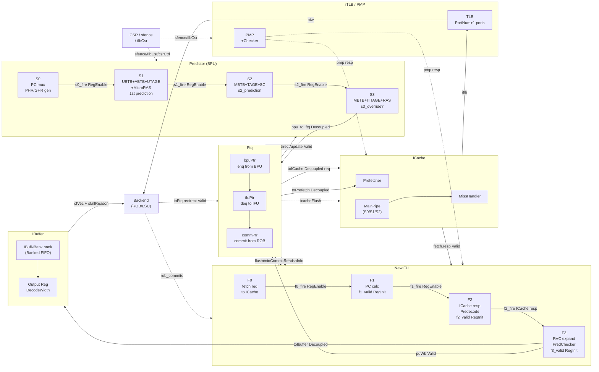

# frontend_block_diagram_overview.md

- Block: Frontend
- Module: N/A (Top-level overview)
- Source: Frontend.scala, FrontendBundle.scala, bpu/Bpu.scala, ifu/Ifu.scala, ftq/Ftq.scala, ibuffer/IBuffer.scala
- Protocols: Decoupled / Valid / Credit
- Key Params: FtqSize, IBuffer.Size, NumWriteBank, NumReadBank, FetchBlockInstNum, DecodeWidth, PhrHistoryLength, GhrHistoryLength
- Last updated: 2026-02-18

---

## 1. Block Summary

XiangShan Frontend is a non-sequential instruction supply pipeline that goes from BPU (Branch Prediction) → FTQ (Fetch Target Queue) → IFU (Instruction Fatch) → IBuffer (Instruction Buffer) → Backend (Decode).

- **Main input**: redirect (misprediction flush), sfence, tlbCsr, csrCtrl from Backend
- **Main output**: `io.backend.cfVec` (DecodeWidth CtrlFlow, IBuffer → Decode), `io.backend.stallReason` (stall cause information)
- **Performance/bottleneck**: ICache miss (IFU stall), FTQ full (BPU back-pressure), IBuffer full (fetch stall), misprediction redirect flush

---

## 2. Key Parameters

| Parameter | Source | Default / Normal value | Impact |
| ------------------- | -------------------------------------------------- | --------------- | ------------------------------------------ |
| FtqSize | `FtqParameters.FtqSize` | 64 | Number of FTQ entries (BPU-IFU buffer depth) |
| IBuffer.Size | `IBufferParameters.Size` | 48 | IBuffer total number of entries |
| NumWriteBank | `IBufferParameters.NumWriteBank` | 4 | Number of IBuffer write banks (for IFU pre-align) |
| NumReadBank | `IBufferParameters.NumReadBank` | 8 | Number of IBuffer read banks (≥ DecodeWidth) |
| FetchBlockInstNum | `FetchBlockSize(64B) / instBytes` | 16 or 32 | Maximum number of instructions per fetch block |
| DecodeWidth | `p(XSCoreParamsKey).DecodeWidth` | 6 | IBuffer → Decode simultaneous output width |
| PhrHistoryLength | `FrontendParameters.getPhrHistoryLength` | calculated value | PHR (Path History Register) length |
| GhrHistoryLength | `HasBpuParameters.GhrHistoryLength` | SC max table | Global branch history (GHR) length for SC |
| ResolveEntryBranchNumber | `FrontendParameters.ResolveEntryBranchNumber` | 8 | Maximum number of branch slots per FTQ resolve entry |
| ipmpPortNum | `coreParams.ipmpPortNum` | ICache ports | Number of PMP checker ports |
| itlbPortNum | `coreParams.itlbPortNum` | 1 | Number of iTLB ports |

---

## 3. Top-Level Block Diagram

### 5.7 BPU internal s3_override

- `s3_override = true` (`Bpu.scala:380`: `s3_valid && !(s3_prediction === s3_s1Prediction)`) when S3 results differ from S1 predictions
- When override occurs, retransmit S3 prediction results to FTQ (`io.toFtq.prediction.bits.s3Override := s3_override`)
- There is no separate override of the S2 stage, and when `s3_flush` occurs, S2/S1 are also flushed.
- `flushFromBpu` delivered from FTQ to IFU → consumed at IFU F0 stage

---

## 6. Error / Exception Paths

### 6.1 iTLB Exceptions (PF/GPF/AF)

- ICache → iTLB request → `ExceptionType.fromTlbResp(resp)` → `fromICache.bits.exception` → receive from IFU F2
- Create `f2_exception_vec` → Save to `IBuffer.exceptionType` at F3 → Pass to Decode

### 6.2 PMP Access Exception (AF)

- `ExceptionType.fromPMPResp(resp)` → merge into ICache response → forward the same path

### 6.3 ECC / TileLink corrupt (AF)

- `ExceptionType.fromECC(enable, corrupt)` / `fromTilelink(corrupt)`
- Output `io.error` Valid inside ICache → `errorReg = RegNext(icache.io.error)` → `io.error` L1BusErrorUnit delivered (`Frontend.scala:262-263`)

### 6.4 MMIO command processing

- IFU F3: Detect `f3_pmp_mmio` → Via `InstrUncache` (64-bit unit fetch)
- MMIO flush: `mmio_redirect` → F2/F3 flush, snpc redirect to FTQ
- After confirming ROB commit, next MMIO fetch: `mmioCommitRead ↔ FTQ`

### 6.5 Exception priority (ExceptionType.merge)

`iTLB(PF/GPF/AF) > PMP(AF) > ECC(AF)` — `ExceptionType.merge(...)` function reference (FrontendBundle.scala:191)

---

## 7. Timing Hints

| module | Critical Path Candidate | Description |
| ---- | ------------------ | ---- |
| IFU F1 | PC calculation adder | `f1_pc_lower_result` 16 adders in parallel (`CatPC` optimization applied) |
| IFU F2 | ICache resp addr match | `fromICache.bits.vaddr(0) === f2_ftq_req.startAddr` — timing critical annotation exists (IFU.scala:366) |
| BPU S2/S3 | TAGE/SC multi-table lookup | Multiple folded history XOR + SRAM read |
| FTQ | Compare FtqPtr | Using `isAfter` function, comparing 64-entry circular queue |
| IBuffer | enqOffsetPopCount | `enqOffset = PopCount(io.in.bits.valid.take(i))` — PredictWidth(16) width |
| BPU → IFU | `flushFromBpu.shouldFlushByStage2/3` | Determination of flush by comparing FtqPtr, must be consumed without delay at IFU F0 |

---

## 8. Open Questions / TODO

- [ ] MMIO fetch latency: How often does ROB commit wait occur?
- [ ] Verification of timing saving effect of `numDup=4` replication structure
- [ ] `f2_mmio_mismatch_exception`: Cacheable/non-cacheable boundary crossing case handling completeness
- Effect of [ ] PTWFilter's `ifilterSize` parameter on iTLB miss frequency
- [ ] How much is the IBuffer bypass path utilized in actual waveforms?

---

→ See [frontend_in_out_seq_diagram.md](./frontend_in_out_seq_diagram.md)
→ See [frontend_Predictor_analysis.md](./frontend_Predictor_analysis.md)
→ See [frontend_NewIFU_analysis.md](./frontend_NewIFU_analysis.md)
→ See [frontend_Ftq_analysis.md](./frontend_Ftq_analysis.md)
→ See [frontend_IBuffer_analysis.md](./frontend_IBuffer_analysis.md)
