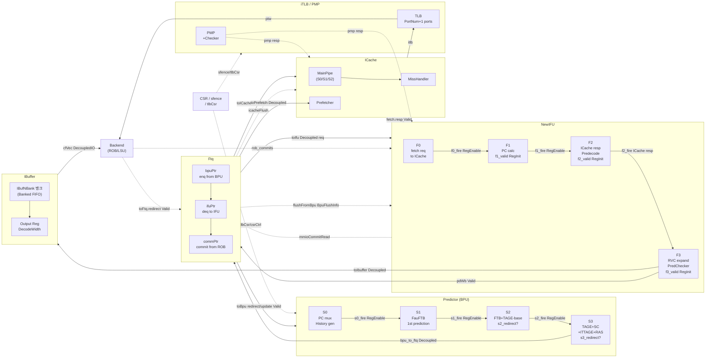

# frontend_block_diagram_overview.md

- Block: Frontend
- Module: N/A (Top-level overview)
- Source: Frontend.scala, FrontendBundle.scala, BPU.scala, IFU.scala, NewFtq.scala, IBuffer.scala
- Protocols: Decoupled / Valid / Credit
- Key Params: FtqSize, IBufSize, IBufNBank, PredictWidth, DecodeWidth, HistoryLength, numBr
- Last updated: 2026-02-18

---

## 1. Block Summary

XiangShan Frontend는 BPU(분기 예측) → FTQ(Fetch Target Queue) → IFU(명령어 패치) → IBuffer(명령어 버퍼) → Backend(디코드)로 이어지는 비순차적 명령어 공급 파이프라인이다.

- **주요 입력**: Backend로부터 오는 redirect (misprediction flush), sfence, tlbCsr, csrCtrl
- **주요 출력**: `io.backend.cfVec` (DecodeWidth개 CtrlFlow, IBuffer → Decode)
- **성능/병목**: ICache miss (IFU stall), FTQ full (BPU back-pressure), IBuffer full (fetch stall), misprediction redirect flush

---

## 2. Key Parameters

| Parameter    | Source                          | Default / 일반값 | 영향                                   |
| ------------ | ------------------------------- | --------------- | -------------------------------------- |
| FtqSize      | `p(XSCoreParamsKey).FtqSize`    | 64              | FTQ 엔트리 수 (BPU-IFU 버퍼 깊이)      |
| IBufSize     | `p(XSCoreParamsKey).IBufSize`   | 48              | IBuffer 총 엔트리 수                   |
| IBufNBank    | `p(XSCoreParamsKey).IBufNBank`  | 6               | IBuffer 뱅크 수 (≥ DecodeWidth)        |
| PredictWidth | `HasXSParameter.PredictWidth`   | 16 (halfwords)  | 한 fetch 블록당 최대 명령어 수          |
| DecodeWidth  | `p(XSCoreParamsKey).DecodeWidth`| 6               | IBuffer → Decode 동시 출력 너비        |
| HistoryLength| `p(XSCoreParamsKey).HistoryLength`| 256           | BPU 전역 분기 이력 길이                |
| numBr        | `p(XSCoreParamsKey).numBr`      | 2               | FTB 엔트리당 최대 분기 슬롯 수          |
| numDup       | `HasBPUConst.numDup`            | 4               | BPU 내부 PC/history 복제 수 (타이밍 최적화) |
| ipmpPortNum  | `coreParams.ipmpPortNum`        | ICache ports+1  | PMP checker 포트 수                    |
| itlbPortNum  | `coreParams.itlbPortNum`        | PortNumber+1    | iTLB 포트 수                           |

---

## 3. Top-Level Block Diagram



---

## 4. Pipeline Stages by Module

### 4.1 Predictor (BPU) — 3 register stages

| Stage | 이름 | 근거 | 역할 |
| ----- | ---- | ---- | ---- |
| S0    | Launch phase | (combinational) | PC mux, folded history gen, predictor input 구성 |
| S1    | 1st prediction | `RegEnable(s0_pc, s0_fire)` / `s1_valid_dup` | FauFTB 조회, 초기 예측결과 FTQ 전달 |
| S2    | 2nd prediction | `RegEnable(s1_pc, s1_fire)` / `s2_valid_dup` | 메인 FTB 조회 + TAGE base, s2_redirect 가능 |
| S3    | Final prediction | `RegEnable(s2_pc, s2_fire)` / `s3_valid_dup` | TAGE+SC+ITTAGE+RAS 결합, s3_redirect 가능 |

`BPU.scala: class Predictor` — `val s1_valid_dup, s2_valid_dup, s3_valid_dup = dup_seq(RegInit(false.B))`

### 4.2 NewIFU — 3 register stages (+ F0 launch phase)

| Stage | 이름 | 근거 | 역할 |
| ----- | ---- | ---- | ---- |
| F0    | Launch phase | (combinational) | ICache 요청 생성, fromFtq.req 소비 |
| F1    | PC calc | `val f1_valid = RegInit(false.B)` | PC/half_snpc/cut_ptr 계산 |
| F2    | ICache resp | `val f2_valid = RegInit(false.B)` | ICache 응답 수신, predecode 실행, 예외 생성 |
| F3    | IBuffer enq | `val f3_valid = RegInit(false.B)` | RVC 확장, PredChecker, IBuffer 전송, MMIO 처리 |

`IFU.scala: class NewIFU` — `def numOfStage = 3`

### 4.3 Ftq — 3 포인터 기반 circular queue

| 포인터 | 역할 |
| ------- | ---- |
| bpuPtr  | BPU enqueue 위치 |
| ifuPtr  | IFU dequeue 위치 |
| commPtr | commit 완료 위치 |

`NewFtq.scala: class FtqPtr` — `CircularQueuePtr[FtqPtr](FtqSize)`

### 4.4 IBuffer — 뱅크드 FIFO, 출력 레지스터 1단

| 구조 | 근거 | 역할 |
| ---- | ---- | ---- |
| IBufNBank 뱅크 | `val ibuf = RegInit(VecInit.fill(IBufSize)(...))` | 원형 버퍼, 뱅크별 1엔트리 dequeue |
| Output Reg | `val outputEntries = RegInit(...)` | DecodeWidth 출력 레지스터 |
| Bypass path | `val useBypass = enqPtr === deqPtr && decodeCanAccept` | empty 시 enqueue → 즉시 출력 |

---

## 5. Flow / Backpressure Control

### 5.1 BPU → FTQ

- **Protocol**: `DecoupledIO(new BpuToFtqBundle)` — `bpu_to_ftq.resp.valid / .ready`
- **Stall**: FTQ full 시 `ftqFullStall = true` → BPU S3 stall, `s3_ready = false`
- **flush**: `io.redirect Valid` 수신 시 in-flight S0~S3 무효화

### 5.2 FTQ → IFU

- **Protocol**: `Decoupled(new FetchRequestBundle)` — `fromFtq.req.valid / .ready`
- `fromFtq.req.ready := f1_ready && io.icacheInter.icacheReady` (IFU.scala:263)
- **flush**: `backend_redirect` / `wb_redirect` → f0/f1/f2/f3_flush 연쇄 전파

### 5.3 FTQ → ICache

- **Protocol**: `Decoupled(new FtqToICacheRequestBundle)` — `toICache.req`
- `ftq.io.toICache.req.ready := ifu.io.ftqInter.fromFtq.req.ready && icache.io.fetch.req.ready` (Frontend.scala:203)

### 5.4 IFU → IBuffer

- **Protocol**: `Decoupled(new FetchToIBuffer)` — `toIbuffer`
- **Stall**: IBuffer full(`allowEnq = false`) → `io.out.ready` deassert → IFU f3 stall
- `io.icacheStop := !f3_ready` → ICache도 stall

### 5.5 IBuffer → Backend (Decode)

- **Protocol**: `Vec(DecodeWidth, DecoupledIO(new CtrlFlow))`
- **Stall**: `decodeCanAccept` 입력으로 dequeue 제어
- **Bypass**: `useBypass = enqPtr === deqPtr && decodeCanAccept` (빈 상태에서 직접 출력)
- `allowEnq := (IBufSize - PredictWidth).U >= numValidNext` (거의 full 시 enqueue 차단)

### 5.6 Backend redirect → FTQ → 전 모듈 flush

```
io.backend.toFtq.redirect.valid
  → needFlush = RegNext(...)
  → ftq: flush ifuPtr, 예측정보 정정
  → icacheFlush → ICache 파이프 무효화
  → ibuffer.io.flush → IBuffer 전체 flush
  → f0_flush → f1_flush → f2_flush → f3_flush (IFU 전체 flush)
```

### 5.7 BPU 내부 override bubble

- S2가 S1 예측보다 더 앞선 idx로 redirect → `overrideBubble(0) = true`
- S3가 S2 예측보다 더 앞선 idx로 redirect → `overrideBubble(1) = true`
- FTQ에서 IFU에게 `flushFromBpu.s2/s3` 전달 → F0 단계에서 `f0_flush_from_bpu`

---

## 6. Error / Exception Paths

### 6.1 iTLB 예외 (PF / GPF / AF)

- ICache → iTLB 요청 → `ExceptionType.fromTlbResp(resp)` → `fromICache.bits.exception` → IFU F2에서 수신
- `f2_exception_vec` 생성 → F3에서 `IBuffer.exceptionType`에 저장 → Decode까지 전달

### 6.2 PMP 접근 예외 (AF)

- `ExceptionType.fromPMPResp(resp)` → ICache 응답에 병합 → 동일 경로 전달

### 6.3 ECC / TileLink corrupt (AF)

- `ExceptionType.fromECC(enable, corrupt)` / `fromTilelink(corrupt)`
- ICache 내부에서 `io.error` Valid 출력 → `errorReg = RegNext(icache.io.error)` → `io.error` L1BusErrorUnit 전달 (Frontend.scala:436)

### 6.4 MMIO 명령어 처리

- IFU F3: `f3_pmp_mmio` 감지 → `InstrUncache` 경유 (64-bit 단위 fetch)
- MMIO flush: `mmio_redirect` → F2/F3 flush, FTQ에 snpc redirect
- ROB commit 확인 후 다음 MMIO fetch: `mmioCommitRead ↔ FTQ`

### 6.5 예외 우선순위 (ExceptionType.merge)

`iTLB(PF/GPF/AF) > PMP(AF) > ECC(AF)` — `ExceptionType.merge(...)` 함수 참조 (FrontendBundle.scala:191)

---

## 7. Timing Hints

| 모듈 | Critical Path 후보 | 설명 |
| ---- | ------------------ | ---- |
| IFU F1 | PC 계산 adder | `f1_pc_lower_result` 16개 adder 병렬 (`CatPC` 최적화 적용) |
| IFU F2 | ICache resp addr match | `fromICache.bits.vaddr(0) === f2_ftq_req.startAddr` — timing critical 주석 존재 (IFU.scala:366) |
| BPU S2/S3 | TAGE/SC multi-table lookup | 다수 folded history XOR + SRAM 읽기 |
| FTQ | FtqPtr 비교 | `isAfter` 함수 사용, 64-entry circular queue 비교 |
| IBuffer | enqOffset PopCount | `enqOffset = PopCount(io.in.bits.valid.take(i))` — PredictWidth(16) 너비 |
| BPU → IFU | `flushFromBpu.shouldFlushByStage2/3` | FtqPtr 비교로 flush 여부 판단, IFU F0에서 지연 없이 소비해야 함 |

---

## 8. Open Questions / TODO

- [ ] MMIO fetch latency: ROB commit wait이 얼마나 자주 발생하는가?
- [ ] `numDup=4` 복제 구조의 타이밍 절감 효과 검증
- [ ] `f2_mmio_mismatch_exception`: cacheable/non-cacheable 경계 crossing 케이스 처리 완전성
- [ ] PTWFilter의 `ifilterSize` 파라미터가 iTLB 미스 빈도에 미치는 영향
- [ ] IBuffer bypass 경로가 실제 waveform에서 얼마나 활용되는가?

---

→ See [frontend_in_out_seq_diagram.md](./frontend_in_out_seq_diagram.md)
→ See [frontend_Predictor_analysis.md](./frontend_Predictor_analysis.md)
→ See [frontend_NewIFU_analysis.md](./frontend_NewIFU_analysis.md)
→ See [frontend_Ftq_analysis.md](./frontend_Ftq_analysis.md)
→ See [frontend_IBuffer_analysis.md](./frontend_IBuffer_analysis.md)
