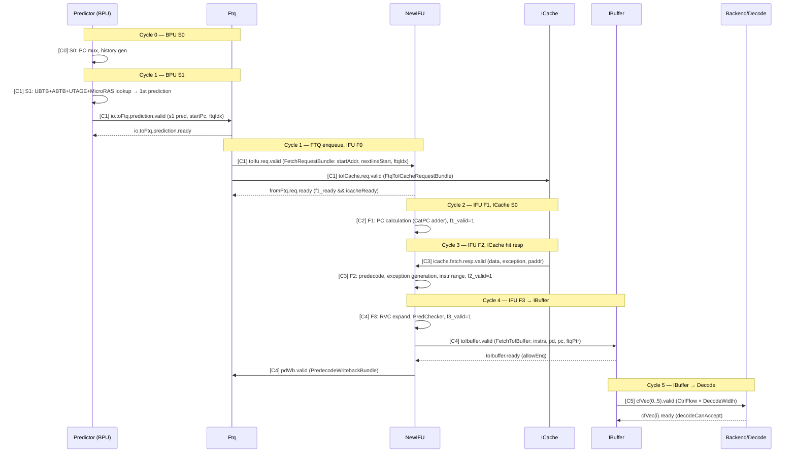
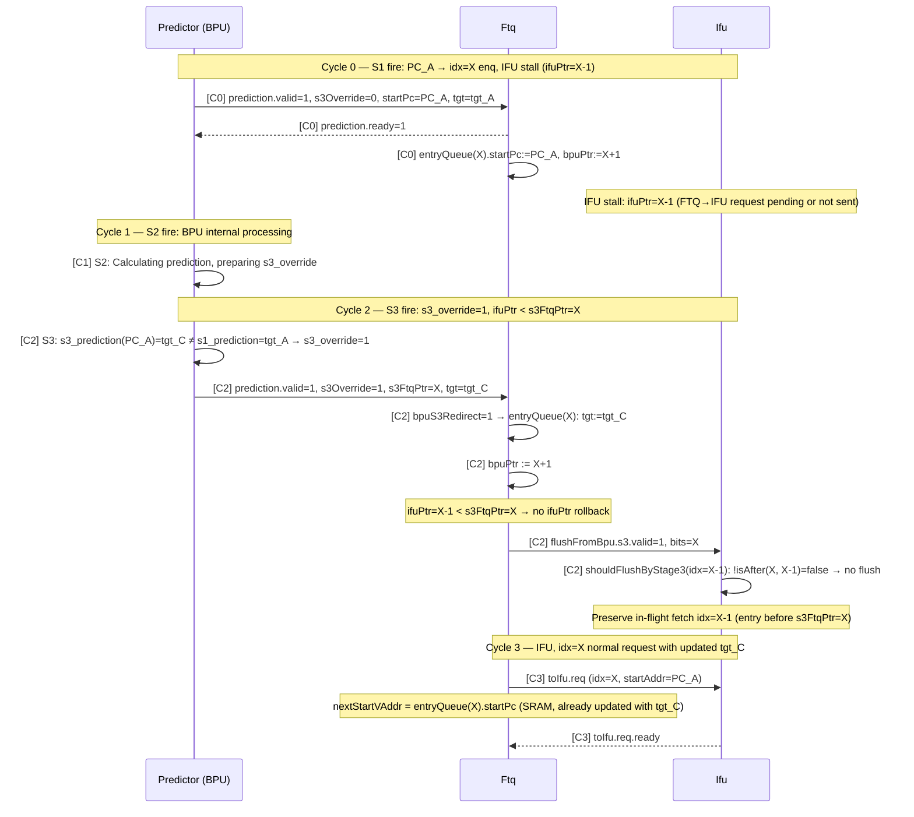
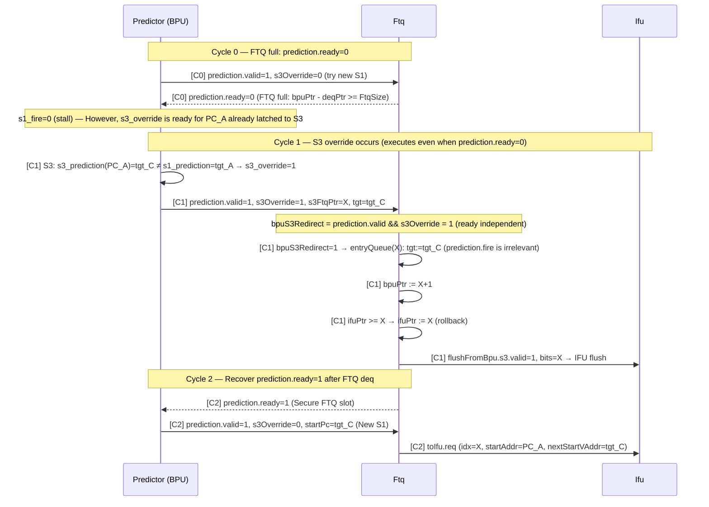
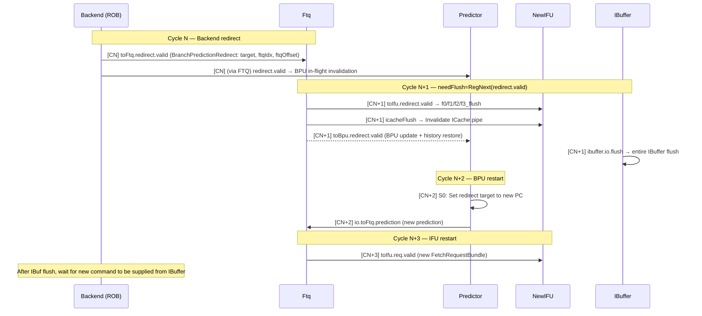
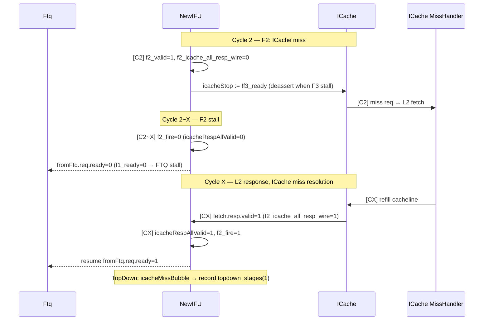
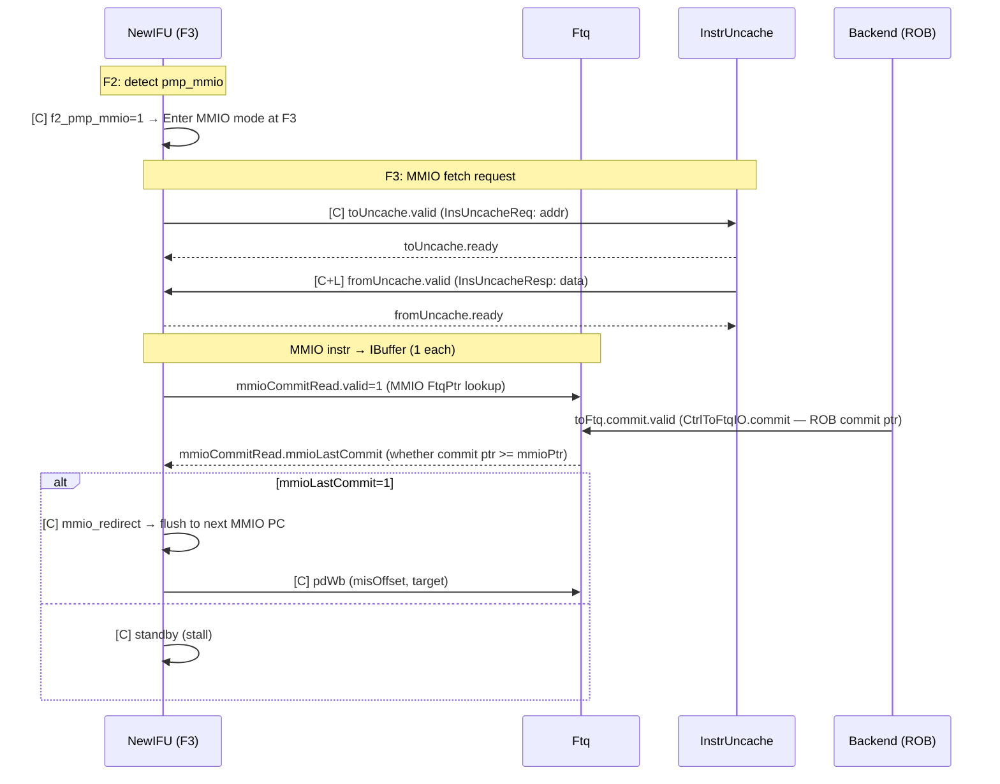

# frontend_in_out_seq_diagram.md

- Block: Frontend
- Module: N/A (total I/O flow)
- Source: Frontend.scala, ifu/Ifu.scala, ftq/Ftq.scala, bpu/Bpu.scala, ibuffer/IBuffer.scala
- Protocols: Decoupled / Valid
- Key Params: FtqSize=64, FetchBlockInstNum=16, DecodeWidth=6, IBuffer.Size=48, NumWriteBank=4, NumReadBank=8
- Last updated: 2026-02-18

→ See [frontend_block_diagram_overview.md](./frontend_block_diagram_overview.md)

---

## 1. I/O Summary

### 1.1 input (FrontendInlinedImp.io)

| Port | Protocol | direction | Description |
| ---- | -------- | ---- | ---- |
| `io.backend.toFtq.redirect` | Valid | Backend → FTQ | Misprediction/MemVio redirect |
| `io.backend.toFtq.commit` | Valid FtqPtr | Backend → FTQ | ROB commit signal (for FTQ commit ptr update, MMIO lastCommit check) |
| `io.backend.canAccept` | Bool | Backend → IBuffer | Decode is acceptable |
| `io.backend.wfi.wfiReq` | Bool | Backend → ICache/Uncache | WFI request |
| `io.reset_vector` | UInt | SoC → BPU | Start PC on reset |
| `io.sfence` | Bundle | CSR → iTLB | TLB flush |
| `io.tlbCsr` | Bundle | CSR → iTLB/BPU | SATP/STATUS etc. |
| `io.csrCtrl` | Bundle | CSR → Each module | bp_ctrl, frontend_trigger, pf_ctrl, etc. |
| `io.ptw` | TlbPtwIO | PTW → iTLB | Page table walk response |
| `io.softPrefetch` | Valid Vec | Backend → ICache | Software prefetch request |
| `io.debugTopDown.robHeadVaddr` | Valid | Backend → iTLB | For TopDown analysis |

### 1.2 output

| Port | Protocol | direction | Description |
| ---- | -------- | ---- | ---- |
| `io.backend.cfVec` | DecoupledIO Vec | Frontend → Decode | DecodeWidth CtrlFlow command |
| `io.backend.fromFtq` | Bundle | FTQ → Backend | PC mem write, newest entry, etc. |
| `io.backend.fromIfu` | Bundle | IFU → Backend | gpaddr mem write |
| `io.backend.wfi.wfiSafe` | Bool | Frontend → Backend | Is it safe to enter WFI |
| `io.error` | L1BusErrorUnitInfo | ICache → Backend | ECC/Bus Error |
| `io.frontendInfo.ibufFull` | Bool | IBuffer → Backend | IBuffer full status |
| `io.frontendInfo.bpuInfo` | Bundle | FTQ → Backend | BPU hit/miss counter |
| `io.resetInFrontend` | Bool | Frontend → SoC | reset signal propagation |

---

## 2. Sequence Diagram — Group A: Normal Fetch Flow (ICache Hit)

> BPU prediction → FTQ enqueue → IFU fetch → ICache hit → IBuffer enqueue → Decode delivery

---

## 3. Sequence Diagram — Group B: BPU S3 Override (s3_override → FTQ entry update + IFU flush)

> **Actual architecture (code basis: `bpu/Bpu.scala`, `ftq/Ftq.scala`):**
>
> The BPU → FTQ path has **two independent flows**:
>
> | path | Conditions | FTQ operation | latency |
> |------|------|-----------|---------|
> | **S1 new enq** | `s1_valid && s2_ready` | `entryQueue[bpuPtr]` new record, `bpuPtr++` | ~1 cycle |
> | **S3 override** | `s3_override` (S3≠S1) | Overwrite `entryQueue[s3FtqPtr]`, `bpuPtr := s3FtqPtr+1` | ~3 cycle |
>
> - **S1 (uBTB/ABTB) prediction always goes into FTQ first.** BPU latency is not fixed to 3-cycle.
> - **S3 override** only occurs when the S3 result is different from the S1 result (`s3_override := s3_valid && !(s3_prediction === s3_s1Prediction)`), and **post-corrects** the entry previously enqled by S1.
> - S2 only processes the BPU internal flush (`s2_flush := s3_flush || s3_override`) and does not directly transmit it to the FTQ.
> (Reference: Ftq.scala TODO — "wait for Ifu/ICache to remove bpu s2 flush")
> - **prediction.ready independent**: `bpuS3Redirect = prediction.valid && s3Override` — Override is executed even if FTQ is full.

### FTQ index tracking (s3FtqPtr)

| steps | Code Basis | Description |
|------|-----------|------|
| S1 fire city | `s2_ftqPtr = RegEnable(io.fromFtq.bpuPtr, s1_fire)` | Latch bpuPtr at S1 fire point to s2 |
| S2 fire city | `s3_ftqPtr = RegEnable(s2_ftqPtr, s2_fire)` | pass s2_ftqPtr to s3 |
| S3 viewpoint | `io.toFtq.s3FtqPtr := s3_ftqPtr` | Pass override target entry index to FTQ |
| run override | `predictionPtr = s3Override ? s3FtqPtr : bpuPtr(0)` | update entryQueue(s3FtqPtr) |
| rollback bpuPtr | `when(s3Override) { bpuPtr := s3FtqPtr + 1 }` | Move the FTQ enqueue pointer to the next override entry |

### FTQ Override Operation Summary

| Conditions | Action | Code Basis |
|------|------|-----------|
| prediction.fire(s1, not s3Override) | entryQueue(bpuPtr) new record, bpuPtr+1 | `prediction.fire` |
| s3Override=1 | entryQueue(s3FtqPtr) update(overwrite), bpuPtr := s3FtqPtr+1 | `bpuS3Redirect`, `predictionPtr` |
| ifuPtr >= s3FtqPtr | ifuPtr := s3FtqPtr (rollback) | `when(ifuPtr >= ftqIdx)` |
| pfPtr >= s3FtqPtr | pfPtr := s3FtqPtr (rollback) | `when(pfPtr >= ftqIdx)` |
| IFU stage idx >= s3FtqPtr | shouldFlushByStage3 = true → flush | `!isAfter(s3FtqPtr, idxToFlush)` |

### nextStartVAddr Bypass case

| bpuPtr location | nextStartVAddr source | Code Basis |
|-------------|---------------------|-----------|
| bpuPtr(0) == ifuPtr(0) | prediction.bits.target (bypass-1) | `bpuPtr(0) === ifuPtr(0)` |
| bpuPtr(0) == ifuPtr(1) | prediction.bits.startPc (bypass-2, = tgt_C) | `bpuPtr(0) === ifuPtr(1)` |
| Other | entryQueue(ifuPtr(1)).startPc (SRAM) | default MuxCase |

---

### B-1: Standard S3 Override (ifuPtr > s3FtqPtr — IFU is already ahead)

> enq idx=X in S1 → IFU is processing more than idx=X → s3_override=1 in S3 (tgt_C ≠ tgt_A)
> → update entryQueue(X) + rollback ifuPtr + IFU flush + restart based on tgt_C

---

### B-2: Early S3 Override (ifuPtr <= s3FtqPtr — IFU is still behind)

> IFU stall due to FTQ back-pressure, etc. → ifuPtr < s3FtqPtr
> → no need for ifuPtr rollback, only update entryQueue(s3FtqPtr), no IFU flush range

---

### B-3: Back-pressure S3 Override (prediction.ready=0 — override runs independently)

> FTQ full → prediction.ready=0 (new S1 enq not possible)
> However, s3_override is executed regardless of prediction.ready with `bpuS3Redirect` path.

---

## 4. Sequence Diagram — Group C: Backend Redirect (Misprediction Flush)

> Detect misprediction in ROB → Flush entire Frontend → Restart with correct PC

---

## 5. Sequence Diagram — Group D: ICache Miss (Stall)

> ICache miss → IFU F2 stall → FTQ back-pressure

---

## 6. Sequence Diagram — Group E: MMIO Fetch

> MMIO area command fetch → Via InstrUncache → Next MMIO fetch after ROB commit

---

## 7. Edge Cases

### 7.1 IBuffer full → fetch stall

- `allowEnq := io.in.bits.prevInstrCount < nextNumInvalid` (nextNumInvalid = Size.U − nextNumValid) — Enqueue is allowed only when the number of next fetch instructions is less than the number of invalid entries in the next cycle.
- `io.full = !allowEnq` → `io.frontendInfo.ibufFull` output → stall signal to backend
- IFU `toIbuffer.ready` = false → F3 stall → F2 stall → FTQ back-pressure

### 7.2 FTQ full → BPU stall

- `ftqFullStall` → BPU S3 `s3_ready=false` → s2/s1 also chain stall
- `s0_stall = !s3_ready` → PC mux freeze in BPU S0

### 7.3 Cross-cacheline fetch (doubleLine)

- `f0_doubleLine = fromFtq.req.bits.crossCacheline` — `startAddr(blockOffBits-1) === 1`
- Added second cacheline request to ICache (FtqToICacheRequestBundle.readValid(1..4))
- F2: `f2_doubleLine && f2_icache_all_resp_wire = vaddr(0)===startAddr && vaddr(1)===nextlineStart`

### 7.4 Cross-page RVI instruction exception

- F2: `isLastInLine(f2_pc(i)) && !f2_pd(i).isRVC && f2_doubleLine` → `f2_crossPage_exception_vec`
- If there is no exception on the first page, use the exception on the second page.
-`IBufferExceptionType.isCrossPage()` classification

### 7.5 Unnecessary flush (BTB Miss) classification

- `ControlBTBMissBubble = ControlRedirectBubble && !cfiUpdate.br_hit && !cfiUpdate.jr_hit`
- `TAGEMissBubble = ControlRedirectBubble && cfiUpdate.br_hit && !cfiUpdate.sc_hit`
- `SCMissBubble` / `ITTAGEMissBubble` / `RASMissBubble`
- IBuffer: Counter input for each bubble type (TopDown analysis)

---

→ See [frontend_block_diagram_overview.md](./frontend_block_diagram_overview.md)
→ See [frontend_Predictor_analysis.md](./frontend_Predictor_analysis.md)
→ See [frontend_NewIFU_analysis.md](./frontend_NewIFU_analysis.md)
→ See [frontend_Ftq_analysis.md](./frontend_Ftq_analysis.md)
→ See [frontend_IBuffer_analysis.md](./frontend_IBuffer_analysis.md)
