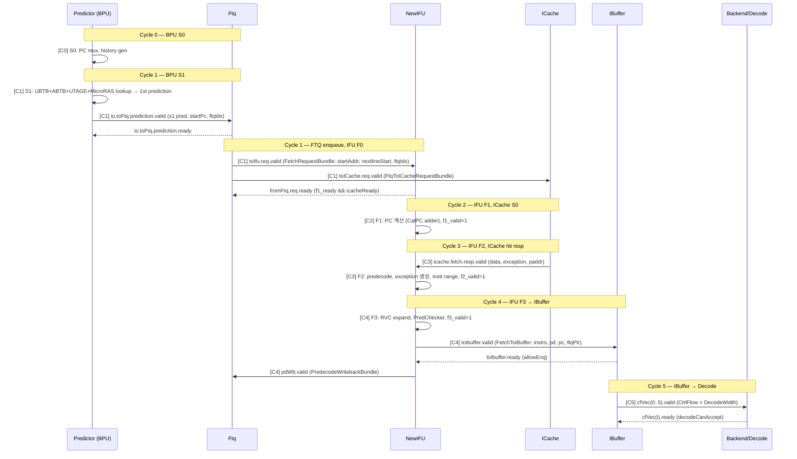
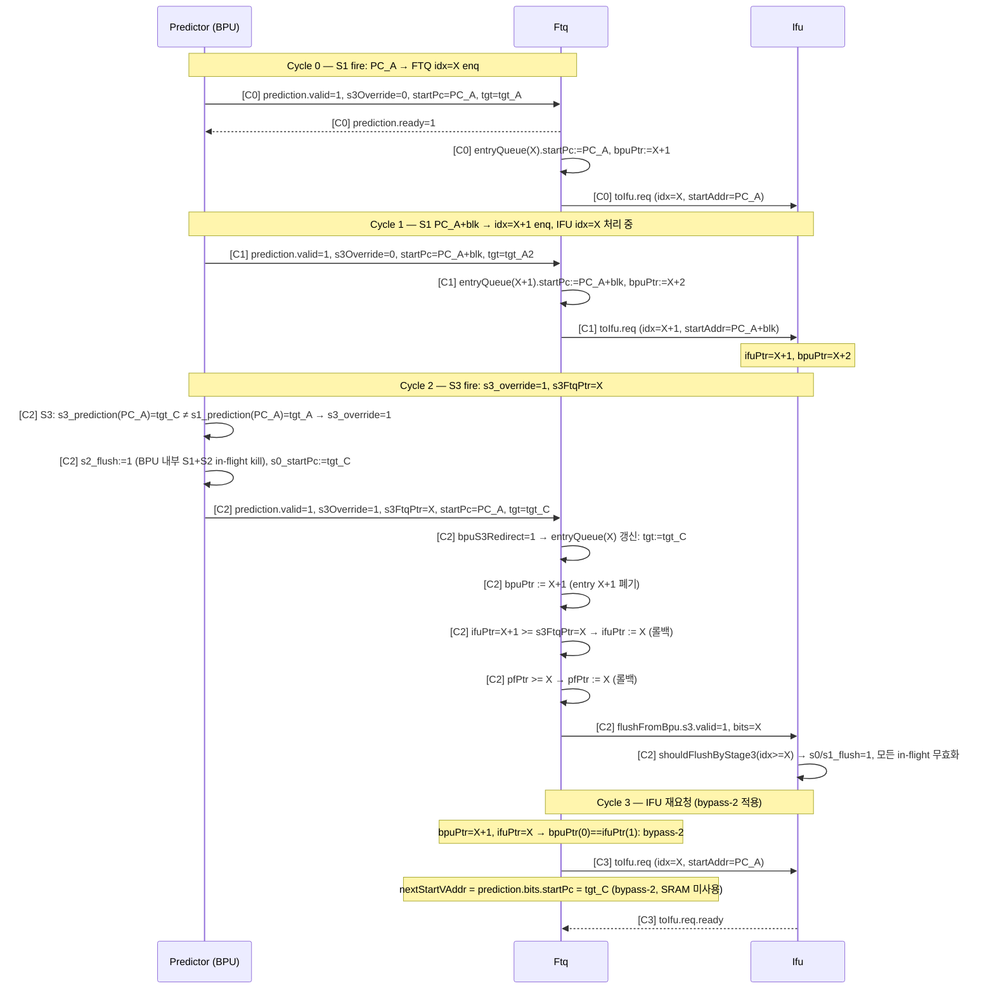
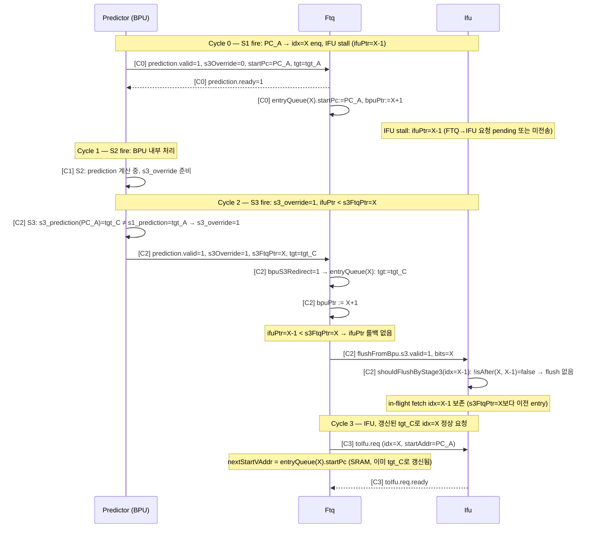
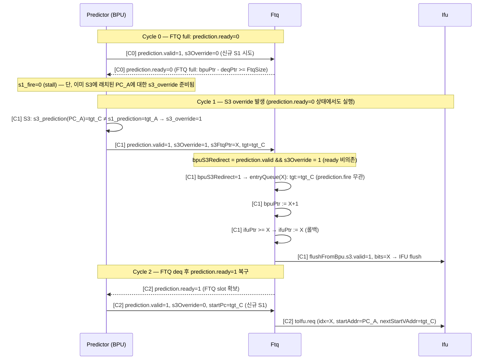
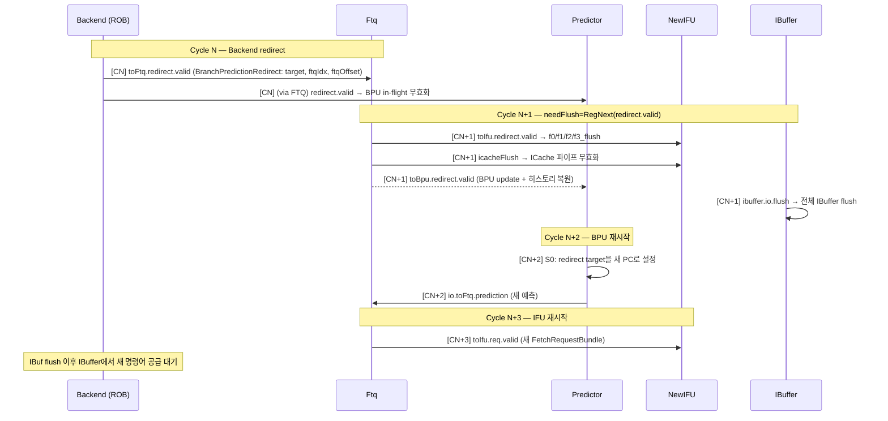
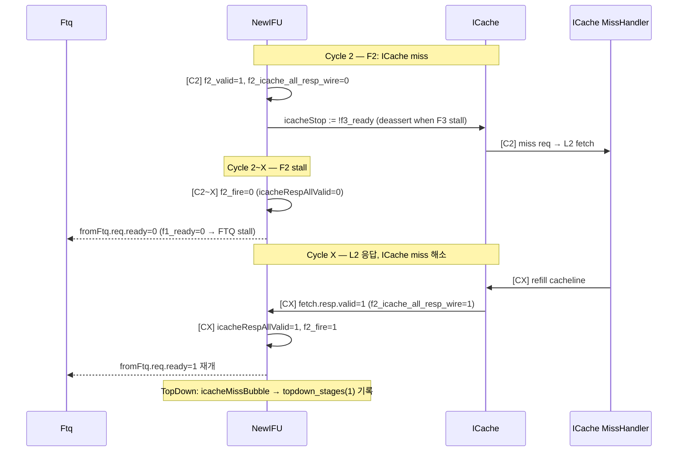
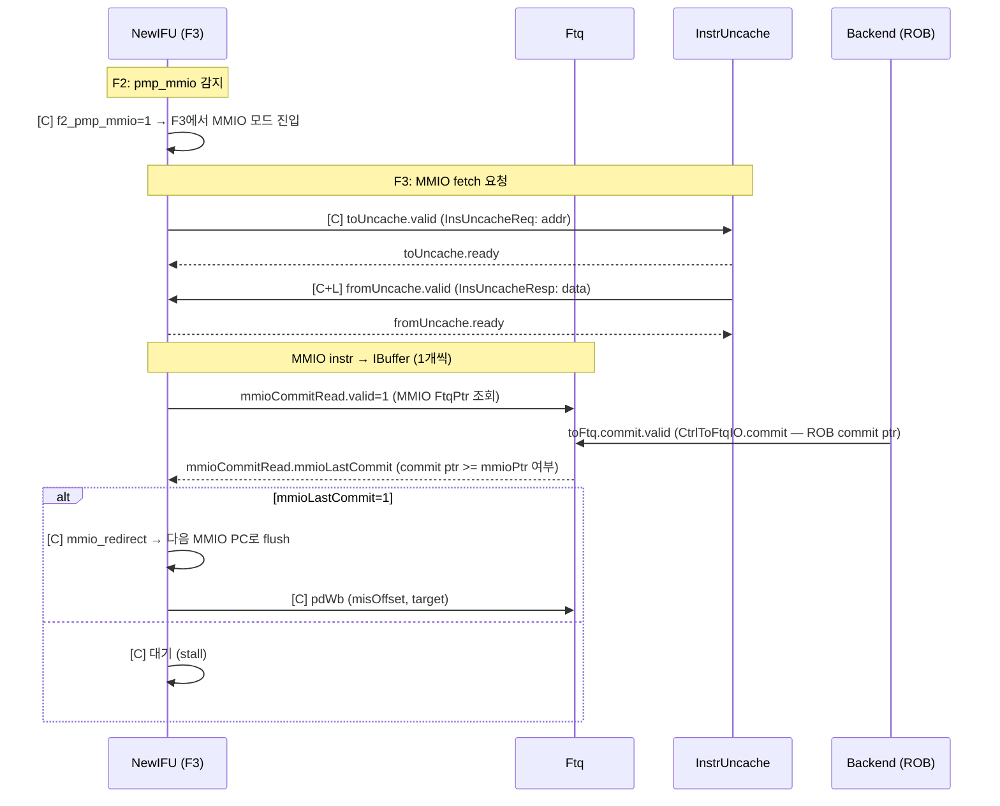

# frontend_in_out_seq_diagram.md

- Block: Frontend
- Module: N/A (전체 I/O 흐름)
- Source: Frontend.scala, ifu/Ifu.scala, ftq/Ftq.scala, bpu/Bpu.scala, ibuffer/IBuffer.scala
- Protocols: Decoupled / Valid
- Key Params: FtqSize=64, FetchBlockInstNum=16, DecodeWidth=6, IBuffer.Size=48, NumWriteBank=4, NumReadBank=8
- Last updated: 2026-02-18

→ See [frontend_block_diagram_overview.md](./frontend_block_diagram_overview.md)

---

## 1. I/O Summary

### 1.1 입력 (FrontendInlinedImp.io)

| Port | Protocol | 방향 | 설명 |
| ---- | -------- | ---- | ---- |
| `io.backend.toFtq.redirect` | Valid | Backend → FTQ | Misprediction/MemVio redirect |
| `io.backend.toFtq.commit` | Valid FtqPtr | Backend → FTQ | ROB commit 신호 (FTQ commit ptr 갱신, MMIO lastCommit 체크용) |
| `io.backend.canAccept` | Bool | Backend → IBuffer | Decode가 수락 가능한지 |
| `io.backend.wfi.wfiReq` | Bool | Backend → ICache/Uncache | WFI 요청 |
| `io.reset_vector` | UInt | SoC → BPU | 리셋 시 시작 PC |
| `io.sfence` | Bundle | CSR → iTLB | TLB flush |
| `io.tlbCsr` | Bundle | CSR → iTLB/BPU | SATP/STATUS 등 |
| `io.csrCtrl` | Bundle | CSR → 각 모듈 | bp_ctrl, frontend_trigger, pf_ctrl 등 |
| `io.ptw` | TlbPtwIO | PTW → iTLB | Page table walk 응답 |
| `io.softPrefetch` | Valid Vec | Backend → ICache | 소프트웨어 prefetch 요청 |
| `io.debugTopDown.robHeadVaddr` | Valid | Backend → iTLB | TopDown 분석용 |

### 1.2 출력

| Port | Protocol | 방향 | 설명 |
| ---- | -------- | ---- | ---- |
| `io.backend.cfVec` | DecoupledIO Vec | Frontend → Decode | DecodeWidth개 CtrlFlow 명령어 |
| `io.backend.fromFtq` | Bundle | FTQ → Backend | PC mem write, newest entry 등 |
| `io.backend.fromIfu` | Bundle | IFU → Backend | gpaddr mem write |
| `io.backend.wfi.wfiSafe` | Bool | Frontend → Backend | WFI 진입 안전 여부 |
| `io.error` | L1BusErrorUnitInfo | ICache → Backend | ECC/버스 에러 |
| `io.frontendInfo.ibufFull` | Bool | IBuffer → Backend | IBuffer full 상태 |
| `io.frontendInfo.bpuInfo` | Bundle | FTQ → Backend | BPU 적중/미스 카운터 |
| `io.resetInFrontend` | Bool | Frontend → SoC | 리셋 신호 전파 |

---

## 2. Sequence Diagram — Group A: 정상 Fetch 흐름 (ICache Hit)

> BPU 예측 → FTQ enqueue → IFU fetch → ICache hit → IBuffer enqueue → Decode 전달

---

## 3. Sequence Diagram — Group B: BPU S3 Override (s3_override → FTQ entry 갱신 + IFU flush)

> **실제 아키텍처 (코드 근거: `bpu/Bpu.scala`, `ftq/Ftq.scala`):**
>
> BPU → FTQ 경로는 **두 가지 독립적인 흐름**이 있다:
>
> | 경로 | 조건 | FTQ 동작 | latency |
> |------|------|-----------|---------|
> | **S1 신규 enq** | `s1_valid && s2_ready` | `entryQueue[bpuPtr]` 신규 기록, `bpuPtr++` | ~1 cycle |
> | **S3 override** | `s3_override` (S3≠S1) | `entryQueue[s3FtqPtr]` 덮어쓰기, `bpuPtr := s3FtqPtr+1` | ~3 cycle |
>
> - **S1 (uBTB/ABTB) 예측은 항상 FTQ에 먼저 들어간다.** BPU latency가 3-cycle 고정이 아니다.
> - **S3 override**는 S3 결과가 S1 결과와 다를 때(`s3_override := s3_valid && !(s3_prediction === s3_s1Prediction)`)만 발생하며, 기존에 S1이 enq한 entry를 **사후 교정**한다.
> - S2는 BPU 내부 flush(`s2_flush := s3_flush || s3_override`)만 처리하며 FTQ에 직접 전달하지 않는다.
>   (참고: Ftq.scala TODO — "wait for Ifu/ICache to remove bpu s2 flush")
> - **prediction.ready 비의존**: `bpuS3Redirect = prediction.valid && s3Override` — FTQ full이어도 override는 실행된다.

### FTQ 인덱스 추적 (s3FtqPtr)

| 단계 | 코드 근거 | 설명 |
|------|-----------|------|
| S1 fire 시 | `s2_ftqPtr = RegEnable(io.fromFtq.bpuPtr, s1_fire)` | S1 fire 시점의 bpuPtr를 s2에 래치 |
| S2 fire 시 | `s3_ftqPtr = RegEnable(s2_ftqPtr, s2_fire)` | s2_ftqPtr를 s3에 전달 |
| S3 시점 | `io.toFtq.s3FtqPtr := s3_ftqPtr` | FTQ에 override 대상 entry 인덱스 전달 |
| override 실행 | `predictionPtr = s3Override ? s3FtqPtr : bpuPtr(0)` | entryQueue(s3FtqPtr) 갱신 |
| bpuPtr 롤백 | `when(s3Override) { bpuPtr := s3FtqPtr + 1 }` | FTQ enqueue 포인터를 override entry 다음으로 이동 |

### FTQ Override 동작 요약

| 조건 | 동작 | 코드 근거 |
|------|------|-----------|
| prediction.fire (s1, not s3Override) | entryQueue(bpuPtr) 신규 기록, bpuPtr+1 | `prediction.fire` |
| s3Override=1 | entryQueue(s3FtqPtr) 갱신(덮어쓰기), bpuPtr := s3FtqPtr+1 | `bpuS3Redirect`, `predictionPtr` |
| ifuPtr >= s3FtqPtr | ifuPtr := s3FtqPtr (롤백) | `when(ifuPtr >= ftqIdx)` |
| pfPtr >= s3FtqPtr | pfPtr := s3FtqPtr (롤백) | `when(pfPtr >= ftqIdx)` |
| IFU stage idx >= s3FtqPtr | shouldFlushByStage3 = true → flush | `!isAfter(s3FtqPtr, idxToFlush)` |

### nextStartVAddr Bypass 경우

| bpuPtr 위치 | nextStartVAddr 소스 | 코드 근거 |
|-------------|---------------------|-----------|
| bpuPtr(0) == ifuPtr(0) | prediction.bits.target (bypass-1) | `bpuPtr(0) === ifuPtr(0)` |
| bpuPtr(0) == ifuPtr(1) | prediction.bits.startPc (bypass-2, = tgt_C) | `bpuPtr(0) === ifuPtr(1)` |
| 그 외 | entryQueue(ifuPtr(1)).startPc (SRAM) | default MuxCase |

---

### B-1: Standard S3 Override (ifuPtr > s3FtqPtr — IFU가 이미 앞선 상태)

> S1에서 idx=X enq → IFU가 idx=X 이상 처리 중 → S3에서 s3_override=1 (tgt_C ≠ tgt_A)
> → entryQueue(X) 갱신 + ifuPtr 롤백 + IFU flush + tgt_C 기준 재시작

---

### B-2: Early S3 Override (ifuPtr <= s3FtqPtr — IFU가 아직 뒤처진 상태)

> FTQ back-pressure 등으로 IFU stall → ifuPtr < s3FtqPtr
> → ifuPtr 롤백 불필요, entryQueue(s3FtqPtr)만 갱신, IFU flush 범위 없음

---

### B-3: Back-pressure S3 Override (prediction.ready=0 — override는 독립 실행)

> FTQ full → prediction.ready=0 (신규 S1 enq 불가)
> 그러나 s3_override는 `bpuS3Redirect` 경로로 prediction.ready와 무관하게 실행

---

## 4. Sequence Diagram — Group C: Backend Redirect (Misprediction Flush)

> ROB에서 misprediction 감지 → 전체 Frontend flush → 정확한 PC로 재시작

---

## 5. Sequence Diagram — Group D: ICache Miss (Stall)

> ICache miss → IFU F2 stall → FTQ back-pressure

---

## 6. Sequence Diagram — Group E: MMIO Fetch

> MMIO 영역 명령어 fetch → InstrUncache 경유 → ROB commit 후 다음 MMIO fetch

---

## 7. Edge Cases

### 7.1 IBuffer full → fetch stall

- `allowEnq := io.in.bits.prevInstrCount < nextNumInvalid` (nextNumInvalid = Size.U − nextNumValid) — 다음 사이클의 invalid 엔트리 수보다 다음 fetch 명령어 수가 적을 때만 enqueue 허용
- `io.full = !allowEnq` → `io.frontendInfo.ibufFull` 출력 → Backend에 stall 신호
- IFU `toIbuffer.ready` = false → F3 stall → F2 stall → FTQ back-pressure

### 7.2 FTQ full → BPU stall

- `ftqFullStall` → BPU S3 `s3_ready=false` → s2/s1도 연쇄 stall
- `s0_stall = !s3_ready` → BPU S0에서 PC mux 동결

### 7.3 Cross-cacheline fetch (doubleLine)

- `f0_doubleLine = fromFtq.req.bits.crossCacheline` — `startAddr(blockOffBits-1) === 1`
- ICache에 두 번째 cacheline 요청 추가 (FtqToICacheRequestBundle.readValid(1..4))
- F2: `f2_doubleLine && f2_icache_all_resp_wire = vaddr(0)===startAddr && vaddr(1)===nextlineStart`

### 7.4 Cross-page RVI instruction 예외

- F2: `isLastInLine(f2_pc(i)) && !f2_pd(i).isRVC && f2_doubleLine` → `f2_crossPage_exception_vec`
- 첫 번째 page에 예외 없으면 두 번째 page의 예외를 사용
- `IBufferExceptionType.isCrossPage()` 구분

### 7.5 불필요한 flush (BTB Miss) 분류

- `ControlBTBMissBubble = ControlRedirectBubble && !cfiUpdate.br_hit && !cfiUpdate.jr_hit`
- `TAGEMissBubble = ControlRedirectBubble && cfiUpdate.br_hit && !cfiUpdate.sc_hit`
- `SCMissBubble` / `ITTAGEMissBubble` / `RASMissBubble`
- IBuffer: 각 bubble 타입별 카운터 입력 (TopDown 분석)

---

→ See [frontend_block_diagram_overview.md](./frontend_block_diagram_overview.md)
→ See [frontend_Predictor_analysis.md](./frontend_Predictor_analysis.md)
→ See [frontend_NewIFU_analysis.md](./frontend_NewIFU_analysis.md)
→ See [frontend_Ftq_analysis.md](./frontend_Ftq_analysis.md)
→ See [frontend_IBuffer_analysis.md](./frontend_IBuffer_analysis.md)
