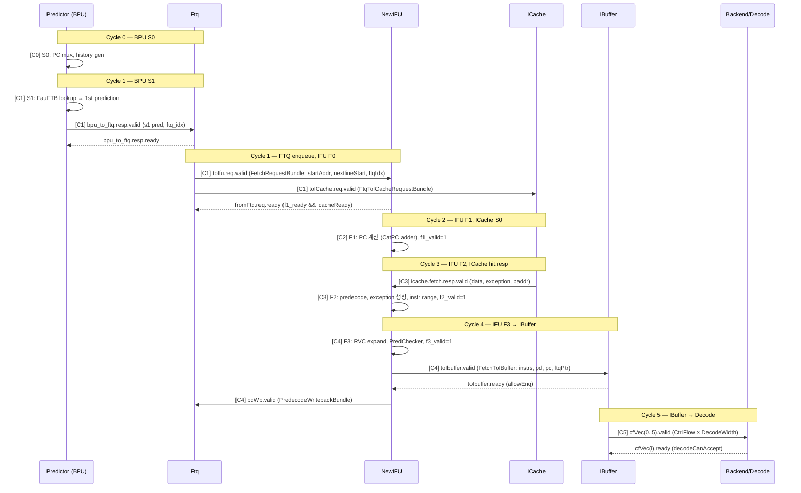
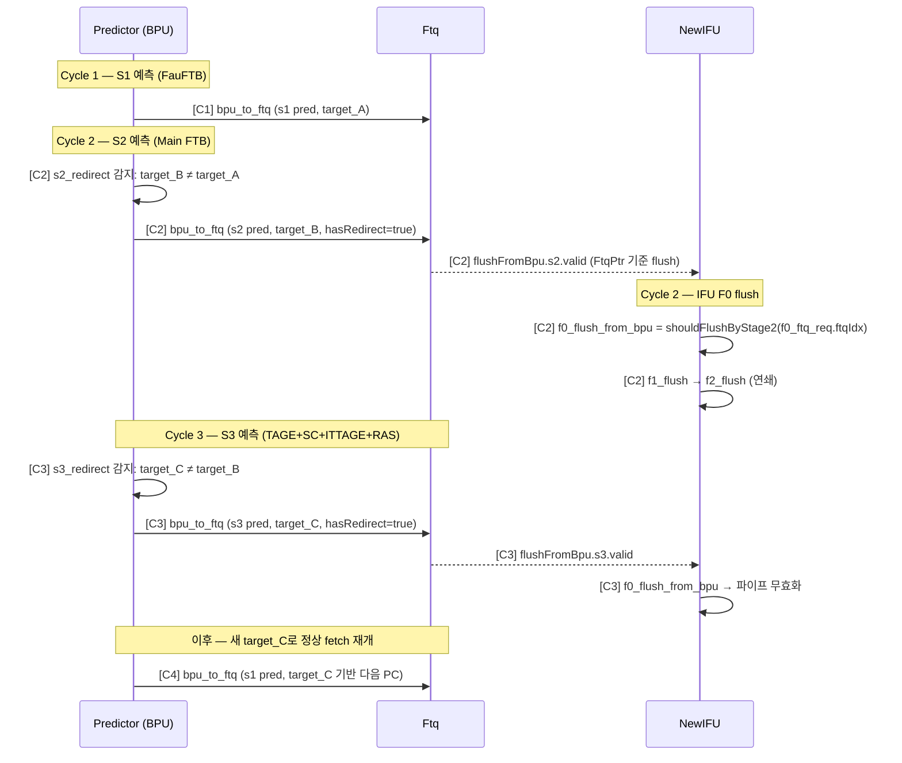
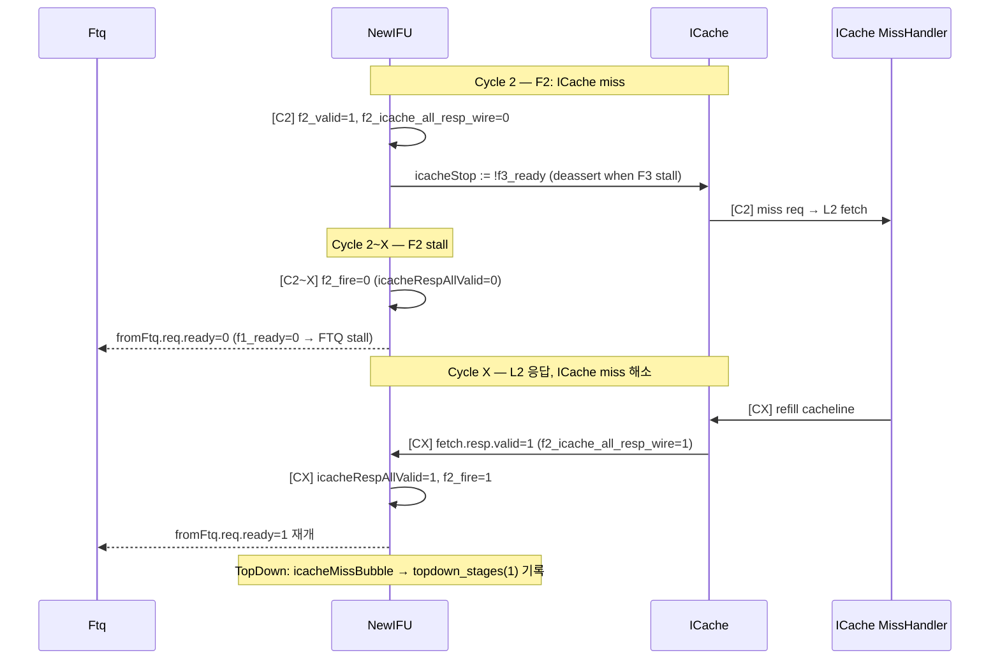
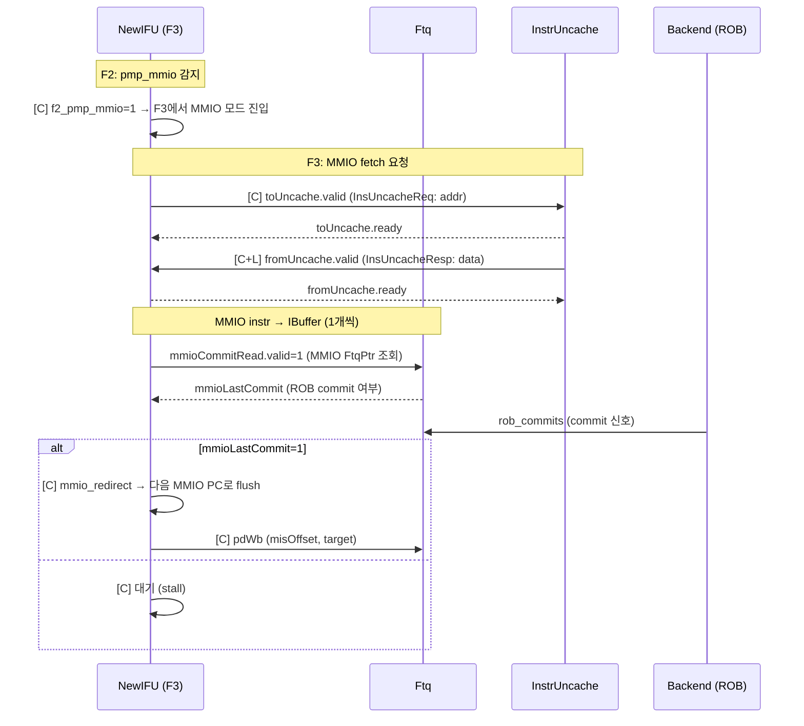

# frontend_in_out_seq_diagram.md

- Block: Frontend
- Module: N/A (전체 I/O 흐름)
- Source: Frontend.scala, IFU.scala, NewFtq.scala, BPU.scala, IBuffer.scala
- Protocols: Decoupled / Valid
- Key Params: FtqSize=64, PredictWidth=16, DecodeWidth=6, IBufSize=48
- Last updated: 2026-02-18

→ See [frontend_block_diagram_overview.md](./frontend_block_diagram_overview.md)

---

## 1. I/O Summary

### 1.1 입력 (FrontendInlinedImp.io)

| Port | Protocol | 방향 | 설명 |
| ---- | -------- | ---- | ---- |
| `io.backend.toFtq.redirect` | Valid | Backend → FTQ | Misprediction/MemVio redirect |
| `io.backend.toFtq.rob_commits` | Valid Vec | Backend → IFU | ROB commit 정보 (MMIO 제어) |
| `io.backend.canAccept` | Bool | Backend → IBuffer | Decode가 수락 가능한지 |
| `io.backend.wfi.wfiReq` | Bool | Backend → ICache/Uncache | WFI 요청 |
| `io.reset_vector` | UInt | SoC → BPU | 리셋 시 시작 PC |
| `io.sfence` | Bundle | CSR → iTLB | TLB flush |
| `io.tlbCsr` | Bundle | CSR → iTLB/BPU | SATP/STATUS 등 |
| `io.csrCtrl` | Bundle | CSR → 각 모듈 | bp_ctrl, frontend_trigger, pf_ctrl 등 |
| `io.ptw` | TlbPtwIO | PTW → iTLB | Page table walk 응답 |
| `io.softPrefetch` | Valid Vec | Backend → ICache | 소프트웨어 prefetch 요청 |
| `io.debugTopDown.robHeadVaddr` | Valid | Backend → iTLB | TopDown 분석용 |

### 1.2 출력

| Port | Protocol | 방향 | 설명 |
| ---- | -------- | ---- | ---- |
| `io.backend.cfVec` | DecoupledIO Vec | Frontend → Decode | DecodeWidth개 CtrlFlow 명령어 |
| `io.backend.fromFtq` | Bundle | FTQ → Backend | PC mem write, newest entry 등 |
| `io.backend.fromIfu` | Bundle | IFU → Backend | gpaddr mem write |
| `io.backend.wfi.wfiSafe` | Bool | Frontend → Backend | WFI 진입 안전 여부 |
| `io.error` | L1BusErrorUnitInfo | ICache → Backend | ECC/버스 에러 |
| `io.frontendInfo.ibufFull` | Bool | IBuffer → Backend | IBuffer full 상태 |
| `io.frontendInfo.bpuInfo` | Bundle | FTQ → Backend | BPU 적중/미스 카운터 |
| `io.resetInFrontend` | Bool | Frontend → SoC | 리셋 신호 전파 |

---

## 2. Sequence Diagram — Group A: 정상 Fetch 흐름 (ICache Hit)

> BPU 예측 → FTQ enqueue → IFU fetch → ICache hit → IBuffer enqueue → Decode 전달

---

## 3. Sequence Diagram — Group B: BPU Redirect (S2/S3 Override)

> BPU S2 또는 S3가 S1 예측보다 더 정확한 target 계산 → FTQ에 override, IFU flush

---

## 4. Sequence Diagram — Group C: Backend Redirect (Misprediction Flush)

> ROB에서 misprediction 감지 → 전체 Frontend flush → 정확한 PC로 재시작

---

## 5. Sequence Diagram — Group D: ICache Miss (Stall)

> ICache miss → IFU F2 stall → FTQ back-pressure

---

## 6. Sequence Diagram — Group E: MMIO Fetch

> MMIO 영역 명령어 fetch → InstrUncache 경유 → ROB commit 후 다음 MMIO fetch

---

## 7. Edge Cases

### 7.1 IBuffer full → fetch stall

- `allowEnq = (IBufSize - PredictWidth).U >= numValidNext` — 거의 full 시 차단
- `io.full = !allowEnq` → `io.frontendInfo.ibufFull` 출력 → Backend에 stall 신호
- IFU `toIbuffer.ready` = false → F3 stall → F2 stall → FTQ back-pressure

### 7.2 FTQ full → BPU stall

- `ftqFullStall` → BPU S3 `s3_ready=false` → s2/s1도 연쇄 stall
- `s0_stall = !s3_ready` → BPU S0에서 PC mux 동결

### 7.3 Cross-cacheline fetch (doubleLine)

- `f0_doubleLine = fromFtq.req.bits.crossCacheline` — `startAddr(blockOffBits-1) === 1`
- ICache에 두 번째 cacheline 요청 추가 (FtqToICacheRequestBundle.readValid(1..4))
- F2: `f2_doubleLine && f2_icache_all_resp_wire = vaddr(0)===startAddr && vaddr(1)===nextlineStart`

### 7.4 Cross-page RVI instruction 예외

- F2: `isLastInLine(f2_pc(i)) && !f2_pd(i).isRVC && f2_doubleLine` → `f2_crossPage_exception_vec`
- 첫 번째 page에 예외 없으면 두 번째 page의 예외를 사용
- `IBufferExceptionType.isCrossPage()` 구분

### 7.5 불필요한 flush (BTB Miss) 분류

- `ControlBTBMissBubble = ControlRedirectBubble && !cfiUpdate.br_hit && !cfiUpdate.jr_hit`
- `TAGEMissBubble = ControlRedirectBubble && cfiUpdate.br_hit && !cfiUpdate.sc_hit`
- `SCMissBubble` / `ITTAGEMissBubble` / `RASMissBubble`
- IBuffer: 각 bubble 타입별 카운터 입력 (TopDown 분석)

---

→ See [frontend_block_diagram_overview.md](./frontend_block_diagram_overview.md)
→ See [frontend_Predictor_analysis.md](./frontend_Predictor_analysis.md)
→ See [frontend_NewIFU_analysis.md](./frontend_NewIFU_analysis.md)
→ See [frontend_Ftq_analysis.md](./frontend_Ftq_analysis.md)
→ See [frontend_IBuffer_analysis.md](./frontend_IBuffer_analysis.md)
