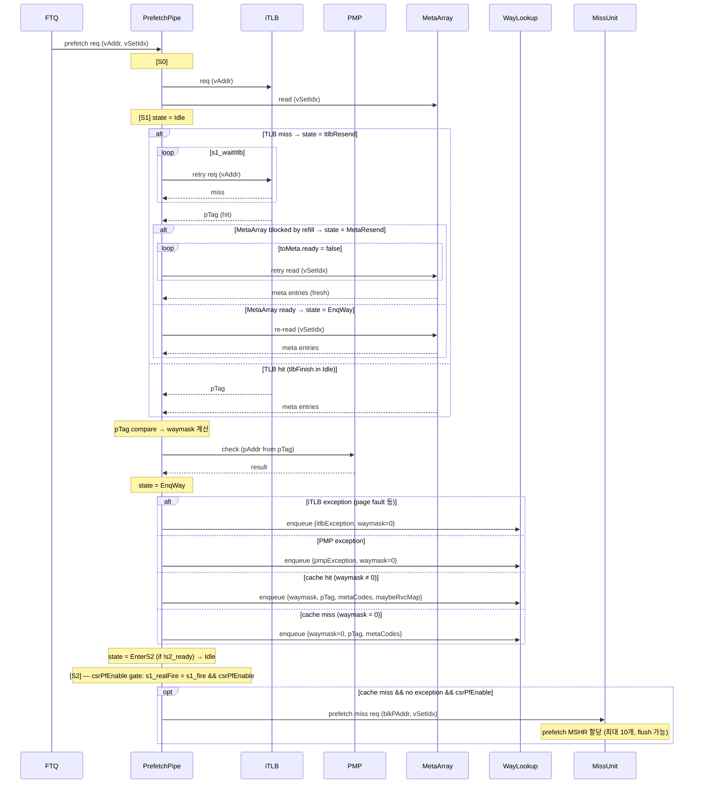
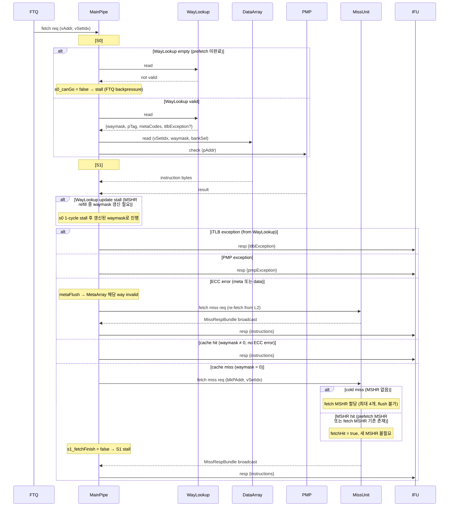
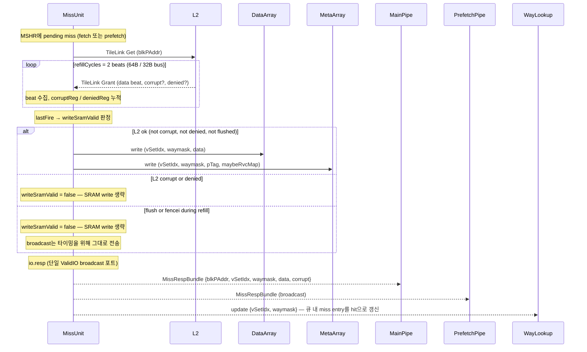

# XiangShan ICache 분석 문서

이 문서는 XiangShan 프론트엔드의 Instruction Cache(ICache)를 코드 기준으로 다시 설명한 문서다.  
기존 설명처럼 비유를 길게 끌기보다, 실제 구현이 어떤 모듈로 나뉘어 있고 요청이 어떤 순서로 흐르는지에 집중한다.

문서를 읽을 때 가장 먼저 잡아야 할 핵심은 아래 두 가지다.

1. `prefetch pipe`가 **TLB 결과와 meta lookup 결과를 미리 계산해서 `WayLookup`에 적어 둔다.**
2. `main pipe`는 **그 결과를 받아 data array만 읽고**, 부족한 경우에만 `MissUnit`에 refill을 요청한다.

즉, 이 ICache의 빠른 경로는 "main pipe가 매번 meta array와 iTLB를 직접 때리는 구조"가 아니라,  
"prefetch pipe가 앞에서 준비해 둔 정보를 main pipe가 소비하는 구조"로 이해하는 편이 맞다.

---

## 1. 먼저 전체 그림부터

관련 파일:

- `src/main/scala/xiangshan/frontend/icache/ICacheMainPipe.scala`
- `src/main/scala/xiangshan/frontend/icache/ICachePrefetchPipe.scala`
- `src/main/scala/xiangshan/frontend/icache/ICacheMissUnit.scala`
- `src/main/scala/xiangshan/frontend/icache/ICacheWayLookup.scala`
- `src/main/scala/xiangshan/frontend/icache/ICacheMetaArray.scala`
- `src/main/scala/xiangshan/frontend/icache/ICacheDataArray.scala`

ICache는 크게 아래 블록으로 나뉜다.

| 블록 | 역할 | 핵심 포인트 |
| --- | --- | --- |
| `ICachePrefetchPipe` | 미래 fetch 주소를 미리 살펴봄 | iTLB + meta read 수행 후 `WayLookup`에 기록 |
| `ICacheWayLookup` | prefetch 결과를 임시 저장 | main pipe가 바로 읽을 수 있도록 큐 형태로 유지 |
| `ICacheMainPipe` | 실제 fetch 요청 처리 | `WayLookup` 결과를 이용해 data array read |
| `ICacheMetaArray` | tag / `maybeRvcMap` / meta ECC 저장 | prefetch pipe가 읽고, miss refill이 씀 |
| `ICacheDataArray` | 실제 instruction bytes 저장 | main pipe가 읽고, miss refill이 씀 |
| `ICacheMissUnit` | miss 요청 수집 및 L2 refill 처리 | MSHR 관리, TileLink 요청, meta/data writeback |
| `ICacheReplacer` | victim way 선택 | refill 시 어떤 way를 덮어쓸지 결정 |

요청 흐름을 한 줄로 요약하면 다음과 같다.

```text
FTQ prefetch request
  -> PrefetchPipe
  -> iTLB + MetaArray read
  -> WayLookup enqueue

FTQ fetch request
  -> MainPipe
  -> WayLookup dequeue
  -> DataArray read
  -> hit면 IFU 응답
  -> miss면 MissUnit 요청
  -> refill 오면 응답 + SRAM write
```

---

## 2. 파라미터와 저장 구조

관련 파일:

- `src/main/scala/xiangshan/frontend/icache/Parameters.scala`

기본 파라미터는 다음과 같다.

| 항목 | 값 | 의미 |
| --- | --- | --- |
| `nSets` | 256 | set 개수 |
| `nWays` | 4 | 4-way set associative |
| `blockBytes` | 64 | cache line 크기 |
| `rowBits` | 64 | data bank 1개의 폭은 64bit = 8B |
| `PortNumber` | 2 | 연속된 두 cache line까지 동시에 다룰 수 있게 만든 포트 수 |
| `WayLookupSize` | 32 | prefetch 결과를 저장하는 큐 깊이 |
| `NumFetchMshr` | 4 | fetch miss용 MSHR |
| `NumPrefetchMshr` | 10 | prefetch miss용 MSHR |
| `NumInterleavedBank` | 2 | meta array interleaving bank 수 |
| `MetaWaySplit` | 2 | meta SRAM을 way 방향으로 둘로 나눔 |

총 용량은 다음과 같다.

```text
256 sets * 4 ways * 64 bytes = 64 KiB
```

여기서 `PortNumber = 2`를 "완전히 독립된 fetch 두 개를 동시에 처리한다"라고 이해하면 약간 틀린다.  
이 설계에서 port 0과 port 1은 보통 **한 fetch block이 두 cache line에 걸칠 때 그 두 line을 함께 다루기 위한 포트**다.

즉:

- port 0: 현재 fetch가 시작되는 첫 번째 cache line
- port 1: cross-line이면 다음 cache line

---

## 3. 주소가 어떻게 나뉘는가

관련 파일:

- `src/main/scala/xiangshan/frontend/icache/Helpers.scala`
- `src/main/scala/xiangshan/frontend/icache/Parameters.scala`

ICache는 VIPT 성격의 경로를 가진다.  
set index는 virtual address에서 바로 얻고, hit 판정에 필요한 tag는 iTLB를 거친 physical tag를 사용한다.

주소를 크게 나누면 이렇게 볼 수 있다.

```text
physical block address = [ pTag | vSetIdx | blockOffset ]

vSetIdx      : 어떤 set을 볼지 결정
blockOffset  : cache line 안에서 어느 byte/bank가 필요한지 결정
pTag         : 해당 set 안의 어느 way가 맞는지 판정
```

코드 기준 helper는 다음과 같다.

- `get_idx(vAddr)`: set index 추출
- `get_phy_tag(pAddr)`: physical tag 추출
- `getBlkAddrFromPTag(vAddr, pTag)`: refill 요청용 block address 구성
- `getPAddrFromPTag(vAddr, pTag)`: 응답용 physical address 구성
- `getBankIdx(blkOffset)`: data bank index 계산

중요한 점은 `waymask`가 주소에서 직접 나오지 않는다는 것이다.  
`waymask`는 prefetch pipe가 meta array를 읽고 `pTag`를 비교한 뒤 만들어 낸 결과다.

---

## 4. Meta Array는 무엇을 저장하는가

관련 파일:

- `src/main/scala/xiangshan/frontend/icache/ICacheMetaArray.scala`
- `src/main/scala/xiangshan/frontend/icache/ICacheMetaInterleavedBank.scala`
- `src/main/scala/xiangshan/frontend/icache/Bundles.scala`

meta entry에는 대략 다음 정보가 들어 있다.

| 필드 | 의미 |
| --- | --- |
| `phyTag` | hit 판정을 위한 physical tag |
| `maybeRvcMap` | 각 instruction slot이 압축 명령어일 수 있는지에 대한 힌트 |
| `code` | meta ECC/parity |

유효 비트는 SRAM 안이 아니라 `validArray` 레지스터로 따로 관리된다.

```scala
private val validArray = RegInit(VecInit.fill(NumInterleavedSet)(0.U(nWays.W)))
```

이 구조의 의미는 다음과 같다.

1. meta SRAM에는 태그와 부가 정보가 저장된다.
2. 실제로 그 way가 valid한지는 별도 valid bit 배열이 판단한다.
3. `flush`나 `fence.i`는 주로 이 valid bit를 지우는 방식으로 동작한다.

### 4.0 MetaArray 접근 패턴 요약

혼동하기 쉬운 부분이므로 먼저 정리한다.

| 포트 | 연결 대상 | 역할 |
| --- | --- | --- |
| `.read` | **prefetch pipe 전용** | pTag 조회 — hit/miss 판정용 |
| `.write` | **refill (missUnit) 전용** | L2에서 받아온 pTag를 SRAM에 저장 |
| `.flush` | main pipe (ECC 오류 후) | 해당 way의 validArray 비트를 클리어 |
| `.flushAll` | fencei | 전체 validArray 클리어 |

**핵심:**

- **prefetch pipe** → MetaArray를 **읽는다** (write 아님)
- **refill** → MetaArray를 **쓴다** — L2 fetch 완료 후 pTag를 저장해야 이후 prefetch에서 hit이 잡힘
- **main pipe** → MetaArray를 직접 **읽지 않는다** — WayLookup에서 prefetch 결과를 받아 씀

### 4.1 interleaving이 왜 필요한가

meta array는 `NumInterleavedBank = 2`로 나뉜다.  
연속된 두 set을 동시에 다룰 수 있게 하려는 목적이다.

예를 들어:

```text
set 0 -> bank 0
set 1 -> bank 1
set 2 -> bank 0
set 3 -> bank 1
```

이렇게 두면 cross-line fetch처럼 연속된 두 line을 같이 볼 때 bank conflict를 줄일 수 있다.

### 4.2 MetaArray의 실제 input과 arbitration

MetaArray(`ICacheImp.scala`)에 연결된 input은 다음 4개다.

```scala
metaArray.io.read    <> prefetcher.io.metaRead   // prefetch pipe: read
metaArray.io.write   <> missUnit.io.metaWrite    // refill: write
metaArray.io.flush   <> mainPipe.io.metaFlush    // main pipe: flush (ECC error 후 invalid)
metaArray.io.flushAll := io.fencei               // fence.i: 전체 flush
```

즉 **prefetch_pipe와 main_pipe는 MetaArray에서 독립적이지 않다.**  
main_pipe의 flush가 prefetcher의 read를 막을 수 있다.

단일 포트 사용 우선순위는 아래 combinational 조건으로 결정된다.

```scala
// ICacheMetaInterleavedBank.scala
io.read.req.ready := !io.write.req.valid && !io.flush.req.valid && !io.flushAll && tagArray.io.r.req.ready
```

우선순위:

1. `flushAll` (fencei)
2. `flush` (main_pipe, ECC error 후)
3. `write` (refill)
4. `read` (prefetcher)

FSM이나 별도 arbitration controller는 없다. 모두 combinational 조건이며,  
`ICacheMetaInterleavedBank`에 존재하는 유일한 레지스터는 valid bit 배열(`validArray`)뿐이다.

> **flush는 validArray만 건드린다.** tagArray SRAM 포트는 사용하지 않는다.  
> 그럼에도 flush 중 read를 막는 이유는, valid bit가 수정되는 도중에 해당 set을 읽으면 stale valid 정보를 보게 될 수 있기 때문이다.

#### backpressure 전파 방식

별도 arbitration controller 없이 **Ready-Valid 핸드쉐이크**로 backpressure가 upstream으로 전파된다.

```text
MetaArray.read.req.ready = false   ← write.valid 또는 flush.valid 올라옴
  → toMeta.ready = false           (prefetch pipe 내 MetaArray 연결)
  → s0_canGo = false
  → s0_fire = false
  → S0 pipeline register 진행 안 함 (stall in place)
  → io.req.ready = false           → FTQ prefetch 요청이 block됨
```

```scala
// ICachePrefetchPipe.scala
private val s0_canGo = s1_ready && toItlb.ready && toMeta.ready
s0_fire := s0_valid && s0_canGo && !s0_flush
io.req.ready := s0_canGo
```

---

## 5. Data Array는 무엇을 저장하는가

관련 파일:

- `src/main/scala/xiangshan/frontend/icache/ICacheDataArray.scala`
- `src/main/scala/xiangshan/frontend/icache/ICacheDataBank.scala`

data array는 실제 instruction bytes를 저장한다.  
한 cache line은 64B이고, 이것을 8개의 bank로 나누어 저장한다.

```text
64B cache line
  = 8 banks
  = each bank stores 8B
```

즉 bank 분할은 "서로 다른 cache line 8개"가 아니라,  
"같은 cache line의 서로 다른 byte 구간 8개"라고 봐야 한다.

```text
Bank 0 -> byte  0.. 7
Bank 1 -> byte  8..15
Bank 2 -> byte 16..23
...
Bank 7 -> byte 56..63
```

이 점이 중요하다. 그래서:

- prefetch pipe가 bank 0을 쓰고 main pipe가 bank 1을 쓰는 식의 분업은 아니다.
- refill write가 발생하면 line 전체를 쓰므로 사실상 data array 읽기가 막힌다.

### 5.1 왜 bank로 쪼개는가

주된 이유는 두 가지다.

1. 필요한 byte 구간만 읽어서 전력을 줄이기 위해
2. fetch block이 line 경계를 넘는 경우 두 line의 bank를 적절히 섞어 읽기 위해

`Helpers.scala`의 아래 함수들이 이를 담당한다.

- `getBankSel(blkOffset, blkEndOffset, crossLine)`
- `getLineSel(blkOffset)`
- `getBankValid(portValid, blkOffset)`

### 5.2 DataArray의 실제 input과 arbitration

DataArray(`ICacheImp.scala`)에 연결된 input은 다음 2개다.

```scala
dataArray.io.read  <> mainPipe.io.dataRead     // main pipe: read
dataArray.io.write <> missUnit.io.dataWrite    // refill: write
```

**prefetch_pipe는 DataArray에 전혀 연결되지 않는다.** DataArray에서 두 파이프 간 contention은 없다.

단일 포트 사용 우선순위는 아래 combinational 조건으로 결정된다.

```scala
// ICacheDataBank.scala
io.read.req.ready := !io.write.req.valid && ways.map(_.io.r.req.ready).reduce(_ && _)
```

우선순위:

1. `write` (refill)
2. `read` (main pipe)

`ICacheDataBank`에는 레지스터가 하나도 없다. FSM이나 중재 상태가 없으며,  
write.valid가 사라지면 다음 cycle에 combinational하게 read가 즉시 가능해진다.

---

## 6. 이 설계에서 가장 중요한 블록: WayLookup

관련 파일:

- `src/main/scala/xiangshan/frontend/icache/ICacheWayLookup.scala`
- `src/main/scala/xiangshan/frontend/icache/Bundles.scala`
- `src/main/scala/xiangshan/frontend/icache/Helpers.scala`

이 문서를 이해할 때 가장 중요하면서도 가장 오해하기 쉬운 블록이 `WayLookup`이다.

`WayLookup`은 단순한 "way 번호 저장소"가 아니다.  
prefetch pipe가 미리 계산한 **fetch에 필요한 핵심 정보 묶음**을 큐 형태로 보관하는 구조다.

`WayLookupEntry`를 보면 실제 저장 정보는 다음과 같다.

| 필드 | 의미 |
| --- | --- |
| `vSetIdx(Vec[2])` | 두 포트가 볼 set index |
| `waymask(Vec[2])` | 각 포트에서 hit한 way 결과 |
| `maybeRvcMap(Vec[2])` | meta에서 가져온 압축 명령 힌트 |
| `metaCodes(Vec[2])` | meta ECC code |
| `pTag` | prefetch 시점의 physical tag |
| `itlbPbmt` | iTLB 변환 결과의 PBMT |

예외 정보는 `WayLookupEntry` 안에 전부 넣지 않고 별도로 저장한다.

```scala
private val exceptionEntry = RegInit(0.U.asTypeOf(Valid(new WayLookupExceptionEntry)))
```

이렇게 한 이유는, 주석 그대로 첫 번째 예외만 저장해도 flush가 걸리기 때문이다.

### 6.1 왜 WayLookup이 필요한가

main pipe의 빠른 경로에서 매번 아래 작업을 직접 하면 부담이 크다.

1. iTLB 변환
2. meta array read
3. 4-way tag compare
4. `waymask` 생성

그래서 prefetch pipe가 이 작업을 앞에서 미리 수행하고, 결과를 `WayLookup`에 넣는다.  
main pipe는 fetch가 실제로 들어왔을 때 그 결과를 바로 꺼내 data array만 읽는다.

즉 `WayLookup`은 "prefetch 결과를 main pipe로 전달하는 지연 버퍼"다.

### 6.2 큐 동작

`WayLookup`은 원형 큐처럼 동작한다.

- `writePtr`: prefetch pipe가 새 결과를 넣는 위치
- `readPtr`: main pipe가 읽어 가는 위치
- `empty`: 읽을 것이 없음
- `full`: 더 쓸 수 없음

핵심 로직은 다음과 같이 이해하면 된다.

1. prefetch pipe가 `io.write.fire` 하면 엔트리가 enqueue된다.
2. main pipe가 `io.read.fire` 하면 엔트리가 dequeue된다.
3. 큐가 비어 있는데 같은 cycle에 write가 들어오면 bypass로 바로 read에 전달할 수 있다.

코드에도 이 bypass가 있다.

```scala
private val canBypass = empty && io.write.valid && !exceptionEntry.valid
```

즉 prefetch 결과가 막 생성된 cycle에 main pipe가 바로 받아 가는 빠른 경로가 존재한다.

### 6.2.1 WayLookup이 비어 있으면 어떻게 되나

이 부분은 자주 오해되는 지점이다.  
main pipe는 `WayLookup`가 비어 있을 때 다른 경로로 fallback하지 않는다.

즉, 아래 같은 대체 경로는 없다.

```text
WayLookup miss
  -> main pipe가 직접 iTLB 수행
  -> main pipe가 직접 meta array read
  -> main pipe가 직접 tag compare
```

실제 동작은 그 반대다.

```text
WayLookup miss
  -> main pipe 진행 불가
  -> FTQ fetchReq backpressure
  -> bubble 발생
```

코드 관점에서는 `MainPipe S0`가 진행 조건에 `fromWayLookup.valid`를 직접 포함한다.

```scala
private val s0_canGo = toData.ready && fromWayLookup.valid && s1_ready
fromFtq.ready := s0_canGo
```

의미는 간단하다.

1. `WayLookup.valid = 1`이어야 main pipe가 data array read를 시작할 수 있다.
2. `WayLookup.valid = 0`이면 fetch request를 받지 않는다.
3. 따라서 오동작이 아니라 stall이 난다.

이 설계는 "WayLookup이 항상 존재한다고 믿는다"기보다,  
"WayLookup이 준비되지 않았으면 아예 fetch를 시작하지 않는다"라고 이해하는 편이 정확하다.

### 6.2.2 같은 cycle에 막 만들어진 결과는 bypass된다

`WayLookup`이 비어 있어도 prefetch pipe가 같은 cycle에 write를 만들면, queue에 저장했다가 다시 읽지 않고 바로 main pipe로 전달할 수 있다.

즉 경우를 나누면 다음과 같다.

1. `WayLookup`에 이미 엔트리가 있음
   main pipe가 일반 dequeue 경로로 읽는다.
2. `WayLookup`은 비어 있지만 prefetch 결과가 같은 cycle에 생성됨
   bypass로 바로 전달된다.
3. `WayLookup`도 비어 있고 prefetch 결과도 아직 없음
   main pipe가 stall된다.

그래서 `WayLookup`는 "없으면 틀릴 수 있는 speculative storage"가 아니라,  
"있어야만 fetch를 진행할 수 있는 준비 완료 신호 포함 버퍼"에 가깝다.

### 6.3 miss refill이 WayLookup을 업데이트하는 이유

이 부분은 꼭 이해해야 한다.

prefetch pipe가 `WayLookup`에 적어 둔 결과는 "그 시점의 meta 상태"를 기준으로 한다.  
그 뒤에 miss refill이 완료되면 cache 상태가 바뀔 수 있다.

예를 들어:

1. prefetch 시점에는 miss라서 `waymask = 0`이었다.
2. 잠시 뒤 miss refill이 완료되어 해당 line이 cache에 들어왔다.
3. 아직 main pipe가 그 엔트리를 소비하지 않았다.

이 경우 `WayLookup` 안의 오래된 정보는 틀린 상태다.  
그래서 `ICacheWayLookup`은 `io.update: Valid[MissRespBundle]`를 받아 기존 엔트리를 갱신한다.

`updateMetaInfo()`의 의미는 다음과 같다.

- 같은 `vSetIdx`와 같은 `pTag`면:
  refill 결과로 `waymask`, `maybeRvcMap`, `metaCodes`를 최신 값으로 덮어쓴다.
- 같은 `vSetIdx`와 같은 `waymask`지만 `pTag`가 달라졌다면:
  예전 hit 정보가 다른 line으로 대체된 상황이므로 `waymask := 0`으로 만들어 miss처럼 취급한다.

즉 `WayLookup`은 단순 큐가 아니라, **refill에 의해 뒤늦게 정정되는 큐**다.

### 6.4 flush와 branch flush

`WayLookup`은 전역 flush뿐 아니라 BPU stage3 flush도 신경 쓴다.

- `io.flush`: 큐 포인터 초기화
- `flushFromBpu.shouldFlushByStage3(...)`: 꼬리 엔트리 하나를 되감는 동작

이 부분은 `prefetch 결과는 만들어졌지만 아직 main pipe가 소비하지 않은 엔트리`를 branch flush로 버리기 위한 처리다.

---

## 7. Prefetch Pipe: 실제로 무엇을 미리 계산하는가

관련 파일:

- `src/main/scala/xiangshan/frontend/icache/ICachePrefetchPipe.scala`

prefetch pipe는 3 stage로 보는 것이 가장 이해하기 쉽다.

### 7.1 Stage 0

입력:

- FTQ의 prefetch request
- `startAddr`
- `nextlineStart`
- `crossCacheline`

이 stage에서 하는 일:

1. 두 포트의 virtual address 준비
2. `vSetIdx` 계산
3. iTLB request 발행
4. meta array read request 발행

여기서 iTLB는 포트가 하나뿐이다.  
코드 주석에도 있듯, kunminghu-v3에서는 한 fetch request가 page를 넘지 않는다고 가정하므로 첫 line 주소만으로 충분하다.

즉 prefetch pipe는:

- meta read는 2포트 감각으로 처리하지만
- iTLB는 첫 line 기준 1회 변환으로 처리한다

라고 이해하면 된다.

### 7.2 Stage 1

이 stage가 핵심이다.

하는 일은 다음과 같다.

1. iTLB 응답 수신
2. physical tag 추출
3. meta array 응답 수신
4. 각 포트에서 4-way tag compare 수행
5. `waymask`, `maybeRvcMap`, `metaCodes` 계산
6. 필요하면 WayLookup enqueue
7. PMP 검사
8. 예외 / MMIO 여부 정리

meta read 결과에서 실제 hit way를 만드는 코드는 이 부분이다.

```scala
val waymask = getWaymask(s1_pTag, portEntries)
```

즉 prefetch pipe가 하는 가장 중요한 일은 사실상:

```text
"이 주소는 현재 cache의 몇 번 way에 있나?"
```

를 미리 계산하는 것이다.

### 7.3 Stage 2

stage 2는 실제 prefetch miss를 miss unit에 보내는 단계다.

이 stage에서 하는 일:

1. SRAM hit 여부와 MSHR hit 여부 결합
2. exception / MMIO가 아니고 miss이면 miss request 발행
3. 두 포트의 miss를 arbiter로 묶어 `MissUnit`에 전달

중요한 점:

- prefetch가 hit이면 data array를 읽지 않는다.
- prefetch는 data 자체를 가져오지 않는다.
- prefetch의 주목적은 `WayLookup` 준비와 miss 선행 발행이다.

### 7.4 `csrPfEnable`가 꺼지면 무엇이 멈추나

이 신호는 이름만 보면 prefetch pipe 전체를 끄는 것처럼 보일 수 있지만, 실제로는 그렇지 않다.

코드를 보면:

```scala
private val s1_realFire = s1_fire && io.csrPfEnable
private val s2_valid = ValidHold(s1_realFire, s2_fire, s2_flush)
```

즉 `csrPfEnable`는 stage 2로 들어가는 miss prefetch 경로를 막는다.  
반면 stage 1에서 수행하는 아래 작업은 계속 동작한다.

1. iTLB 응답 수신
2. meta read 결과 수신
3. tag compare
4. `WayLookup` enqueue

따라서 `csrPfEnable = 0`일 때도 `WayLookup` 생성은 계속된다.  
멈추는 것은 "앞당겨서 miss를 MissUnit에 보내는 기능"이지, main pipe를 위한 선행 lookup 자체가 아니다.

---

## 8. Main Pipe: 실제 fetch는 어떻게 처리되는가

관련 파일:

- `src/main/scala/xiangshan/frontend/icache/ICacheMainPipe.scala`

main pipe는 2 stage로 보면 된다.

### 8.1 Stage 0

입력:

- FTQ fetch request
- `WayLookup` 결과

이 stage에서 하는 일:

1. fetch block이 cross-line인지 계산
2. `WayLookup`에서 `waymask`, `pTag`, 예외 정보를 받음
3. 그 `waymask`를 사용해 data array read request 발행

여기서 중요한 assert가 하나 있다.

```scala
assert(s0_vSetIdx(i) === fromWayLookup.bits.vSetIdx(i))
```

즉 main pipe는 `WayLookup` 엔트리가 현재 FTQ fetch와 정확히 대응한다고 가정한다.  
그래서 prefetch pipe와 main pipe의 요청 순서 정합성이 매우 중요하다.

여기서 한 가지 더 중요한 점은, main pipe가 이 엔트리를 "없어도 되는 참고 정보"로 보는 것이 아니라는 점이다.

진행 조건 자체가 `fromWayLookup.valid`에 묶여 있기 때문에:

```scala
private val s0_canGo = toData.ready && fromWayLookup.valid && s1_ready
```

`WayLookup`이 아직 준비되지 않았다면 main pipe는 fetch를 시작하지 않는다.  
즉 이 설계는 "prefetch가 안 되어 있으면 main pipe가 직접 meta/TLB를 본다"가 아니라,

```text
prefetch 결과가 준비될 때까지 기다린다
```

가 정확한 설명이다.

타임라인으로 보면 다음과 같다.

```text
이상적인 경우
  Cycle N    : prefetch pipe S0, iTLB/meta request
  Cycle N+1  : prefetch pipe S1, WayLookup write
  Cycle N+2  : main pipe S0, WayLookup read + data read
  Cycle N+3  : main pipe S1, IFU 응답

prefetch가 늦은 경우
  Cycle N    : fetchReq는 오고 싶지만 WayLookup.valid = 0
             : main pipe는 fromFtq.ready = 0
             : fetchReq를 받지 못하고 stall
```

그래서 `MainPipe`는 `WayLookup`를 신뢰하는 구조이긴 하지만,  
그 신뢰는 "없어도 괜찮다"는 뜻이 아니라 "없으면 아예 진행하지 않는다"는 프로토콜 위에 서 있다.

### 8.2 Stage 1

이 stage에서 실제 fetch 결과가 정리된다.

하는 일:

1. data SRAM 응답 수신
2. 같은 block의 miss refill 응답이 있으면 SRAM 대신 그 데이터 사용
3. `maybeRvcMap` 선택
4. meta ECC / data ECC 검사
5. PMP 검사
6. miss 필요 여부 판단
7. IFU 응답 생성

특히 data 선택은 "SRAM 결과와 MSHR refill 결과 중 어느 쪽이 더 최신인가"를 반영한다.

즉:

- 이미 cache hit이면 SRAM data 사용
- miss였지만 refill 응답이 돌아왔으면 MSHR data 사용

이 구조 덕분에 refill 완료 직후에도 main pipe가 별도 재시도 없이 데이터를 받을 수 있다.

### 8.3 왜 main pipe는 meta array를 안 읽는가

이 설계의 핵심 차별점 중 하나다.

보통 ICache를 처음 보면 "hit 판정하려면 main pipe가 meta도 읽어야 하지 않나?"라는 의문이 든다.  
그런데 XiangShan의 이 구현에서는 빠른 경로에서 그 일을 prefetch pipe가 대신한다.

따라서 정상적인 fast path는:

```text
main pipe
  = WayLookup에서 hit 정보 받음
  + data array 읽음
```

이지,

```text
main pipe
  = iTLB
  + meta read
  + data read
```

가 아니다.

---

## 9. hit / miss는 어떻게 결정되는가

### 9.1 hit

prefetch pipe가 만들어 둔 `waymask`에 1이 있으면 hit다.

```scala
private val s0_hits = VecInit(fromWayLookup.bits.waymask.map(_.orR))
```

즉 main pipe는 기본적으로 `WayLookup`의 판정을 신뢰하고 data array를 읽는다.

### 9.2 miss

아래 조건이면 miss 처리로 넘어간다.

1. `waymask`가 0이라서 hit way가 없음
2. 또는 ECC 오류로 refetch가 필요한 경우
3. 단, exception이나 MMIO이면 refill을 보내지 않음

main pipe의 miss 조건은 대략 아래와 같다.

```text
(!hit || corrupt_refetch) && no_exception && !mmio
```

prefetch pipe도 비슷하게 자신의 stage 2에서 miss를 판단하지만, 목적은 "미리 refill 요청"이다.  
main pipe의 miss는 실제 fetch 완료를 위한 요청이라는 점이 다르다.

---

## 10. MissUnit과 MSHR

관련 파일:

- `src/main/scala/xiangshan/frontend/icache/ICacheMissUnit.scala`
- `src/main/scala/xiangshan/frontend/icache/ICacheMshr.scala`
- `src/main/scala/xiangshan/frontend/icache/ICacheReplacer.scala`

`MissUnit`은 miss 요청을 받아 L2와 통신하고, refill 결과를 SRAM과 파이프라인에 돌려주는 블록이다.

### 10.1 fetch miss와 prefetch miss는 분리되어 있다

MSHR는 두 종류가 있다.

- fetch용 `NumFetchMshr = 4`
- prefetch용 `NumPrefetchMshr = 10`

우선순위는 fetch 쪽이 더 높다.  
TileLink acquire arbitration에서도 fetch MSHR가 먼저 선택되고, prefetch는 그 뒤를 따른다.

### 10.2 duplicate miss를 막는 방법

새 miss 요청이 들어오면 모든 MSHR을 lookup해서 이미 같은 block이 outstanding인지 확인한다.

따라서:

- 이미 진행 중인 fetch miss가 있으면 같은 fetch miss를 또 만들지 않는다.
- prefetch miss도 마찬가지다.
- 심지어 동일 cycle의 fetch/preftch 간 중복도 걸러낸다.

### 10.3 refill이 끝나면 무엇이 갱신되는가

L2 grant의 마지막 beat를 받으면 `MissUnit`은 다음 세 가지를 동시에 수행한다.

1. `MetaArray` write
2. `DataArray` write
3. `MissRespBundle` broadcast

`MissRespBundle`에는 아래 정보가 들어 있다.

| 필드 | 의미 |
| --- | --- |
| `blkPAddr` | refill된 block 주소 |
| `vSetIdx` | 채워 넣은 set |
| `waymask` | 선택된 victim way |
| `data` | line 전체 데이터 |
| `maybeRvcMap` | refill 데이터에서 계산한 RVC 힌트 |
| `corrupt`, `denied` | TileLink 응답 상태 |

이 broadcast를 받는 쪽은:

- main pipe
- prefetch pipe
- WayLookup

이다.  
즉 refill은 단순히 SRAM만 갱신하는 것이 아니라, 파이프라인 내부에 남아 있는 "오래된 판단"도 함께 정정한다.

### 10.4 victim way는 어디서 오나

`ICacheReplacer`가 victim way를 고른다.  
반대로 cache hit가 났을 때는 main pipe가 `replacerTouch`를 보내 해당 set/way가 최근 사용되었다는 정보를 갱신한다.

---

## 11. ECC와 오류 처리

관련 파일:

- `src/main/scala/xiangshan/frontend/icache/Helpers.scala`
- `src/main/scala/xiangshan/frontend/icache/ICacheMainPipe.scala`

기본 설정은 meta/data 모두 `parity`다.

### 11.1 meta ECC

meta corruption은 아래 두 상황을 잡으려 한다.

1. hit한 한 way의 ECC code가 맞지 않음
2. multi-hit가 발생함

특히 정상 cache라면 한 set에서 같은 tag로 multi-hit가 나면 안 되므로, 이것도 사실상 이상 상태다.

### 11.2 data ECC

data는 선택된 bank들에 대해서만 검사한다.  
즉 fetch에 실제로 사용한 bank가 corrupt인지 본다.

### 11.3 오류 발생 시 동작

현재 설정에서 `EnableCorruptRefetch = false`가 기본이므로, 일반적으로는 ECC 오류가 자동 재시도로 복구되지 않는다.  
대신 main pipe가 하드웨어 오류 예외를 생성한다.

만약 `EnableCorruptRefetch = true`면:

1. 문제 있는 meta/data를 flush
2. 다시 miss를 보내 refill

의 형태로 자동 복구를 시도한다.

---

## 12. stall이 어디서 생기는가

이 문서를 읽는 목적이 성능 해석이라면, stall 지점을 구분해서 보는 것이 중요하다.

### 12.1 main pipe stall

대표 원인은 다음과 같다.

- `WayLookup` 결과가 아직 없음
- data array가 refill write 때문에 바쁨
- miss가 outstanding이라 fetch가 아직 안 끝남
- IFU가 `respStall`을 걸음

### 12.2 prefetch pipe stall

대표 원인은 다음과 같다.

- iTLB miss
- meta array가 write/flush 때문에 busy
- `WayLookup`가 full 또는 exception 상태
- miss unit으로 miss request를 못 보냄

### 12.3 array 단위 stall

중요한 사실 두 가지:

1. `MetaArray` read는 prefetch pipe 전용이다.
2. `DataArray` read는 main pipe 전용이다.

그래서 meta 측 stall과 data 측 stall은 성격이 다르다.

- meta 쪽이 막히면 prefetch 준비가 늦어진다.
- data 쪽이 막히면 실제 fetch 응답이 늦어진다.

---

## 13. 자주 헷갈리는 포인트

### 13.1 `PortNumber = 2`는 독립 fetch 두 개가 아니다

대부분의 경우 같은 fetch block 안의 두 cache line을 뜻한다.

### 13.2 prefetch pipe는 instruction data를 직접 읽지 않는다

prefetch pipe의 주 일은:

- iTLB
- meta lookup
- hit/miss 선판정
- WayLookup 기록
- 필요 시 miss 선행 발행

이다.

### 13.3 main pipe는 fast path에서 meta array를 읽지 않는다

main pipe는 `WayLookup` 결과를 소비한다.

### 13.4 bank는 "다른 line"이 아니라 "같은 line의 다른 byte 구간"이다

이 점을 잘못 이해하면 data array arbitration을 완전히 잘못 해석하게 된다.

### 13.5 WayLookup은 고정 불변 결과가 아니다

refill broadcast를 받아 엔트리 내용이 수정될 수 있다.

---

## 14. Sequence Diagrams

> **PrefetchPipe S1 FSM 참고:** PrefetchPipe의 S1 스테이지는 5-state FSM으로 구현되어 있다.  
> `Idle → ItlbResend → MetaResend → EnqWay → EnterS2`  
> DataArray/MetaArray의 SRAM 포트 arbitration(combinational)과는 별개다.

---

### 14.1 Prefetch Pipe Access



---

### 14.2 Main Pipe Access



---

### 14.3 Refill Write



---

### 시나리오별 요약

| 대분류 | 소분류 | 결과 | latency |
| --- | --- | --- | --- |
| Prefetch | TLB hit + cache hit | WayLookup에 waymask 기록 | S0+S1 |
| Prefetch | TLB hit + cache miss | WayLookup + MissUnit prefetch MSHR | S0+S1+S2 |
| Prefetch | TLB miss | S1 ItlbResend loop → (MetaResend) → EnqWay | 가변 |
| Prefetch | Exception (iTLB/PMP) | WayLookup에 exception 기록, MissUnit 없음 | S0+S1 |
| Main pipe | cache hit | DataArray → IFU | 1 cycle (S0→S1) |
| Main pipe | cache miss (cold) | MissUnit fetch MSHR → refill → IFU | 다수 cycle |
| Main pipe | cache miss (MSHR hit) | 기존 MSHR 대기 → broadcast → IFU | 단축 가능 |
| Main pipe | WayLookup empty | stall (prefetch 완료 대기) | 가변 |
| Main pipe | ECC error | metaFlush + re-fetch → IFU | 다수 cycle |
| Refill | L2 ok | DataArray + MetaArray write + broadcast | — |
| Refill | L2 corrupt/denied | SRAM write 생략 + broadcast (corrupt flag) | — |
| Refill | flush 중 refill 완료 | SRAM write 생략 + broadcast (타이밍용) | — |

### 각 파이프의 array 접근 정리

| | MetaArray read | MetaArray flush | DataArray read | DataArray/MetaArray write |
| --- | --- | --- | --- | --- |
| **Prefetch pipe** | O (S0, S1) | X | X | X |
| **Main pipe** | X (WayLookup 대체) | O (ECC 오류 시) | O (S0→S1) | X |
| **MissUnit (refill)** | X | X | X | O (refill write) |

---

## 15. 코드 읽는 순서 추천

처음부터 전체를 보면 오히려 더 헷갈릴 수 있다. 아래 순서로 읽는 편이 낫다.

1. `Parameters.scala`
   파라미터와 용어를 먼저 잡는다.
2. `Bundles.scala`
   어떤 정보가 블록 사이를 오가는지 본다.
3. `Helpers.scala`
   주소/way/bank helper를 이해한다.
4. `ICacheWayLookup.scala`
   prefetch와 main pipe를 이어 주는 핵심 버퍼를 이해한다.
5. `ICachePrefetchPipe.scala`
   hit/miss 선판정과 WayLookup 생성 경로를 본다.
6. `ICacheMainPipe.scala`
   실제 fetch 응답 경로를 본다.
7. `ICacheMissUnit.scala`
   miss 처리와 refill broadcast를 본다.

이 순서로 읽으면 "왜 main pipe가 meta를 안 읽는지", "왜 WayLookup update가 필요한지"가 훨씬 빨리 보인다.

---

## 16. 한 줄 결론

이 ICache의 핵심 아이디어는 아래 한 문장으로 요약할 수 있다.

> prefetch pipe가 iTLB와 meta lookup을 앞에서 끝내 두고, main pipe는 그 결과를 `WayLookup`으로 받아 data fetch와 miss 처리에 집중한다.

그래서 이 구조를 이해할 때는 "cache array 자체"보다도 아래 세 경로의 연결 관계를 먼저 보는 것이 중요하다.

```text
PrefetchPipe -> WayLookup -> MainPipe
                ^
                |
             MissUnit update
```

이 관계를 잡고 나면 나머지 코드는 대부분 "그 fast path를 유지하기 위한 보조 로직"으로 읽힌다.
