# ICache Analysis

- Block: `ICache`
- Top-level implementation: `ICacheImp`
- Main source files:
  - `src/main/scala/xiangshan/frontend/icache/ICache.scala`
  - `src/main/scala/xiangshan/frontend/icache/ICacheImp.scala`
  - `src/main/scala/xiangshan/frontend/icache/ICachePrefetchPipe.scala`
  - `src/main/scala/xiangshan/frontend/icache/ICacheMainPipe.scala`
  - `src/main/scala/xiangshan/frontend/icache/ICacheWayLookup.scala`
  - `src/main/scala/xiangshan/frontend/icache/ICacheMetaArray.scala`
  - `src/main/scala/xiangshan/frontend/icache/ICacheDataArray.scala`
  - `src/main/scala/xiangshan/frontend/icache/ICacheMissUnit.scala`
  - `src/main/scala/xiangshan/frontend/icache/ICacheMshr.scala`
  - `src/main/scala/xiangshan/frontend/icache/Parameters.scala`
  - `src/main/scala/xiangshan/frontend/icache/Bundles.scala`

---

## 1. Block Diagram

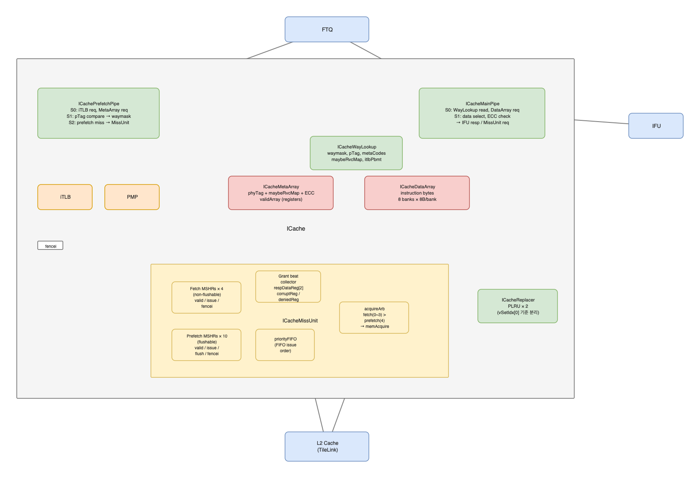

Draw.io source: [icache_block_diagram.drawio](./icache_block_diagram.drawio)

The ICache is split into a prefetch/tag path and a main fetch/data path.

- `ICachePrefetchPipe` accepts FTQ prefetch requests, sends iTLB requests, reads `ICacheMetaArray`, compares the physical tag, and enqueues way lookup information into `ICacheWayLookup`.
- `ICacheMainPipe` accepts FTQ fetch requests, dequeues way lookup information, reads `ICacheDataArray`, checks ECC/PMP/TileLink error state, and sends the instruction fetch response to IFU.
- `ICacheMissUnit` receives fetch and prefetch miss requests, allocates MSHRs, issues TileLink acquires to L2, receives grants, writes refill data into MetaArray/DataArray, and broadcasts refill responses to MainPipe, PrefetchPipe, and WayLookup.
- `ICacheReplacer` selects refill victim ways and receives hit touches from MainPipe.
- Optional `ICacheCtrlUnit` can take over MetaArray/DataArray access for ECC injection when enabled.

---

## 2. Top-Level Interface

`ICacheImp.ICacheIO` exposes the current ICache top-level interface.

| Port | Direction | Type / Protocol | Description |
|------|-----------|-----------------|-------------|
| `hartId` | Input | `UInt(hartIdLen.W)` | Hart ID used by difftest and trace paths. |
| `fromFtq` | Input | `Flipped(FtqToICacheIO)` | FTQ fetch request, prefetch request, BPU flush information, and redirect flush. |
| `softPrefetchReq` | Input | `Vec[Valid[SoftIfetchPrefetchBundle]]` | Backend software instruction prefetch requests. Only one pending soft prefetch is retained in the current implementation. |
| `toIfu` | Output | `ICacheToIfuIO` | Fetch response, fetch-ready indication, perf counters, and topdown signals sent to IFU. |
| `fromIfu` | Input | `Flipped(IfuToICacheIO)` | IFU backpressure. `fromIfu.stall` blocks MainPipe response retirement. |
| `pmp` | Output/Input | `Vec(2, PmpCheckBundle)` | PMP check ports. Port 0 is connected to MainPipe, port 1 is connected to PrefetchPipe. |
| `itlb` | Output/Input | `TlbRequestIO` | iTLB request/response interface used by PrefetchPipe. MainPipe consumes translated results through WayLookup. |
| `itlbFlushPipe` | Output | `Bool` | Flushes the iTLB request pipeline when PrefetchPipe S1 is flushed. |
| `error` | Output | `Valid[L1CacheErrorInfo]` | Reports selected L1 ICache ECC/bus errors to the backend/BEU path. |
| `csrPfEnable` | Input | `Bool` | Enables hardware prefetch miss issue from PrefetchPipe S1 into S2/MissUnit. |
| `fencei` | Input | `Bool` | Flushes cache metadata validity and marks MSHRs as fenced. |
| `flush` | Input | `Bool` | Global frontend flush input. Internal ICache logic mainly uses `fromFtq.redirectFlush`. |
| `wfi` | Input/Output | `Flipped(WfiReqBundle)` | Stops MSHR acquire issue during WFI and reports whether outstanding ICache MSHRs are safe. |

Important external wiring in `Frontend.scala`:

- `icache.io.fromFtq <> ftq.io.toICache`
- `ifu.io.fromICache <> icache.io.toIfu`
- `icache.io.itlb` connects to the single frontend iTLB requestor port.
- `icache.io.pmp(0)` and `icache.io.pmp(1)` connect to two same-cycle PMP checkers.

---

## 3. TLB Hit and Cache Hit Operation

### 3.1 Prefetch Operation

`ICacheImp` arbitrates prefetch input before `ICachePrefetchPipe`. A pending software prefetch has higher priority than the FTQ hardware prefetch request. When a software prefetch is pending, `io.fromFtq.prefetchReq.ready` is forced low because `prefetcher.io.req.ready` is not passed back to FTQ.

The current RTL has two prefetch sources:

| Prefetch type | Source interface | Address source | Cross-line behavior | FTQ / WayLookup relation | Main purpose |
|---------------|------------------|----------------|---------------------|--------------------------|--------------|
| Hardware prefetch | `io.fromFtq.prefetchReq` | `FtqPrefetchRequest.startVAddr` and `nextCachelineVAddr` | Uses `req.crossCacheline`; may lookup two adjacent cachelines | Carries a real `ftqIdx` and can enqueue `ICacheWayLookup` for the later MainPipe fetch | Prepare the normal fetch stream before IFU asks MainPipe for data |
| Software prefetch | `io.softPrefetchReq` | `SoftIfetchPrefetchBundle.vaddr` | Forces `crossCacheline := false`; prefetches only one cacheline | `ftqIdx := DontCare` and does not enqueue `ICacheWayLookup` | Bring an instruction line into ICache due to an explicit software prefetch request |

Operationally, hardware prefetch is part of the frontend fetch pipeline: it translates the predicted/FTQ address, checks MetaArray, and records the result in `ICacheWayLookup` so MainPipe can later read DataArray without doing tag lookup again. Software prefetch is a cache-fill hint: it goes through the same translation, metadata lookup, PMP/cacheability check, and MissUnit prefetch miss path, but it does not create a WayLookup entry because there is no corresponding FTQ fetch bundle waiting to consume it.

Current RTL detail: `PrefetchReqBundle.fromSoftPrefetch` initializes `backendException := ExceptionType.None`, but `ICacheImp` later drives `prefetcher.io.req.bits.backendException := io.fromFtq.prefetchReq.bits.backendException` after selecting between software and FTQ prefetch. Therefore, the top-level wiring should be reviewed if software prefetch must be fully independent from FTQ backend-exception metadata.

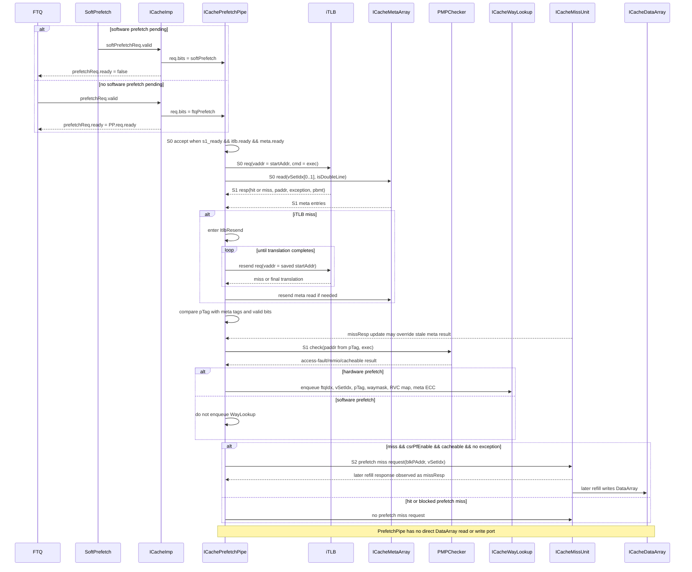

The explicit prefetch state machine is the S1 FSM in `ICachePrefetchPipe`. S0 and S2 use ready/valid holding logic around this FSM: S0 accepts a new request only when S1 can accept it, and S2 holds a miss request until all required prefetch miss requests have been sent or suppressed.

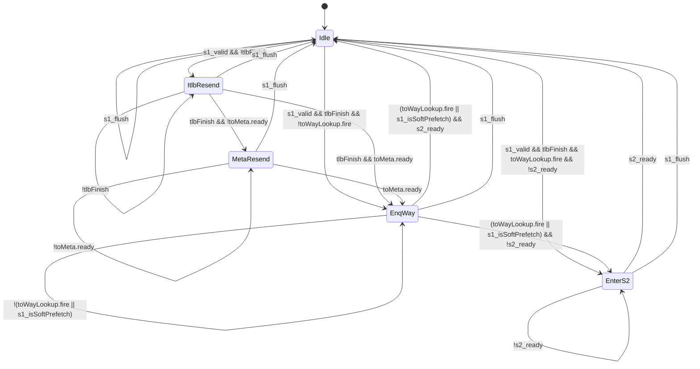

State meanings:

| State | Meaning |
|-------|---------|
| `Idle` | No blocked S1 work. A valid S1 request can complete immediately, move to iTLB resend, wait for WayLookup enqueue, or wait for S2 readiness. |
| `ItlbResend` | S1 is waiting for iTLB translation to finish after an iTLB miss. |
| `MetaResend` | Translation has finished, but the MetaArray resend request could not be accepted yet. |
| `EnqWay` | S1 has enough metadata/translation information and is waiting to enqueue WayLookup, unless the request is a software prefetch. |
| `EnterS2` | S1 work is complete but S2 is still busy issuing or suppressing prefetch miss requests. |

PrefetchPipe stage behavior:

| Stage | Valid / ready control | Main inputs captured or consumed | Main work in the stage | Main outputs | Stall / replay condition | Flush behavior |
|-------|-----------------------|----------------------------------|------------------------|--------------|--------------------------|----------------|
| S0 | `s0_valid := io.req.valid`; `io.req.ready := s1_ready && toItlb.ready && toMeta.ready`; `s0_fire := s0_valid && s0_canGo && !s0_flush` | `startAddr`, `nextlineStart`, `ftqIdx`, `crossCacheline`, `isSoftPrefetch`, `backendException` | Builds `s0_vAddr`, `s0_vSetIdx`, decides whether the request is double-line, and launches the initial translation/meta lookup | `toItlb.valid := s1_needItlb || s0_valid`; `toMeta.valid := s1_needMeta || s0_valid` | Cannot accept a new request when S1 is not ready, iTLB is not ready, or MetaArray is not ready | `s0_flush := io.flush || fromBpuS0Flush || s1_flush`; BPU flush applies only to non-soft prefetch |
| S1 | `s1_valid := ValidHold(s0_fire, s1_fire, s1_flush)`; `s1_ready := s1_nextState === Idle`; `s1_fire := s1_ready && s1_valid && !s1_flush` | Registered S0 request fields; iTLB response; MetaArray response; MissUnit refill response; PMP response | Handles iTLB miss resend, optional MetaArray resend, pTag/meta tag compare, valid/ECC metadata collection, MSHR refill update, PMP/PBMT cacheability check, and WayLookup enqueue | `toWayLookup` for hardware prefetch; `s1_exceptionOut`; `s1_isMmio`; `s1_sramHits`; S1-to-S2 registers when `s1_realFire` | Waits in `ItlbResend` until `tlbFinish`; waits in `MetaResend` until `toMeta.ready`; waits in `EnqWay` until WayLookup enqueue fires or request is soft prefetch; waits in `EnterS2` until S2 is ready | `s1_flush := io.flush || fromBpuS1Flush`; also drives `io.itlbFlushPipe := s1_flush` |
| S2 | `s2_valid := ValidHold(s1_realFire, s2_fire, s2_flush)`; `s1_realFire := s1_fire && io.csrPfEnable`; `s2_ready := s2_finish || !s2_valid` | Registered S1 vaddr, pTag, doubleline, exception, MMIO, SRAM hit bits; MissUnit refill response for MSHR hit check | Computes final hit as `s2_mshrHits || s2_sramHits`, suppresses exception/MMIO/uncacheable requests, tracks per-line `s2_hasSend`, and arbitrates up to `PortNumber` prefetch miss requests | `toMiss` / `io.missReq` with `blkPAddr` and `vSetIdx` | Holds until every requested line is either already sent or not a miss. The miss request can stall behind `toMiss.ready` in MissUnit. | `s2_flush := io.flush`; S2 state is cleared by `s2_fire` or flush |

Important prefetch-path properties:

- `ICachePrefetchPipe` has no direct DataArray port.
- The S0 request is accepted only when S1 is ready and both iTLB and MetaArray can accept the request.
- iTLB miss is handled in the PrefetchPipe S1 FSM with `ItlbResend` and optional `MetaResend`.
- `ICacheMissUnit` refill responses are observed by PrefetchPipe to update in-flight meta hit/miss information.
- Only hardware FTQ prefetch writes `ICacheWayLookup`; software prefetch is used to generate cache fills and does not create a MainPipe lookup entry.
- S2 sends miss requests only when `csrPfEnable` is true, the line is not hit by SRAM/MSHR update, and the access is cacheable and exception-free.

### 3.2 TLB Hit and Cache Hit Fast Path

This is the fast path. The PrefetchPipe has already translated the virtual address, read metadata, found a tag hit, and stored the way information into WayLookup. The MainPipe then reads only the DataArray on the fetch path.

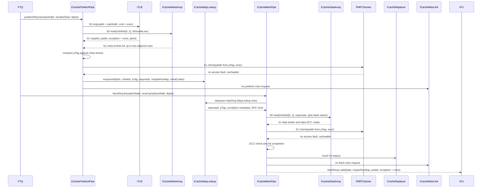

Key fast-path properties:

- iTLB and MetaArray are accessed by PrefetchPipe, not MainPipe.
- MainPipe requires a valid WayLookup entry before it can read DataArray.
- MainPipe stalls on `WayLookup.empty`, DataArray write conflicts, MissUnit waiting, or IFU response stall.
- A cache hit does not allocate an MSHR.

### 3.3 Refill Operation

Refill is handled by `ICacheMissUnit` after a fetch or prefetch miss has allocated an MSHR and issued a TileLink acquire. The refill path has two effects in the same completion window: it broadcasts `MissRespBundle` to in-flight consumers and, when legal, writes the refilled line into MetaArray/DataArray.

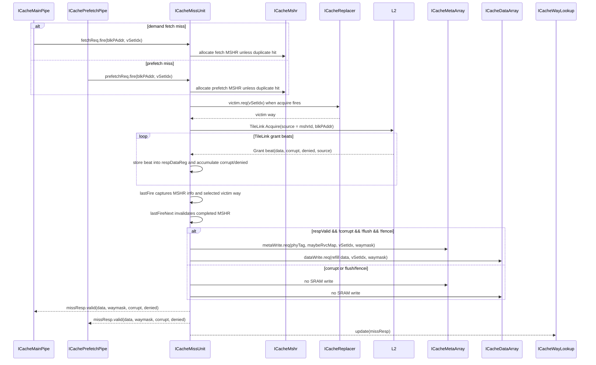

Refill-path properties:

- `ICacheMissUnit` accepts both `fetchReq` and `prefetchReq`; duplicate requests are filtered by existing MSHR lookup.
- Fetch MSHRs have higher acquire priority than prefetch MSHRs.
- TileLink grant data is accumulated in `respDataReg` until the last refill beat.
- `respValid` is generated when the corresponding MSHR is still valid at `lastFireNext`.
- `writeSramValid = respValid && !corruptReg && !io.flush && !io.fencei`.
- Even when `flush` or `fence.i` suppresses SRAM writes, MissUnit may still broadcast `missResp`; MainPipe, PrefetchPipe, and WayLookup drop irrelevant responses using their own valid/flush state.
- MetaArray/DataArray refill writes normally come from MissUnit. If `ICacheCtrlUnit` injection is active, CtrlUnit owns the write ports and MissUnit write ready is forced low.

---

## 4. MetaArray and DataArray SRAM Layout

### 4.1 MetaArray SRAM Layout

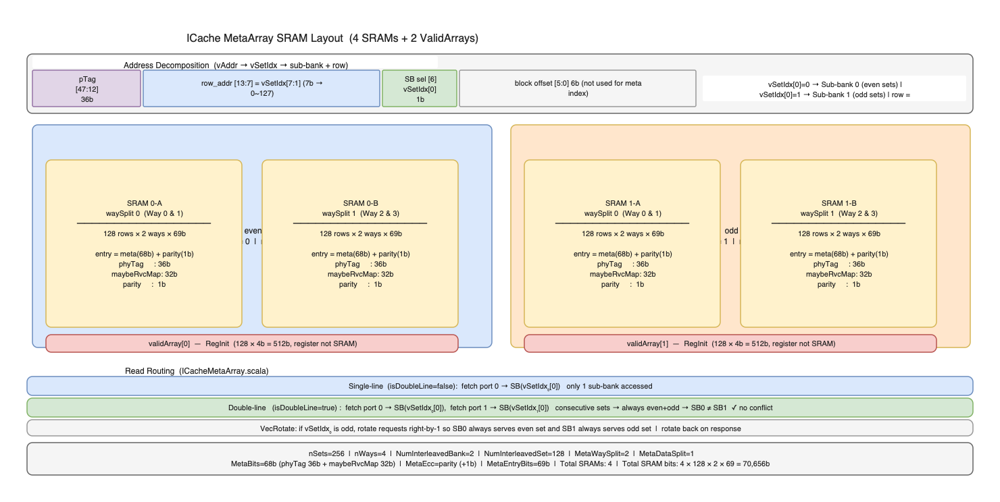

Draw.io source: [icache_meta_array_sram_layout.drawio](./icache_meta_array_sram_layout.drawio)

The MetaArray stores per-line metadata:

- physical tag
- `maybeRvcMap`
- meta ECC code
- valid bits, stored outside the SRAM in `validArray`

Current layout:

| Field | Value |
|-------|-------|
| Number of sets | `nSets = 256` |
| Number of ways | `nWays = 4` |
| Interleaved banks | `NumInterleavedBank = 2` |
| Sets per interleaved bank | `NumInterleavedSet = 128` |
| SRAM macro | `SplittedSRAMTemplate` |
| Port style | `singlePort = true` |
| Read client | `ICachePrefetchPipe` |
| Write client | `ICacheMissUnit` refill, or `ICacheCtrlUnit` during injection |
| Flush client | `ICacheMainPipe` ECC flush and global `fence.i` |

MetaArray uses two set-interleaved banks because `PortNumber = 2` allows one fetch bundle to reference two adjacent cachelines. Adjacent sets are mapped to different interleaved banks, and `ICacheMetaArray` rotates the request vector according to the low set-index bit.

### 4.2 DataArray SRAM Layout

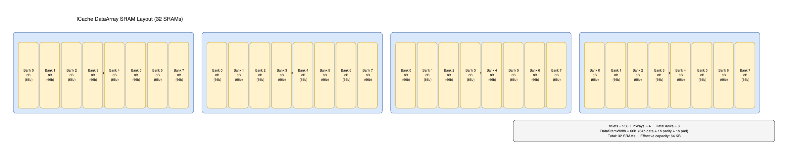

Draw.io source: [icache_sram_layout.drawio](./icache_sram_layout.drawio)

The DataArray stores instruction bytes and data ECC.

Current layout:

| Field | Value |
|-------|-------|
| Cacheline size | `blockBytes = 64` |
| Data row width | `rowBits = 64` |
| Data banks per cacheline | `DataBanks = blockBits / rowBits = 8` |
| Ways | `nWays = 4` |
| SRAM macro per bank/way | `SRAMTemplate` |
| SRAM depth | `nSets = 256` |
| SRAM width | `DataSramWidth = rowBits + DataEccBits + DataPaddingBits` |
| Port style | `singlePort = true` |
| Read client | `ICacheMainPipe` |
| Write client | `ICacheMissUnit` refill, or `ICacheCtrlUnit` during injection |

One 64B cacheline is split across eight 64-bit data banks. Each data bank contains four separately instantiated way SRAMs. MainPipe selects a subset of data banks according to `blkOffset`, `blkEndOffset`, and `isDoubleLine`.

### 4.3 Why MetaArray and DataArray Interleave Differently

MetaArray interleaving is set-oriented. It is designed to read metadata for two adjacent cachelines in the same cycle. Since metadata lookup is line-based, the most useful conflict-avoidance scheme is `vSetIdx % NumInterleavedBank`.

DataArray organization is byte-bank-oriented. It must return the exact instruction byte range for a fetch block, and a fetch may start in the middle of a cacheline or cross into the next cacheline. Therefore, DataArray banking is driven by cacheline byte layout:

- `DataBanks = 8` splits a 64B cacheline into eight 8B banks.
- `getBankSel` selects only the banks needed by the current fetch range.
- `getLineSel` chooses whether each data bank comes from the first or second cacheline when the fetch crosses a line boundary.

The result is that MetaArray optimizes adjacent-line tag lookup, while DataArray optimizes sub-line data extraction and cross-line fetch assembly.

---

## 5. DataArray Source and Current-Cycle Arbitration

`ICacheDataArray` has one read interface and one write interface at the top level. The read side is owned by demand fetch through `ICacheMainPipe`; the normal write side is owned by `ICacheMissUnit` refill. Hardware prefetch does not directly access DataArray. A prefetch only consumes DataArray write bandwidth later if it allocates an MSHR and the MissUnit writes the returned refill line.

### 5.1 DataArray Access Sources

| Source | Module | DataArray port | Access type | Priority / blocking behavior |
|--------|--------|----------------|-------------|------------------------------|
| Demand fetch read | `ICacheMainPipe` | `dataArray.io.read <> mainPipe.io.dataRead` | Direct read | Can read only when at least one selected `ICacheDataBank` reports ready. A selected bank is not ready when a write is valid in that bank. |
| Refill write | `ICacheMissUnit` | `dataArray.io.write <> missUnit.io.dataWrite` | Direct write | Normal owner of the DataArray write port. Refill write has priority over same-bank demand read inside each `ICacheDataBank`. |
| Control / ECC injection write | `ICacheCtrlUnit` | `dataArray.io.write <> ctrlUnit.io.dataWrite` when `EnableCtrlUnit && ctrlUnit.io.injecting` | Direct write | Overrides MissUnit write ownership at the `ICacheImp` mux. MissUnit `dataWrite.req.ready` is forced false while injection owns the port. |
| Hardware / software prefetch | `ICachePrefetchPipe` | No direct DataArray port | Indirect through MissUnit refill | Reads `ICacheMetaArray`, writes `ICacheWayLookup`, and sends `missUnit.io.prefetchReq`. If the prefetch miss is refilled, DataArray is written by `ICacheMissUnit`. |

### 5.2 Top-Level Write-Port Owner

`ICacheImp` performs the first level of arbitration before requests reach `ICacheDataArray`.

```text
if EnableCtrlUnit && ctrlUnit.io.injecting:
    dataArray.io.write <> ctrlUnit.io.dataWrite
    missUnit.io.dataWrite.req.ready := false
else:
    dataArray.io.write <> missUnit.io.dataWrite
    if EnableCtrlUnit:
        ctrlUnit.io.dataWrite.req.ready := false

dataArray.io.read <> mainPipe.io.dataRead
```

This mux is not a DataArray state machine. It is a top-level owner selection between CtrlUnit injection and MissUnit refill. When CtrlUnit is disabled, MissUnit is the only write source.

### 5.3 DataArray Bank-Level Arbitration

`ICacheDataArray` expands the top-level request into eight byte-oriented data banks.

```text
read.bankSel := getBankSel(blkOffset, blkEndOffset, isDoubleLine)
read.lineSel := getLineSel(blkOffset)

for each DataBank i:
    bank[i].read.valid := read.valid && read.bankSel(read.lineSel[i])[i]
    bank[i].read.setIdx := read.vSetIdx(read.lineSel[i])
    bank[i].read.waymask := read.waymask(read.lineSel[i])

for each DataBank i:
    bank[i].write.valid := write.valid
    bank[i].write.setIdx := write.vSetIdx
    bank[i].write.waymask := write.waymask
    bank[i].write.entry := write.entries[i]

read.ready := OR(bank[*].read.ready)
write.ready := AND(bank[*].write.ready)
```

The write request is broadcast to all `DataBanks` because a refill writes the full 64B cacheline. The read request is bank-selected because a fetch reads only the banks covered by the requested byte range, including the possible cross-line case.

Inside each `ICacheDataBank`, each way is a separate `SRAMTemplate` instantiated with `singlePort = true`. The local arbitration is simple write-over-read ready/valid logic:

```text
bank.read.ready := !bank.write.valid && AND(way[*].read.ready)
bank.write.ready := AND(way[*].write.ready)

for each way:
    way.read.valid := bank.read.valid && read.waymask[way]
    way.write.valid := bank.write.valid && write.waymask[way]
```

Therefore, a same-bank read loses to any valid write in that `ICacheDataBank`. The only DataBank state directly involved in this arbitration is the registered read request used to select the returning SRAM data. Optional CtrlUnit injection state exists outside DataArray.

### 5.4 Bandwidth Implications

- Demand fetch can proceed only when its selected DataBanks are not blocked by a write-valid refill or injection.
- MissUnit refill writes have effective priority over demand reads within each DataBank because the bank read ready is deasserted whenever `write.req.valid` is high.
- Prefetch has no direct DataArray read bandwidth cost. Its DataArray cost appears later as a MissUnit refill write if the prefetch miss is accepted and completed.
- CtrlUnit injection, when active, blocks normal MissUnit DataArray refill writes at the top-level mux.
- The arbitration is combinational ready/valid priority logic, not an FSM. No state transition diagram is needed for the current DataArray access arbitration.

---

## 6. All TLB and Cache Cases

The cache hit/miss status is determined in PrefetchPipe from MetaArray lookup plus MSHR refill update. MainPipe later treats a zero waymask as a fetch miss and requests MissUnit unless an exception, MMIO, or uncacheable PBMT blocks the cache refill path.

### 6.1 TLB Hit + Cache Hit

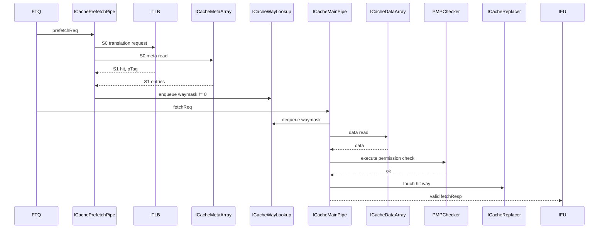

### 6.2 TLB Hit + Cache Miss

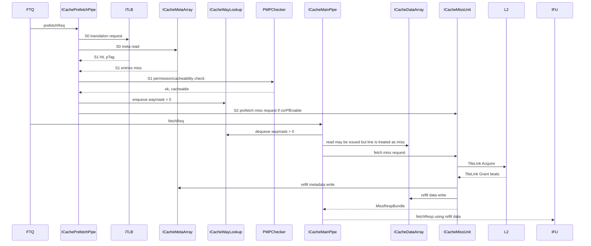

Notes:

- MissUnit filters duplicate fetch/prefetch requests by matching `blkPAddr` and `vSetIdx`.
- Fetch miss requests have higher issue priority than prefetch acquires.
- The refill response is also observed by WayLookup and PrefetchPipe for in-flight metadata update.

### 6.3 TLB Miss + Cache Hit

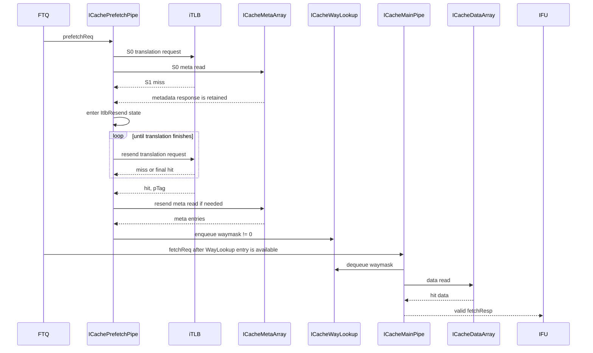

Notes:

- During the iTLB miss, PrefetchPipe keeps the FTQ-side order by holding S1 until `tlbFinish`.
- MainPipe stalls if the corresponding WayLookup entry is not available.
- No ICache miss request is required after the iTLB miss resolves if MetaArray reports a valid waymask.

### 6.4 TLB Miss + Cache Miss

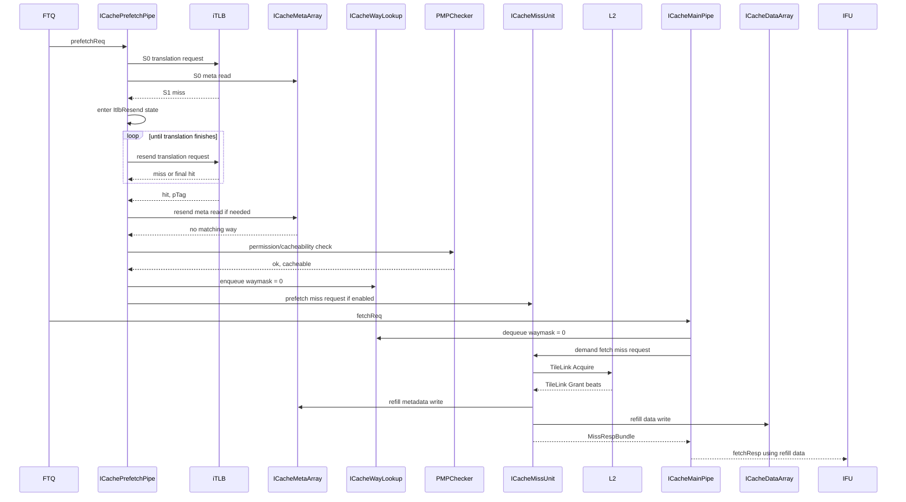

### 6.5 TLB Exception

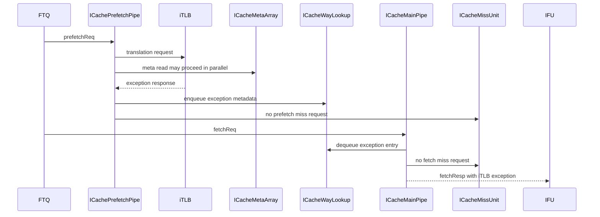

Notes:

- `ICacheWayLookup` stores only the first exception entry because exceptions trigger redirection and later entries are expected to be flushed.
- MainPipe gives iTLB/PMP exceptions priority over TileLink/ECC exceptions when building the final response exception.

### 6.6 PMP, MMIO, or Uncacheable PBMT

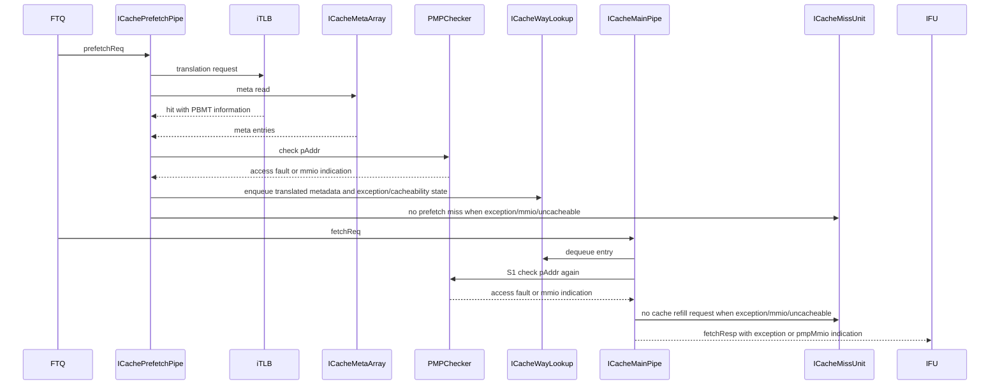

Notes:

- PrefetchPipe blocks prefetch miss issue when `s1_exceptionOut` is not none, PMP reports MMIO, or PBMT is uncacheable.
- MainPipe blocks demand refill through `s1_shouldFetch` under the same exception/MMIO/uncacheable conditions.

---

## 7. MissUnit Analysis Link

Detailed MissUnit behavior is documented separately:

- [icache_missunit_analysis.md](./icache_missunit_analysis.md)

That document covers MSHR allocation, duplicate request filtering, fetch/prefetch priority, TileLink acquire/grant handling, refill response generation, and MetaArray/DataArray refill writeback.
