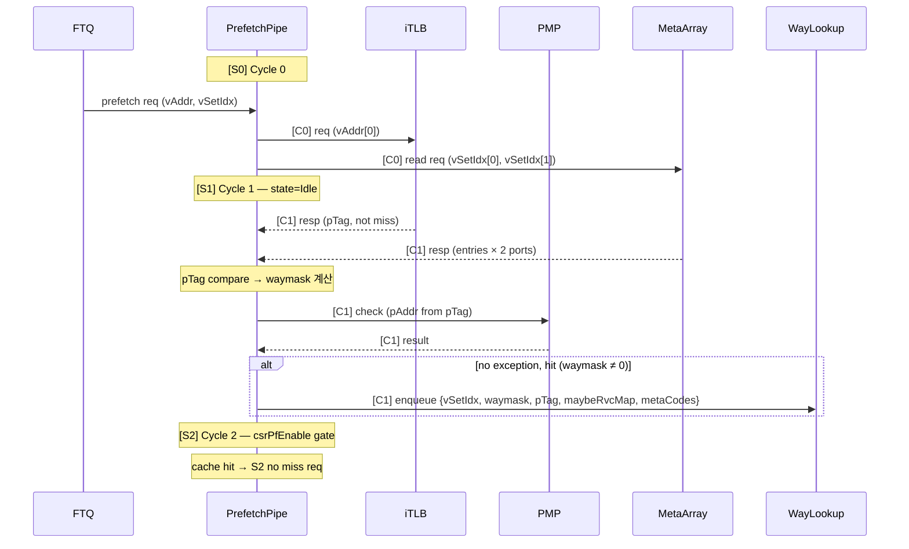
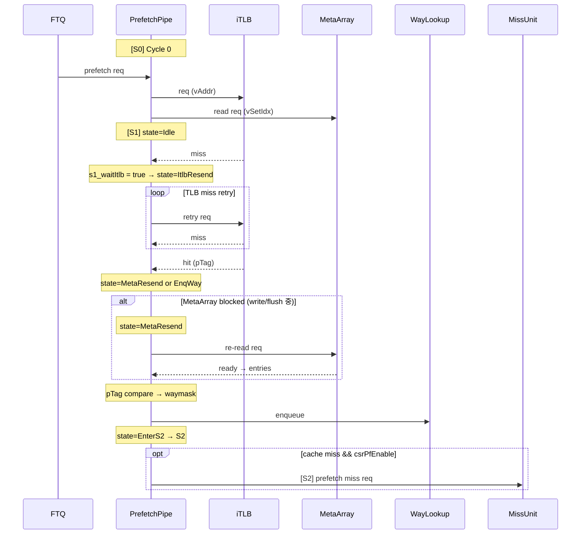
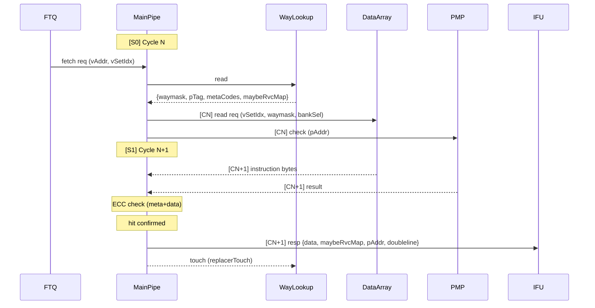
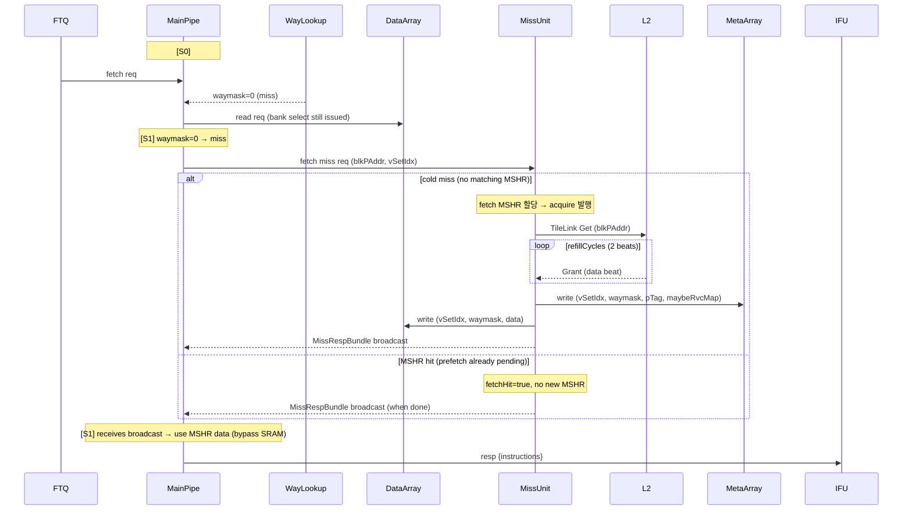
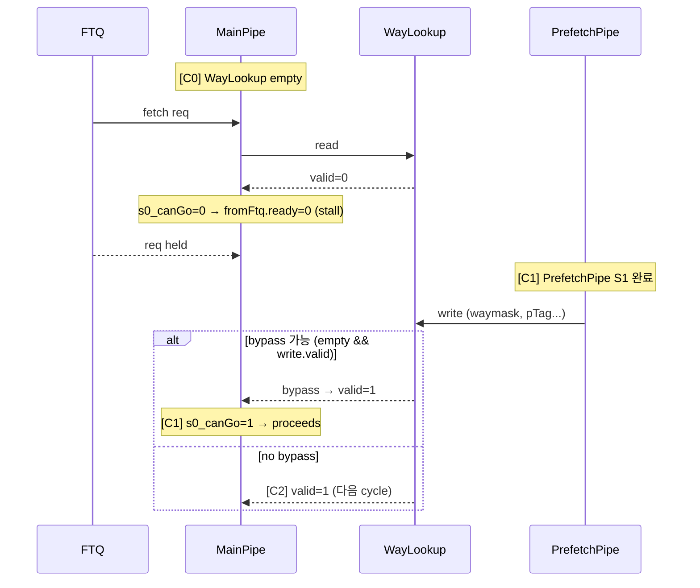

# icache_analysis.md

- Block: ICache
- Module: ICache (top-level block analysis)
- Source:
  - `src/main/scala/xiangshan/frontend/icache/ICache.scala`
  - `src/main/scala/xiangshan/frontend/icache/ICacheImp.scala`
  - `src/main/scala/xiangshan/frontend/icache/ICacheMainPipe.scala`
  - `src/main/scala/xiangshan/frontend/icache/ICachePrefetchPipe.scala`
  - `src/main/scala/xiangshan/frontend/icache/ICacheMissUnit.scala`
  - `src/main/scala/xiangshan/frontend/icache/ICacheMshr.scala`
  - `src/main/scala/xiangshan/frontend/icache/ICacheWayLookup.scala`
  - `src/main/scala/xiangshan/frontend/icache/ICacheMetaArray.scala`
  - `src/main/scala/xiangshan/frontend/icache/ICacheMetaInterleavedBank.scala`
  - `src/main/scala/xiangshan/frontend/icache/ICacheDataArray.scala`
  - `src/main/scala/xiangshan/frontend/icache/ICacheDataBank.scala`
  - `src/main/scala/xiangshan/frontend/icache/ICacheReplacer.scala`
  - `src/main/scala/xiangshan/frontend/icache/ICacheCtrlUnit.scala`
  - `src/main/scala/xiangshan/frontend/icache/Parameters.scala`
  - `src/main/scala/xiangshan/frontend/icache/Bundles.scala`
  - `src/main/scala/xiangshan/frontend/icache/Helpers.scala`
  - `src/main/scala/xiangshan/frontend/icache/Utils.scala`
- Language: Chisel/Scala
- Protocols: Decoupled, Valid, TileLink (L2 memory access), MMIO/RegMap (CtrlUnit)
- Key Params: nSets=256, nWays=4, blockBytes=64, rowBits=64, PortNumber=2, NumFetchMshr=4, NumPrefetchMshr=10, WayLookupSize=32
- Last updated: 2026-04-22

---

> → See [block diagram drawio](./icache_block_diagram.drawio)
> → See [MissUnit analysis](./icache_missunit_analysis.md)

---

## 1. Block Summary

ICache는 XiangShan 프론트엔드의 L1 Instruction Cache다.  
`ICachePrefetchPipe`가 FTQ prefetch 요청을 받아 iTLB + MetaArray를 미리 조회하여 `WayLookup`에 결과를 저장하고, `ICacheMainPipe`는 FTQ fetch 요청이 오면 `WayLookup` 결과를 소비해 DataArray만 읽어 IFU에 응답한다.  
Miss 발생 시 `ICacheMissUnit`이 TileLink를 통해 L2에 refill을 요청하고, 완료 시 MetaArray·DataArray에 쓰면서 파이프라인에 broadcast한다.

**핵심 구조 요약:**

```text
FTQ prefetchReq → ICachePrefetchPipe → (iTLB + MetaArray) → ICacheWayLookup
                                                                    ↓
FTQ fetchReq    → ICacheMainPipe    ←─────────────────────── WayLookup read
                        ↓ (DataArray read)
                   hit → IFU resp
                   miss → ICacheMissUnit → TileLink L2 → refill broadcast
```

**주요 입력:** FTQ prefetch/fetch 요청, iTLB 응답, PMP 응답, TileLink Grant  
**주요 출력:** IFU fetch 응답, TileLink Acquire, 에러 리포트

**성능/병목 포인트:**

- `WayLookup` empty → MainPipe stall (prefetch가 늦으면 fetch가 막힘)
- DataArray write (refill) → MainPipe S0 stall (single-port 충돌)
- MetaArray write/flush → PrefetchPipe stall (single-port 우선순위: flushAll > flush > write > read)

---

## 2. Key Parameters

| Parameter | Source | Default | 영향 |
|-----------|--------|---------|------|
| `nSets` | `ICacheParameters.nSets` | 256 | set 수, idxBits=8 결정 |
| `nWays` | `ICacheParameters.nWays` | 4 | 4-way SA, way 비교 로직 크기 |
| `rowBits` | `ICacheParameters.rowBits` | 64 | DataBank 1개 폭 (8B) |
| `blockBytes` | `ICacheParameters.blockBytes` | 64 | cacheline 크기, DataBanks=8 결정 |
| `PortNumber` | `ICacheParameters.PortNumber` | 2 | 연속 2 cacheline 동시 처리 포트 수 (고정) |
| `Replacer` | `ICacheParameters.Replacer` | `"setplru"` | 교체 정책 (`"random"`, `"setlru"`, `"setplru"`) |
| `NumFetchMshr` | `ICacheParameters.NumFetchMshr` | 4 | fetch miss MSHR 수 (높은 우선순위) |
| `NumPrefetchMshr` | `ICacheParameters.NumPrefetchMshr` | 10 | prefetch miss MSHR 수 (낮은 우선순위) |
| `WayLookupSize` | `ICacheParameters.WayLookupSize` | 32 | prefetch 결과 저장 큐 depth |
| `MetaEcc` | `ICacheParameters.MetaEcc` | `"parity"` | meta ECC 방식, MetaEccBits=1 결정 |
| `DataEcc` | `ICacheParameters.DataEcc` | `"parity"` | data ECC 방식, DataEccBits=1 결정 |
| `DataEccUnit` | `ICacheParameters.DataEccUnit` | `None` (→ `blockBytes=64`) | ECC 단위 크기 (None이면 blockBytes) |
| `NumInterleavedBank` | `ICacheParameters.NumInterleavedBank` | 2 | MetaArray bank 수, bank conflict 감소 |
| `MetaWaySplit` | `ICacheParameters.MetaWaySplit` | 2 | Meta SRAM을 way 방향으로 분할 (PPA 최적화) |
| `MetaDataSplit` | `ICacheParameters.MetaDataSplit` | 1 | Meta SRAM을 data 방향으로 분할 (PPA 최적화) |
| `DataPaddingBits` | `ICacheParameters.DataPaddingBits` | 1 | Data SRAM 패딩 비트 (물리 설계용) |
| `EnableCtrlUnit` | `ICacheParameters.EnableCtrlUnit` | `true` | ECC 주입 테스트 유닛 활성화 여부 |
| `EnableCorruptRefetch` | `ICacheParameters.EnableCorruptRefetch` | `false` | ECC 오류 시 자동 re-fetch 여부 (현재 비활성화, 타이밍 문제) |

**파생 파라미터:**

| 파생값 | 계산식 | 결과 |
|--------|--------|------|
| `blockBits` | `blockBytes × 8` | 512 bits |
| `DataBanks` | `blockBits / rowBits` | 8 banks |
| `idxBits` | `log2(nSets)` | 8 bits |
| `blockOffBits` | `log2(blockBytes)` | 6 bits |
| `NumInterleavedSet` | `nSets / NumInterleavedBank` | 128 sets/bank |
| `MaxInstNumPerBlock` | `blockBytes / instBytes` | 32 slots (instBytes=2) |
| `DataSramWidth` | `rowBits + DataEccBits + DataPaddingBits` | 66 bits/bank |

---

## 3. Top-Level Interfaces (ICacheIO)

`ICacheImp.scala: class ICacheIO`

| Port | Dir | Width / Type | Protocol | Description |
|------|-----|-------------|----------|-------------|
| `hartId` | in | `hartIdLen` | Wire | Hart ID |
| `fromFtq` | in | `FtqToICacheIO` | Decoupled (내부) | FTQ → fetch req + prefetch req |
| `softPrefetchReq` | in | `Vec[LduCnt, Valid[SoftIfetchPrefetchBundle]]` | Valid | 백엔드 소프트 프리패치 요청 |
| `toIfu` | out | `ICacheToIfuIO` | Valid | ICache → IFU fetch 응답 |
| `fromIfu` | in | `IfuToICacheIO` | Wire | IFU → respStall 신호 |
| `pmp[0]` | out/in | `PmpCheckBundle` | Req/Resp | MainPipe PMP 검사 |
| `pmp[1]` | out/in | `PmpCheckBundle` | Req/Resp | PrefetchPipe PMP 검사 |
| `itlb` | out/in | `TlbRequestIO` | Decoupled | PrefetchPipe iTLB 변환 요청/응답 |
| `itlbFlushPipe` | out | 1 | Wire | iTLB flush 전파 |
| `error` | out | `Valid[L1CacheErrorInfo]` | Valid | ECC/버스 오류 리포트 (BEU) |
| `csrPfEnable` | in | 1 | Wire | CSR prefetch miss 발행 enable |
| `fencei` | in | 1 | Wire | fence.i (MetaArray 전체 flush) |
| `flush` | in | 1 | Wire | 전역 flush (파이프라인 초기화) |
| `wfi` | in | `WfiReqBundle` | Flipped | WFI: MSHR acquire 발행 정지 |

---

## 4. Sub-Module Instance Map

`ICacheImp.scala: Lines 101-107`

```scala
private val metaArray  = Module(new ICacheMetaArray)
private val dataArray  = Module(new ICacheDataArray)
private val mainPipe   = Module(new ICacheMainPipe)
private val missUnit   = Module(new ICacheMissUnit(edge))
private val replacer   = Module(new ICacheReplacer)
private val prefetcher = Module(new ICachePrefetchPipe)
private val wayLookup  = Module(new ICacheWayLookup)
// optional:
private val ctrlUnit   = LazyModule(new ICacheCtrlUnit)  // EnableCtrlUnit=true 시
```

| Sub-module | 역할 | 핵심 포인트 |
|------------|------|-------------|
| `ICachePrefetchPipe` | FTQ prefetch 요청 처리 (3-stage) | iTLB + MetaArray 조회 → WayLookup 기록 |
| `ICacheWayLookup` | prefetch 결과 큐 (depth=32) | MainPipe로 결과 전달, refill 시 update |
| `ICacheMainPipe` | FTQ fetch 요청 처리 (2-stage) | WayLookup 소비 + DataArray 읽기 → IFU 응답 |
| `ICacheMetaArray` | tag·RVC hint·ECC 저장 | 2개 interleaved bank, singlePort SRAM |
| `ICacheDataArray` | instruction bytes 저장 | 8 banks × 4-way SRAM |
| `ICacheMissUnit` | MSHR 관리 + TileLink 통신 | fetch(4)+prefetch(10) MSHR, refill broadcast |
| `ICacheReplacer` | victim way 선택 (setplru) | touch/victim 인터페이스 |
| `ICacheCtrlUnit` | ECC 주입 FSM (선택적) | meta/data ECC fault 주입 테스트용 |

**Array 접근 연결 요약 (ICacheImp.scala):**

```scala
// MetaArray
metaArray.io.read    <> prefetcher.io.metaRead    // prefetch pipe만 read
metaArray.io.write   <> missUnit.io.metaWrite     // refill만 write
metaArray.io.flush   <> mainPipe.io.metaFlush     // ECC error 후 invalid
metaArray.io.flushAll := io.fencei                // fence.i: 전체 clear

// DataArray
dataArray.io.read    <> mainPipe.io.dataRead      // main pipe만 read
dataArray.io.write   <> missUnit.io.dataWrite     // refill만 write (CtrlUnit 활성화 시 우선 획득)
```

---

## 5. Top-Level Block Diagram

> → See [block diagram drawio](./icache_block_diagram.drawio)

<!-- draw.io에서 PNG 또는 SVG로 export 후 아래 경로에 저장하여 이미지 삽입:
     
-->

**draw.io 원본:** [icache_block_diagram.drawio](./icache_block_diagram.drawio)

다이어그램에 포함되어야 할 요소:

- 상위 블록: `ICache`
- 내부 서브모듈 박스: `ICachePrefetchPipe`, `ICacheWayLookup`, `ICacheMainPipe`, `ICacheMissUnit`, `ICacheMetaArray`, `ICacheDataArray`, `ICacheReplacer`, `ICacheCtrlUnit`
- 외부 인터페이스 화살표 (라벨 포함): `FTQ prefetchReq`, `FTQ fetchReq`, `IFU resp`, `iTLB req/resp`, `PMP req/resp`, `TileLink Acquire/Grant`
- 내부 데이터 흐름 화살표 (라벨 포함): `MetaRead`, `WayLookup enqueue/dequeue`, `DataRead`, `MissReq`, `MissResp broadcast`, `MetaWrite`, `DataWrite`, `replacerTouch`, `victimWay`
- 각 모듈 내부에 pipeline stage 수 표기: MainPipe(S0,S1), PrefetchPipe(S0,S1,S2)

---

## 6. Pipeline Stages by Module

> → See [block diagram drawio](./icache_block_diagram.drawio)

<!-- Pipeline stage 다이어그램 draw.io export 후 삽입:
     
-->

- **`ICacheMainPipe`** — 2 stages (S0, S1): `RegEnable(s0_fire)`, `RegNext(s0_fire)`
- **`ICachePrefetchPipe`** — 3 stages + S1 FSM (S0, S1, S2): `RegEnable(s0_fire)`, FSM state, `ValidHold(s1_realFire)`
- **`ICacheWayLookup`** — Queue (non-pipeline): `entries[32]`, `readPtr`, `writePtr`, `exceptionEntry`
- **`ICacheMissUnit`** — Non-pipeline: `readBeatCnt`, `respDataReg`, `corruptReg`, `deniedReg`
- **`ICacheMetaInterleavedBank`** — 1 SRAM latency cycle: `readReqReg` (RegEnable), `validArray` (RegInit)
- **`ICacheDataBank`** — 1 SRAM latency cycle: `readReqReg` (RegEnable)
- **`ICacheReplacer`** — Combinational: policy state regs (setplru)

**파이프라인 타임라인 (이상적 fast path):**

```text
Cycle N   : [PrefetchPipe S0] iTLB req + MetaArray read req 발행
Cycle N+1 : [PrefetchPipe S1] iTLB/Meta 응답 → pTag compare → WayLookup enqueue
Cycle N+2 : [MainPipe S0]    WayLookup dequeue → DataArray read req 발행
Cycle N+3 : [MainPipe S1]    DataArray resp → ECC check → IFU 응답
```

---

## 7. Memory Organization

### 5.1 MetaArray

**Memory Spec:**

| Memory | Depth | Width (bits) | Banks | Read Ports | Write Ports |
|--------|-------|-------------|-------|------------|-------------|
| `tagArray` (SplittedSRAMTemplate) | 128 (NumInterleavedSet) | MetaEntryBits × nWays | 2 (NumInterleavedBank) | 1 (singlePort) | 1 (singlePort) |
| `validArray` (RegInit Vec) | 128 × 2 = 256 sets | nWays=4 bits | — | comb | comb |

근거: `ICacheMetaInterleavedBank.scala: SplittedSRAMTemplate(set=NumInterleavedSet, way=nWays, waySplit=MetaWaySplit=2, dataSplit=MetaDataSplit=1, singlePort=true, withClockGate=true)`

`validArray`는 SRAM 외부에 별도 레지스터로 관리됨:  
```scala
private val validArray = RegInit(VecInit.fill(NumInterleavedSet)(0.U(nWays.W)))
```

**Memory Contents:**

| Memory | Field | Size (bits) | Description |
|--------|-------|-------------|-------------|
| `tagArray` | `phyTag` | tagBits (PAddrBits-14) | hit 판정용 physical tag |
| `tagArray` | `maybeRvcMap` | 32 (MaxInstNumPerBlock) | instruction slot별 RVC 가능 여부 hint |
| `tagArray` | `code` | 1 (MetaEccBits, parity) | meta ECC 코드 |
| `validArray` | valid per way | 4 bits / set | way 유효 비트 (SRAM 외부 레지스터) |

**Bank conflict 처리:**  
Interleaving으로 연속된 2 set이 서로 다른 bank에 배치됨.  
Port 우선순위 (combinational, `ICacheMetaInterleavedBank.scala`):
1. `flushAll` (fence.i) — validArray 전체 clear
2. `flush.req.valid` (ECC error) — 해당 set/way의 validArray 비트 clear
3. `write.req.valid` (refill) — tagArray write + validArray set
4. `read.req.valid` (prefetcher) — tagArray read (ready = !write && !flush && !flushAll)

---

### 5.2 DataArray

**Memory Spec:**

| Memory | Depth | Width (bits) | Banks | Read Ports | Write Ports |
|--------|-------|-------------|-------|------------|-------------|
| `ways[0..3]` (SRAMTemplate × 4 per bank) | 256 (nSets) | 66 (DataSramWidth) | 8 (DataBanks) | 1 (singlePort) | 1 (singlePort) |

근거: `ICacheDataBank.scala: SRAMTemplate(set=nSets, way=1, singlePort=true, shouldReset=true, withClockGate=false)` × nWays per bank

**Memory Contents:**

| Memory | Field | Size (bits) | Description |
|--------|-------|-------------|-------------|
| `ways[i]` | `data` | 64 (ICacheDataBits=rowBits) | 8B instruction data (1 bank = 1/8 cacheline) |
| `ways[i]` | `code` | 1 (DataEccBits, parity) | data ECC 코드 (64bit당 1 parity) |
| `ways[i]` | `padding` | 1 (DataPaddingBits) | 물리 설계 패딩 |

**Port 우선순위 (combinational, `ICacheDataBank.scala`):**
```scala
io.read.req.ready := !io.write.req.valid && ways.map(_.io.r.req.ready).reduce(_ && _)
```

1. `write` (refill) — 우선
2. `read` (main pipe)

**Bank 배치:**

```text
Bank 0 → byte  0.. 7 (cacheline 내 offset 0..7)
Bank 1 → byte  8..15
...
Bank 7 → byte 56..63
```
같은 cacheline의 8B씩 분할 저장. bank는 "서로 다른 cacheline"이 아니라 "같은 cacheline의 다른 byte 구간"이다.

---

## 6. Internal Pipeline / State

### 6.1 ICacheMainPipe (2-stage)

`ICacheMainPipe.scala`

| Stage | 레지스터 경계 | 주요 동작 |
|-------|-------------|----------|
| S0 | 입력 래치 (RegEnable on s0_fire) | WayLookup dequeue, DataArray read 발행, PMP req |
| S1 | RegNext(s0_fire) | DataArray resp 수신, MSHR bypass, ECC check, miss 판정, IFU 응답 |

**S0 진행 조건 (`ICacheMainPipe.scala`):**
```scala
private val s0_canGo = toData.ready && fromWayLookup.valid && s1_ready
fromFtq.ready := s0_canGo
s0_fire := s0_valid && s0_canGo && !s0_flush
```

**S1 stall 조건:**
```scala
// s1은 fetch가 완료될 때까지 hold
private val s1_fetchFinish = ...  // miss resp 수신 시 true
```

**Flush:**
```scala
s0_flush = io.flush || io.flushFromBpu.shouldFlushByStage3(s0_ftqIdx, s0_valid)
s1_flush = io.flush || io.flushFromBpu.shouldFlushByStage3(s1_ftqIdx, s1_valid)
```

---

### 6.2 ICachePrefetchPipe (3-stage + FSM)

`ICachePrefetchPipe.scala`

| Stage | 주요 동작 |
|-------|----------|
| S0 | iTLB req, MetaArray read req 발행 |
| S1 (FSM) | iTLB 응답·MetaArray 응답 수집, pTag compare, waymask 계산, WayLookup enqueue |
| S2 | miss이면 MissUnit prefetch req 발행 (csrPfEnable gate) |

**S1 FSM (5개 상태, `ICachePrefetchPipe.scala`):**

| State | 전환 조건 | 동작 |
|-------|----------|------|
| `Idle` | tlbFinish && !needMeta | → `EnterS2` 또는 `EnqWay` |
| `ItlbResend` | iTLB miss | iTLB 재시도 루프 |
| `MetaResend` | toMeta.ready=false | MetaArray 재시도 루프 |
| `EnqWay` | WayLookup.ready 대기 | WayLookup enqueue |
| `EnterS2` | s2_ready 대기 | S2 진입 |

---

### 6.3 ICacheWayLookup (큐 + MSHR update)

`ICacheWayLookup.scala`

```scala
private val entries  = RegInit(VecInit.fill(WayLookupSize)(0.U.asTypeOf(...)))
private val readPtr  = RegInit(ICacheWayLookupPtr(false.B, 0.U))
private val writePtr = RegInit(ICacheWayLookupPtr(false.B, 0.U))
private val exceptionEntry = RegInit(0.U.asTypeOf(Valid(new WayLookupExceptionEntry)))
```

- Bypass: `canBypass = empty && io.write.valid && !exceptionEntry.valid` → 큐 생략하고 직통 전달
- updateStall: refill broadcast 수신 시 readPtr 엔트리 갱신 중이면 read 1 cycle stall

---

### 6.4 ICacheMissUnit

→ See [icache_missunit_analysis.md](./icache_missunit_analysis.md)

주요 구조 요약:
- `fetchMSHRs[0..3]`: fetch용 (DeMultiplexer 경유, 높은 우선순위)
- `prefetchMSHRs[0..9]`: prefetch용 (DeMultiplexer + priorityFIFO 경유)
- `acquireArb`: Arbiter(NumFetchMshr+1) — fetch MSHR + prefetch MuxBundle
- refill: Grant D-channel → beat 수집 → 마지막 beat에서 SRAM write + broadcast

---

### 6.5 ICacheReplacer

`ICacheReplacer.scala`

```scala
private val replacers = Seq.fill(PortNumber)(ReplacementPolicy.fromString(Replacer, nWays, nSets / PortNumber))
```

- 2개 replacer 인스턴스 (PortNumber=2), 각각 nSets/2 개 set 담당
- `vSetIdx[0]`로 홀짝 분기해서 어느 replacer에 접근할지 결정
- Touch: mainPipe S1 hit 시 `replacerTouch.req` valid 발생
- Victim: MissUnit이 MSHR acquire 직전 `victim.req`를 보내 way 결정

---

## 7. Interfaces (Sub-module 핵심 포트)

### 7.1 ICacheMainPipe IO

`ICacheMainPipe.scala: class ICacheMainPipeIO`

| Port | Dir | Type / Protocol | Description |
|------|-----|----------------|-------------|
| `req` | in | Decoupled[FtqFetchRequest] | FTQ fetch 요청 |
| `resp` | out | Valid[ICacheRespBundle] | IFU fetch 응답 |
| `respStall` | in | 1 / Wire | IFU stall 요청 |
| `flush` | in | 1 / Wire | 전역 flush |
| `flushFromBpu` | in | BpuFlushInfo / Wire | BPU stage3 flush |
| `dataRead` | out/in | DataReadBundle / Decoupled | DataArray read req/resp |
| `metaFlush` | out | MetaFlushBundle / Vec[Valid] | ECC 오류 후 way invalid |
| `replacerTouch` | out | ReplacerTouchBundle / Vec[Valid] | hit 시 replacer 갱신 |
| `wayLookupRead` | in | Flipped(Decoupled[WayLookupBundle]) | WayLookup 결과 소비 |
| `missReq` | out | Decoupled[MissReqBundle] | miss 요청 → MissUnit |
| `missResp` | in | Valid[MissRespBundle] | refill broadcast 수신 |
| `pmp` | out/in | PmpCheckBundle | PMP 검사 req/resp |
| `errors` | out | Vec[PortNumber, Valid[L1CacheErrorInfo]] | ECC 오류 리포트 |
| `eccEnable` | in | 1 / Wire | ECC 검사 enable (CtrlUnit 제어) |

---

### 7.2 ICachePrefetchPipe IO

`ICachePrefetchPipe.scala`

| Port | Dir | Type / Protocol | Description |
|------|-----|----------------|-------------|
| `req` | in | Decoupled[PrefetchRequest] | FTQ/소프트 prefetch 요청 |
| `metaRead` | out/in | MetaReadBundle / Decoupled | MetaArray read |
| `wayLookupWrite` | out | Decoupled[WayLookupWriteBundle] | WayLookup enqueue |
| `missReq` | out | Decoupled[MissReqBundle] | prefetch miss → MissUnit |
| `missResp` | in | Valid[MissRespBundle] | refill broadcast |
| `itlb` | out/in | TlbRequestIO | iTLB 변환 req/resp |
| `pmp` | out/in | PmpCheckBundle | PMP 검사 |
| `flush` | in | 1 / Wire | 전역 flush |
| `csrPfEnable` | in | 1 / Wire | miss 발행 enable gate |

---

## 8. Functionality

### 8.1 Fast Path (hit)

```text
Cycle N   : PrefetchPipe S0 — iTLB req + MetaArray read req
Cycle N+1 : PrefetchPipe S1 — pTag compare → waymask → WayLookup enqueue
Cycle N+2 : MainPipe S0    — WayLookup dequeue → DataArray read req (waymask로 way 선택)
Cycle N+3 : MainPipe S1    — DataArray resp → ECC check → IFU 응답
```

### 8.2 Miss Path

1. MainPipe S1: `waymask == 0` → MissUnit.fetchReq
2. MissUnit: 빈 fetchMSHR 할당 → TileLink Acquire 발행
3. L2 Grant 수신 (refillCycles beats 수집)
4. 마지막 beat: MetaArray·DataArray write + MissRespBundle broadcast
5. MainPipe S1: broadcast 수신 → SRAM 대신 MSHR data 사용 → IFU 응답

### 8.3 주소 분해

```text
PA = [ pTag(PAddrBits-14 bits) | vSetIdx(8 bits) | blockOffset(6 bits) ]
```

- `vSetIdx = vAddr[13:6]` (virtual address 기반, VIPT)
- `pTag = iTLB 변환 결과에서 상위 비트`
- `blockOffset` → bank index(3 bits) + bank offset(3 bits)

### 8.4 Hit 판정

```scala
// ICachePrefetchPipe.scala (S1)
val waymask = getWaymask(s1_pTag, portEntries)  // 4-way tag compare → one-hot waymask

// ICacheMainPipe.scala (S0)
private val s0_hits = VecInit(fromWayLookup.bits.waymask.map(_.orR))
```

waymask가 0이면 miss, 0이 아니면 hit (valid bit 포함한 결과).

---

## 9. Flow / Backpressure Control

### 9.1 MainPipe 진행 조건

```scala
// ICacheMainPipe.scala
private val s0_canGo = toData.ready && fromWayLookup.valid && s1_ready
fromFtq.ready := s0_canGo
```

| 조건 | 미충족 시 동작 |
|------|--------------|
| `fromWayLookup.valid` | WayLookup empty → MainPipe stall, FTQ backpressure |
| `toData.ready` | DataArray busy (refill write) → stall |
| `s1_ready` | S1이 miss 대기 중 → stall |

### 9.2 PrefetchPipe 진행 조건

```scala
// ICachePrefetchPipe.scala
private val s0_canGo = s1_ready && toItlb.ready && toMeta.ready
io.req.ready := s0_canGo
```

| 조건 | 미충족 시 동작 |
|------|--------------|
| `toMeta.ready` | MetaArray busy (write/flush) → stall, FTQ prefetch backpressure |
| `toItlb.ready` | iTLB queue full → stall |
| WayLookup `full` | WayLookup 꽉 참 → S1 EnqWay 상태에서 stall |

### 9.3 WayLookup Bypass

```scala
// ICacheWayLookup.scala
private val canBypass = empty && io.write.valid && !exceptionEntry.valid
```

WayLookup이 비어 있어도 prefetch 결과가 같은 cycle에 생성되면 큐를 거치지 않고 MainPipe에 직통 전달.

### 9.4 WayLookup Update Stall

```scala
// ICacheWayLookup.scala
private val updateStall = entryUpdate(readPtr.value)
io.read.valid := (canRead && !updateStall) || canBypass
```

refill broadcast 수신 시 readPtr 엔트리를 갱신하는 cycle에는 MainPipe S0가 1 cycle stall.

### 9.5 Miss 상태에서의 S1 stall

MainPipe S1은 miss resp broadcast 수신까지 hold 상태 유지. `s1_fetchFinish = missResp.valid && matching`.

### 9.6 Flush 경로

| flush 종류 | 발생처 | 적용 범위 |
|-----------|--------|----------|
| `io.flush` | 백엔드 (redirect 등) | MainPipe S0/S1, PrefetchPipe 전체, WayLookup, MSHR flush bit |
| `io.fencei` | 백엔드 | MetaArray validArray 전체 clear, MSHR fencei bit |
| `flushFromBpu.shouldFlushByStage3` | BPU S3 | 개별 FTQ 엔트리 단위 flush (MainPipe, PrefetchPipe, WayLookup tail) |

---

## 10. Error / Exception Handling

### 10.1 Meta ECC 오류

근거: `ICacheMainPipe.scala: checkMetaEcc()`

- hit한 way의 ECC code를 `parity` 알고리즘으로 검사
- multi-hit(같은 set에서 두 way 이상 tag 일치)도 오류로 처리
- `EnableCorruptRefetch=false` (기본): ECC 예외를 IFU에 전달
- `EnableCorruptRefetch=true`: `metaFlush`로 해당 way invalid → MissUnit에 re-fetch 요청

### 10.2 Data ECC 오류

근거: `ICacheMainPipe.scala: checkDataEcc()`

- fetch에 실제 사용된 bank만 검사 (bankSel 기준)
- `parity` 1-bit 검사 (64-bit 데이터 단위)
- `EnableCorruptRefetch=false` (기본): ECC 예외 전달
- `EnableCorruptRefetch=true`: 자동 re-fetch (현재 비활성화, 타이밍 문제)

### 10.3 TileLink 오류 (corrupt/denied)

근거: `ICacheMissUnit.scala`

```scala
private val corruptReg = RegInit(false.B)
private val deniedReg  = RegInit(false.B)
// Grant beat별 누적
when(io.memGrant.fire && edge.hasData(io.memGrant.bits)) {
  corruptReg := corruptReg || io.memGrant.bits.corrupt
  deniedReg  := deniedReg  || io.memGrant.bits.denied
}
// corrupt/denied이면 SRAM write 생략
private val writeSramValid = respValid && !corruptReg && !io.flush && !io.fencei
```

SRAM 쓰기는 생략하되 broadcast는 그대로 발행 (corrupt/denied flag 포함).

### 10.4 iTLB / PMP 예외

- prefetch pipe S1에서 감지 → `WayLookupExceptionEntry`에 기록 (큐당 1개, 첫 예외만)
- MainPipe S0에서 WayLookup dequeue 시 예외 정보 수신
- 예외 발생 시 miss 요청 발행 안 함, IFU에 예외 응답만 전달

### 10.5 Error 리포트

```scala
// ICacheMainPipe.scala
val errors: Vec[Valid[L1CacheErrorInfo]] = Output(Vec(PortNumber, ValidIO(new L1CacheErrorInfo)))
```

BEU(Bus Error Unit)로 포트별 오류 정보 리포트. ICacheImp에서 OR 취합하여 `io.error`로 출력.

---

## 11. Timing Hints

| 위치 | Critical Path 후보 | 이유 |
|------|-------------------|------|
| MainPipe S0 | `fromWayLookup.valid && toData.ready` → `s0_canGo` | 여러 모듈 상태 AND gate |
| MainPipe S1 | ECC check + data mux (SRAM vs MSHR bypass) | `checkDataEcc()` + `DataHoldBypass` chain |
| MetaArray read→S1 | 128-set SRAM read → 4-way tag compare → waymask | interleaved bank 후 회전 + compare |
| DataArray read→S1 | 256-set 8-bank SRAM → Mux1H(waymask) | wide mux (nWays=4 way 중 선택) |
| WayLookup update | `entryUpdate(readPtr)` → `updateStall` → `io.read.valid` | 32-entry 순차 scan |
| PrefetchPipe S1 | `getWaymask(pTag, entries)` | 4-way comparator × PortNumber |

**타이밍 민감 설정:**
- `EnableCorruptRefetch=false`: ECC check → resp.valid 경로에서 parity check가 critical path에 포함될 수 있어 비활성화 (코드 주석 참고: `ICacheParameters.scala: "disabled due to timing issue"`)
- `singlePort=true` (DataBank, MetaBank): write/read 간 직렬화로 타이밍 단순화 (대신 stall 발생)

---

## 12. Sequence Diagrams

### 12.1 Prefetch Pipe 정상 흐름 (TLB hit, cache hit)



---

### 12.2 Prefetch Pipe — TLB miss 흐름



---

### 12.3 Main Pipe — Cache Hit 흐름



---

### 12.4 Main Pipe — Cache Miss 흐름



---

### 12.5 WayLookup empty → MainPipe stall



---

## 13. Pseudocode

### 13.1 ICacheMainPipe

```text
=== S0 ===
if fetchReq.valid && WayLookup.valid && DataArray.ready && s1_ready && !flush:
  latch(ftqReq, vSetIdx, waymask, pTag, itlbException, metaCodes, maybeRvcMap)
  DataArray.read(vSetIdx, waymask, bankSel(blkOffset, blkEndOffset, doubleline))
  PMP.req(pAddr from pTag)
  WayLookup.dequeue()
  s0_fire
else:
  stall (fromFtq.ready = false)

if flush or bpuFlush(ftqIdx):
  invalidate S0 registers

=== S1 ===
// MSHR bypass: refill broadcast 수신 시 SRAM 대신 사용
if MissResp.valid && matches(vSetIdx, pTag):
  data[bank] = MissResp.data[bank]  // bypass SRAM
  update WayLookup entry (waymask, metaCodes, maybeRvcMap)
else:
  data[bank] = DataArray.resp[bank]

// hit 판정 (S0에서 WayLookup waymask 기준)
hits = waymask.orR per port

// ECC check
metaCorrupt = checkMetaEcc(waymask, metaCodes)   // parity check + multi-hit detect
dataCorrupt = checkDataEcc(data, codes, bankSel) // active bank만 검사

// miss / exception 판정
if itlbException or pmpException:
  IFU.resp(exception)
elif metaCorrupt or dataCorrupt:
  if EnableCorruptRefetch:
    metaFlush(vSetIdx, waymask)
    MissUnit.fetchReq  // re-fetch
  else:
    IFU.resp(eccException)
elif !hits[i] && !exception && !mmio:
  MissUnit.fetchReq(blkPAddr, vSetIdx)  // Arbiter로 port 0 or 1
  wait for MissResp (S1 hold)
  IFU.resp(data from MSHR)
else:  // hit
  ReplacerTouch(vSetIdx, hitWay)
  IFU.resp(data, maybeRvcMap, pAddr, doubleline)

if flush or bpuFlush:
  invalidate S1 registers
```

---

### 13.2 ICachePrefetchPipe

```text
=== S0 ===
if prefetchReq.valid && iTLB.ready && MetaArray.ready && s1_ready && !flush:
  send iTLB.req(vAddr[0])
  send MetaArray.read(vSetIdx[0], vSetIdx[1], isDoubleLine)
  s0_fire

=== S1 FSM ===
state = Idle:
  on s0_fire:
    wait iTLB resp
    if iTLB.hit:
      pTag = iTLB.resp.pTag
      tlbValid = true
    else:
      s1_waitItlb = true
      → ItlbResend
    if MetaArray.ready:
      sramValid = true
    else:
      → MetaResend

  if tlbValid && sramValid:
    pTagCompare → waymask per port
    updateMetaInfo with MissResp if any
    PMP.req(pAddr from pTag)
    if WayLookup.ready && !isSoftPrefetch:
      WayLookup.enqueue(vSetIdx, waymask, pTag, maybeRvcMap, metaCodes, itlbException?)
      → EnterS2

state = ItlbResend:
  retry iTLB.req until hit
  → EnqWay or MetaResend

state = MetaResend:
  retry MetaArray.read until ready
  → EnqWay

state = EnqWay:
  wait WayLookup.ready
  WayLookup.enqueue(...)
  → EnterS2

state = EnterS2:
  s1_realFire = s1_fire && csrPfEnable
  → Idle

=== S2 ===
if miss && !exception && !mmio:
  MissUnit.prefetchReq(blkPAddr, vSetIdx)
  if both ports miss: arbiter selects one per cycle
```

---

## 14. Notes / Assumptions

1. **`PortNumber=2` 의미**: 독립된 2개 fetch가 아니라 cross-cacheline fetch 시 연속 2개 cacheline을 동시 처리하는 구조다. Port 0 = 현재 cacheline, Port 1 = 다음 cacheline (doubleline=true 시에만 valid).

2. **MainPipe는 fast path에서 MetaArray를 읽지 않는다**: WayLookup이 prefetch 결과를 저장하므로, MainPipe S0에서 직접 MetaArray/iTLB를 조회하지 않는다. WayLookup이 없으면 stall.

3. **DataArray와 MetaArray는 완전히 분리된 접근자를 가진다**: MetaArray read는 PrefetchPipe 전용, DataArray read는 MainPipe 전용. 두 파이프 간 read 충돌은 없다.

4. **WayLookup은 refill 후 업데이트된다**: prefetch 시점에 miss였더라도 이후 refill이 완료되면 `updateMetaInfo()`로 해당 큐 엔트리의 waymask가 갱신된다. 이로 인해 MainPipe는 추가 SRAM 조회 없이 hit 처리 가능.

5. **`csrPfEnable=0`이어도 WayLookup 생성은 계속된다**: CSR 제어는 PrefetchPipe S2의 miss 발행 경로만 막는다. WayLookup enqueue(S1)는 항상 동작해 MainPipe fast path를 유지한다.

6. **`validArray`는 SRAM 외부 레지스터로 관리된다**: flush(valid 비트 클리어)가 tagArray SRAM 포트를 사용하지 않아 flush와 read의 충돌 없음. 단, read ready 신호에서 flush 중에는 read를 막아 stale valid 정보 노출 방지.

7. **ECC 주입 테스트**: `ICacheCtrlUnit`이 활성화되면 FSM을 통해 지정 주소의 meta/data SRAM에 의도적으로 ECC fault를 주입할 수 있다. 주입 중에는 MissUnit의 DataArray write를 CtrlUnit이 선점.

8. **AliasTagBits**: `untagBits(=idxBits+blockOffBits=14) > pgIdxBits(=12)` 이므로 기본 설정에서 AliasTagBits = 14-12 = 2 bits. TileLink Acquire에 alias tag 포함 (L2 cache alias 해소용).
