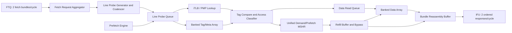

# New 2-Fetch/Cycle ICache Design Proposal

- Target: new ICache designed natively for 2 fetch bundles/cycle
- Scope: clean-sheet frontend L1 instruction cache proposal
- Assumption: do not inherit the current XS ICache microarchitecture
- Date: 2026-04-28

---

## 1. Design Goal

The new ICache should treat **2 fetch bundles/cycle** as the native input contract, not as an extension of a 1-fetch design.

The key observation is that 2 fetch bundles are not the real internal access unit. A fetch bundle can span one or two cachelines. Therefore, 2 fetch bundles/cycle can expand to:

```text
2 fetch bundles/cycle * up to 2 cachelines/bundle = up to 4 cacheline probes/cycle
```

The proposed design is therefore **line-probe based**:

1. Accept up to 2 fetch bundles/cycle.
2. Decompose them into up to 4 cacheline probes.
3. Merge duplicate cacheline probes before accessing SRAM or allocating MSHRs.
4. Schedule unique line probes into banked tag arrays and schedule hit data reads into a separate 2-bank DataArray.
5. Reassemble line data back into ordered fetch bundle responses.

This avoids designing the cache around "two MainPipes". Instead, the cache is built around a small line-probe scheduler with enough banking to sustain the common case.

---

## 2. Top-Level Architecture



### Main Blocks

| Block | Purpose |
|-------|---------|
| Fetch Request Aggregator | Accepts two FTQ fetch bundles and assigns ordered request IDs. |
| Line Probe Generator | Converts each bundle into one or two cacheline probes. |
| Coalescer | Merges probes targeting the same physical cacheline or same virtual line before translation completes when safe. |
| Line Probe Queue | Holds demand and replay probes; arbitrates bank conflicts. |
| iTLB / PMP Lookup | Translates and checks execute permission/cacheability for line probes. |
| Banked Tag/Meta Array | Performs tag, valid, ECC, and metadata lookup for up to four independent line probes in the common case. |
| Access Classifier | Determines hit, miss, exception, MMIO, uncacheable, or replay. |
| Banked Data Array | 2-way line-interleaved data store; reads selected hit ways and returns line data beats. |
| Bundle Reassembly Buffer | Reconstructs the original two fetch bundle responses and preserves program order. |
| Unified MSHR | Merges demand and prefetch misses by physical line address. |
| Refill Buffer | Receives L2 data, bypasses waiting demand requests, and commits lines into DataArray/TagArray. |
| Prefetch Engine | Generates lower-priority line probes and allocates prefetch MSHRs under credit control. |

---

## 3. External Interface Contract

### 3.1 Fetch Request Input

The ICache input should be vectorized at the fetch-bundle level.

```text
fetchReq.valid[2]
fetchReq.bits[2]:
    startVAddr
    fetchBytes
    ftqIdx
    prediction metadata
    taken/stop offset
    exception metadata from frontend
fetchReq.ready[2]
```

Recommended policy:

- Slot 0 has older program order than slot 1.
- Slot 1 may be accepted only if slot 0 is accepted, unless the FTQ explicitly supports holes.
- Each accepted bundle gets a monotonically increasing internal `fetchReqId`.
- Responses retire in order, even if slot 1 hits earlier than slot 0.

### 3.2 Fetch Response Output

```text
fetchResp.valid[2]
fetchResp.bits[2]:
    data
    validBytes
    pAddr
    ftqIdx
    exception
    pmpMmio / uncacheable indication
    replay indication
fetchResp.ready
```

Recommended policy:

- The ICache may internally complete slot 1 before slot 0.
- The output interface should still preserve FTQ order by using the Bundle Reassembly Buffer.
- If slot 0 is blocked by miss/exception/replay, slot 1 is held even if it is ready, unless the downstream IFU explicitly supports out-of-order fetch responses.

---

## 4. Core Design Principle: Unique Line Probe First

### 4.1 Why Line Probe Is the Internal Unit

Two fetch bundles can overlap in several ways:

```text
Case A: both bundles are inside the same 64B cacheline
Case B: bundle 0 crosses into the line used by bundle 1
Case C: two bundles touch adjacent but different cachelines
Case D: two bundles are unrelated after a redirect or taken branch
```

If the cache blindly issues one access per bundle, it wastes SRAM bandwidth and MSHR entries. The internal request should therefore be:

```text
LineProbe:
    virtualLineAddr
    physicalLineAddr after translation
    vSetIdx
    byte consumers:
        list of (fetchReqId, bundleSlot, byteRange)
    isDemand
    isPrefetch
    age
```

### 4.2 Duplicate Merge Rule

The only architecturally correct miss merge key is the physical cacheline address:

```text
merge_key = physicalLineAddr
```

Before translation completes, a speculative virtual merge is allowed only if:

```text
same virtual line address
and same address space / ASID / VM context
and no synonym ambiguity for the selected cache organization
```

After iTLB translation, all demand and prefetch requests must be rechecked against `physicalLineAddr`.

Important rule:

```text
Do not merge based on "bundle0 not taken and bundle1 is sequential" alone.
Do not merge based on "combined fetch size <= 64B" alone.
Merge only when the cacheline address is identical.
```

---

## 5. Pipeline Proposal

### 5.1 Stage Overview

| Stage | Name | Main Work |
|-------|------|-----------|
| F0 | Accept and Normalize | Accept up to 2 bundles, assign request IDs, calculate line ranges. |
| F1 | Probe Generation | Generate up to 4 line probes, merge duplicate virtual lines when safe. |
| F2 | Translation and Tag Read | Perform iTLB lookup and banked TagArray read in parallel using the virtual index. |
| F3 | Hit/Miss Classify | Compare physical tags, apply valid/ECC/PMP/cacheability, select hit way. |
| F4 | Data Read | Read selected DataArray banks for hit lines. |
| F5 | Reassemble and Respond | Assemble bundle bytes, bypass refill data if needed, retire ordered responses. |

### 5.2 Hit Latency

Recommended default hit latency is 4 to 5 frontend stages from request accept to response. This is intentional:

- It avoids reading all data ways speculatively before tag compare.
- It keeps the DataArray read behind a known waymask.
- It improves power and timing at 2-fetch width.

Optional low-latency mode:

- Add a way predictor.
- Read predicted-way data in parallel with tag lookup.
- On wrong-way prediction, replay only the affected line probe.

This should be treated as an optional performance feature, not the base design.

---

## 6. Tag/Meta Array Design

### 6.1 Organization

Recommended default:

```text
Cache size      = 64 KiB
Line size       = 64 B
Ways            = 4
Sets            = 256
Tag/Meta banks  = 4
Sets per bank   = 64
Bank select     = vSetIdx[1:0]
Bank row        = vSetIdx[7:2]
```

Each line bank contains tag/meta SRAMs for all ways.

```text
TagBank[4][Way 0..3][64 rows]
```

Each TagBank supports:

- One lookup read per cycle.
- One refill/invalidate write per cycle when the bank is not used by a higher-priority read.
- Refill-buffer bypass for recently filled lines.

### 6.2 Why 4 Tag/Meta Banks

Two fetch bundles can become four line probes. With 4 Tag/Meta banks, four consecutive cachelines map to four different banks:

```text
line N     -> bank 0
line N + 1 -> bank 1
line N + 2 -> bank 2
line N + 3 -> bank 3
```

This directly targets the dominant frontend pattern: sequential fetch and near-sequential taken-path fetch.

For arbitrary branch targets, bank conflicts can still occur. The design handles this with replay in the Line Probe Queue rather than expensive true 4-read-port SRAM.

### 6.3 Alternative Not Chosen: Full Replication

To guarantee zero conflict for any two arbitrary fetch bundles, the cache could replicate TagArray and over-bank the DataArray. That is not recommended as the base design:

- Area increases significantly.
- Dynamic power increases on every access.
- Refill and ECC update logic becomes more complex.
- Most frontend traffic is sequential enough to benefit from 4-bank Tag/Meta lookup and 2-bank DataArray read scheduling.

The recommended design is therefore:

```text
4 Tag/Meta line banks + 2 DataArray line banks + conflict replay + duplicate merge
```

not:

```text
full multiported or fully replicated ICache
```

---

## 7. Data Array Design

### 7.1 Organization

The DataArray is intentionally **2-way line-interleaved**, not 4-way line-interleaved.

Reason:

- Tag/Meta needs to inspect up to four line probes/cycle because 2 bundles can each span two cachelines.
- DataArray does not need to guarantee four line data reads in one cycle as the base contract.
- The architectural output target is 2 fetch bundles/cycle, and each bundle can be assembled from one or two line fragments.
- A 4-way DataArray would reduce some doubleline replay cases, but it doubles SRAM macro count versus a 2-way design and increases power/timing cost.
- Therefore, the base design uses 2 DataArray line banks and handles worst-case four-line data demand through the Data Read Queue and Bundle Reassembly Buffer.

The DataArray is split by line bank and byte bank.

```text
DataArray[lineBank][dataBeatBank][way]

lineBank     = vSetIdx[0]    // 2-way line interleave
dataBeatBank = byte offset[5:3]  // 8 banks per 64B line, 8B each
row          = vSetIdx[7:1]
```

Default SRAM instance count:

```text
2 line banks * 8 data beat banks * 4 ways = 64 SRAM macros
```

This keeps the total data capacity unchanged while increasing independent access points.

### 7.2 Read Access

A line hit issues a DataArray read only for the required byte range. If a bundle spans two lines, the Data Read Queue attempts to read the two line fragments from the even/odd line banks in the same cycle. If both fragments or two bundles contend for the same DataArray line bank, the younger fragment is replayed and the Bundle Reassembly Buffer waits.

```text
for each hit LineProbe:
    select lineBank
    select dataBeatBanks by byte mask
    read selected way
    return 64B line slice or selected beats
```

Data read scheduling:

```text
availableDataBanks = 2'b11

for hitLine in age_order:
    if availableDataBanks[hitLine.vSetIdx[0]]:
        issue DataArray read
        clear availableDataBanks[hitLine.vSetIdx[0]]
    else:
        keep hitLine in Data Read Queue for replay
```

This means:

- Two independent one-line bundles can complete in one cycle when they map to different DataArray banks.
- One cross-line bundle usually completes in one cycle because adjacent lines map to different banks.
- Two cross-line bundles can require two cycles if they collectively need four line fragments.
- Same-line duplicate bundles still use one DataArray read and multicast the returned line data to both bundle consumers.

### 7.3 Refill Commit and Read Conflict Policy

Refill data first enters a Refill Buffer. The cache line becomes visible to waiting demand requests through bypass before it is necessarily committed to SRAM.

Recommended per-bank priority:

1. Demand read for an older request.
2. Refill commit if the Refill Buffer is near full.
3. Demand replay read.
4. Prefetch tag/data read.
5. Normal refill commit.

This policy keeps the fetch pipe moving while preventing refill-buffer deadlock.

Correctness rule:

```text
If a demand line probe matches an entry in Refill Buffer:
    use refill-buffer data
    do not wait for DataArray commit
```

This also solves the read-after-refill hazard and same-cycle refill/read ambiguity.

---

## 8. iTLB and PMP Design

### 8.1 Translation Bandwidth

The hit path must not serialize two fetch bundles. The translation block should support lookup for up to four unique line probes per cycle after coalescing.

Recommended implementation:

- Multi-compare iTLB CAM for hit lookup.
- Query coalescing by virtual page number before the CAM lookup.
- PTW miss queue with merge by VPN/ASID/VM context.
- PTW issue may be narrower than lookup bandwidth, but misses must not block unrelated TLB hits if buffering is available.

### 8.2 Page-Crossing Policy

If a fetch bundle can cross a page boundary, the line-probe generator must create separate translation requests for each unique page.

Recommended policy:

- Common case: two bundles touch one or two pages total.
- Worst case: four line probes touch up to four pages.
- If unique page count exceeds iTLB lookup bandwidth, keep the request in the Line Probe Queue and translate remaining probes in the next cycle.

### 8.3 PMP and Cacheability

PMP/cacheability is evaluated per physical line probe.

Each line probe can independently become:

- Cacheable hit
- Cacheable miss
- MMIO / uncacheable
- Execute access fault
- TLB exception

The Bundle Reassembly Buffer merges per-line exceptions into per-bundle response state. Older line exceptions in a bundle take priority over younger byte ranges.

---

## 9. Miss and MSHR Design

### 9.1 Unified Line MSHR Table

Use one physical-line keyed MSHR table with requester lists.

```text
MSHR entry:
    physicalLineAddr
    vSetIdx
    victimWay
    sourceClass: demand / prefetch / software-prefetch
    requesterList:
        fetchReqId
        bundleSlot
        byteRange
    refillData
    state
```

Demand and prefetch requests share the same line table, but allocation credits are separated.

### 9.2 MSHR Allocation Rules

```text
if line already has an MSHR:
    merge requester into existing MSHR
    if requester is demand and existing MSHR is prefetch:
        promote priority to demand
else if demand credit available:
    allocate demand MSHR
else:
    replay or backpressure demand probe
```

Recommended default:

```text
Demand MSHRs   = 8 to 12
Prefetch MSHRs = 16 to 24
MSHR lookup    = at least 4 probes/cycle
Refill accepts = at least 1 full line/cycle, 2 preferred
```

### 9.3 Same-Line Two-Bundle Optimization

When both fetch bundles need the same cacheline:

```text
one TagArray probe
one DataArray read on hit
one MSHR allocation on miss
one refill response multicast to both consumers
```

This is a first-order requirement, not an optimization. Without it, the 2-fetch design wastes the bandwidth it added.

---

## 10. Prefetch Design

### 10.1 Prefetch as a Line-Probe Producer

The prefetch engine should not have a separate high-bandwidth data path. It should inject lower-priority line probes into the same Line Probe Queue used by demand.

Prefetch sources:

- Next-line / stream prefetch from FTQ direction.
- Target-path prefetch from branch prediction.
- Software instruction prefetch hints.

### 10.2 Prefetch Arbitration

Recommended priority:

```text
1. Demand probes already accepted from FTQ
2. Demand replays caused by bank conflict
3. Demand miss retries
4. Hardware prefetch probes
5. Software prefetch probes
```

Prefetch should use otherwise idle tag/data banks. It should not force demand fetch to lose a bank unless explicitly allowed by a QoS policy.

### 10.3 Prefetch MSHR Scaling

Do not double prefetch lookup bandwidth just because demand input bandwidth doubled. Instead:

- Increase prefetch MSHR count.
- Add per-source credits.
- Add L2 backpressure awareness.
- Drop low-confidence prefetches when demand miss pressure is high.

This gives better timing than a fully 2x prefetch pipeline and avoids prefetch pollution.

---

## 11. Bank Conflict Handling

### 11.1 Conflict Definition

There are two separate bank-conflict domains.

Tag/Meta bank conflict:

```text
conflict if tagBank(a) == tagBank(b)
```

DataArray bank conflict:

```text
conflict if dataLineBank(a) == dataLineBank(b)
and selected dataBeatBanks overlap
and same SRAM macro cannot accept both
```

### 11.2 Scheduler Policy

The Line Probe Queue should perform oldest-first scheduling with Tag/Meta bank availability masks.

```text
availableTagBanks = 4'b1111

for probe in age_order:
    if availableTagBanks[probe.tagBank]:
        issue probe
        clear availableTagBanks[probe.tagBank]
    else:
        keep probe for replay
```

The Data Read Queue uses the same age-ordered policy, but with only two DataArray line banks:

```text
availableDataBanks = 2'b11

for hitLine in age_order:
    if availableDataBanks[hitLine.dataLineBank]:
        issue data read
        clear availableDataBanks[hitLine.dataLineBank]
    else:
        keep hitLine for data-read replay
```

For duplicate probes:

```text
if physicalLineAddr matches an already issued probe this cycle:
    attach as another consumer
    do not consume another bank slot
```

### 11.3 Backpressure

FTQ backpressure is asserted when:

- The Fetch Request Aggregator is full.
- The Line Probe Queue cannot accept all probes generated by an accepted bundle pair.
- The Bundle Reassembly Buffer is near full.
- Demand MSHR credits are exhausted and misses cannot be replayed safely.
- iTLB miss queue is full.

Slot-level backpressure should preserve order:

```text
ready[1] must not be true when ready[0] is false
unless the FTQ explicitly supports holes.
```

---

## 12. Ordered Response and Partial Completion

The cache must separate internal completion order from architectural response order.

### 12.1 Bundle Reassembly Buffer

Each accepted fetch bundle gets an entry:

```text
BundleROB entry:
    fetchReqId
    ftqIdx
    slot
    requiredLineMask
    completedLineMask
    byte fragments
    exception
    replay
```

When all required lines complete, the entry becomes response-ready.

### 12.2 Response Policy

Recommended simple policy:

```text
respond slot 0 if ready
respond slot 1 if slot 0 is also ready and slot 1 is ready
otherwise hold younger ready entries
```

This avoids out-of-order IFU complications.

Optional future policy:

- Allow out-of-order response with explicit `fetchReqId`.
- Requires IFU/FTQ reorder support and more verification.

---

## 13. Replacer Design

Replacement must operate on logical cache sets, not physical SRAM bank rows.

Recommended:

- One replacement state per logical set.
- Multi-update input for up to four hit line probes/cycle.
- If several touches target the same set in one cycle, merge them.
- If several touches target different sets but the replacer storage cannot accept all updates, apply oldest-first and drop low-impact duplicate touches.

Victim selection:

```text
victim request key = logical vSetIdx / physical set
victim response = way
```

If two simultaneous misses target the same set:

- Allocate different victim ways only if replacement policy can guarantee no duplicate victim.
- Otherwise serialize victim selection for that set.

---

## 14. L2/L3 Bandwidth Requirements

A 2-fetch ICache increases both average and burst miss pressure. It is insufficient to widen only L1.

### 14.1 L1-L2 Interface

Recommended minimum:

```text
L1I miss request issue: 2 lines/cycle peak, credit limited
L1I refill data:        64B/cycle preferred
Grant buffering:        at least 2 lines
```

If the L2 data path is narrower than 64B/cycle, the Refill Buffer must absorb multi-beat grants without blocking new demand hits.

### 14.2 L2 Changes

Recommended L2 support:

- More MSHRs for combined ICache and DCache pressure.
- Banked data array with at least 2 independent read/write banks per cycle.
- Separate demand and prefetch admission credits.
- Demand ICache and DCache requests should outrank ICache prefetch.
- Merged duplicate line requests across L1I/L1D when coherent and legal.

### 14.3 L3/Memory Changes

Recommended L3 support:

- Increase outstanding miss credits from L2.
- Track source class for QoS: I-demand, D-demand, I-prefetch, D-prefetch.
- Throttle prefetch when L3 queue occupancy or memory latency exceeds thresholds.

---

## 15. ECC and Error Policy

Recommended protection:

- Tag/meta ECC per line entry.
- Data ECC or parity per 8B data beat.
- Refill buffer stores ECC with data.
- DataArray commit writes data and ECC together.

Error handling:

```text
Tag ECC error:
    invalidate affected line
    replay as miss

Data ECC correctable:
    correct data if supported
    schedule repair write

Data ECC uncorrectable:
    poison response or refetch from L2
    report precise fetch exception metadata
```

For 2-fetch, errors are tracked per bundle slot and per line fragment. Slot 1 error must not corrupt slot 0 response metadata.

---

## 16. Recommended Base Parameters

| Parameter | Recommendation | Reason |
|-----------|----------------|--------|
| Fetch bundles/cycle | 2 | Architectural target. |
| Max line probes/cycle | 4 before conflict replay | Handles 2 bundles crossing lines. |
| Cache size | 64 KiB | Balanced frontend capacity. |
| Line size | 64 B | Matches typical L2 refill granularity. |
| Ways | 4 | Good latency/area balance. |
| Logical sets | 256 | 64 KiB / 64B / 4 ways. |
| Tag/Meta line banks | 4 | Sustains four consecutive tag/meta line probes. |
| DataArray line banks | 2 | Native 2-bundle data bandwidth with replay for four-line worst cases. |
| Data beat banks | 8 per line | 8B beat granularity. |
| Demand MSHRs | 8 to 12 | Covers two-bundle miss bursts. |
| Prefetch MSHRs | 16 to 24 | Scales prefetch distance without widening prefetch read path. |
| Refill buffer | 2 to 4 lines | Decouples L2 grant timing from SRAM write conflicts. |
| Bundle ROB | 8 to 16 entries | Absorbs bank conflicts and miss latency. |
| iTLB hit lookups | up to 4 unique line/page probes | Avoids hidden translation bottleneck. |

---

## 17. Critical Correctness Rules

1. Preserve fetch bundle order at the external response interface unless IFU/FTQ explicitly supports out-of-order responses.
2. Merge same-line demand requests before DataArray read and before MSHR allocation.
3. Use physical line address as the final merge key.
4. Do not let prefetch consume demand bank bandwidth under demand pressure.
5. Do not expose a refilled line as valid in TagArray before its data is either committed or available through Refill Buffer bypass.
6. Track exception/MMIO/uncacheable state per line probe and merge into bundle response precisely.
7. Keep replacement state indexed by logical set, independent of physical SRAM bank layout.
8. Keep refill writeback decoupled from demand hit reads using a Refill Buffer.

---

## 18. Verification Plan

### 18.1 Directed Tests

- Two bundles in the same cacheline: one DataArray read, two responses.
- Two bundles crossing into the same second line: duplicate second-line merge.
- Four consecutive line probes: no Tag/Meta bank conflict; DataArray may schedule them over two cycles if all four hit and are needed for response assembly.
- Two unrelated branch targets mapping to same line bank: one issues, one replays.
- iTLB miss in slot 0 while slot 1 hits: slot 1 completes internally but does not retire first.
- Same-line miss from both slots: one MSHR, two requester entries.
- Prefetch miss followed by demand to same line: demand merges and promotes priority.
- Refill arrives while demand reads same line: refill-buffer bypass wins.
- Tag ECC error in one slot while the other slot hits cleanly.
- PMP fault on one line of a cross-line bundle.

### 18.2 Assertions

```text
No two SRAM operations use the same single-port bank in one cycle.
No two MSHR entries have the same physicalLineAddr.
No response retires before an older accepted request unless out-of-order mode is enabled.
No line becomes tag-valid without data availability through SRAM or refill bypass.
Prefetch allocation never consumes reserved demand MSHR credits.
```

### 18.3 Performance Counters

- Accepted fetch bundles/cycle.
- Generated line probes/cycle.
- Duplicate line probe merge count.
- Bank conflict replay count by line bank.
- iTLB hit/miss count per slot.
- MSHR merge count and allocation failure count.
- Refill-buffer bypass count.
- Prefetch usefulness and prefetch drop reason.
- Ordered-response blocking because older slot is not ready.

---

## 19. Final Recommendation

The recommended new design is:

```text
2-bundle input
-> unique line-probe coalescer
-> 4-bank tag/meta lookup
-> physical-tag hit/miss classifier
-> way-selected 2-bank DataArray
-> refill-buffer bypass
-> ordered bundle response
```

This design is preferable to a simple "duplicate the old pipe" approach because it handles the real bottleneck: up to four cacheline probes per cycle with duplicate lines, bank conflicts, iTLB misses, and MSHR merges.

The most important architectural choices are:

- Make cacheline probe the internal unit.
- Use 4 Tag/Meta line banks and 2 DataArray line banks, not full array replication.
- Merge same-line requests before SRAM and MSHR allocation.
- Keep prefetch lower priority and scale it with MSHR credits, not raw read ports.
- Decouple refill completion from SRAM write conflicts using a Refill Buffer.
- Preserve external fetch order with a Bundle Reassembly Buffer.
